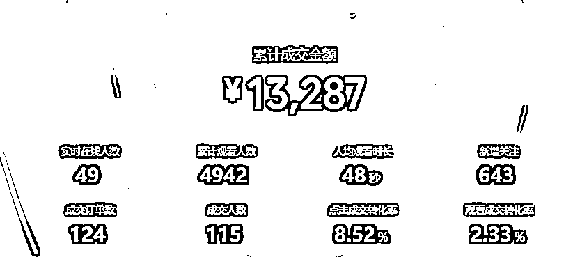
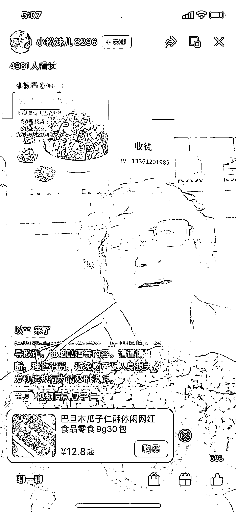

# 掌握了视频号日入过万的技巧，我决定放弃视频号

> 原文：[`www.yuque.com/for_lazy/thfiu8/sgyt393027vnrhm6`](https://www.yuque.com/for_lazy/thfiu8/sgyt393027vnrhm6)

## (28 赞)掌握了视频号日入过万的技巧，我决定放弃视频号

作者： 拾壹贰

日期：2023-09-13

朋友圈里面这样的数据，你应该看到了不少吧。今天就跟大家说一说视频号当下带货最火热的玩法：

首先上面的数据都是真实的，而且这些数据很多都是来自于宝妈哦，就连带小孩的宝妈都能日入过万，

不经让我对这个模式很好奇，当然也是想去试一下，下一个幸运儿会不会是我呢。

下面我先讲一下，我对目前视频号的一些认知。

## 1.趋势

视频号目前对于新号都有流量扶持，新号发的内容很容易，会跑到 10w+的浏览，这个是目前其他平台，很

少能给到的流量，就比如抖音已经是红海，普通人视频破万都有点难度。所以目前短剧+硬广，很容易在视频号上

得到一个夸张的流量，注意这里是夸张，做抖音都没如此享受过如此丝滑的待遇。在视频流量跑起来之后，要

开启直播，让短视频为直播间导流，而且短视频的客户已经被广告给洗过一波后，更容易下单，所以视频号目前

直播的成家率很高，1000 的场观，基本可以卖到 1500gmv，成交率很高。

## 2.产品

目前市场上视频号最火热，最容易拿到数据的是 百货，以及零食。都有一些共同的特点，便宜，量大

还有就是日常都能用的到。像目前比较火热的是 清洁用品：洁厕剂，清洁五件套，抹布等，零食：红糖姜茶，

巴旦木，月饼等。想了解更多的爆品，点开直播广场就能看到。这些品都是在 9.9-39.9 的区间，购买的时候

会决策时间短，利于下单。

## 3.表现形式

表现现在市场上最流行的就是，网剧+硬广，就像我们看电视到了最高潮的时候插播广告，不得不停下来

看广告。网剧在有很多吸引人的情节，这个我们只需要跟着热门的号去抖音上面下载短剧，直接拿来就用。

因为短剧跌宕起伏的剧情，还有一些无厘头的反转，拿捏了不少视频号这个年龄段的主要用户，所以短剧的

播放量很容易起来，一条视频跑起来很容易。

## 4.剪辑技巧

短剧的剪辑技巧居然如此简单，可以说是按部就班，机械化操作就能过重，这也是为什么这么多的宝妈都前赴后继能涌入视频号的原因之一了。下面举个例子，一条抖音上面的剧情+硬广的视频，只需要以下的操作就能去重：掐头去尾，抽帧补帧，四个角落加贴纸，加两层滤镜，加一层画中画。导出，整个过程对于一些有剪辑基础的老鸟来说可能只需要不到 10 分钟的时间就能产出一条。

## 5.发布技巧

发布技巧，堪称视频上的最热的话题了，卡特效能让你一条视频，连怼十次，大大减少了工作量。市场上甚至

这个技巧早期都能卖上不低的价格，这就是信息差。第二个技能就是最近很火的卡封面，卡封面加上卡特效的技术

加持，你可以看到很多市场上爆的视频都是这样的手法。也让众多视频号选手不得不花时间去学一下。

## 6.直播

直播就是视频号的收银台，得益于视频的流量 10w+，用直播间来承接这些流量。很多人说自己没有直播经验

但是你看到视频号上，直播的主播了吗？各个年龄段都有，我看到最夸张的主播 80 岁有余，50-60+的主播数不胜数，这里我不是要给大家灌鸡汤，主要原因是只要按着话术念，你的直播间就能成交！是不是很不可思议。这就是红利吧。

看到这里，是不是我们就跃跃欲试了，如此简单，那还不马上去抢钱。对的，大部分人就是只看到这里就

开始幻想爆单的快乐了。人家宝妈都行，人家年级这么大都行，我也行！（这里不是歧视，是心理描述，因为宝妈时间还不灵活，人家行我也行）今天就起五个号，明天就杀进去，后天就爆单，说干就干。

#### 上面的内容都没有错，但是只有下场了，也只有提高了认知才能赚到钱，下面我就来说一说项目的难点：

1\.   视频号最无厘头的就是违规，动不动就违规，显然上面的混剪剧情带货也是跟平台在抗衡，确实能赚到钱，但是，但是号可能很快就会违规，违规后就基本没有什么流量了，而且解封也看 TX 的尿性，有概率过，有大概率慢慢过。

2\.  视频号，最重要的是号！是的，是号。大家都这个门槛比较低的竞争下，用的都是一样的手法，差不多的素材，

能不能爆单，是概率。号多的团队，就能提高概率，号少的玩家基本就看天吃饭了，没有爆单就违规是普通人的日常。一个人可以开通 5 个视频号，所以号对于大玩家来说不是什么问题，但是普通人这几个号，基本就没什么好玩的了。

3\. 有了连怼我就能连爆吗？市场上的弄潮儿卡封面卡特效出来 5 天后，基本就没有什么信息差了，大家都用这个技巧都还能爆吗？那为什么第一批用这个的人爆了呢？有想过这个问题吗？第一批能用上这个技巧的团队，首先拥有技术上的信息差，人家的选品，以及素材能力都大大的高于个人，决定你视频能不能爆的，绝不是这些技巧，而是选素材的能力，选对了素材，或者早发布这个素材都能大大的提升视频爆的概率。

4.最后，能解决号的问题的朋友尽管冲吧，这是很大的红利.如果你不能解决号的问题，那种换一种方式呗。

### 这是我对视频号浅显的一些看法，欢迎大家交流。

* * *

评论区：

窝牛 : 视频号，重要的就是号，不是视频[强]真理
月见草 : 这个标题，就很吸引眼球，大佬太强了。
沐琳 : 最近在考虑视频号，看到这有点思路了，谢谢大佬[抱拳]
coll : 确实信息差很重要，哪怕在生财，卡特效这个技术也是最近才看到，而别人已经玩了几个月了

* * *