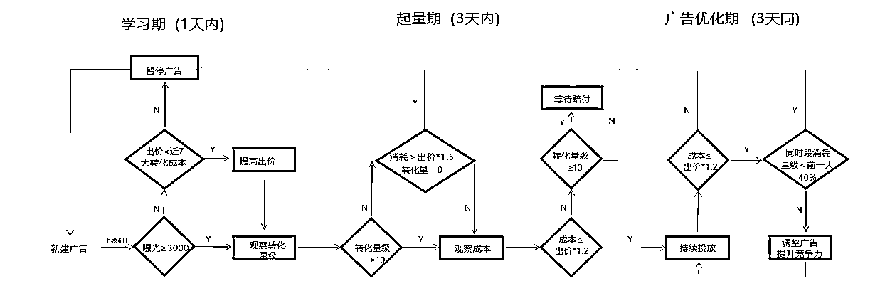
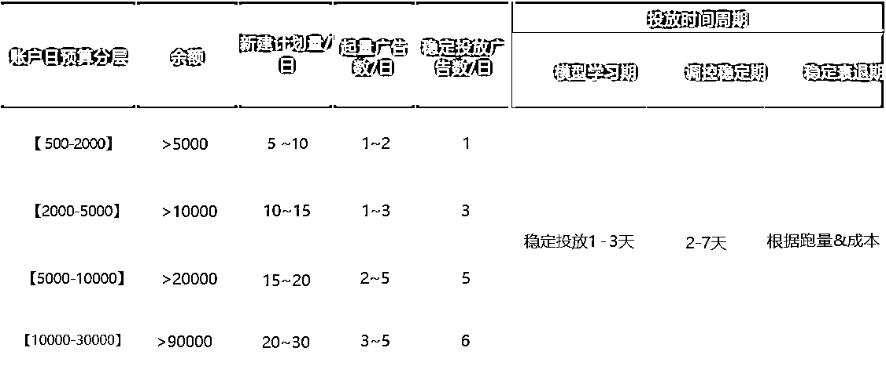

# 小红书投放教程--人人都可以抓住投放红利期

> 原文：[`www.yuque.com/for_lazy/thfiu8/pekdlsck7ua7c4g1`](https://www.yuque.com/for_lazy/thfiu8/pekdlsck7ua7c4g1)

## (37 赞)小红书投放教程--人人都可以抓住投放红利期

作者： Sy

日期：2023-09-14

就不过多介绍自己了   小红书略懂一点 什么行业都玩过一点

最近整理了一下 小红书聚光投放 的操作指南和判单账户健康好坏的一些关键点

当然仅仅个人见解，参考而已

注：不要把聚光当做私信豁免的工具（一天几十或者几百只是为了可以引流？浪费钱）

小红书的时时刻刻变更下，小红书投放毫无疑问就是最终的红利期

我，就分 4 个板块给大家聊一下我对小红书聚光投放的见解

一.健康广告标准及操作

二.健康广告投放流程

三.健康广告账户搭建

四.健康账户黄金 10 要素 

健康广告标准及操作：1.账户广告学习期 2.账户广告起量期 3.账户广告稳定期 4.账户广告衰退 5.广告补量

1.账户广告学习期：监控广告计划目标转化数、 目标成本账户的健康指标

时间维度: 广告首次曝光及之后的 3 个自然日内

单广告转化数: 日消>=转化成本  *10，且日累计转化数>=10 个  (/行业大盘成本

超成本赔付：转化成本>120%，持续观察至学习期结束等赔付

详情见：[aurora](https://ad.xiaohongshu.com/help/list?id=423)

行业标准操作流程

①学习期通过日监控每日均达到 10 个转化每天修改广告出价或者 定向的次数不能超过 2 次

②学习期失败:日监控，若出现以下情况建议暂停空耗广告:消耗/出价<=1.5 且无转化 48 小时内消耗极少，6 小时消耗小于出价

③学习期超成本: 第一天达成前提下，可持续观察至保障期结束，等赔付

小红书赔付是一个相对来说可以使自己肆无忌惮的一个功能，所以一定要好好利用赔付机制

2.账户广告起量:重点观察起量广告消耗占比与起量率数据起量

健康指标

时间维度：新广告通过学习期之后的 3 个自然日内

①单广告转化数：根据投放目标决定

②起量广告消耗占比:起量新广告消耗/统计   范围内所有新广告消耗

③起量率:起量新广告数量/统计范围内在投广告数量

行业标准操作：

①单广告转化数: 点击成本控制方式>=200;私信成本控制方式>=15;

②起量广告消耗占比：健康账户起量广告消耗占比 60%+ ；

3.账户广告稳定期：提高广告预算，避免频繁调整，持续放量

健康指标：

时间维度:新广告起量之后的 7-14 个自然日内

①关注广告转化情况和成本:监测计划预算消耗情况，及时提高预算，持续放量

4.账户广告衰退提量：老广告曝光衰退。超成本，需新建广告补量

健康指标：

①老广告定义：数据时间：首次曝光时间> =7 天的广告

②广告生命周期：日曝光低于峰值的 60%，40%，  3% ，则分别认定为初衰，落，效

行业标准操作：

老广告衰退：因为广告有生命周期，所以要保持广告新建及素材更新 ,    一般稳定生命周期时长 7-14 天

①峰值期:适当提升出价，提高广告预算，最大化广告   跑量能力

②初衰期&衰落期&失效期: 当广告进入初衰期判断是   否潜力广告，潜力广告可进一步提升出价延缓衰退，并同时更换素材或新建广告补量

广告生命周期：

老广告超成本:

①起量广告连续 3 天转化成本都超出出价 20%或单日成本超出 50%，暂停广告 ② 新建广告进行补量

5 新广告补量

健康指标：

①账户稳定起量广告数量>=3 条，或在线广告数>=10 条

行业操作流程：

A：补量数量&节奏

① 参考 20%的理想状态起量率，两条老广告衰退，需要至少新建 10 条广告补量

②如未成功起量(转化数>=10) ，持续新   建 10 条广告，直至有起量成功广告计划

B：新广告设置: 参考老广告定向、素材，在老广告基础上做变化

①  直接复制老广告，限 1 条，出价提 5-10%

②  相同定向，不同素材 3-5 条

③  相同素材，不同定向 3-5 条 健康广告标准及操作就讲完啦

二.健康广告投放流程 

学习期新建广告 tips：

•   投放时长:7-24 点/全天

•出价:参考近 7-15 天成本/行业平均出价提升 20%

•   定向:适当放宽定向，宽窄定向组合

•文案:凸显人群、产品特性  结合实时热点创新文案

•    外层创意:复用历史跑量创意/参考近期行业 top 创意

•   广告数量:每天最低上新 10-15 条

起量期新建广告 tips： 

•  精准定向差异化:

a. 除一级定向外，可勾选近期高转化兴趣行为定向               

b.智能定向，利用系统探索人群

c.提取账户负反馈人群以及不感兴趣人群定向进行排除

•创意多样性:

a.文案凸显产品推荐/产品测评/结合热点

b.修改外层图片搭配方式/视频口播文案/多创意功能差异组合

• 调整频率:每天修改广告出价或者定向的次教不能超过 2 次

老广告掉量 tips：

• 保证账户余额:余额>近 3 天日均消耗

•放宽单广告预算  ，广告预算>1000，且广告总 预 算<余额*30,出价提升 5-10%,提升广告竞争力

•新建补量广告  ，参考 20%的理想状态起量率，两条老广告袁退，需新建 10 条广告补量

•如未成功起量(转化数<=10 个)，持续新建 10 条广告直至有起量成功广告

三.健康广告账户搭建

1.账户框架优化
2.账户上新
3.账户调优

框架优化：根据账户日预算进行分层，定量设置广告

账户上新｜计划层级&单元层级  

 1.计划层级：投放标的选择:互动+私信  ，私信为主（非电商行业举例）

(建议占比 70%)  ，互动为辅(30%),以目前实际投放成本&量级情况调整占比

广告命名: 怎么记得住，记得清楚，就怎么来

2.投放时间：
投放时段:7-24 小时/全天（小红书自动回复也全量了,适当可以拉长推广时段） 

上新广告时间:抓住大盘流量高峰期  ，少量高频提前   (2h)  上新广告

流量高峰期:早上 7- 10 点  ，  中午 12-14 点，  下午 15-22 点

3.出价：

新账号出价在行业平均出价上提高 10%，  提高竞争力，  快速起量

老账号出价参考近 7-15 天成本提升 5%

采用双阶段出价，提升后端有效率

新户出价:按照账户或行业近期平均关注成本设置

老户出价:按照账户或行业近 7-15 天平均开口成本 or 客资成本进行出价

4.定向：

新账号

适当放宽定向拿量  ，宽窄定向结合

宽定向定义:地域+年龄+性别

窄定向定义:在宽定向基础上  ，增加其他一级定向(行业相关）、  行为兴趣标签或人群重定向标签

老账号

上新广告时，定向可参考该账号历史投放好的定向和大盘表现好的定向进  行设置且排除已转化人群

账户上新｜创意层级

素材:

 新账号:

结合热门笔记，参考大盘优质图片&视频，准备 6-10 篇不同内容方向（做赛马准备）素材类型等进行测试

老账号:

上新广告 ，除了参考行业优秀素材外，可结合历史跑量较好素材，老框架搭配新内容、或者新笔记形式搭配跑量内容等元素差异化测试拿量

素材选择:看赛马下来的笔记或者准备类似的爆文笔记

视频:图片=4:6 ，优选竖版视频，图文素材优先级:组图>大图>小图

这一档其实就不用细讲，如果没有内容产出能力就抄爆文，爆文也是同行一直怼起来的广告素材（肯定成本也低）如果有内容产出能力就赛马即可，不同行业文案关键词和打法不一

账户调优 ｜广告增量策略

预算充足
①账户余额，保证账户避免余额不足影响导致账户整体拿量出现问题:余额>历史 7 天消耗 ②广告预算放宽单条广告预算  ， 单广告日预算>=出价*30* ,且所有在线广告总预算<余额 30
③挪预算：
a.转化好，成本低:此类广告可占比总预算的 80%，确保广告在起量过程中不受余额过滤影响导致跑量困难
b.转化差，成本高:这类广告及时关停  ，将预算放置转化较好  ，成本较低的广告中

有竞争力的出价
提价抢量:以获量为目的，在短期内提高出价抢占更多曝光，可在原出价基础上进行 5%-10%的提价

素材多样性
多创意功能:广告主可在广告维度下手动创建多个创意，系统为每个受众智能优选最佳创意展示，实现千人千面展示，快速测试爆款素材进行拿量
爆款素材使用 

①使用历史优秀起量素材重新投放，在原素材的基础上穿插新元素(热点素材)，防止图片一样导致账户受新鲜度过滤影响无法跑量②  根据近期同行优秀爆款素材进行仿拍、创新，寻找爆款文案素材

四.健康账户-黄金 10 要素 

 余额：余额保证能满足 3 日目标客资需求量所需要的金额，即余额≥客资成本*目标客资量*3

投放时间：避免系统提前控制曝光，导致量级下降，建议投放时间选择 24h，当日投放目标达成，手动调整投放间

预算：避免预算较低限制曝光，单广告预算=1000-1500

出价：出价＞=近 7 日成本，避免出价过低导致竞争力不足难以起

定向：宽定向(仅选择年龄、地域、性别) 占比至少 30%，保证目标人群夏盖

素材：同主体下相同素材广告<5 条，避免相同素材过滤

曝光：单广告 6h 曝光>3000，及时暂停，避免占用潜力广告预算

开口：单广告消耗>出价*1.5，且无开口转化再暂停，避免空耗过多

加微：若咨询成本>=120%(预期或者问问我哈哈哈）且无加微(加微率＜10%)再暂停广告

广告数：保持账户起量广告 2，3 条，or 在线广告大于等于 30 条，保证账户量级稳定，老广告衰退后新广告可及时补量

第一次写，可能有些话术没有做到足够精简，且，内容排版差，导致大家可能没法特别清楚了解有些点，有任何不懂的可以私信我给大家解答~

* * *

评论区：

Sy : 希望大家都可以正确认识小红书聚光投放的好处，不要盲目去浪费自己的广告成本
企微小助手 : 投放的产品从哪里来
精准侠 : 我们公司拿了小红书聚光代理，目前很多商家都开始投流，一批是为了私信豁免日消费保持 100 的类型，另一批是矩阵多号，每个号日消费 2000-3000🤣在抢小红书付费聚光的低成本红利期
Sy : 找供应商呀
Sy : 是的，小红书目前获客成本太低了
可明 : 我们跑聚光，怎么成本很高
Sy : 啥行业呢
小不点 : 日消费保证 100，是不是就直接私信豁免了？

* * *