# 建站 20 天拿下 480 万访问量，第 2 个月 1840 万，俄罗斯版的妙鸭相机是怎么做到的？

> 原文：[`www.yuque.com/for_lazy/thfiu8/nocei42nccqacl4b`](https://www.yuque.com/for_lazy/thfiu8/nocei42nccqacl4b)

## (精华帖)(108 赞)建站 20 天拿下 480 万访问量，第 2 个月 1840 万，俄罗斯版的妙鸭相机是怎么做到的？

作者： 哥飞

日期：2023-09-15

大家好，我是哥飞。实际上这篇文章是 8 月 11 日写的，当时可以查到这个网站 7 月访问量是 480 万，当时我写文章时预估了一下 8 月份流量可能是 650 万左右，结果现在能查到，8 月份流量直接到了 1840 万。

所以这篇文章很值得发出来大家再学习一下，整个操盘手法完全可以变成 SOP，大家跟着做。

包括哥飞调查分析的方法步骤也值得大家学习。

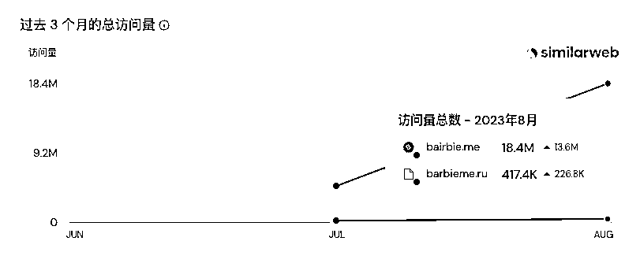

好了，以下是正文开始，文中出现的时间如果没有特别注明，那么就是写文章时的 8 月 11 日。

正文开始

话说，下午（指 8 月 10 日） MoneyHunter 群主在群里例行分享财富信息，说 [BaiRBIE.me](http://BaiRBIE.me) 单月访问量 480 万了，而且是凭空冒出来的。

我查了一下，这个域名居然是 7 月 17 日注册的，再查 archive 发现网页是 7 月 22 日被收录的，也就是说，建站到今天，也才 20 天。

从上图可以看出来，实际流量是 7 月就有 480 万，8 月还没结束，暂时看不到流量数据，所以实际 480 万流量是 7 月 31 日之前的 10 天时间就达成的，但是 8 月数据还没出来，我们就暂时当作总流量 480 万。

如果让哥飞来预估的话，8 月流量估计在 650 万左右，到 9 月初，Similarweb 上显示了 8 月份流量数据时，我们再来看看哥飞估得准不准。

这个网站流量增速这么猛，引起了哥飞朋友 TT 总的注意，他问哥飞，这流量到底怎么来的？

哥飞就去收集了一些信息，总结起来发现，整个爆火路径居然跟妙鸭相机差不多。

好了，下面就是哥飞收集信息的过程，完整教给大家，以后大家也可以这样收集任何网站的信息。

先看 Similarweb 上这个站的用户地理位置分布，我们发现几乎都是北半球来的流量，俄罗斯 60.65%，哈萨克斯坦 7.57%，乌克兰 4.55%，波兰 4.37%，土耳其 3.84%，白俄罗斯 3.07%，剩下的流量就很分散了，我们忽略掉。

再看流量来源分布，57.44%是直接访问，21.51%来自于搜索引擎，14.51%来自社交网络，6.24%来自外链，还有 0.28%来自于邮件。几乎没有付费搜索或者展示广告，说明运营团队没有做广告投放。

多说一句，哥飞这里展示的数据来自于 Similarweb Pro ，如果你用的免费版，不是最新数据，可能跟哥飞这里看到的不一样，以哥飞截图为准。

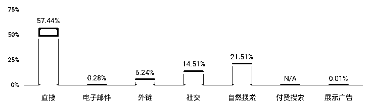

再看下访问设备分布，11.38%来自于电脑，88.62%来自于手机或者平板电脑。也就是这个站整体流量主要在手机端传播流动。

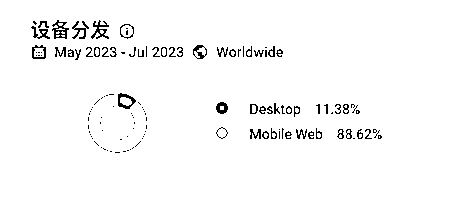

刚才我们说了，有 21.51%流量来自于搜索引擎，从下图可以看到，大部分都是品牌词，也就是说，用户在别的地方知道这个产品名字之后，再来搜索引擎里搜索的，而不是这个网站抓住了什么热门搜索关键字。

当然，你会说，最近上映了一部电影，但是电影名字是《Barbie》，而网站域名是 [BaiRBIE.me](http://BaiRBIE.me) ，看出区别来了吗，域名多了一个 i，与字母 a 凑成了 ai。

而下面的搜索词，基本都是 bairbie ，只有第一个是 barbie 但是搜索词后面有个 me ，所以可以认为用户就是在搜索这个网站的品牌词，而不是在搜索电影。

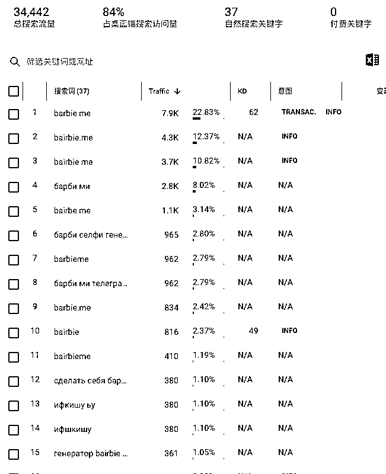

所以，虽然有 21.51%流量来自于搜索引擎，但并不是流量的初始来源，我们还得继续找。

上面我们说了，57.44%流量来自于直接访问，这部分可以认为是用户记住了网址，或者用即时通信软件发送的网址，或者把网址加入了书签，或者是有些链接设置了 noreferrer 导致无法跟踪。但不管哪种情况，我们先放一边，看看别的方向。

先看外链，6.24%的流量来自于外链，也就是大约 30 万左右，我们只看前 12 个，因为后面的都流量太小了。

哥飞做了个表格，加上了网站介绍：

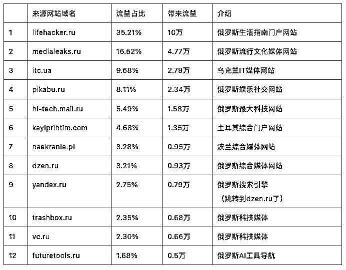

接下来，我们在谷歌用“site:来源域名 bairbie”语法搜索，并且点开搜索工具，限定结果时间为 7 月 17 日到 7 月 25 日，目的是找出最早的宣传网页。

如第一个[lifehacker.ru](http://lifehacker.ru)，我们这样搜索，总共只找到 7 条结果，其中最早的是 7 月 18 日发的，好像找到了最早的网页。

但实际仔细看就会发现，我们找的关键字都没有出现在标题里，而是出现在描述里的，所以最有可能的真相是，这些网页里都有个相关文章列表，里边有我们要找的那个文章。

那就继续把时间往后移动，经过多次测试，当选择 7 月 26 日到 7 月 28 日区间时，终于出现了我们要找的网页。

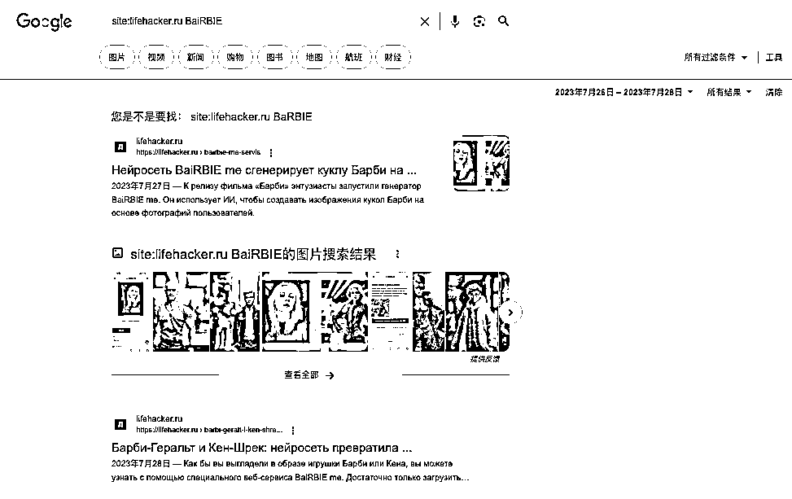

网址是 [`lifehacker.ru/bairbie-me-servis/`](https://lifehacker.ru/bairbie-me-servis) ，这是 7 月 27 日发的，网页截图如下。

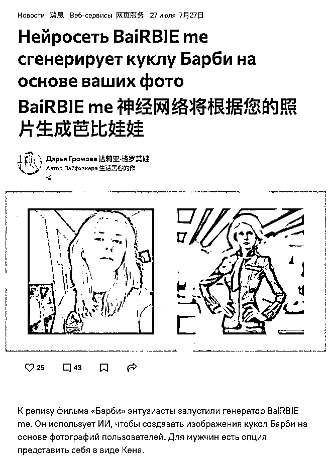

注意，这篇文章太长了，不好全部截图，所以只截了上半部分和尾部，因为尾部里有 [BaiRBIE.me](http://BaiRBIE.me) 的链接。

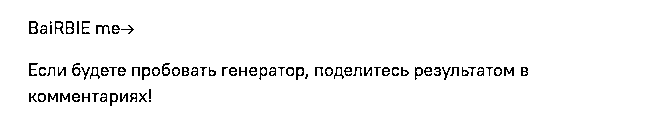

这是 [lifehacker.ru](http://lifehacker.ru) 的一个名叫达莉亚·格罗莫娃的编辑发的文章，我们暂时不知道是收费软文，还是仅仅是新闻报道，所以暂时不下结论。

继续按照上面的方法，这次我们限定一下，使用 intitle 语法，限定我们要找的关键字只能出现在标题中，并且拉长时间，会发现，这个网站只有这一篇文章提到了 BaiRBIE。

那么继续找第二个来源网站 [medialeaks.ru](http://medialeaks.ru) ，这次我们限定时间 7 月 17 日到 8 月 11 日，同样只找到一篇帖子。

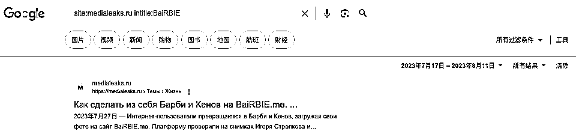

链接是 [`medialeaks.ru/2707tat-str-int-bairbie-me/`](https://medialeaks.ru/2707tat-str-int-bairbie-me) ，发布时间 7 月 27 日，截图如下。

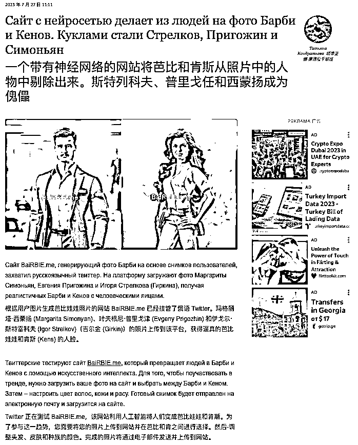

注意，这里提到了 Twitter ，说明有可能 BaiRBIE 最早是在 Twitter 推广的。

接下来，用同样的方法，去找第 3 个来源网站 [itc.ua](http://itc.ua) 的搜索结果，找到了四条，两条是 7 月 26 日发的，两条是 8 月 1 日发的。

我们先看 7 月 26 日发的，

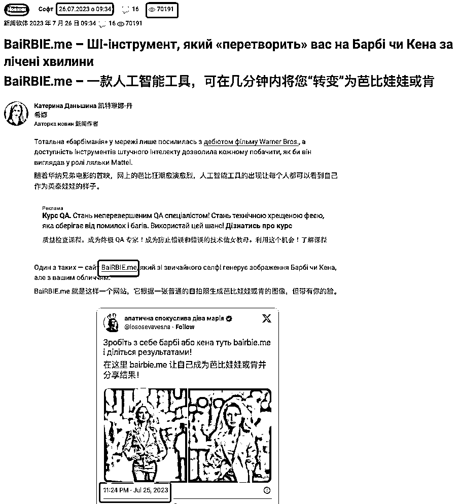

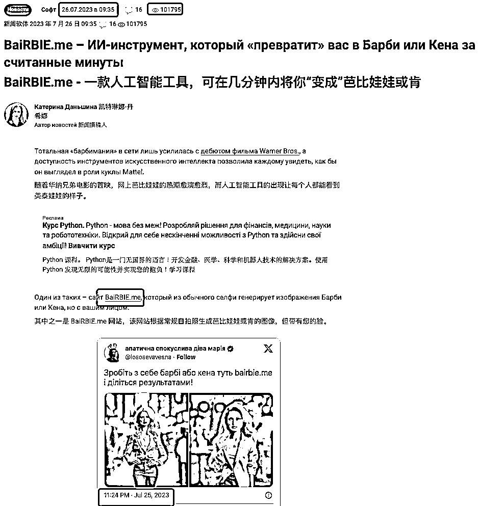

注意看这两条，有几个关键点：

1、一个是 09:34 发布，一个是 09:35 发布；

2、一个 70191 个阅读，一个 101795 个阅读；

3、两个都嵌入了同一条推文；

4、推文发布时间是 7 月 25 日。

我们刚才找的两个网站的文章都提到了推特，记住，这里要考的。但我们暂时先放一边，哥飞继续找。

现在是第 4 个来源网站，这次会发现，直接搜索 [site:pikabu.ru](http://about:blank) intitle:BaiRBIE 找不到结果，而搜索 [site:pikabu.ru](http://about:blank) BaiRBIE 可以找到结果，这说明没有哪个网页标题中含有 BaiRBIE 。

我们换用站内搜索，结果页 [`pikabu.ru/search?q=bairbie&st=3`](https://pikabu.ru/search?q=bairbie&st=3) 找到了 4 个帖子，分别如下：

[`pikabu.ru/story/v_volne_novogo_filma_pro_barbi_i_pro_ai_neyronku_10502953`](https://pikabu.ru/story/v_volne_novogo_filma_pro_barbi_i_pro_ai_neyronku_10502953) 发布于 7 月 26 日

[`pikabu.ru/story/stat_barbi_za_1_minutu_10509430`](https://pikabu.ru/story/stat_barbi_za_1_minutu_10509430) 发布于 7 月 28 日

[`pikabu.ru/story/now_i_am_become_death_the_destroyer_of_barbieworlds_10511321`](https://pikabu.ru/story/now_i_am_become_death_the_destroyer_of_barbieworlds_10511321) 发布于 7 月 29 日，里边还提到去水印工具，所以可以认为是用户发布的。

[`pikabu.ru/story/prevrati_sebya_v_barbi_ili_kena_v_odin_klik_onlayn_10527031`](https://pikabu.ru/story/prevrati_sebya_v_barbi_ili_kena_v_odin_klik_onlayn_10527031) 发布于 8 月 3 日

接下来是 [site:hi-tech.mail.ru](http://about:blank) BaiRBIE ，有一条 7 月 28 日的软文。

为什么说软文呢，因为 [BaiRBIE.me](http://BaiRBIE.me) 的使用步骤和链接都完整写出来了。

[`hi-tech.mail.ru/news/101583-internet-shodit-s-uma-po-barbi-nejroseti/`](https://hi-tech.mail.ru/news/101583-internet-shodit-s-uma-po-barbi-nejroseti)

剩下的来源网站我不一一展示步骤，而是直接在下面列出所有找到的结果：

7 月 26 日发布：

[`itc.ua/news/bairbie-me-yy-ynstrument-kotoryj-prevratyt-vas-v-barby-yly-kena-za-schytannye-mynuty/`](https://itc.ua/news/bairbie-me-yy-ynstrument-kotoryj-prevratyt-vas-v-barby-yly-kena-za-schytannye-mynuty)

[`itc.ua/ua/novini/bairbie-me-shi-instrument-yakyj-peretvoryt-vas-na-barbi-chy-kena-za-licheni-hvylyny/`](https://itc.ua/ua/novini/bairbie-me-shi-instrument-yakyj-peretvoryt-vas-na-barbi-chy-kena-za-licheni-hvylyny)

[`pikabu.ru/story/v_volne_novogo_filma_pro_barbi_i_pro_ai_neyronku_10502953`](https://pikabu.ru/story/v_volne_novogo_filma_pro_barbi_i_pro_ai_neyronku_10502953)

7 月 27 日发布：

[`lifehacker.ru/bairbie-me-servis/`](https://lifehacker.ru/bairbie-me-servis) 

[`medialeaks.ru/2707tat-str-int-bairbie-me/`](https://medialeaks.ru/2707tat-str-int-bairbie-me)

[`naekranie.pl/lekkie/barbie-ken-generator-wlasne-zdjecie-bairbie-me-1690446081`](https://naekranie.pl/lekkie/barbie-ken-generator-wlasne-zdjecie-bairbie-me-1690446081)

[`trashbox.ru/link/2023-07-27-nejroset-delaet-barbi-ili-kena-s-vashim-licom`](https://trashbox.ru/link/2023-07-27-nejroset-delaet-barbi-ili-kena-s-vashim-licom)

7 月 28 日发布：

[`hi-tech.mail.ru/news/101583-internet-shodit-s-uma-po-barbi-nejroseti/`](https://hi-tech.mail.ru/news/101583-internet-shodit-s-uma-po-barbi-nejroseti)

[`pikabu.ru/story/stat_barbi_za_1_minutu_10509430`](https://pikabu.ru/story/stat_barbi_za_1_minutu_10509430)

[`kayiprihtim.com/haber/yapay-zeka-fotograf-barbie-evreni-site/`](https://kayiprihtim.com/haber/yapay-zeka-fotograf-barbie-evreni-site)

https://[vc.ru/u/1986849-neurotrends-neyroseti-chatgpt/774679-bairbie-me-ii-instrument-kotoryy-prevratit-vas-v-barbi-ili-kena-za-schitannye-minuty](http://vc.ru/u/1986849-neurotrends-neyroseti-chatgpt/774679-bairbie-me-ii-instrument-kotoryy-prevratit-vas-v-barbi-ili-kena-za-schitannye-minuty)

https://[vc.ru/flood/775096-obrabotay-svoe-foto-v-stile-barbie](http://vc.ru/flood/775096-obrabotay-svoe-foto-v-stile-barbie)

https://[vc.ru/marketing/774797-ya-tozhe-hochu-na-plyazh-predstavili-zvezd-rossiyskogo-it-v-obraze-barbie](http://vc.ru/marketing/774797-ya-tozhe-hochu-na-plyazh-predstavili-zvezd-rossiyskogo-it-v-obraze-barbie)

7 月 29 日发布：

[`pikabu.ru/story/now_i_am_become_death_the_destroyer_of_barbieworlds_10511321`](https://pikabu.ru/story/now_i_am_become_death_the_destroyer_of_barbieworlds_10511321)

https://[vc.ru/u/2105782-elena-valitova/776159-bairbie-me-zavoevyvaet-mir-v-chem-opasnost-neyronok-i-chat-botov](http://vc.ru/u/2105782-elena-valitova/776159-bairbie-me-zavoevyvaet-mir-v-chem-opasnost-neyronok-i-chat-botov)

7 月 31 日发布：

[`dzen.ru/a/ZMfUO_fpOHtoOGmj`](https://dzen.ru/a/ZMfUO_fpOHtoOGmj)

https://[vc.ru/ml/777922-ai-vr-daydzhest-14-specialno-dlya-digital-club](http://vc.ru/ml/777922-ai-vr-daydzhest-14-specialno-dlya-digital-club)

8 月 1 日发布：

https://[vc.ru/midjourney/778171-barbengeymer-na-chey-storone-ty](http://vc.ru/midjourney/778171-barbengeymer-na-chey-storone-ty)

8 月 3 日发布：

[`pikabu.ru/story/prevrati_sebya_v_barbi_ili_kena_v_odin_klik_onlayn_10527031`](https://pikabu.ru/story/prevrati_sebya_v_barbi_ili_kena_v_odin_klik_onlayn_10527031)

[`dzen.ru/a/ZMugiG72xGmhVKVR`](https://dzen.ru/a/ZMugiG72xGmhVKVR)

https://[vc.ru/u/1330361-neyronki-dlya-zarabotka/782392-bairbie-me-poprobuy-sebya-v-obraze-barbi-ili-kena](http://vc.ru/u/1330361-neyronki-dlya-zarabotka/782392-bairbie-me-poprobuy-sebya-v-obraze-barbi-ili-kena)

对于以上 21 个网页，哥飞以多年行走江湖的经验判断，除了 [pikabu.ru](http://pikabu.ru) 和 [vc.ru](http://vc.ru) 两个网站的部分内容是用户自发发布的外，其它的网页典型特征都是一个网站只发一两条，但是访问量都挺大的，可以认为都是媒体软文。

现在我们回过头来再看社交网络来的流量，刚才我们说了，整个网站的流量中有 14.51%来自于社交网络，那么这部分流量中，来源分布情况如下：

55.27%来自于 VKontakte ，这是俄罗斯最大的社交网站，简称 VK；

17.93%来自于 Facebook ，脸书不用介绍了；

10.97%来自于 Twitter，现在应该叫 X 了；

9.54%来自于 TG web app ；

3.60%来自于 Instagram。

我们先看 VK ，先在谷歌搜索，找到了 915 条，通过限定时间，找到了几条，但是依然还是我们刚才前文遇到的问题，实际发布时间不是这个时间。

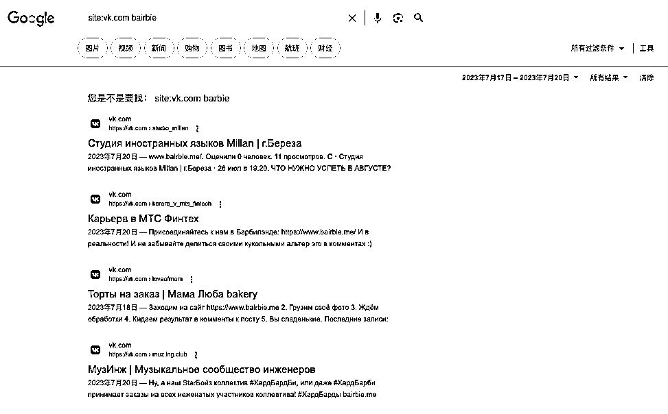

以上面显示 7 月 18 日发布的 https://[vk.com/loveofmom](http://vk.com/loveofmom) 为例，实际我们打开他的个人页面可以就能看到，https://[vk.com/wall-83478798_15142](http://vk.com/wall-83478798_15142) 是在 7 月 28 日发布的。

https://[vk.com/muz.ing.club](http://vk.com/muz.ing.club) 则是在 8 月 1 日转载别人在当日发布的内容 https://[vk.com/wall-192863412_651](http://vk.com/wall-192863412_651) 。

我们换用俄罗斯搜索引擎 [yandex.com](http://yandex.com) ，通过以下语法查找到了五千多条用户发布的内容。

[site:vk.com](http://about:blank) inurl:wall [bairbie.me](http://bairbie.me)

由于没办法限定时间，哥飞只好一条一条点进去，人肉翻看抽样了 100 条内容，并且做了个表格记录每天的内容数量，结果如下：

可以看到 7 月 26 日开始有内容，7 月 27 日开始蔓延，7 月 28 日爆发，7 月 29 日开始减弱，之后就一直没多少量了。

这跟之前我们在看到的媒体软文发布时间是一致的。

再看 Twitter 上搜索 [BaiRBIE.me](http://BaiRBIE.me) 的搜索结果统计数据：

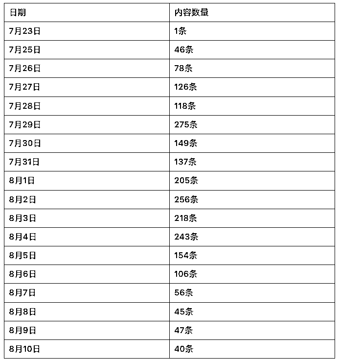

可以看出来 23 算是测试，25 号才开始正式放出来给用户使用，之后在 29 日有个高峰，之后回落一些，再之后 8 月 1 日到 4 日数据也不错，之后就开始不断衰落了。

剩下的 Facebook，哥飞就不去统计了，估计规律差不多，大家感兴趣可以去统计一下。

最终总结 [BaiRBIE.me](http://BaiRBIE.me) 这个站的时间线如下：

1、7 月 17 日注册域名；

2、7 月 20 日电影《芭比 Barbie》上映；

3、7 月 22 日 Archive 收录了[BaiRBIE.me](http://BaiRBIE.me)网站页面；

4、7 月 23 日在 Twitter 看到第一条分享信息；

5、7 月 25 日，团队先找了部分用户或 KOL 试用产品，并且带来第一波在 Twitter 的扩散；

6、7 月 26 日开始投放科技媒体软文，主要是 [itc.ua](http://itc.ua) ；

7、7 月 26 日开始有用户在 [pikabu.ru](http://pikabu.ru) 发帖自发宣传；

8、7 月 27 日在 [lifehacker.ru](http://lifehacker.ru)、[medialeaks.ru](http://medialeaks.ru)、[naekranie.pl](http://naekranie.pl)、[trashbox.ru](http://trashbox.ru)投放软文；

9、7 月 28 日在[hi-tech.mail.ru](http://hi-tech.mail.ru)、[kayiprihtim.com](http://kayiprihtim.com)投放软文；

10、7 月 28 日开始有用户在 [vc.ru](http://vc.ru) 自发扩散。 

其实从 7 月 25 日开始，在 Twitter 中，就有自发扩散的用户，也有团队找的 KOL 在帮助扩散。

整个过程看下来，Twitter 传播威力依然巨大，值得大家去运营维护好自己的 Twitter 账号。

整套运营推广策略，是不是跟妙鸭相机很像，妙鸭相机在小红书招募内测用户，并且在公测后扩散开来，之后也在别的社交平台如即刻刷屏。

这其中投放软文是值得我们学习的增长方式，先让媒体帮忙扩散，之后利用社交网络放大和裂变。

好了，今天文章就写完了，我是哥飞，欢迎在评论区交流。

* * *

评论区：

黄小刀 : 飞哥，你也太高产了……
三林 : 之前提到哥飞这个案例，关联的中标帖 [`t.zsxq.com/12WsOzkny`](https://t.zsxq.com/12WsOzkny)
阿彪 : 牛逼的分析啊！！！
哥飞 : 感谢阿彪的认可
涛 : 想知道飞哥写这篇文章花了多久，尤其是人肉翻看俄搜索引擎 100 条还总结表格花了多长时间[捂脸]
哥飞 : 8 小时
亦仁 : 感谢分享，已加精华。
Jacky 杰克 : 先用小红书种草，没有小红书的话就发点软文[奸笑]

* * *