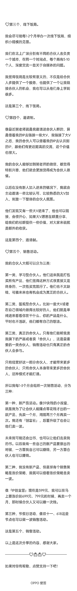

# 如何 3 个月内实现百万利润，和合伙人互惠共赢？

> 原文：[`www.yuque.com/for_lazy/thfiu8/ylkq0y2lmtgsnbor`](https://www.yuque.com/for_lazy/thfiu8/ylkq0y2lmtgsnbor)

## (精华帖)(105 赞)如何 3 个月内实现百万利润，和合伙人互惠共赢？

作者： 阿猫|上海|管理能力

日期：2023-09-14

时隔半年，又来生财分享啦，总算又有点拿得出手的成绩来分享了。

我每一次有重大项目的突破，都喜欢把这个复盘分享在生财里面。

这是我往期在生财的分享，有兴趣的可以回顾一下。

《用读书群建立「私域流量」》 [`articles.zsxq.com/id_764w5b9fvfju.html`](https://articles.zsxq.com/id_764w5b9fvfju.html) 《视频号直播卖读书会 | 4 小时进账 2W+》

[`wx.zsxq.com/dweb2/index/topic_detail/585245444811414`](https://wx.zsxq.com/dweb2/index/topic_detail/585245444811414) 《100 天写作返现活动，提供价值的时候顺带赚钱》

[`wx.zsxq.com/dweb2/index/topic_detail/218242458448541`](https://wx.zsxq.com/dweb2/index/topic_detail/218242458448541)

今天的分享是我最新做的【7 年觉醒合伙人】项目，是受到 @粥左罗 老师  的邀请分享的整理，最近他也出了顶峰会，有点相似的产品，希望对于想做类似产品的小伙伴，能有帮助。

✅先赞后看，养成习惯。感谢！🙆

————以下是阿猫的分享———

大家好，我是阿猫。

我有三个核心标签：

第一个：金融硕士，海外留学；

第二个：公众号「阿猫读书」创始人；

第三个：目前有个小团队，包括一个合伙人和 4 个全职员工，全职员工主要负责运营知识星球和各个自媒体平台。

我从 2017 年开始经营自己的公众号，当年刚毕业时，我面临到底是打工还是做自媒体的选择。我选了做自媒体，有一个非常简单的理由：2017 年的时候公众号广告非常多，我一个月只要接 4 条广告，就能有一万多收入。

只要公众号拓展得好，每个月的收入上限会更高，我没有理由选择去打工。

所以我就选择了做自媒体这条路，一直走到现在，一步一步从接广告到拓展社群，到跟别人合作社群，到拍视频、做直播，再到现在做合伙人项目。

我其实比较简单，就是沉迷于全职做自媒体这件事，对我来说做自媒体有点像打游戏，不断地去闯关挑战，一关过了又开启新的关卡，搞新产品、搞新渠道、提高转化等等，一直在这条路上摸索。

「合伙人」项目是我最近新开的一个项目，先简单介绍一下这个产品：

首先，「合伙人」产品本身涵盖了我过去所有卖过的产品，单独拿出去卖，总价值过万；

其次，我在这个项目里给合伙人提供了 50%-100%的销售分佣；

最后，我们会有线下饭局，每个月都有线上语音聊天，日常也会在微信群里进行高质量的交流。

目前「合伙人」产品的定价在一万左右，卖了 200 份，有一些是老用户升级，也有一些是新用户，最终整体的利润是 100 万左右。

这次分享主要讲一下我是怎么去做「合伙人」这个项目的，主题是《合伙人项目拆解，如何 3 个月内实现百万利润，和合伙人互惠共赢？》，包括 5 个部分：

✅第一部分，我为什么要做「合伙人」产品？

主要有三点：

❤️首先，合伙人可以帮我解决流量问题。

最开始我看到「合伙人」这种商业模式兴奋了很久，因为它解决了我们做自媒体的一个很大的问题——流量。

我的「合伙人」产品卖一万块钱，但对我来说最有价值的点并不是这个产品价格高、能挣很多钱，而是有很多合伙人帮我分销旗下的产品。

我给他们一个超高的分佣，他们在卖我的产品的过程中，我会得到新的曝光，相当于他们的流量向我这边倾斜，大家都会知道阿猫是谁，这是最吸引我的点。

目前来看也确实达到了这个效果。

我最近在卖「创富社」这个产品，很多合伙人都在帮我卖，一定程度上他们帮我扩大了「阿猫」这个 IP 的认知度，并且他们卖出这个产品，我 100%让利给他们，也相当于这个产品是他们自己的。

这样就解决了我的流量问题。

做自媒体最大的烦恼就是，你想要得到流量，要么花时间，要么花钱。

花时间就是你要辛辛苦苦花很长时间去创作内容，获得平台流量；花钱就是去买流量，在这方面我已经花了快 100 万，在不同的大号上推广「阿猫读书」这个账号，买流量很费钱，而且后期会慢慢饱和，也有一定的风险。

「合伙人」项目就是我发现的第三条路：合伙人卖我的产品，他们赚钱，我赚流量。

所以我现在等于有了三条腿走路：

第一条腿是付费推广，第二条腿是花时间创作内容拿平台流量，第三条腿是认可我的一些人卖我的产品，我得到流量和曝光。

那我是怎么发现「合伙人」项目可以运作的？

首先，我自己误打误撞想到，其实我该卖的产品已经卖完了，我自己的流量也卖不动了，如果我选择 100%让利给合伙人，他们能卖出去是他们的本事，我也完全不亏，那这条路就行得通，我可以用一段时间进行测试。

其次，我发现「玩赚新媒」就是在这样做，他们有玩赚合伙人项目，提供 100%分佣。

玩赚合伙人的创始人芷蓝是一个小 IP，她没太用自己的 IP 力量去卖产品，而是用这套模式招纳一批合伙人，冷启动之后，合伙人帮她卖产品，同时合伙人再卖合伙人，进行裂变。

目前玩赚新媒星球超过 5000 人，玩赚合伙人有五六百人，相当于创造了总价值 500 万以上的利润。

我不知道他们有没有流量投放，如果没有投放，那这个裂变是非常夸张的。

所以我觉得这是一种可行的方式，万一我以后哪个渠道不行，可以多一条路，借助合伙人的力量帮我放大。

这是第一点，合伙人可以帮我解决流量问题。

❤️其次，我可以帮合伙人解决产品和转化问题。

我观察到极少人能够做到像粥老师这种程度，在流量、产品、转化三个点上都能做到很极致，很多人就算全职做也没法把这三个点都做得很好，可能每个点都需要花两三年时间去慢慢走通。

如果要同时兼顾这三个点，既要努力在平台上创作获取流量，创作完又要去搞一个产品，搞完产品还要想怎么去转化，很多人没有时间做这么多事情，这是他们的一个大痛点。

那他们其实不应该把时间同时分配到这三件事上，而是应该先专注自己获取流量，再去帮别人卖一些好卖的、好转化的产品。

发现这个问题之后，我觉得我要把自己的产品做得特别好卖，在这个过程中我可以教他们销售。因为在没做「合伙人」产品之前，我的「创富社」也卖了 5000 多份，说明我有销售转化的能力。

我不仅能给他们提供产品去卖，还可以教他们转化方法。我会给他们开一些带货营，我自己和邀请的嘉宾在里面分享怎么把产品卖出去。

这样，他们既解决了转化问题，又解决了产品问题。前期就只需要专注在平台上创作免费的内容吸引流量就可以，把所有的时间放在早期最核心的地方，这是他们能够解决的问题。

事实上有很多小 IP，他们自己的公众号只有一两百阅读量，现在公众号接广告整体都很难，只有一两百阅读量的账号又没有什么人找他投放广告，这样就很难变现。

如果有我这个产品，他们成为我的合伙人之后，就可以去卖我的「小报童」或者知识星球的低客单价产品，一个月起码可以赚几百块钱。这也算解决了早期做自媒体为爱发电的问题。

从更长期的角度来看，我招募的这一批人当中，有小 IP 也有大 IP，大 IP 不仅可以卖我旗下的低客单价产品，也可以选择去卖「合伙人」产品或者我的高客单价产品。

他卖「合伙人」产品，引进来更多新的合伙人，这些人又可以去卖更多「合伙人」。

像我招的一个小伙伴，他自己本身是做自媒体的，有很多铁粉，他把他的铁粉招到我的「合伙人」里，他的铁粉就可以卖我的产品，这样就形成了裂变的过程，慢慢他就可以自己走下去。

我之前观察过玩赚合伙人那里，也有几个特别强的 IP 专门帮他们卖合伙人。像理白，他本身的流量其实很少，但他已经卖了一百多份合伙人。

这样这些小 IP 就有机会提前开启高客单价的生涯，这是非常爽的一件事。

本来你的流量不多，没办法批量化地去卖几十块钱或者几百块钱的产品，那需要更多流量，如果你只有很少的粉丝，但是非常用心地服务这一小批粉丝，那你就有机会把高客单价的产品卖出去。

理白的公众号其实只有几百阅读量，但他能非常精细化地运营自己的朋友圈，虽然只有几千个好友，却能完成超高转化，转化了 100 个人成为他的合伙人。

这是第二点，我可以帮合伙人解决产品和转化问题。

❤️最后，合伙人可以跟我一起给合伙人交付。

「合伙人」产品还有一个比较吸引人的点是，他不仅成为了我的合伙人，还成为了我的合伙人的合伙人。

什么意思？

举个例子。

像之前来咱们新媒体变现圈做过分享的包子，他是一个 B 站 up 主，现在帮我卖合伙人卖得最多，卖了快 10 个名额。

事实上包子卖「合伙人」的心态，不是卖阿猫的合伙人，而是卖觉醒品牌的合伙人，这样包子自己也要对他招募的合伙人负责，我这边的交付就可以少一点。

那些人不在我这边加入合伙人，他们选择从包子那边加入，包子要给他做一些交付，这样就相当于他既有我们觉醒品牌的服务，又有包子个人的服务，也就是两个 IP 同时为他服务，这对很多人来说是比较吸引他的地方。

在包子的层面来看，可能原本他想开发一个客单价一万左右的产品，最起码要等到三年之后，因为我们做产品要根据自己的势能和价值，慢慢提高自己的产品价值才可以卖到一万多的客单价。

但他参加了我的合作人项目，现在就可以提前开始卖高客单价产品，提前赚到这一笔钱。

以上是第一部分，我为什么要做「合伙人」产品。

✅第二部分，「合伙人」产品的发售方式。

「合伙人」产品发售，对我来说是一件特别困难的事情。

我原本是一个成长 IP、读书 IP，第一次去卖自媒体星球（现在叫「IP 创业营」）的时候都卖不出去。

一开始定价是 999 元，后来涨到 1499 元，我明明有 30 万粉丝，到最后竟然只卖了大概 100 份，这时候我才发现用户群体原来这么重要。

如果你本来拥有的是成长方向的用户群体，突然转成卖个人 IP 或者自媒体的产品，就很难卖出去。

我其实已经花了一两年时间卖自媒体星球，慢慢转型转了有一年多时间，在非常漫长的时间里，邀请了不同的人免费加入，或者非常低价地邀请一些比较铁的粉丝加入，最后凑够了 500 人。

但我觉得这个产品做坏了，500 人太少了，也没有人分享。后来我就把自媒体星球转型成「IP 创业营」，把价格从 1499 元降到 499 元，跟「玩赚新媒」星球价格一样。

现在「IP 创业营」的定位，反而变成了一个用来引流「合伙人」的产品。

这样我的「合伙人」产品发售其实分成了四步：

第一步，先卖 499 元的低价「IP 创业营」；

第二步，内部找一些熟悉的铁粉，主动给他们高分佣去卖「IP 创业营」，测试效果；

第三步，盲订；

第四步，合伙人开始帮我销售。

先说第一步。

在卖合伙人之前，我进行了一次「IP 创业营」的发售。一开始把它的价格打下来，先用自己的 IP 力量，尽可能把更多对自媒体感兴趣的人吸引到 499 元的「IP 创业营」里。

表面上我卖出一份只赚 499 元，也卖不了太多，大概卖了 1000 份左右，好像赚不到钱。

实际不是。

我努力卖完之后，还要继续第二步。

我开始寻找去年在自媒体星球待得比较好的一些人，自媒体星球确实对他们有帮助，他们也有小 IP 的力量。我会跟他们私聊，给他们 80%的分佣，让他们每周在星球分享一次，算是给高分佣的任务。

他们每周在星球分享，也可以降低我自己交付的压力。

我大概找了 10 个左右比较铁的小 IP，然后发现 80%的分佣对他们的吸引力非常大，他们都特别猛地发力卖。因为他们觉得一个产品卖 499 元自己可以赚 400 块，卖 10 个就是 4000 块，比卖他自己的产品赚得更多。

最后卖了大概也有 500 份，这样下来我的自媒体星球总人数达到了 1500 人左右。

这是第二步。这一步我愿意高分佣让利的前提是，我知道后面要卖合伙人。

接下来到第三步。

「IP 创业营」卖完之后，我马上开始下一个阶段，在「IP 创业营」告诉大家我要推出「合伙人」产品，现在是盲订阶段。

当时我只是把所有权益用简单的图文分享模式展示出来，跟他们说：我现在要推出「合伙人」项目，大概有哪些合伙人权益，第一次做盲订还没有太多具体详情，就已经有二三十个比较铁的粉丝直接买了。

等第一次盲订差不多了，我觉得应该没有人继续加入了，就开启第二次盲订。又做了一张非常具体、非常精致的海报，告诉大家海报已经做出来了，但我还没有详细讲解具体的权益，如果大家还想盲订，可以趁最后几天还没公布权益的时候加入。

这个过程大概维持了半个月到一个月的时间，过程中我一直在做测试，整个盲订节点大概有 100 人左右加入。

这时候我就知道，在盲订阶段用我自己的流量去卖合伙人已经到了瓶颈。

然后我写了一篇非常具体的旗下产品的介绍，加入之后你可以得到我旗下的哪些产品，有哪些分佣是可以做的，为什么能做这个产品等等，都有非常具体的介绍，然后开始正式招募。

正式招募之后，其实就卖得比较少了，有十几二十个人，加起来大概有 120 人左右。这个阶段结束之后价格涨到了 9999 元，还可以招募少部分人，但已经基本卖不太动了。

然后我开启了第四步——合伙人销售阶段。

很多合伙人早期卖过我的「IP 创业营」，对我的「合伙人」产品和「IP 创业营」有一定了解，这时候他们就可以顺理成章地去尝试卖「合伙人」产品。

高客单价产品一开始都非常难卖，大概两三个月的时间里，我一直让合伙人尝试去卖。

这个过程中我发现，每个小 IP 最少有一两个铁粉，这些铁粉不管你出什么产品他们都会无脑入，只要他自己的情况不差，就愿意去买你的产品。我主要也是看中了合伙人身边存在这种铁粉。

这个阶段我的合伙人消化了几十个合伙人进来，最终一共卖了 200 个合伙人名额。

这就是我整体上的一套发售方式。

其中还有一些小技巧。

我还没开始卖「合伙人」产品时，给他们的分佣是 80%，然后我主动联系他们说：你可以半价加入我的「合伙人」，付 4999 元就可以加入，我把 80%的分佣提高到 100%，你之前卖「IP 创业营」的销售也可以得到 100%的分佣。

他们一听，都觉得性价比很高。有十几个合伙人就是被我半价转化进来的，但我非常喜欢这一类合伙人，因为他们是真正的合伙人，未来可以再帮我卖其他的一些产品。

以上是第二部分，「合伙人」产品的发售方式。

✅第三部分，合伙人得到的价值。

主要有 4 点：

❤️第一点，得到 100%分佣。

合伙人销售我旗下的低价产品都是 100%分佣，高价产品是 50%分佣，这样他们就有机会在流量不多的时候提前赚到钱。

这是最表面的好处。

我最近卖「小报童」和「创富社」，内心是真的想帮他们赚钱，我希望这款产品定价低一点，这样用户看上去会觉得性价比极高，合伙人就会非常好卖出去。

当合伙人发现真的能卖出去的时候，他们的动力就来了，这会促使他们更有动力去做自媒体、努力去创作内容得到流量，因为他们知道得来的流量都可以销售我的产品换成钱。

这是第一点，得到 100%分佣。

❤️第二点，扩大影响力。

从某种层面上，可以说我在白嫖我的合伙人，虽然我已经给了他们 100%分佣。

为什么这么说？

因为他们的粉丝都慢慢转到了我这里，以后我可以用他们的流量再去卖我的新产品。

在这一点上我给予他们的回馈是，用我的流量扩大他们的影响力。

我自己本身有很多渠道，包括朋友圈、公众号，以及 100 个读书群的嘉宾分享渠道等等，如果合伙人很积极地帮我曝光我的品牌，帮我卖我的产品，且成功带出一个合伙人，我就会让他来我的 100 个读书群进行一次分享，并且给他们提供公众号或者微信引流的机会。

相当于我的流量反过来又回归到他们身上，这是合伙人后期的价值。

我也有类似粥左罗新媒体变现圈这样的群，每周都会邀请一个成功卖出产品或者带出合伙人的合伙人去群里分享，一方面是给大家看到优质的内容分享，另一方面合伙人自己也可以得到一次曝光机会。

我现在的要求是必须带出合伙人才可以去做分享，因为如果他们只是卖出我旗下的产品，我还给他们 100%的分佣，其实我能得到的好处是有限的，我也赚不到钱，所以得带出合作人才可以。

到了后面，我从合伙人身上赚的也挺多的，通过合伙人卖「合伙人」，我已经赚了差不多 10 万，这是很重要的一个部分。

所以我不太在意把我的流量贡献给合伙人。

而且我观察到一个现象，其实每个粉丝都很有自己的主观想法，可能你的价值明明更高，但他就是喜欢别人。

我把我的粉丝引流到合伙人那边，通过合伙人去卖「合伙人」，虽然我只得到了一半的钱，但是也很高兴，因为我自己能赚钱，我的合伙人也能赚钱，同时粉丝还可以在更认可的人那里购买「合伙人」这个产品。

这是比较好的情况，充分地让我的流量在不同的人身上贡献出价值。

这是第二点，扩大影响力。

❤️第三点，合伙人训练营。

现在我的「IP 创业营」会跟旗下所有的合伙人联合创办一些训练营，像带货训练营、公众号训练营、朋友圈文案训练营，只要有市场需求或者合伙人身上具备某项能力，我们都可以一起做一个训练营。

这种模式参考了生财有术的航海模式，玩赚新媒也在做。

为什么要这样做？

如果我想做一门课程，我的时间、能力有限，我最擅长的是商业或者社群运营方面，其他方面没法给我的读者贡献很好的价值。

那怎么办？

就是跟不同领域做得好的人进行训练营合作，他们肯定愿意跟我合作，就算不给钱也愿意，因为他们跟一个比自己影响力更大的 IP 合作，一方面可以得到曝光，另一方面也有一种荣誉感。

我们的训练营每次招募 200 人左右，他给这 200 人分享的过程中可以曝光自己，这群人本身都是非常有价值的粉丝。

合作训练营，也是我给合伙人提供的一个机会。

我现在每个月都会安排一两个合伙人，到我们的「IP 创业营」里合作训练营，我的读者用押金的形式参与。

训练营是课程或者社群的补充，合伙人每天在群里分享，对读者的帮助更大。

从这个层面考虑，我每个月都开展一两个训练营，给合伙人的激励机制就是让他们在训练营里分享曝光。

同时给他们保底 1000 块钱的讲师费，再根据押金和在带货营的表现情况，给予额外奖励。

像我这次「创富社」的一个带货营，来自于我的合伙人老马，他是负责人和讲师，成功帮我驱动了「创富社」和小报童。这种合伙人的价值就非常高，他可以帮我让大家带出更多货，我会给这种合伙人设置更好的奖金机制。

我们的训练营有两种形式，一种是大训练营，带货营就是大训练营；还有一种是小训练营，主要是自媒体领域一些垂直细分的小技能。像朋友圈文案训练营就是，一般做 7 天或者 14 天；还有公众号互推训练营，做公众号版块非常细的一些事情，也可以做 7 天或者 14 天。

小训练营相对更适合一些 IP 更小的合伙人，不需要单独给他一笔讲师费，因为这种合作本身对他们的价值就已经很大了。

这是第三点，合伙人训练营。

❤️第四点，社群内部链接交流。

做自媒体最难的，是链接到一些相对同频、能够达成合作的人。如果你能提供这样一个圈子，这就会变成你的社群价值。

合伙人其实也是个社群，当你把能够付一万元左右的人筛选进来之后，他们就会自发链接，也会互相去合作一些项目。

这是第四点，社群内部链接交流。

❤️第五点，流量的反复利用。

这一点也很重要。

虚拟产品有个特点是复购率非常低，你想把你的流量重复变现，基本要靠反复销售不同的产品。

虽然很多人都可以做自己的产品，但大多数人都只能做一款产品，因为他们没有团队，这样到最后他们的变现形式，要么是一直卖自己的那一款产品，要么是不断接广告。等接不到广告，自己的那款产品也卖得差不多时，他就赚不到钱了。

但如果他做我的合伙人，就可以挑不同的产品去卖，可能每两三个月都可以变现一次，他的流量可以反复被利用起来。

基本上每 1-3 个月，我也会给合伙人组织一次活动卖我旗下的产品。一方面我可以每 1-3 个月里获取一波很稳的流量，另一方面他们每 1-3 个月就可以变现一次，这样他们就可以持续地把自媒体这件事做下去。

你想持续把你的流量变现无非两种模式，一种是不断卖不同的产品，另一种是不断获取新流量。

如果你没办法获取更多流量，那就只能去反复利用你的流量去卖不同的产品进行变现。

以上是第三部分，合伙人得到的价值。

✅第四部分，我得到的价值。

这部分前面已经涉及到比较多了，这里就简单梳理一下，主要有 5 点：

第一点，每卖出一个合伙人我可以得到一份门票钱。

最近这次的销售最后得到了 100 万左右的利润，这是最表面的一个价值，本质上跟卖一款产品没有什么区别。

第二个，合伙人能带我旗下的产品和「合伙人」。

他们带我旗下的产品是帮我获取流量，带「合伙人」是帮我赚钱。相当于「合伙人」这个产品，同时解决了我的流量问题和赚钱问题。

我之前就发现玩赚合伙人的芷蓝每天特别轻松，她就开开舞蹈室，有各种旅行，还是一个妈妈，我就好奇她怎么会有这么多时间。

其实就是因为她这个模式搞得好，可以很轻松地靠旗下的合伙人赚到很多钱。

她的模式有点像早期的微商或者加盟的模式，这种模式可以不断放大自己，又不用付出太多精力。

第三个，我可以在过程中挖掘潜在合作对象。

我很需要一些认可我并且有能力跟我合作项目的人，我可以在这个过程中用做项目的方式链接一些人。

第四个，以训练营的方式跟合伙人学习。

我最开始搞「合伙人」项目，是因为我跟鱼塘主、约翰、包子他们三个人分别都有星球的合作，在合作的过程中，我从他们身上学到了很多新东西和技能点。

包括现在跟老马合作也是，我一直觉得我很会销售，但跟老马比起来我又不太会销售，那在跟他合作带货营的过程中，我就可以从他身上学到很多。

第五个，筛选高价值的分享渠道。

我从粉丝中挑选最高能、最认可我的一些人组建社群，有什么问题、话题、想法，都可以在这 200 人的内部群中分享。

以前我没有这样一个渠道，如果在超过 1000 人的群里，我总是要多想一下：这些东西该不该分享、能不能分享、适不适合分享。

但如果从 30 万粉丝中挑选出 200 人组成一个群，这个群里几乎没有任何负面评价，他们愿意听你说话，跟你在思维上也比较同频。这样我有任何想法，都可以直接分享到这个群里。

我一直都把合伙人当成最亲密、最认可的人，我们每个月都会有小规模的饭局，合伙人就是终身的朋友关系，这点对我来说是比较重要的价值。

以上是第四部分，我得到的价值。

✅第五部分，「合伙人」经营模式拆解。

❤️第一个，轻交付。

「合伙人」模式最大的一个好处就是，不需要太多的交付。合伙人最直接的价值可以理解成，大家加入进来是想要得到高分佣机制的门票。

只要加入进来就能得到高分佣，光这一个价值花一万块就非常超值，我再稍微加一点服务，它就会变成一个性价比很高的产品。

我给合伙人做的分享，很像内部培训的感觉，我去培训他们怎么做销售、怎么做自媒体等等。

我希望我的培训对他们有帮助之后，他们能成长起来，有能力去做自己的 IP。

如果他们还在一个过渡阶段，也可以边做自己的 IP 边卖我的产品，这样也更容易熬过自媒体那段比较低谷的时期。

这是第一个，轻交付。

❤️第二个，圆桌会议。

我和我的合伙人每个月会有一次线上圆桌会议。

为什么会有这个形式？

我非常讨厌微信一对一咨询，有人在微信上问我问题，我会觉得一次时间只能贡献给一个人，时间成本太高了，所以我基本不在微信上一对一回答别人的问题。

我会一次性搜集所有合伙人的问题，在每个月的第三周把合伙人集中起来开线上圆桌会议，花两三个小时的时间，给他们解答一些自媒体相关的问题。

这种方式发挥出来的价值会更大。

因为我的回答动力更强，我知道别的合伙人也在听，我的回答也许对他们也有启发，我就会更认真地回答。

我给合伙人回答问题的模式有三种，按优先级排序：

第一种，线上圆桌会议，直接在线上一次性以语音的方式解决大家的问题。

第二种，直接在群里提出问题，我在群里回答，200 个合伙人都能看到。

第三种，对于一些私密问题，如果你不方便在线上圆桌会议问，也不方便在群里分享，我可以提供微信一对一咨询。

原本我很担心这种模式，有 200 个人，如果大家都找你问问题会很耗费时间，但是在我之前招募的自媒体星球里有 500 个人，我也提供微信一对一咨询，结果发现一年下来根本没几个人找你，所以后来我就不担心这个问题了，提问的人真的很少，有很多问题的人也很少。

只有早期你刚建立的时候，他们可能有一些问题会问，后面提问的人会越来越少。

这种模式慢慢就变成了每个月一次，到现在第三个月提问的人数越来越少，基本没有多少问题了。

这是第二个，圆桌会议。

星球最多只能发 10000 字，剩余 1000 字戳下面图片👇👇

———————❤️🙆🙆❤️——————

如果对你有帮助，点赞支持一下吧！

* * *

评论区：

亦仁 : 感谢分享，已加精华。
亦仁 : 再往下一步，可以考虑下赛道的概念，几大赛道，每个赛道一批合伙人去打，然后组一批中台合伙人专注做赋能。
比浪 : 感谢分享，最近也在做其他垂直方向类似的业务
阿猫|上海|管理能力 : 感谢精华和建议！！

* * *