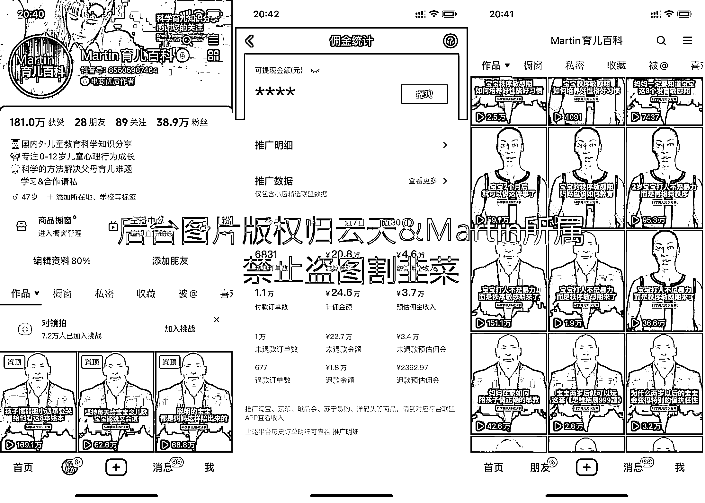

# AI 虚拟数字人短视频项目分享

> 原文：[`www.yuque.com/for_lazy/thfiu8/uovnu4s64zr7of12`](https://www.yuque.com/for_lazy/thfiu8/uovnu4s64zr7of12)

## (61 赞)AI 虚拟数字人短视频项目分享

作者： 云天

日期：2023-09-21

各位小伙伴们，大家好，今天云天将给大家带来一个门槛低，适合各类人群的项目。

它就是——AI 虚拟数字人短视频项目。

我们社群的小伙伴现在大号 martin 做到了**39 万粉丝，橱窗销量 21w 件**的战绩，目前小号 powerhouse 半个月的时间做到了**30 万+粉丝**。

目前还属于蓝海项目，只要你跟着云天的节奏走，绝对能让你赚到 n 个圈子的费用。

如果你手头上没有项目，完全可以 all in。因为对于你来讲，只需要每天一些碎片化的时间就可以操作，甚至可以矩阵做号，无论是转带货，还是卖号，都能让你赚的一桶金。

废话不多说，直接上干货。

下面，我们将主要从以下方向，通过**文字+视频**的展示方式，给大家讲解详细的操作。

# 目录：

一、项目介绍

二、视频制作之软件介绍

三、文案获取、筛选以及二次创作

四、视频制作（一）数字人视频生成

五、视频制作（二）合成混剪精细化操作

六、封面制作

七、起号运营思路

八、变现

因为星球受限，详情请大家移步飞书

[`ixy2s5ruvqf.feishu.cn/docx/TeB9dC4QGo5CLrxf8LscqdBPnZf?from=from_copylink`](https://ixy2s5ruvqf.feishu.cn/docx/TeB9dC4QGo5CLrxf8LscqdBPnZf?from=from_copylink)

* * *

评论区：

离心之巅 : 我做了两个多月，一样的剪辑手法，都是用的 heygen。且经过了换脸处理，我的视频号小红书抖音都收到了违规，提示搬运~~不知啥情况。
Jeffrey : [强]数字人原来是这么做出来的
dingt3 : 大号关注你很久了，而且还找过你说付费学习要 1288
晨冬 : 会不会是这个人物形象其他人也在用？所以被平台判断重复搬运了。需要中间加入混剪视频。
离心之巅 : 离心之巅 回复 晨冬:
heygen 用的人挺多的[捂脸][捂脸]同一个模型有的人原封不动的用，也没问题。我还经过换脸处理的～～中间混剪素材我也都是用的素材网站的素材，不是剪映的素材库，一个素材不会超过 3 秒。去重都是没问题的～～我同时起了三个号各平台分发，都全军覆没了。不知是不是同行举报。也可能还是需要搏概率吧，我这个大号都被识别搬运三次了，每次都是一个视频爆了，紧接着就提示了

* * *