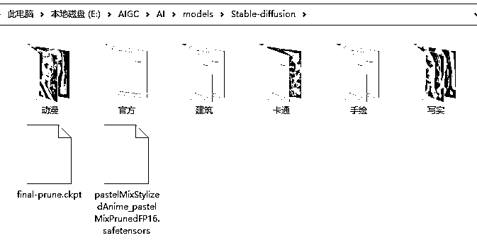
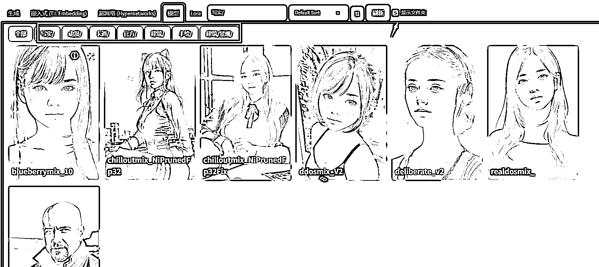
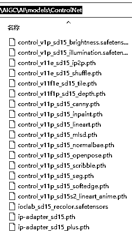
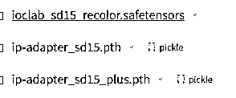
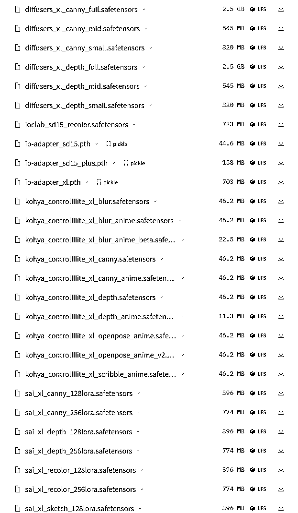

# stable diffusion 模型管理和 controlnet 最新支持 SDXL 模型下载

> 原文：[`www.yuque.com/for_lazy/thfiu8/fqd4ao12olr1lpoe`](https://www.yuque.com/for_lazy/thfiu8/fqd4ao12olr1lpoe)

## (25 赞)stable diffusion 模型管理和 controlnet 最新支持 SDXL 模型下载

作者： 来来

日期：2023-09-18

**1、模型管理**

小技巧 1：中文文件夹

modleS 模型文件夹下的模型，都是可以设置中文文件夹，有 2 个好处，查看方便，调用方便

**查看方便：通过这里可以查看你自己分类不同文件夹的模型，记得选择显示文件夹。**

**调用方便：在选择大模型的时候，就可以根据你自己命名的文件夹快速识别模型。**

**小技巧 2：模型图片**

**你可以设置一张和模型同名的图片，查阅的时候会自动调用这个缩略图。**

**1、LORA 模型**

一般来说 LORA 的模型有 2 种不同放置的位置

原生 LORA 模型放置在：安装目录\models\Lora

插件 LORA 模型放置在：安装目录\extensions\sd-webui-additional-networks\models\lora

**坏处：同样的模型要放 2 个地方，极大占用硬盘空间**

**解决方案：按照下面的步骤，点击设置--**Additional Networks---把路径改成原生的 LORA 路径即可，这样插件和原生共同使用一个路径。极大节省硬盘空间。

**2、controlnet 模型**

**技巧 1：很多教程告诉大家要放在** 安装目录\extensions\sd-webui-controlnet\models 下，这个目录这么长，不好找，其实**controlnet 模型你可以直接放在  **安装目录\models\ControlNet 下，即可自动识别，

**技巧 2：现在 controlnet 已经可以很好的支持 SDXL 模型了，请升级 SD 软件到 1.6 版本，controlnet 升级到 1.1.410 版本。需要下载支持 SDXL 的 controlnet 模型，放置在上一条说的文件夹即可。**

**下载链接：这里的模型是 controlnet 专用哦[`huggingface.co/lllyasviel/sd_control_collection/tree/main`](https://huggingface.co/lllyasviel/sd_control_collection/tree/main)**

**这 3 个是适合 SD1.5 模型的，IP-Adapter 和 Recolor 模型**

**其余 41 个都是支持 SDXL 大模型的，截图不全。**

腾讯的 T2I-Adapter 模型这里下载，也是有 2 种支持 SD1.5（18 个）和支持 SDXL（3 个）[`huggingface.co/TencentARC/T2I-Adapter/tree/main/`](https://huggingface.co/TencentARC/T2I-Adapter/tree/main/models)

综上所述，除了之前 controlnet 的 14 个基础模型，现在增加了 44 个支持 SDXL，21 个支持 SD1.5，大家抓紧用起来吧。

* * *

评论区：

暂无评论

* * *