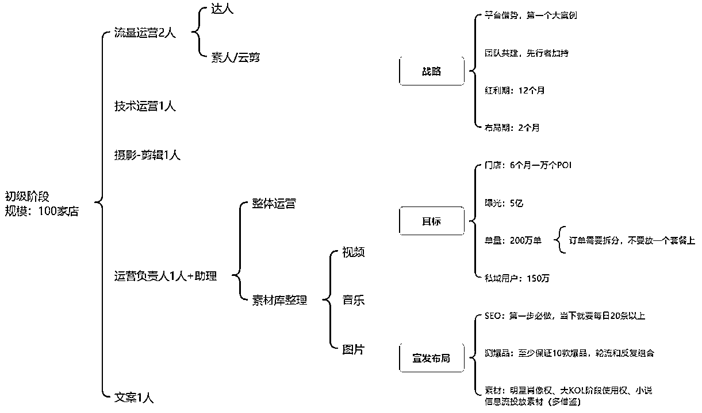

# 10 倍以上的增长：2023 年抖音家政行业洗牌加速

> 原文：[`www.yuque.com/for_lazy/thfiu8/ygr4cputa2guy150`](https://www.yuque.com/for_lazy/thfiu8/ygr4cputa2guy150)

## (22 赞)10 倍以上的增长：2023 年抖音家政行业洗牌加速

作者： 楚川

日期：2023-09-22

**大家好，我是楚川，一个集合品牌实操、短视频、直播推广为一体的创客，未来立志要在本地生活做 20 年以上。**

经过 3 年多本地生活的摸爬打滚，终于建立起”**不管平台的变化、市场的恶化，也必须盈利**”的能力，从 2022 年团队开始转型起在本地生活逐渐亲自操刀或者孵化了抖音本地生活类目头部，如鲜花店、足浴、美甲美睫、湘菜、酒吧、蹦床、烘焙、亲子乐园、家政、整理归纳、大闸蟹等。

**分享的初衷是：我们过去 10 个月，做出了抖音保洁 TOP1，联合开发的抖音小程序服务 70 多个家政品牌，现在又即将打出第二个保洁 TOP1（天鹅到家）。现在把抖音家政运营经验共享，拆解一下成功和失败的地方。希望大家今年在做本地生活的时候，思路一定要清晰，更高效的方式拿结果。**

#### 2、家政在新媒体引流的看法

1.  **第一，认清自己的定位和能力边界**：我一直认为专业的人做专业的事情，再牛逼的团队也不能把一个行业所有的角色全部填满。从家政行业去分析就是：阿姨招募、培训，门店经营，流量获客，平台运营，私域运营，招商加盟，其实每一个板块都能深挖。所以必须有一个共识就是掌握自己的定位，让自己明白能力边界，什么是核心，可以持续在行业中立足，把生意做长久。举个例子：我一开始对合作的品牌的态度是做好流量成交、私域运营，其余不用多想；我对到家防水、除甲醛的团队小伙伴，就是让他们持续关注做好交付，把控产品供应链，加盟商的服务标准化拉到极致，流量方向探索交给我们。

1.  **第二，平台的态度**：现在家政流量最大的两个平台是美团、抖音、支付宝、京东。我想说的是铁打的平台，流水的品牌和服务商，所以大家要走的路线就是——在平台搞流量和赚钱，去平台化发展。2023 年算是家政引流的新元年，我们在抖音开创了新类目，并且拿到结果，现在行业逐渐放开。这个类目会像餐饮一样泛滥，但带来较大的 GMV，背后存在的问题是：客诉，技术部署（平台组建不成熟），短视频的剪辑和分发。

​

首先分析一下美团，前面 2 年做了 4 次重大的政策调整，直接让获客成本提高了 3 倍，剩下的自己来干。这一点让大家明白：**平台的红利都是暂时的，抓住了就必须同时搭建自己的留存能力，不然就是流水的平台红利，永远打白工的公司。**

其次就是抖音，目前家政还属于邀约阶段，曾经的获客是以信息流获取表单为主，现在变成了团购获客。从我的理解和经验分析，这个类目一定是会在平台全面放开，最后比拼的是抖音的投放效率，做视频的能力和 SEO 的部署。保洁从 2023 年年初到现在已经完全变成红海市场，在这个类目中没有差异化的服务和留存能力的品牌会在 2023 年 9 月开始淘汰，加速衰败。

最后是支付宝和京东，都属于开放、调整、测试和观望的阶段，跟两个平台的负责人都有聊过，都没有很清晰的扶持、官方落地手册，所以需要时间沉淀。另外官方的人都是屁股决定脑袋，这就是职场，跟我们的生意不定契合，可能今天能有点对点的扶持，明天换岗了又是另外一番面貌。

**以上就是平台的分析，家政属于门槛****低****，平台可以自己做，品牌和服务商要保持的姿态就是：做一个墙头草，哪里流量就去哪里搞，快速沉淀自己的流量，建立自己的体系和生意壁垒。**

#### 3、我是如何孵化一个团队在抖音拿结果

1.  **第一，结识和认知同频**：我第一次服务家政企业的缘由是是在一个私董会的本地生活线下分享会（2022 年 11 月 19 日），跟大家分享了 90 分钟关于过去的复盘和未来展望，一些观点不谋而合，后面很快就有线上的频繁沟通，到长沙的会面，然后确定合作就直接布局、开干。这里想说的就是看到机会就一定要抓住机会，不能犹豫。

2.  我们都会认为家政只是一个本地生活入场券，杀进市场，找持续获利的事情和项目才比较关键。

3.  合作必须是 1+1 大于 2，所以确定合作后，我就各平台和相关行业资源都是全部导入这个团队。不过有一点就是以后关于大项目合作，一定是需要白纸黑字，不然到某些时候根本扯不清。

​

1.  **第二，技术部署和团队架构**：针对于这个家政品牌的目标，我从多个角度做了方向性的安排。所有的出发点都是以最高人效建立，从而保证项目快速起盘。

1.  批量化剪辑+品牌矩阵部署：我们探索了一下内容方向，选择了 30 个账号，批量化剪辑视频和一键发布视频观察数据情况，然后就持续调整、优化和打模板。最后让视频的内容方向、播放量都有了一个很好的保障。

1.  第三，**IP 账号的输出+SEO 布局**：以弱 IP 的方式，官方账号只是做简单的产品内容讲解，而不是很浓的商业化视频，另外就是选择关键词做好所有的内容布局，最后就是在核心城市搜索家政，出现的就是目标品牌。

1.  IP 账号的输出+SEO 布局，占领用户心智。直播间挂小房子，以 POI 布局的地方去触达用户。第一阶段想的模型是：100 个城市可以联系客服核销，钩子产品直接加私域。

1.  2022 年 12 月的阶段，信息流按照城市模型来打（这个目前依旧可以适用于没有报白的家政公司）：杭州多点入驻 POI,虽然没有产品，就用视频矩阵的方式来做，参考所有的按摩平台在抖音的宣发种草。第三步再做信息流和 IP 获客。第四步就是整理方法论，加盟的方式放大。

1.  抖音 SEO,在类目未开放或者是无法完成入驻的阶段，以及抖音限流挂 POI 的家政内容的情况下，目前发布内容的首要目的是铺设关键词(品牌&品类)。需要把要做的词先抓出来，对应到内容，有些词是官号做，有些词是带货号做。要结合现在家政词搜索量和竞品的占有量，制定目标，至少做到平台前三的主要词汇占有量。

1.  **快速拿结果**

2.  **产品上架，以 DIY 类目疯狂上产品**：我们在杭州完成上架，并且上架就疯狂出单。再次证明 SEO 提前布局的威力，这也是抖音本地生活流量疯狂的一面。在这个过程，我们一共花了 45 天，技术部署花了 30 天，1 月份真正出单和爆发。

1.  **直播和 POI 名称调整**：我们在文旅上用无人直播拿到结果，于是同样用到了家政，发现一样拿到结果，并且结合：100 多个 POI+无人直播+短视频分发，拿到了月销 200 万的结果。后面再做了 POI 名称的调整，持续吃 SEO 的流量和高净值客户的流入。

1.  **平台制约和同行举报**：在 2023 年 2 月-3 月，团队持续收到同行一日不下 50 个投诉举报，还有官方的巡查，因为内测的 3 个大品牌的 GMV 只是他们的零头，整体过于高调，所以枪打出头鸟。到现在就是等官方的类目开放重新杀进市场。在这一块的思考是：抖音流量巨大，客服团队和销售团队一定要跟上，不然在投诉量上来的时候，就会是无头苍蝇一样，找不到解决方案。

#### 4、2023 年，我对家政团队的理解

**第一，没有全国货盘的能力，劳动力供应链不能坐庄，不做全国品牌和 TOP1**。

其实一开始在我的安排是希望单城市打爆，然后不同城市以其他的子品牌复制，因为我们团队是最了解字节的，我们算是活的最久的服务商，太清楚平台在想什么。2023 年，1-2 月的疯狂增长和获取流量，到类目第一后戛然而止，这一点值得深思。在本地生活领域，我们团队就是希望合作方初期，至少是 3 个月，都是听话照做，因为认知水平不统一，经验和技术也有差距，那就是用我们的方式带着跑最好。**现在是 2023 年下半年到 2024 年，家政的运营我建议依旧是核心区域做直营，以 POI 覆盖+大批量视频疯狂发布，是能从 SEO 和曝光密度上跟全国品牌掰手腕，这也是区域家政的最优解。**

**第二，流量如何****二****转和运营**。

家政的流量很大，有足够多的爆发力，并且沉淀的私域流量是 90%用户，标签是：26-40 岁的高净值女性。但是在这个过程又会陷入阿姨 T 单，不过也取决于团队的运营和把控能力。这个用户价值很高，所以盈利的第二环节应该是有升单产品，那就要在所有环节做好新的思考。

比如：流量进来——必须有互动——日常维护和升单。这是一定要做的事情，因为我有学生，做 9.9 日常鲜花，流量进来就开始拉群，日常好物分享和视频号直播卖货，这就是执行力和持续的思考力。

**但是在这个环节，我们跟诸葛到家的创始人李敏沟通，也反思到为什么大部分家政公司直接放弃了家政私域。最核心的地方是保洁业务依旧是低频需求，复购周期长，在运营层面上很难形成良性循环，其次是当下在拉新层面都无法做好就更加没有能力考虑第二层面的转化，所以这是花钱烧用户的团队需要认真思考的地方。**

**第三，一个最小单元的家政团队的组成**。

交付团队+拍剪运营 1 名+流量运营 1 名+平台运营 1 名，我们就是这种配置，差不多对方提供的人手就是 2.5 个人，剩下的线上打流量就是我们这边在操作。在 60 天的时间，他们自运营就启动了，我们只做战略指导。在做单城市或者省份家政品牌，5-6 个人的团队，预计可以做到单月 60-150GMV 的水平，只要能力不拉胯，持续：IP 输出+矩阵+SEO 布局+无人直播+达人矩阵/直播，纯流量产出比到 1：100 无压力。在这一块，我们团队已经分别在长沙、衡阳、广州、深圳顺利的发育，收益很稳。

**第四，真正的家政公司需要深度绑定流量团队，流量获取方式和渠道优化，产品定位重新包装。**

抖音本地生活是一个平台变化极大的行业，传统的家政公司一定不要认为，从服务商这里学到了流量运营就直接毁约自己玩。家政团队要十分清晰认识到学到的流量运营能力是不具备升级进化的空间，一定要在自己的领域专精，而不是因为蛋糕被切分而选择短视的行为。因为流量团队是有足够的体感知道抖音的趋势和流量密码，能够快速调整运营策略，保证每一次平台的红利不会掉队。并且随着时间越来越长，流量团队会越来越清晰理解家政盘的产品，是能够具备能力深挖家政行业的潜在需求，这就是能让团队快速掘金的机会。所以楚川在这里建议，真正的家政公司（非中介家政公司）要持续选择流量团队合作，时间越久，越能产生化学反应。

#### 5、未来家政的归宿

**第一，流量必须变现**。

流量不做二次变现，这个生意会很辛苦。不然沉淀的流量再怎么样也只有 30%的私域复购，压力都给到流量获取端。我认识好多个家政团队，都是在流量变现上陷入难题，导致后面没有大发展。但在流量变现的商业模式上一定不能建立在复购的角度，不然就是一个死局。

**第二，家政是一个很复杂的体系，很多小赛道值得大家深耕**。

随着往后发展，抖音家政行业是逐渐利好从业者，值得我们做 20 年以上，这也是我们团队愿意持续投入精力的原因。**但是在商业模式的建立上，一定需要深度思考的点：如何避免能力强的阿姨和师父把客户抢走，平台或公司留下的都是摆烂的交付人员。**

**第三，未来抖音家政一定是精细化、多方位的发展。**

**其中涉及到的方向有保洁、清洁、维修和防水等，每一个方向都能连锁到上万家的水平，这就需要所有的从业者做深层次的探究。另外就是在产品的升级和创新需要逐渐走向市场，如保洁业务下的宠物家庭保洁、婴儿和久病家庭的清洁都是需要特殊处理的保洁服务，这些高客****单****产品都有待开发和大面积落地。**

**第四，做品牌和资本加持**。

我孵化的品牌”十三烧“在 10 家店，12 万会员的时候就可以估值 5000 万，并且拿到天使轮，2023 年即将开始 A 轮，我们融入了私域运营和数字化的部署，估值 10 倍以上的增长，这就是是品牌的力量。如果家政拆分成 n 个子品牌，沉淀流量做私域，可以很快估值破 5000 万，并且拿到资本加持，就不会轻而易举陷入平台的制约，思路和战略决定更加高维的出路。

**第五，家政云连锁是一本万利的生意，但是在实体项目中赚钱，最终还是要回归线下门店。**

这就取决于 1 年内谁能做大量的抖音 POI 入驻，把门店成本压到最低，想想看一年一个档口 600 块，100 家店就是 6 万，但是你能做破亿的 GMV，这就是当下大部分人看不到的机会。同时极度便宜的门店展示也是一个线下广告位，一石二鸟。这是后半场大家都需要深思的问题。

**第六，我们到底是想做一个家政项目还是做一个生态。**

家政行业的盈利大头肯定是招商加盟、招生培训，但最后需要在行业中落地，那真正的业务还是需要去有人推动落地。我们团队的思考是不想去做一个仅仅能赚钱的家政项目，未来的发展方向是打通上下游，用我们流量和运营能力整合落地交付端、家政服务培训端，做一个复合收益的生态，才能保证整个团队能在行业中存活 20 年以上。

**以上就是我做家政的全部经验，很多方面有思维缺陷，因为我切入到这个行业还没有到 1 年。更深层次的探讨，可以单独****链****接。**

* * *

评论区：

胖大魔 : 我看到居家养老。从家政慢慢方面低成本切助浴需求，
闫君 : 楚川实干家写出的帖子就是不一样，很实在，很接地气。

* * *