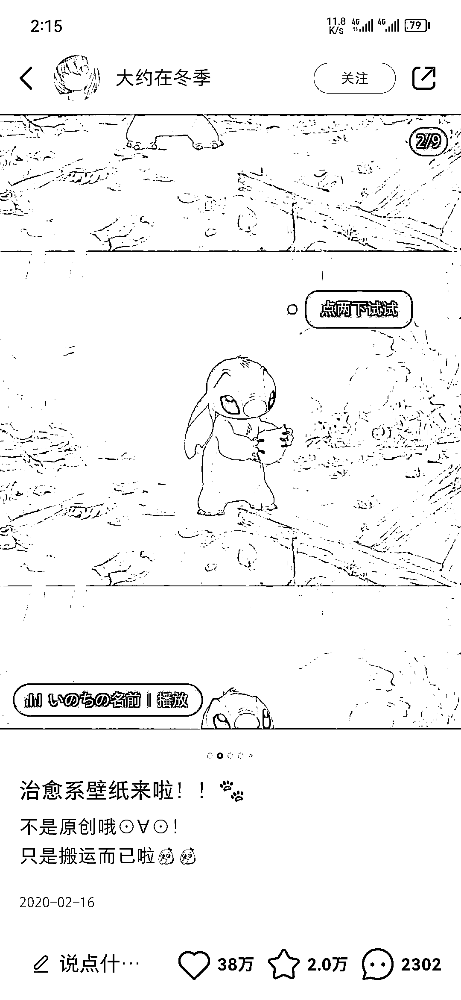
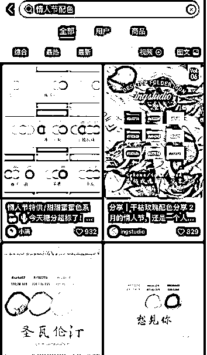
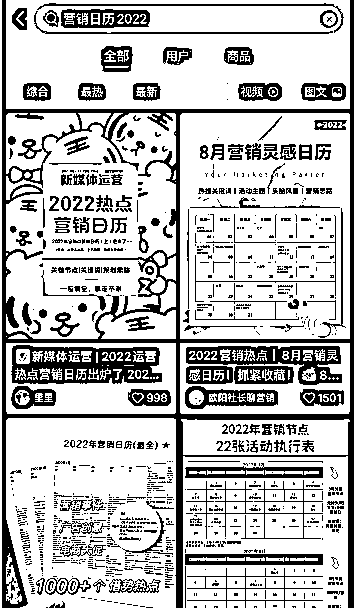
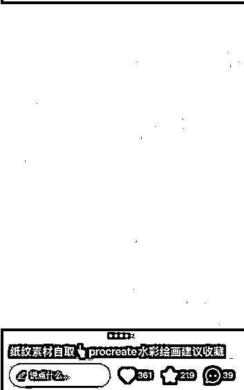
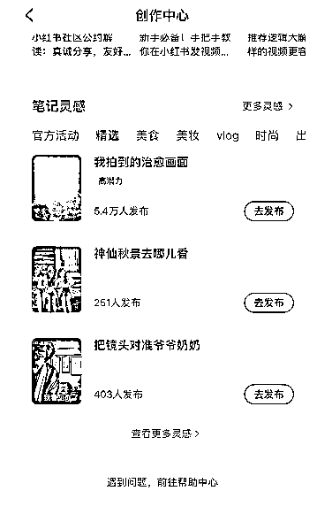
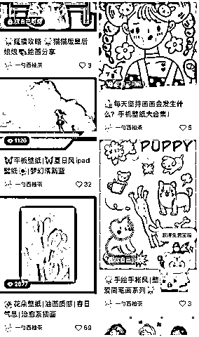

# 从微博转型到小红书做壁纸号，怎么从几十粉到万粉，成功变现？

> 原文：[`www.yuque.com/for_lazy/thfiu8/urnfamu8e0x42trf`](https://www.yuque.com/for_lazy/thfiu8/urnfamu8e0x42trf)

## (33 赞)从微博转型到小红书做壁纸号，怎么从几十粉到万粉，成功变现？

作者： 一勺西柚茶

日期：2023-09-19

不知道大家刷小红书时，有没有刷到过分享风景图、动漫图、插画图或 ins 风图片等类型的壁纸号？

其实做这类型的账号并不难，变现逻辑也很简单粗暴，但很考验耐心，需要持续付出时间和精力。

接下来，就结合自己的实战经验，给各位圈友分享下这类账号是如何运营变现的。

大家好，我是西柚茶。

只做原创的设计美学博主，靠画画接单实现经济独立。

目前微博粉丝 5w，小红书 3 个月涨粉 1.8w。

从刚开始点赞几十，到后来写出了赞藏 2w+的爆文，再到后来几乎一半以上的笔记都是爆款。

中间经历了一些曲折，也有很多思考和感悟。今天来给大家分享一些打造爆款笔记的经验与心得，希望对你们有用。

我会从以下几个方面展开分享：

一、我为什么做小红书？

二、我是怎样写出万赞笔记的？

三、一些运营小技巧

四、我做小红书的感受

五、新手容易踩雷的地方

六、壁纸账号的变现逻辑

# 一、我为什么做小红书？

在做小红书之前，我玩的是微博，主营类目是壁纸插画，也积攒了一批粉丝。

无聊时刷小红书，偶然间发现，有人搬运我的壁纸，点赞还很高，于是心里想到：她们可以，我也可以呀，而且我本身会画画，会更有优势。

稍微研究了一下发现，原来小红书是个宝藏，变现渠道很多元，刷到很多插画师朋友都在上面发内容，有的授课，有的卖周边，这说明了发展小红书绝对是一个趋势。

**于是我开始寻找方向，分析怎么做内容，怎么变现，从微博发力改为重点专攻小红书。**

找了之前微博发布过的内容，信心满满编辑好笔记发布了，满心期待等着流量大爆发，没想到现实直接给我泼了一盆冷水，自己发的笔记居然还没有搬运我的笔记点赞高。

刚开始就觉得好难，内容这么好怎么没人看，差点摆烂，直到有一次偶然间蹭了个热点，我迎来了自己的第一篇爆款，而且是万赞的大爆款。

# 二、我是怎样写出万赞笔记的？

一月份发布的这篇笔记，因为提前布局，蹭到了情人节热点，流量爆发点赞 1.7w，收藏 5000+。

**（1）调研阶段**

起初是因为一时想不出选题，情人节是最近的一个大节日，所以提前很久就做了内容，没想到无心插柳柳成荫，最后居然爆了。

这件事给了我一个选题的思路：

前期可以根据月份日期（可以用营销日历辅助）去小红书搜索自己类目相关的节日关键词，按“综合”、“最热”、“最新” 搜索高赞笔记，看到合适的并且可以模仿的，记录到自己的选题库中。

但这时候会发现有个问题，有时候通过搜索一个节日关键词，发现没几篇最近的笔记，数据也不好，怎么办？

没关系，这是正常的。因为至少提前了一个月，所以搜出来的大概率是往期的相关笔记。我们要做的正是提前布局关键词，等节日流量来了，你比别人有了基础流量，爆的可能性就增加了。

这种选题有时效性，建议早点发，减少竞争，节日快到的时候会有大批新内容涌现，到时候难度就增加了。

有了选题之后，具体怎么做呢？下面就以我这篇情人节笔记为例，详细说一下我的制作过程。

我先大致浏览关于情人节的内容，感受一下去年这个节日大家都爱看什么，一般节日热点每年都会有很多流量，而且爆过的内容很大概率会再爆。

搜索之后，我发现往期情人节数据好的有这些内容：

1.  元素：爱心，玫瑰；

1.  色调：红色，粉色，蓝色，黄色，白色（大部分都是粉色红色）；

1.  文案：都是有氛围感的简短的一句话，有些会加点英文体现高级感。

知道了关键元素，接下来就是找素材了。

**（2）找素材阶段**

分别搜索：“情人节配色”，“爱心素材”，“情人节文案”

搜“情人节配色”，会发现有很多颜色的色卡，但因为刚才看了排名靠前的笔记，基本都是红色粉色占比多一些，所以第一篇笔记不是很适合，优先选择红粉系的配色。

搜“爱心素材”，也会找到非常多的爱心参考，可以参考外形，形式，装饰，但不要一模一样照抄，结合一下，例如：可以参考这个爱心的形式，里面的方块元素换成圆形。

最后搜“情人节文案”，也有很多高赞的笔记，可以参考一下，文案写的好也能带来很多互动。

**（3）制作内容**

结合了之前的一些素材，就可以制作内容啦～

色调选择红色系，元素我画的是手绘感的爱心（结合一点变化），文案就是简短浪漫的一句话。

编辑好内容之后，就可以选择时间发布了，没想到发布不久后，后台就不断地有消息提醒，每过几分钟，就显示消息 99+。

也是这一次的经验，给了我很多启发。经过不断地摸索尝试和学习，重新对内容做了调整，账号进行了改造，引流和询单渐渐多起来了，成功收获了更多的客户。

这里提醒大家，发布笔记时你要考虑用户的活跃时间调整发布时间，多测试几次。

还要注意的是整体色调要统一，排版不要杂乱，统一的视觉会让用户专业。

# 三、一些运营小技巧

**（1）提前布局：抓住节假日流量**

营销日历很有用，可以帮助你确定全年的节假日，根据日期来准备对应选题（不用每个节日都做选题，根据自己的行业来）

百度就能直接搜索到：[htts://](https://www.sohu.com/a/512630028_120147995)[www.sohu.com/a/512630028_120147995](http://www.sohu.com/a/512630028_120147995)

小红书也能搜到很多别的博主整理好的，找个你喜欢的就行

**（2）蹭热点：遇到突发事件的应对措施**

俗称“蹭热点”，特点是事件得突然，要及时做内容，越早越好，一般热点发生的 1-3 天最佳。

时间久了，一时间平台发布类似风格的笔记太多，大家对这个内容就没这么大兴趣了，笔记数据可能就没那么好了。

总之，热点爆发初期，可以马上开始想想自己这个行业有没有能蹭上的，及时准备相应内容。

注意：政治类，负面类的热点不要蹭，有风险！

**（3）资料引流：埋钩子精准引流**

接下来分享下我的“资料引流法”。

**重点就是一句话：****确定人群，分析他们的需求。**

比如，如果我想引流喜欢画画的朋友，那就可以留干货资料、资源素材。针对不同的人群，你要准备不同的钩子资料。

之前参加无敌的第 1 期资料引流营，我发布了一篇笔记，现在还有很多人加我领资料。

制作方法也很简单，总结起来就是：找对标-分析-模仿-埋钩子

我会在评论区引导大家私信我领取资料，可以发群聊链接也可以暗号暗示。

笔记里引流提的不要太明显，不然会违规。如果内容足够好，钩子足够吸引人的话，就算笔记里没说，也会有很多人在评论区主动问你要资料。

放一张这篇笔记我收到的评论，全都是求资料，之后只要做好承接就行了。

小 tips：每周的关键词车互暖可以参加一下，对笔记初期推送很有好处。

**（4）题攻略：源源不断的灵感从哪来？**

**①从对标账号找**

多参考对标笔记的爆款选题，这样的参考很有价值，因为火过的内容一般还会再火一次。

**②从其他领域（摄影，艺术品）找**

小红书上优质的笔记非常多，囊括了很多领域，刷小红书娱乐的同时也能积累不少素材。

比如我是画画博主，我需要做一个选题，那我就可以搜索摄影、雕塑等相关主题内容（形式可以模仿，内容可不能照搬），结合到自己画面里去，这样既不会过度参考，也有自己的独创性。

而且小红书还会源源不断地给你推相关的笔记，这样素材库就又有了。

**③从笔记灵感找**

小红书官方的【笔记灵感】每周五都会更新，想不出选题可以进去逛逛，顺便看看别人是怎么做的。

指路：点击屏幕左上角-创作中心-笔记灵感。

# 四、我做小红书的感受

### (1）对新人友好

小红书对新人扶持力度很大，只要注意一下规则，有运营意识，真的没有想象中的难，最重要的是及时行动。就算粉丝很少也能快速变现，起号简单，对文笔要求也不高。

只要会作图或者剪视频，能快速输出笔记获取流量，成交转化率也高。

但是注意封面图一定要好看，这样才能让笔记点击量翻倍。

我粉丝不到 1K 就成功引流变现，后面还接到了品牌广告合作。证明平台对小白还是很友好的。

**（2）扩大获客范围**

从微博转战小红书，深刻的感受到客户源又多了一个，越来越多的客户喜欢在这个平台上找内容，所以我们也要与时俱进。一个平台成功了就可以考虑复制模式到另一个平台。

运营小红书可以帮助你扩大获客范围，又因为它的推荐机制，还可以吸引到更多对你笔记感兴趣的客户，所以，一定要多发对客户有利的笔记，促进转化。

**（3）灵感素材的集合地**

小红书上很多好内容，多刷可以培养“网感”，你会发现很多爆款笔记都有套路，想想为什么你会被这篇笔记吸引，多思考这样的爆款能不能用到你的领域。

**分享几个素材网站给大家：**

汇图网（很多图片素材）

[`www.huitu.com/`](https://www.huitu.com)

Fresh Folk（美籍日裔插画家 LENI KAUFFMAN 创建的高质量插画库，免费且可商用）

[`fresh-folk.com/`](https://fresh-folk.com)

POSEMANIACS（30 秒快速挑战人体速写的网站，每 30 秒会随机刷新一张人体解剖动态）

[`www.posemaniacs.com/`](https://www.posemaniacs.com)

电影海报集锦（可以学习优秀电影海报构图）

[`www.impawards.com/`](http://www.impawards.com)

PxHere 摄影图库（非常全的一个免费版权的网站，可以用来当做素材库）

[`pxhere.com/`](https://pxhere.com)

Magdeleine （免费高质量全景图片库，图片都非常高清，质量非常高）

[`magdeleine.co/browse/`](https://magdeleine.co/browse)

# 五、新手容易踩雷的地方

**（1）主页混乱，内容自嗨**

刚开始因为不懂技巧，内容没怎么思考就随便发，也不会太在意封面图，就像个人收藏夹一样，那段时间笔记数据很差，流量也不稳定。

有时候也会经常刷到主页有些笔记，感觉明明也是很随意发，数据也非常好，总觉得自己也能“碰运气”。直到我连续出了好几篇爆款，我才意识到这是有方法可循的，优化好统一好封面图，真的很有效！

（上面是我原先的主页）

笔记大小规格都不一样，很混乱，虽然内容是垂直的，都是画画相关的笔记，但就是显得业余不专业，内容不吸引人，从数据来看用户也不是很喜欢。

没有调研过用户喜欢的内容，不注重排版，自然就没人愿意关注了，点赞也寥寥无几。

**一定要有用户思维，这很关键！**

笔记的选题内容直接决定了你的这个笔记能不能成为爆款。多分享对用户有用的内容，用户才愿意点赞收藏。

在研究过程中，刷到了很多类似博主的笔记，发现**排版统一整齐**的笔记数据就会好一点，这样的内容清晰直观，小红书用户特别爱收藏点赞，互动量相对于单图来讲普遍很高，给人获得感，可以说是流量密码了！

于是我也尝试了一下，主页瞬间大换脸，美观了很多。

上图原先没有怎么排版，点赞量只有 2 位数，编辑过改成了统一的九宫格，后来又把同一系列排版杂乱的笔记都编辑了，点赞变成了 3 位数。

后来又乘胜追击写了好几篇这样的笔记，几乎篇篇几千赞的爆款。

能给用户提供价值，是爆款内容的核心。起号阶段，必须要利他，不能一来就引流。

**（2）自我怀疑，心态不稳**

相信大家都经历过这种时期：

下定决心开始做小红书，一顿操作猛如虎，阅读量只有 2 位数。

于是天天自我怀疑和纠结到底做小红书是不是对的，这时候理性找原因，找办法解决就好。不要被数据绑架。我想说，经营任何一个账号都是长期主义，也许大家看了无数的课程和攻略，掌握了很多技巧，但是最重要是调整好心态。

想清楚做小红书的目的，有用户思维，持续地输出总结复盘，优化自己的账号，坚持下来一定会有收获。做账号，是一个持续输出的过程，同时也是自己不断成长的过程。

# 六、壁纸账号的变现逻辑

首先做这类型的账号并不难，但是需要持续付出时间和精力，很考验耐心～很多人就是因为坚持不下来放弃了

变现逻辑也很简单粗暴：只要把自己的作品发布出去，就会有喜欢你作品的老板来找你授权和约稿

画画技术也不难学，市场更新迭代很快，需要源源不断的新稿子，耐心经营好账号就成功一半啦～

因为画法并不复杂，平时下班也可以随手画一下，就当练手，赚点零花钱也是很不错的

类比到别的行业也是一样，比如手工，维修等等，只要有自己的产品都可以试试展示出去，就有可能收获喜爱成就感，顺便赚点钱，世界这么大，一定会有喜欢你作品的粉丝的

# 七、写在最后

做自媒体，真的是普通人逆袭的一条路，它可以倒逼你不断成长，有时候只需要一点努力+运气，就能让生活发生改变。

跟正确的人，做正确的事，专注自己，多一分心力去注意别人，就少一分心力反省自己。

另外，大家一定要多去尝试，勇于尝试才能找到成功的路。

希望未来的路上，大家都能遇到更好的自己。

以上就是我运营小红书的一些小心得，先完成再完美，与大家共勉。

最后，祝大家天天出爆款，财源滚滚来！

* * *

评论区：

暂无评论

* * *