# 小红书自动化引流(老严)

> 原文：[`www.yuque.com/for_lazy/thfiu8/bhlbndp14ruqqi3m`](https://www.yuque.com/for_lazy/thfiu8/bhlbndp14ruqqi3m)

## (35 赞)小红书自动化引流(老严)

作者： 老严干货 CPS

日期：2023-09-19

生财有术的圈友好，我是老严

我之前分享了一篇《小红书自动引流系统淘客月佣 9w》的文章，是讲小红书自动引流的，阅读量很高，很多人时不时问我一些问题，没法挨个回答。感兴趣的，可以回看一下这篇文章：[`t.zsxq.com/0cLleoKgo`](https://t.zsxq.com/0cLleoKgo)

最近更新了不少内容，重新写了一篇进阶版，6000 多字，希望对大家有用！

* * *

近期我跟朋友聊到相对比较蓝海一点的自然引流板块有 2 个：小红书和视频号。

**啥是蓝海呢？**

就是**池子里鱼比较多，但是来捞鱼的人还不怎么多**，等更多的人知道这里有鱼了就会过来捞，于是就不是蓝海了。

**人再多一点，鱼就不够捞**，这就是俗称的红海了，只有一些有高超捞鱼技术的人能捞到，然后市场慢慢被这批长期积累的兄弟以低毛利占据着，然后**散场的人再去别的蓝海池子里捞鱼，生生不息**。

既然是蓝海，说明成本是普通人（没团队且没资金）也能承担的，引流模式是普通人也能搞的。

大抵上来说，引自然流最常见的手段就是【**做内容+留钩子**】，视频号这块暂且不聊，小红书这边，就是发一篇笔记，然后留个有用的东西，让精准用户加自己，联系方式放在评论、图片等地方。

刚开始小红书还能搞一些小号去发，但是现在肯定没啥效果，需要借助别人的私人号去发布笔记，俗称代理或 兼 zhi。

**我简单把这种代发流程捋一捋：**

**1、发笔记给代理，给的几毛几块，别奢望代理们自己写**

**2、代理发文，然后截图或者发链接给我们**

**3、我们审核无误，然后微信支付宝转账**

**4、让单一代理每天重复上面流程**

**5、找更多的代理重复上面的流程**

**这里有几个问题比较棘手：**

**1、如果有 1000 个代理，如何写这么多去重的笔记？**

**2、如果有 1000 个代理，怎样高效审核代理们的任务？**

**3、如果有 1000 个代理，转账怎么搞？**

**4、如果激励代理每天参与这个任务？**

**5、上哪里找那么多代理？**

第 5 个问题我们这里不谈，下面的问题讨论都有个前提：**你在搞小红书代理发笔记引流，而且帮你发笔记的代理数量特别多，人工流程已经跑通了。**

第 1~4 个问题，传统的手工操作，肯定非常耗费人工、容易出错、流程容易出问题等等，这几个地方，天然就需要工具来解决了，工具最擅长解决这类逻辑简单大量重复且数量级非常大的问题。

我群里有一位兄弟叫【老刘】，他原来是一位软件工程师，后来单干出来创业，开发了一套小红书自动引流系统来引流，解决了以上几个问题。

我简单说说他这个系统的逻辑：

**1、新代理关注公众号**

新代理可能是老代理推荐过来的，自动裂变嘛，这个实现不难

**2、新代理从公众号获取笔记**

笔记是系统自动生成了，要么是根据我们导入的图文混剪成很多篇，要么根据关键词从小红书里自动抓内容生成文章，这都是基本技术，有点目前很火的 AI 的概念。

**3、代理发文以后直接把链接发给系统**

不用发给我们，转发给系统就好了

**4、系统会自动识别文章是否发了**

别问我系统怎么做到的，系统做这种事轻车熟路

**5、系统根据大家的阅读量自动调整本次任务的奖励金额**

是的，系统最终可以通过某种办法知道代理转发笔记的阅读量，然后阅读量越大，给的钱越多，相反越小，例如原定 1 元一篇，某个代理发的文章阅读量爆了，可能给到 2~10 元。

**6、自动给代理转账**

这是公众号跟微信商户支付的基本操作，不赘述。

**7、总提现超过某个数的代理，弹客服微信**

导流到私域和群，用头部效应（单篇文章阅读量高的那几个人）激励其他代理。

这样操作的话，一个全职客服可以管理 1000 个代理，不在话下。

具体这个系统的细节，可以看下面的内容

=======详细内容=======

**《红草》笔记运营管理**

1\. **红草系统是什么？**

大家知道目前小红书平台流量巨大，是天然的种草平台。粉丝相当精准，以 18-38 岁的女性为主。这个目标人群与几乎所有电商平台业务的精准粉丝高度吻合。

所以近年以来，成为大家投入引流的必争之地，热门之一，首选之地。

要想在小红书上面吸引流量，目前主流的是三种做法：

**第一种：**撰写精品爆文，打造 IP，以质取胜。根据自身业务内容寻找挖掘热门话题和内容，精心准备内容丰富的图文素材，通过价值吸引目标用户的关注，从而慢慢实现其自身业务的转化。

**第二种：**投聚光广告，在质量无法做到优秀或者业务本身没有成为热点爆款的基因时，通过付费广告占领目标用户有限的搜索、推荐流量。实现平庸内容的“脱颖而出”，从而“赢在起跑线”抢占平台有限的目标流量。

**第三种：**海量矩阵推广，与上一种情况类似，由于业务内容本身并不属于大众普遍关注的热点。想要卷赢对手或者更多的爆光，就只有唯一的一条路了，那就是帐号矩阵式推广，通过海量的笔记投放，以霸屏的方式抢占流量。

而红草属于第三种操作模式下的一种管理工具。

简单来说，红草是一个可以帮助业主管理笔记素材、生成笔记素材、管理合作博主、发放笔记报酬的一个软件管理平台。

**用户端操作视频必看**

2\. **红草系统效果怎么样？**

最近针对红草系统的老用户做了一次简单的调查了解，问了几个简单的问题：

*1.您目前用红草引流的单粉成本大约是多少钱？*

*2.您目前每天大约投放多少条笔记？*

*3.系统中累计有多少兼职人员参与？*

*4.从单粉成本和笔记展现量方面，你认为还有哪些可以提升的空间？*

有几个联系得比较多的用户给我了一些反馈，我把这些信息汇总到这个表格里面了，大家可以看一下，总的来说有几个情况，可以给大家总结汇报一下：

1. 笔记报酬一般在 0.5-2 元之间，兼职多的人会比较划算。直接相差 4 倍的成本，也就相当于 4 倍的效果差异。

2. 单粉成本在 3-10 元之间算正常区间。优化的空间主要在于兼职的报酬、笔记违规的控制。

3. 常见引流方式是：引导进小红书群、笔记图片水印。

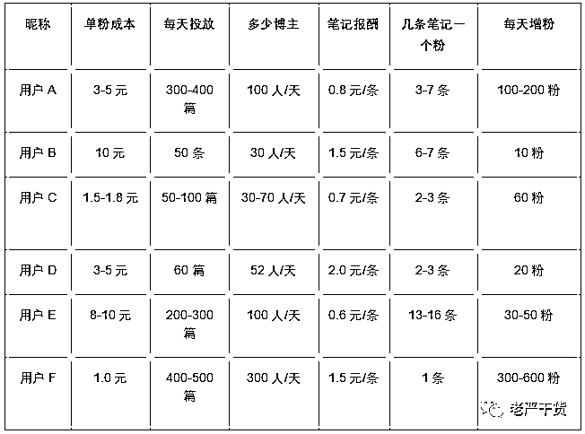

3\. **使用系统常见的困难点在哪里？**

1. 缺乏对标案例，自己都不知道发什么素材，发什么形式。或者案例比较单一，一种方式不行，没有别的备用方式操作。

2. 做兼职的任务粉较少，导致成本高，精力牵扯太多。平台阶段性封号，导致兼职粉流失。

解决好这 2 个核心问题，或者具备以上两个条件，基本上就没有别的大问题了。

4\. **3 月以来新增了哪些重要功能？**

1. 7 月后已经支持抖音的图文获取和发布，以及任务审核。

2. 文案素材可以自动 AI 批量生成；图片素材可以大量自动裁剪；标题可自动采集爆文标题。

3. 笔记的回评促热、文字截评引流、图片截评引流等功能进一步完善和大范围运用。

4. 同行自动收集和分析。用于不断寻找对标帐号，优化自身笔记素材模式。

5. 采集文案的方式得到大量的使用，功能也进一步完善。

6. 笔记模板功能更加灵活。可以按公众号、按分类、按平台（小红书/抖音）等进行规划。

5**. 都哪些人在使用红草**

为了更好的服务使用红草的用户，最近我们做了一个业务形态分类。大致结果如下。

这里有包括了当下最热门的一些业务，比如：快递 CPS、淘客社群、淘客返利、同城相亲、品牌宣传等等。

其实淘客社群、淘客返利都属于淘客的子形态，总体上淘客业务占了 50%以上。

这并不是说系统只适合于淘客，而是由于前期是在淘客圈内开始宣传和传播导致的。

随着用户的口口相传目前非淘客业务的比重也一一点点在提升，进一步说明系统并不受任何行业的影响，也不仅仅只是淘客领域才有引流的需求。

 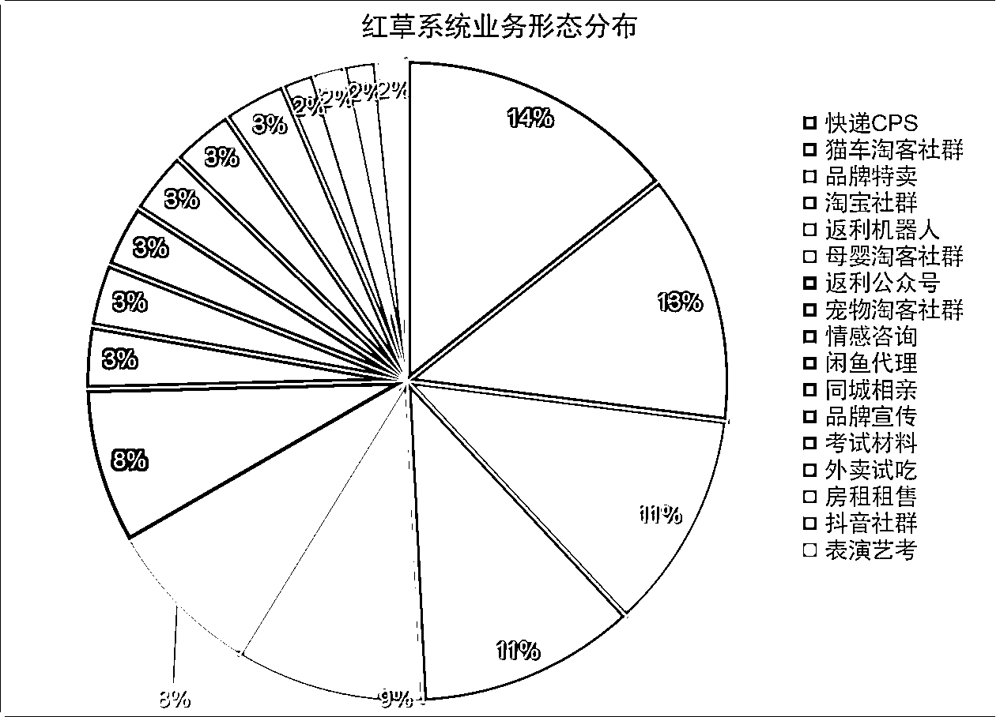

6\. **小红书引流场景举例说明**

下面我们来先来看几种使用小红书笔记引流的场景，让初入者对引流有一个简单的了解。

6.1 **场景一：淘客给社群引流**

这个是淘客利用小红书平台，发布低价的猫砂，引导小红书用户进小红书群。

用户看了笔记，进了小红书群以后，会再在群里发微信的群二维码或者私人号，从而实现引流到私域。

并在私域通过推送淘客优惠券实现变现的案例。

6.2  **场景二：返力淘客给机器人或公众号引流**

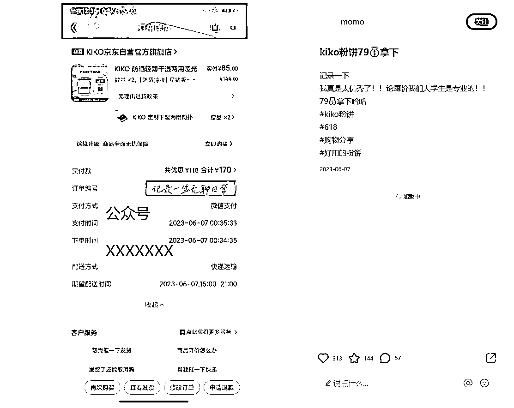

返利机器人或者公众号借用一些热门商品的订单图，再加上公众号或者微信号的水印图片，制作成笔记素材。

然后让兼职批量发布。

6.3 **场景二：拼多多商家给店铺引流**

 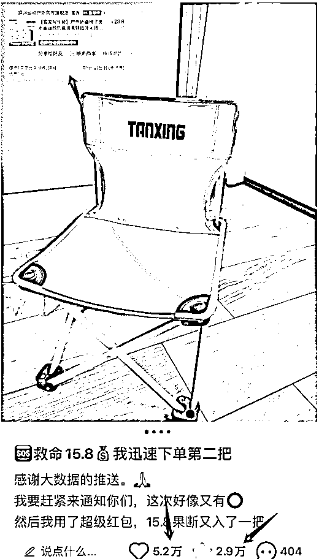

这是个商家的在小红书上面引流的例子。笔记上面就主要就是一把折叠椅和的介绍和图片，图片右上角有一个水印图片，图片是指向这个商家的店铺名称。

可以想象这一条笔记可以给商家带去多少流量，如果商家每天发 100 条，1000 条这样类似的笔记会有多么庞大的流量呢？

如果有商家也想通过这样的方式引流的话，可以用自己的买家群，或者以好评返现的机会，让用户去帮他自己店铺发这种小红书笔记，实现以粉引粉，滚动引流，无限循环。

6.4 **场景三：尾货特卖商家布局小红书**

 

 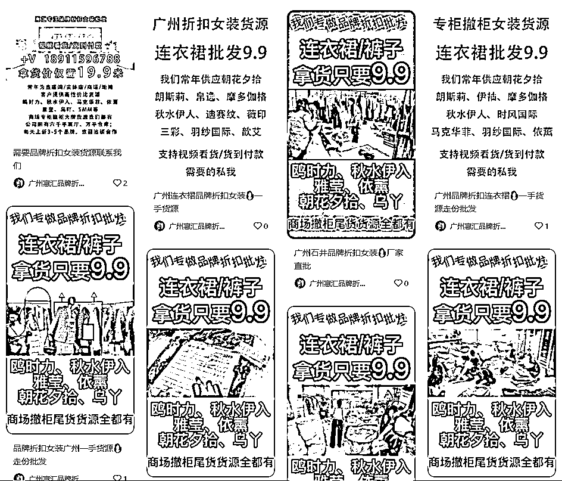

6.5 **场景四：品牌商家给品牌引流。**

背背佳品牌商家给自己品牌引流，实现品牌的传播效应。

 

7\. **人工方式做笔记成本相当大**

 

这是传统方式找人发笔记的的场景，短短的一个对话，隐含了相当大的工作量。

比如这里肯定包含有这些环节：1.核对笔记，2.发放报酬，3.交付图文素材。

场外还有别的环节：1.素材的准备，2.兼职人员的分类分工，3.笔记是否删除的抽查，4.用户的周报浏览数据表现好不好，要不要长期合作，5.兼职拉兼职的裂变奖励和兑换，6.笔记汇总统计效果复盘。

想想如此多的工作量，一个客服人员一天可以应付多少条笔记投放工作呢？100 条还是 200 条？一个客服的薪资成本就是 3000-4500 元。

按 150 条/天算，平均发 1 条笔记客服就占了 1-1.5 元的成本，兼职还要给 1-1.5 元。综合算下来一条笔记的成本就需要花到 2-3 块。

而且这种模式极大的限制了规模化操作，客服的人力隐性管理成本，招聘成本，无法应付季节性变化等因素，会让用小红书引流这个事，看起来很美，做起来很苦。

8\. **《红草》自动化引流模式有多猛？**

8.1 **人工方式处处要花时间**

回顾人工方式做笔记的过程，主要有这么几个环节：

1. 素材的准备

2. 交付图文素材，把发笔记的标题、正文、图片发给兼职。

3. 核对笔记，检查笔记是不是符合要求。

4. 发放报酬，一般是微信转红包。

5. 兼职人员的分类分工，每个人发的素材不能重复。

6. 笔记是否删除的抽查，有很多混红包的，上午发，给了钱，下午删。又去接别家任务。

7. 用户的周报浏览数据表现好不好，要不要长期合作。有些黑号，从来没有流量，要及时发现。

8. 兼职拉兼职的裂变奖励和兑换，兼职邀请好友来做兼职，需要统计和发放奖励。

9. 笔记汇总统计效果复盘，每天发了多少笔进了多少粉，需要汇总日报，分析数据进行优化改进。

上面一共 9 个环节，每个环节都需要内部客服工人参与。先不说兼职的笔记成本，自己人这边的成本就已经足够大了。

8.2 **软件模式到处处自动化**

而使用软件系统就可以基本上 90%解决以上完全可以用电脑代替的工作。

8.2.1 **图文素材准备的全自动化**

下面是采集淘宝商品评语作为笔记的图片和正文的操作，可以一键采集商品所有评论。图片可以自动打分，文字可以自动删除差评。

 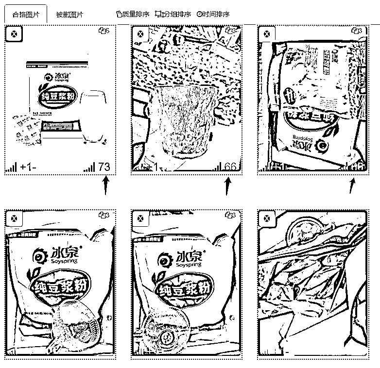

8.2.2 **兼职自动化获取文案**

兼职到系统里面自己来取文案素材，完全不需要素材交付环节。下面是用户通过微信公众号进入的获取文案的网页界面。

 

8.2.3 **自动计算报酬**

核对笔记和计算报酬。兼职取到素材以后，自己复制笔记链接过来上交系统就可以了，然后就可以等待后台工作人员的审核，也可以开通自动审核。

 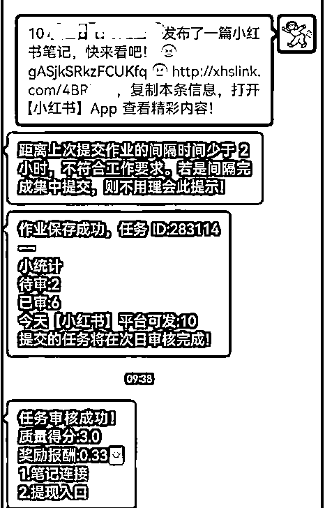

8.2.4 **笔记审核的全自动化**

这是后台审核笔记的列表界面和详情界面，工作人员可以非常方便的点开笔记查看，并进行报酬结算。也可以由系统自动检查，特别是搜索一下笔记是否被屏敝，可以做得比人工更好的质量。

 

8.2.5 **笔记抽查自动化**

系统自动抽查不诚信的发贴行为，一经发现，马上停用帐号。减少盲目的投放。

 

8.2.6 **兼职自动裂变**

自动生成二维码邀请海报，兼职拉兼职，做的人越来越多。新有会有流量扶持，也会发现黑马老号流量很大。

 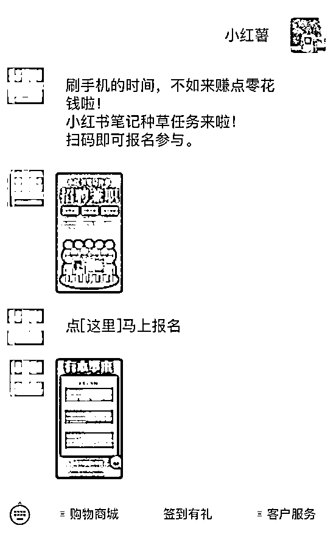

8.2.7 **每天任务报表复盘**

系统会按天统计总的任务投放数量和参与人数，粉丝增加情况等情况。分析数据，迭代优化，不用额外花一分钟时间准备和统计。

 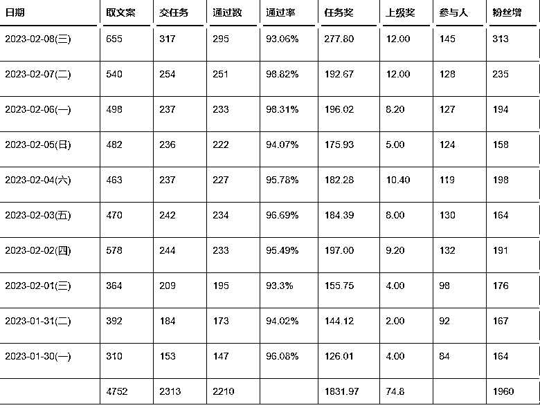

9\. **系统有还有哪些厉害功能？**

由于本文需要遵循一定的步骤来介绍软件，所以并不太方便完全展示系统现有的所有功能。这里列举一些出来，让大家对商品有一个更深的了解。

9.1 **素材自动托管功能**

如果你的素材是来源于淘宝的商品，那么你可以使用托管功能，对素材的新旧替换进行全面的自动托管。

系统可以设定自动导入多少条评语和多少张图片，以及每天控制被多少个兼职取走。前者可以自动补充素材，完全有脱离人工操作，后者可以做到精准投放，好的商品多投放，差的商品少投放，系统有自己的一套计算投放量的标准。

 

9.2 **首图花字效果**

大家知道小红书的首图相当重要，一定有吸引用户点击查看，这条笔记就算成功了。所以笔记的首图加上必要的笔记重点卖点关键词是相当有必要的。

系统目前支持多种风格的首图花字，而这些是一经设置，全自动完成图片的绘制，不需要其他额外操作。

 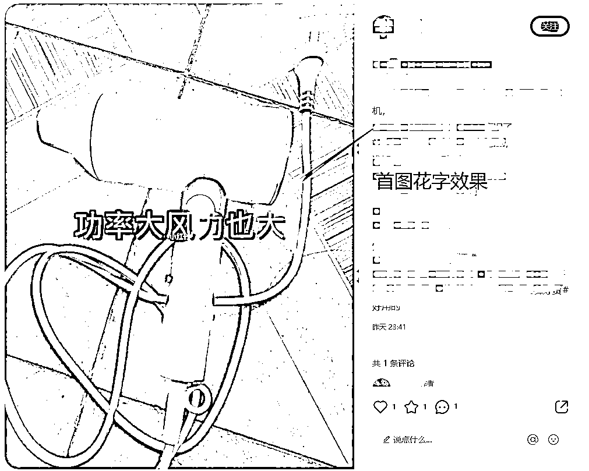

9.3 **减本促效最大利器-浮动报酬**

每个兼职人员刚开始笔记的报酬是固定的，比如 0.8 元一条，随着时间的推移，可能有些兼职比较负责，会主动回复，积极引导。而有些兼职却不管不顾，只管领任务的钱；还有些白号权重低发的笔记完全没有效果，有些老号自己有养号或正常使用的高频用户号，效果非常好。

如果吃大锅饭，劣币驱良币，还会造成那些用心发笔记的人最后也不用心发了。那么咱们整的效果肯定会越来越差，这也是很多人做了一段时间最好做不下去，或者效果相对比较差的原因。

而系统可以自动收集到小红书博主的流量，并与总体效果进行打分对比。好的加钱，差的减钱。这样才能将效果慢慢做得越来越好。

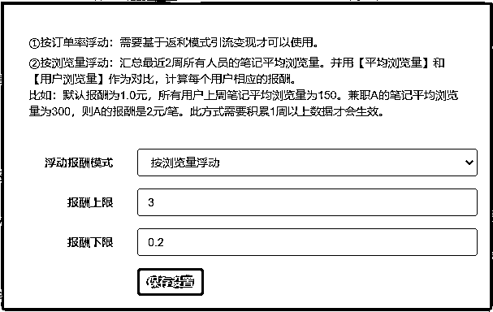 

9.4 **采集的素材一键伪原创**

通过仿写同行的爆文是迅速出效果的捷径，但是仿写工作量是非常大的。红草系统可以实现关键词定期采集，还可以一键伪原创改写。

每一分钟就可以产生十几条原创好文。采集的笔记图片还可以通过随机裁边功能，自动实现原创。

 

9.5 **自有爆文互推**

当兼职的笔记数量发到一定的程度，总有一些笔记可能由于某些原因爆了。这个时候我们更加需要把这些笔记的作用发挥到极致，充分挖掘这些笔记的流量。

这个时候互推就是一个比较好的选择，由我们的兼职在另一些兼职的笔记下面留言，将笔记的气氛哄托出来，也叫水军吧。

系统就可以支持完全控量的互推，而这些操作是非常简单的，点 1，2 下按钮就可以完成。后面的事就交给系统和兼职去操作了。

当然系统也会自动生成【互评任务】需要审核，以及相应的报酬奖励，比如一般为 0.1，0.2 元。

 

9.6 **图片型任务的审核**

对于一些发朋友圈给红包奖励的营销性任务，也可以交由系统来完成。用户只需要把截图发给公众号，后台就会生成一笔图片型任务。

一般来说，管理员可以根据图片的内容，自主决定是给 1 元，0.5 元等奖励。

9.7 **随时掌握用户帐号信息**

做过小红书都应该知道，博主号每周会有一个周报出来。红草系统会每周采集用户周报数据，核算用户的笔记效果。

可以分析博主有没有删除笔记，或接别处的活等违规行为。这是人工操作不可想象的。

 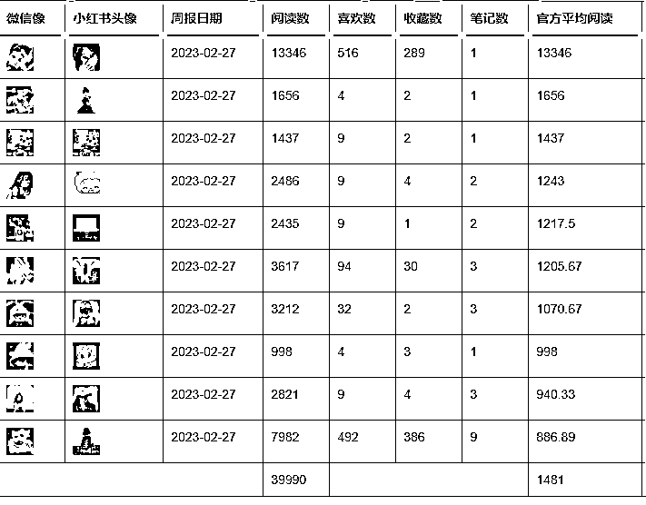

10\. **如何用 1 个客服管理千人兼职团队？**

先给大家看一下图，这是目前使用系统的一个帐户的报表。

报表显示，最近 10 天每天交作业 500-800 篇，参与人数为 200-300 人。大约每人 2-3 篇左右。

那么要做到这些事，需要我们客服人员每天做些什么事呢？

以下是我们一个客服，每天花 1-2 小时需要完成的工作。基本上就是检查一下、处理一下、巡视一下、操作一下。等等这些后台维护工作。

1-2 小时就可以完全应付每天 300 篇左右的笔记产出，如果全职工作就可以轻松维护 1000 篇以上的笔记的。

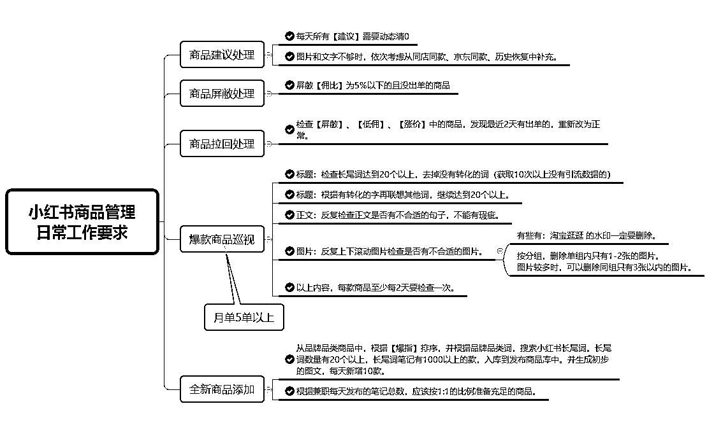

兼职群里也没有太多需要维护的消息，每天看几次基本上差不多了。大部分兼职都不在群里，自己取任务自己交任务，也确实不一定要进到群里。

 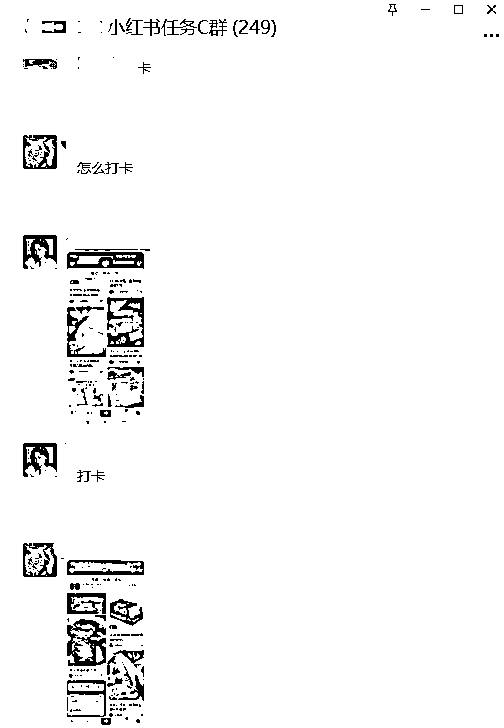

11\. **从哪里招兼职？**

兼职的获取很多种方式，只要能够凑够 50-100 名初始的兼职人员，再借助系统的裂变和运营人员的一些操作，基本上就可以做到兼职的自我更新淘汰和不断增长。

下面有几种常见的方式给大家了解一下。

11.1 **发朋友圈方式**

这种方式大家都会，但又容易被人忽略，不仅可以自己发，还可以发动兼职来发。兼职可以通过【图片型任务】来交作业，领报酬。

 

11.2 **公众号文章方式**

去公众号搜相关招兼职的文章，自己改一改就可以发布了。

11.3 **小红书招兼职**

去小红书面找兼职是最接近博主的方式了，可以自己发文，或者在别人文章下面留言拉兼职。

 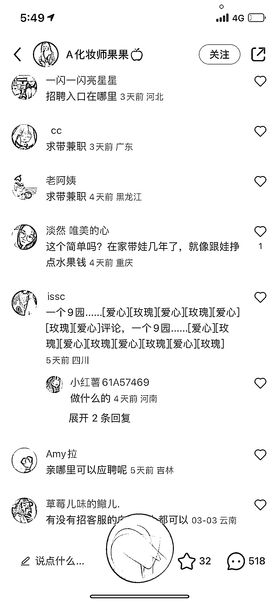

以上是我全部的分享，希望对大家有用！

* * *

评论区：

樾樾 : 请教一下　这个如何做甲方让这些兼职发？
老严干货 CPS : 给钱
樾樾 : 当然给钱，在红草上没有看到甲方通道[呲牙]

* * *