# TikTok 投放广告有哪些机会？以广告投放+选品逻辑为例

> 原文：[`www.yuque.com/for_lazy/thfiu8/ttyvcd3ewrg41d3d`](https://www.yuque.com/for_lazy/thfiu8/ttyvcd3ewrg41d3d)

## (精华帖)(65 赞)TikTok 投放广告有哪些机会？以广告投放+选品逻辑为例

作者： 阳光杉木

日期：2023-09-21

一款电商产品，如果在 TikTok 上获得了很高的播放量，这意味着它和平台调性相契合，也很懂用户。

而我在 TikTok 上就发现了这样的产品--一款有 7800 万播放的带贴纸药盒，也亲自调研和挖掘了这款爆款产品背后的一些信息。

下面就借这个案例，跟大家聊聊 TikTok 广告投放选品的思路，希望能对你们有所帮助。

我是 pipiads 的大伟，今天主要给大家分享关于 tiktok 广告投放的核心选品方法论，选品对国内外任何一个电商平台来说，都是一个非常关键性的动作。

我本人近几年时间，每天观看几千个产品，国内抖音、小红书再到海外亚马逊、独立站、社媒 ，观看的同时，我亲自下场验证思路，也打爆拿到一些结果。

我发现，其实爆品是有相通性和一定的规律的。第一篇文章先大致给大家聊聊 tiktok 广告投放选品框架，会插入我亲自调研和挖掘一款爆品的实战案例参考。希望对各位道友有所帮助

# 一、TikTok 广告投放关键信息

**关键词：强度+信息差+趋势+验证**

tiktok 作为短视频娱乐平台，用户使用最初点开软件是抱着放松娱乐去使用这款软件。而一款产品产生病毒式的传播，往往要和平台调性契合，而社媒平台，最简单的三个字 新奇特。而新奇特又怎么去理解呢？

如下：

**强度：**

通过一定强度的选品，了解市场上现有当前投放的产品：市场上的主要类目是哪些，都有哪些品过去&现在在火的，火的原因是什么，我们是否有优势可以。

**信息差：**

当新品出现的时候，可以快速进行感知，比别人对于新品的敏感度更强，这就是网感，在第一时间发现新品，这就是信息差 。

**趋势：**

发现新品的时候，观测产品趋势，是向上，平缓，还是下滑，通过持续观察，发现产品趋势，选择正在上升的产品。

**验证：**

多渠道验证，从 tt、亚马逊等一些海外平台，验证海外用户对于此产品是否有需求。

通过一定强度的选品，了解市场的趋势，然后及时发现新品，找到上涨趋势的新品，且通过多渠道市场验证的，如谷歌搜索指数也在暴涨的品，最后分析匹配度和优劣势，抓到匹配度高且有优势的产品进行测试。

# 二、皮皮选品技巧分享

**以皮皮为锚点，发现一个好的品之后，多渠道进行验证，去伪存真**

pipiads 是 tiktok 广告数据分析平台及选品平台，也就是说 pipiads 所有的数据都是真实卖家投放广告的数据，这也是为什么要以 pipiads 为锚点去延伸的原因。

选品其实就是一个调研用户需求+验证的过程 我们需要尽可能的去收集信息 提高我们的成功率 同时亲自验证我们的选品是否契合市场。

但选品不能空想，那怎么最快去验证呢，先去观察有结果的人 他打爆的案例是什么样的：

**观察到特定产品的时候，在进行分析寻找机会点。**

**（1）广告搜索**

**选取纬度：**

7 天+shopify/shoplazaa/shopline

适用于对于内容较为敏感的同学，从内容角度去分析视频爆火的原因：

**（2）广告产品**

**选取纬度：**

7 天内+广告展现/广告数/广告天数

适用于对于产品敏感的同学，及时发现新品

结合广告展现/广告数/广告天数等维度数据，了解产品趋势，进一步判断产品可行性

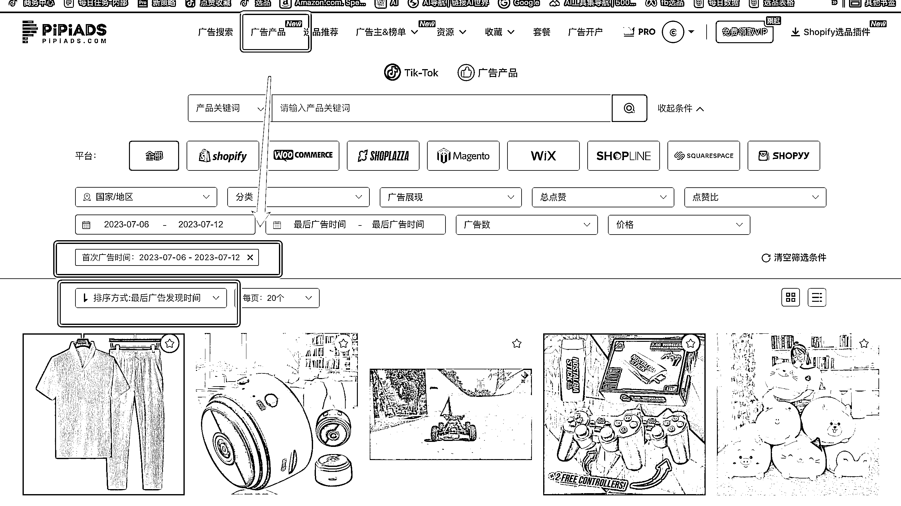

**（3）广告主**

**选取纬度：**

7 天+shopify/shoplazaa/shopline

适用于观察特定广告主，看下他们近期开发什么新品，或者他们的内容近期如何优化

# 三、选品背景

过往的选品，偏蹭热点和风口

在没有风前提下， 应该如何起飞？

付费流测品如何更精准呢，如果大量测品但是出单率很低，而且不能持续出单有什么突破的方法

**今日讨论目标：**

1、寻找适合免费流量做的选品方法论

1.  要求产品适合生产内容，短视频比较容易起量

2、寻找适合付费流量做的选品方法论

1.  要求产品转化率高，常见是刚需/有痛点/高频使用的产品

3、寻找适合免费+付费流量做的选品方法论

1.  可以长线运营的产品，适合生产内容+有一定用户需求的垂类产品

# 四、目前选品逻辑

**（1）选品思路**

**（2）投放方式**

**1、投放逻辑**

**多测试，通过概率找定量，然后放大**

**① 广告账号**

**逻辑：**

1.  账号是需要养的，账号人群标签精准的话，计划就更容易跑起来；

1.  不同账号权重，是因为账户一开始抓到的用户群体不一样，导致不同账号是不同表现，一个账号至少要跑过三天再做决定是否放弃/保留；

1.  所以账号尽量垂直一些，一个账号，做一个特定人群的产品，有必要的，甚至直接按产品区分；

**方法：**

1.  有垂类账号尽量用垂类账号，没有的话，就需要测账号，一般是 3 个来测；

**② 广告系列（计划）**

**不同的计划，人群不一样**

1.  所以可以新建计划，去找到更多不一样的人群

**所以建议建系列的方法：**

1.  不同兴趣，不同系列：如通投/自动/带兴趣/带人群等，分别建不同的系列

2.  不同出价方式，不同系列

3.  当计划开始衰退的时候，新建计划

4.  多建计划，可以多找不同的人群

**③ 广告组**

1.  广告组是基于系列下一层级，所以广告组的人群，是基于系列找到的人群；

1.  所以基于某一个好的系列的基础下，就可以多建不同广告组，在指定的人群里，找到更多出单的概率；

**④ 广告**

1.  广告又是基于广告组的下一层级，所以，当广告组表现好的时候，就可以多复制这个广告组的定向，去搭配不同的广告，让受众，和素材，更有效的进行匹配，从而提高转化率；

1.  所以广告组在衰退的时候，可以尝试，替换广告的素材，延长广告组生命周期（官方说法，未测试）；

1.  同时，多复制广告组，匹配更多不同的素材：素材应该是基于不同的卖点出发的，比如 A 素材的卖点对 A 用户不起作用，但是 B 素材的卖点可以戳中用户，用户看了 B 卖点就会进行购买。

**（3）测试方法**

**爆品：多账号*多系列*多广告组*多广告**

1.  通过概率找到优质的账号/系列/广告组/广告，然后在这个基础上方法；

1.  一般放大方式是放大优质广告组&优化广告；

**品牌：少账号*少系列*少广告组*少广告**

1.  给到一定的预算，让系统充分学习

接下来 我们聊一下落地性和可复制性的案例，亲自带大家看一下一款爆品的出现历程。

1、**利润是核心**

**选品上**

投放广告建议选客单高一些的广告产品  选低客单产品  某些类目投放平台单转都要十几二十多美金 你选一些低客单产品 是玩不了的 除非自然流。

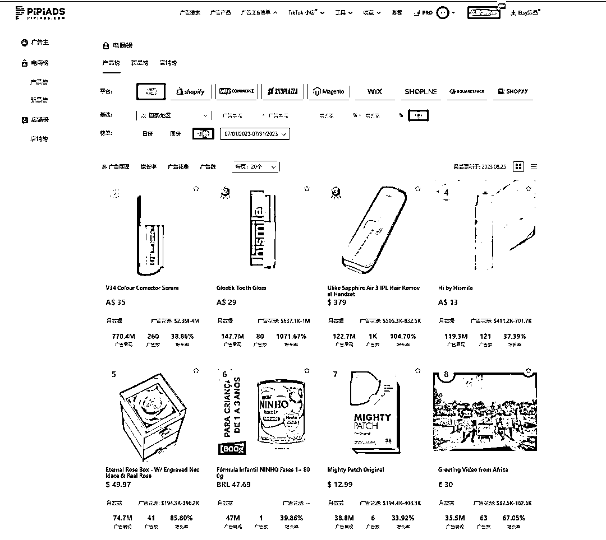

（基本上 pipiads 看到投的很猛的品都有利润空间）

**选客单价高的产品，**这样生命周期会长一些 成功率也会更高一点，因为利润空间大，才有可能**支撑广告费**，支撑**各种成本 。**

**2、与平台符合-打冲动消费**

Tiktok 是短视频娱乐平台 大家去带着**娱乐心态**去使用软件 建议找**新奇特产品开发** 普普通通的品 你要和线下超市 各大电商平台竞争很卷。

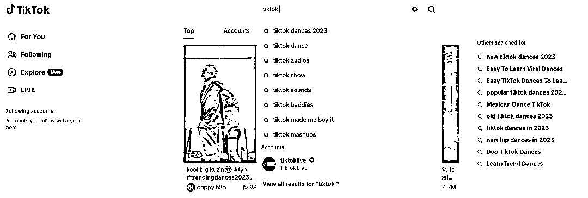

尽量选**受众广产品测试** 原因目前平台商业化标签还在积累中  

**需求群体多 更容易出结果爆款元素组合**（情绪价值、功能性、热点、节日礼品，情怀）

举例基础产品：

一件普通的白短袖 烂大街了，如果我换上刻上鸡汤文案（看世界做自己） 配上点图、赋予意义， 结合节日和礼物、文案代入。

例如：情人节最好的礼物，亲爱的我会陪在你身边，是不是又多了不一样的感觉，相比干巴巴的卖短袖。

（单一元素存在不确定性 多元素结合产生爆款）

3、**不容易在各大电商平台找到**

随着时间发展，越来越多的消费者会有**比价习惯**，像独立站本身还有**信任度**的问题，不知道你是否遇到过 投 spark ads 开评论，会发现有时有人来你帖子下评论骂你。

**骗局，**原因是这个品被人发过垃圾货 或者不发 然后你背锅了... 甚至还会有一些用户评论在某某某平台更便宜 分享链接

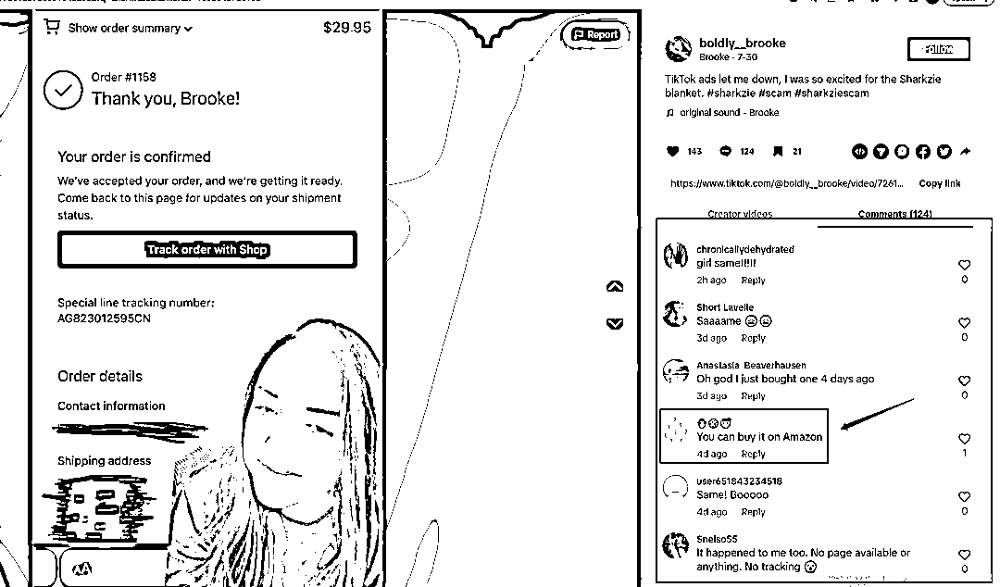

尽量去**挖掘**一些平台**不容易搜到**的产品，或者就是选**质量好的产品** **结合优质服务**去打造信任链接

能搜到也无需担心 你标题改变  然后包装换一下 让消费者看不懂 不容易搜到 例如 绿色+笔记本 我标题换成 （柠檬南瓜 纯爱之光） 艺术感上来了 消费者一搜 还不容易搜到（参考国内小说推文）

**4、情绪选品 yyds**

**调研和了解用户的情绪是每个电商玩家都应该具备的基本技能**

1.  情绪共鸣产生认同

2.  调研情绪

3.  不停的挖掘大众群体不同的情绪

4.  挖掘他们的诉求

5.  将诉求和产品结合起来是兴趣电商一个关键点

1.**可从细分市场切入**

① 怎么找到细分人群刚需

② 避开大类目竞争但不选择太冷门的品

③ 模式的思考

细分市场选品的**核心**在于**通过一款产品发散思维后精准定位**

**案例：**

想做一款包 不确定是什么包，因为箱包是个大类目 我要通过超级发散的思维思考给这个品添加元素 挖掘细分市场

怎么发散呢？

**先以 pipiads 为锚点挖掘到一款热度不错的产品**

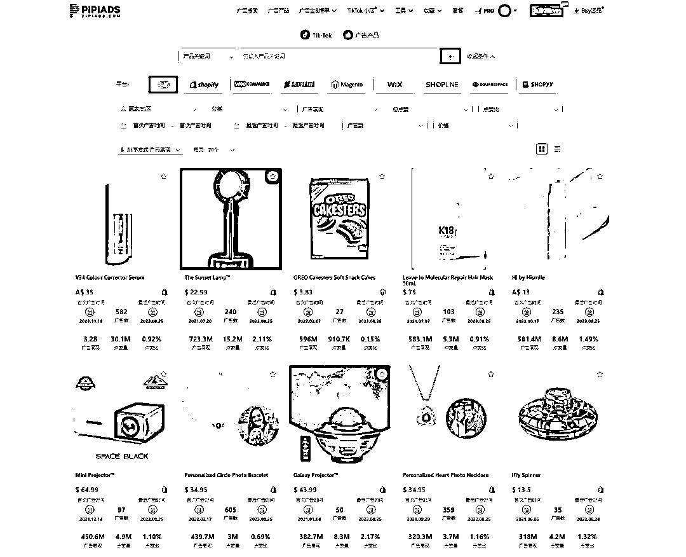

**这款产品的爆点进行拆析：**

**节日**：母亲节、父亲节、情人节、圣诞节

**对象**：男士、女士、父亲、兄弟、上班族、朋友、闺蜜

**功能**：收纳、屏蔽 NFC/RFID 扫描、可追踪、便携性

**场景**：户外、聚会、买菜、办公

**主题**：毕业、生日、活动、周年

有了思维框架 去调**研市场 继续挖掘需求和反馈**

2.**避开大类目竞争激烈的品 或者红海里面找蓝海**

还是以包为举例 女包各大牌竞争激烈 产品花样百出 我们一个小卖切入进去 发现很难

除了女包 还有很多分类 户外包 单肩包 手提包去延伸

需求可以去速卖通亚马逊等电商平台去看类目细分 去研究排名靠前卖家或品牌的评论和反馈

3.**市场什么好卖卖什么**

一模一样去跟 ：他吃肉你喝汤不长久。但执行强有机会  需要**不停的找品测品**  我**目前是不太建议的**

可以通过**差异化拉高上限** ：地区差异化复制 它美国市场跑爆了，你立马换未投放的国家测试 ：在它的基础上做创新优化 做新素材 加入创意 ：找类似款 功能性 同类型 一比一学习模仿

**提炼思路 找到爆点 自己开品** ：经过大量的案例和实践 总结爆单元素规律 自己去打造爆款

核心点 大市场厮杀严重 细分市场很多商家做的不够细致  我们可以思考供应链 营销等各种角度研究 看看哪些是自己的优势 先做到比他好

**接下来 我会用这款药盒爆款案例 来给大家看看 一款爆品是怎么多平台反反复复的爆产品：收纳小药盒**

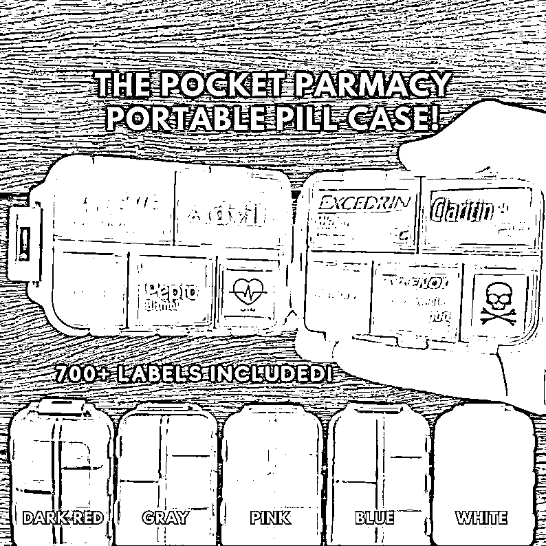

最开始通过 **pipiads 获取**到这款产品有轻度投放 tt 广告

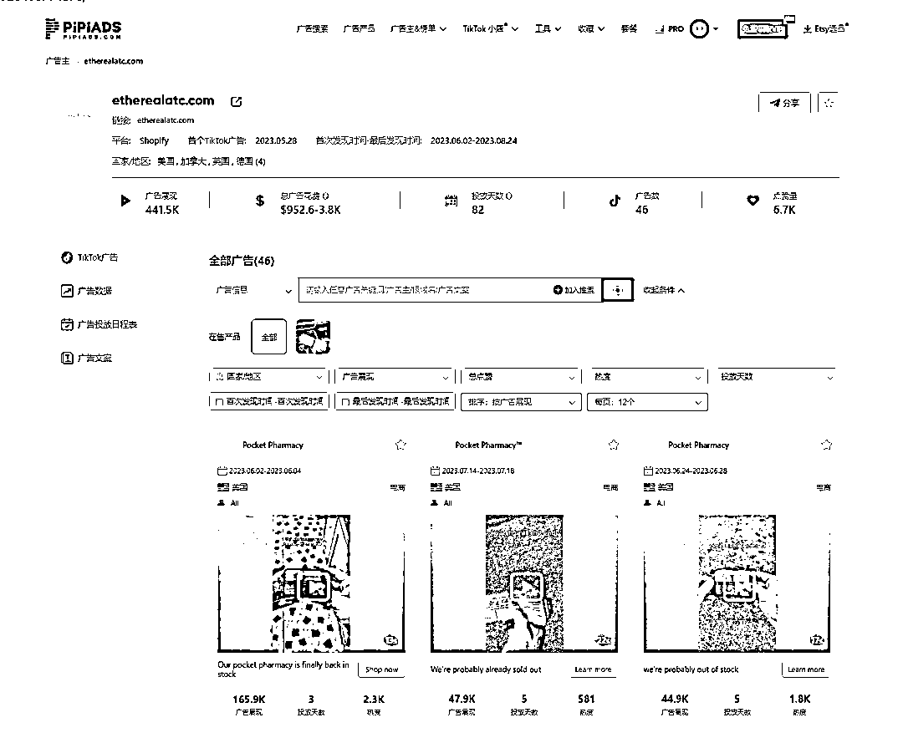

我当时觉得这个品有意思 就去开始调研

**查看了 tt 自然流关键词标签**

标签：**#pillorganizer**

有 **7800 万播放** 再结合产品本身的属性 我初步**判断市场有需求**

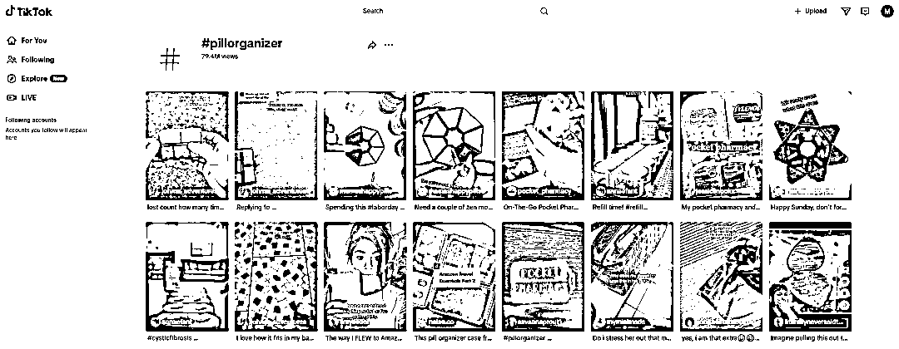

但为什么会这么爆呢？我开始去亚马逊等平台查找蛛丝马迹

观察到这种小药盒 **亚马逊销量非常好**

找到了一模一样的药盒

**11438 条评论 评分 4.7 分**

**2019 年就开始售卖了**

到这里 我有一个思考，就是**亚马逊的药盒**是**没有**那些**收纳贴纸**的

**社媒火爆** 是不是因为**贴纸**的原因呢？

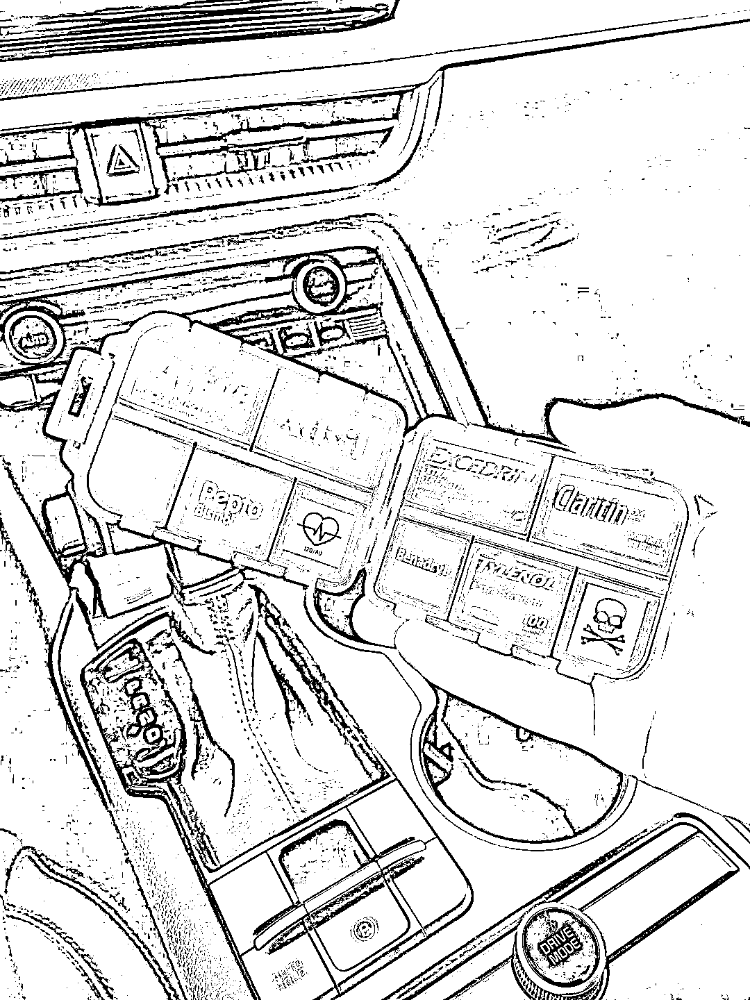

我去搜索 1688 发现**货源是没有带贴纸的**

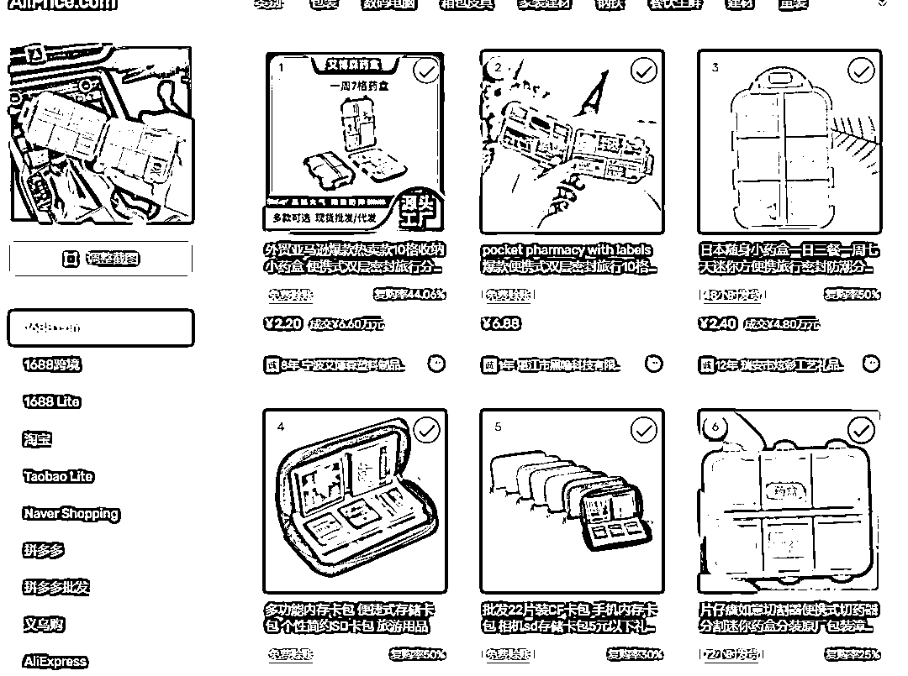

继续挖掘和分析 etsy 平台 **etsy 平台主要特色就是售卖手工成品 和各平台都比较契合[etsyshop.ai](http://etsyshop.ai)** 上**搜索**关键词 **pill organizer**

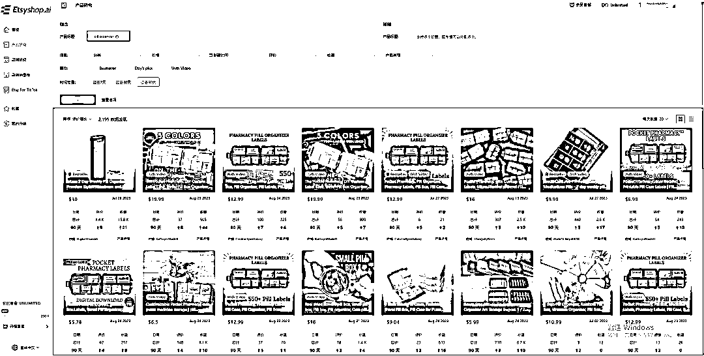

（选品数据来源：[`www.etsyshop.ai/`](https://www.etsyshop.ai) ）

**果不其然 上面有商家售卖药盒贴纸电子版**

**客户购买一份自己用打印机打印出来就好 信息差出现**

**商机也出现了**

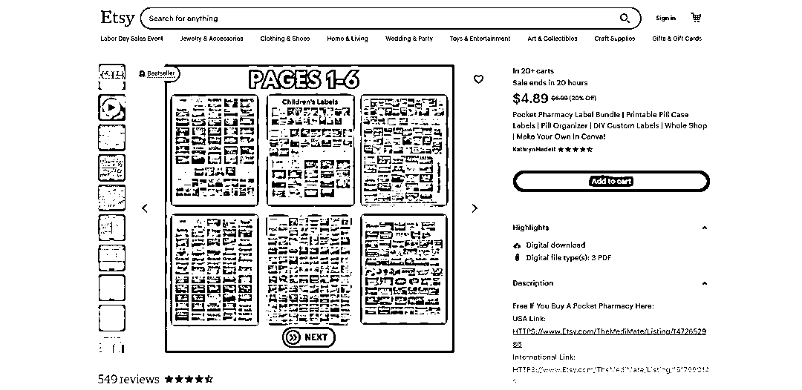

**也就是说，独立站等其他玩家花 4.89 元买了一套 pdf 打印出来 贴在这个拿货 2 人民币的药盒上 社媒又卖爆了！**

**etsy 的品大多都契合 tiktok fb 等平台**

我观察到**很多大爆品 直接复制 etsy** 爆起来的品拿到结果，当然也没有那么容易 需要测试和优化，二八定律

我继续去 tiktok 社媒评论区去调研需求：

[`www.tiktok.com/@pocket_pharmacy/video/7207195991169109290`](https://www.tiktok.com/@pocket_pharmacy/video/7207195991169109290)

客户的**反应非常感兴趣** 并且不容易找到货源

**挖掘出需求**

**实用：旅游+便携+收纳+标签**

**情绪：标签有趣可爱好看**

**意义：可以自己 diy 专属药盒**

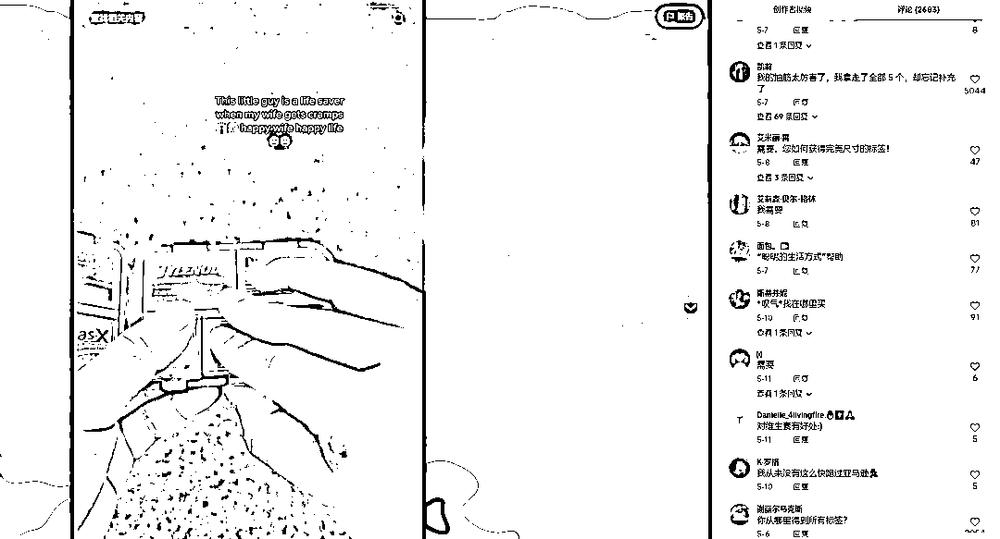

继续通过 **pipiads** 去**查看**了 **tiktok 小店**的售卖情况

**六月开始上架，到现在八月底出了 1400 单**

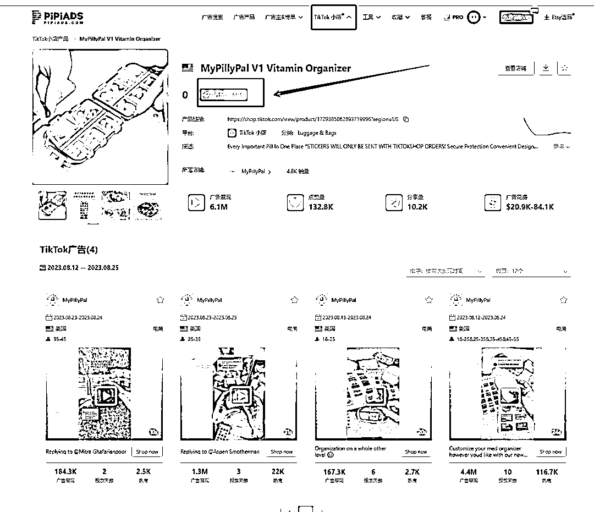

调研后该类目我延伸出来的机会

① **产品本身有市场 可以复制 挖掘其他便宜药盒 设计出新的卡通好看有特色的贴纸售卖**

② **我可以直接卖贴纸 pdf 无需发货 给消费者打印下载 迭代更新**

思路是相通的 其他产品我是否能够这样去构思呢？

答案是的 这就是方法

我来给大家**捋一捋时间线**

**最早亚马逊 19 年开始售卖 没有贴纸 单盒子**

**etsy 卖家出现售卖 PDF 电子贴纸**

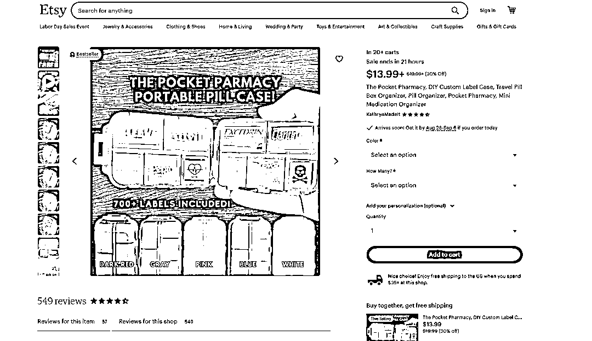

**独立站等玩家贴纸结合药盒开始社媒进行投放内容推广**

**小店等社媒内部电商渠道上架**

整个时间段 不同渠道或平台的差异化复制后都有了结果反馈

这就是一个**爆品的多渠道差异化思路**

感谢大家，这是我第一次在生财分享，后续根据大家的反馈,继续更新,后续会多一些选品案例，我亲自调研出来的可复制的案例。

* * *

评论区：

亦仁 : 感谢分享，已加精华。
A 中泽 : 交流

* * *