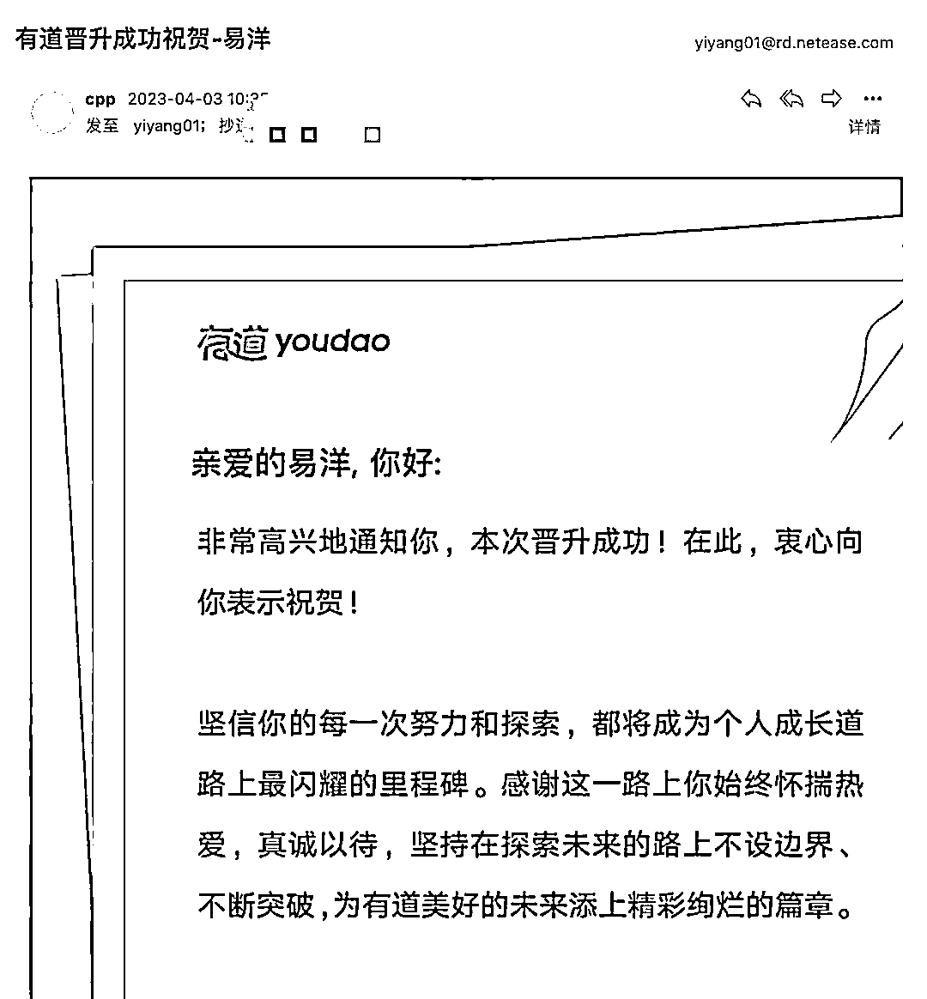
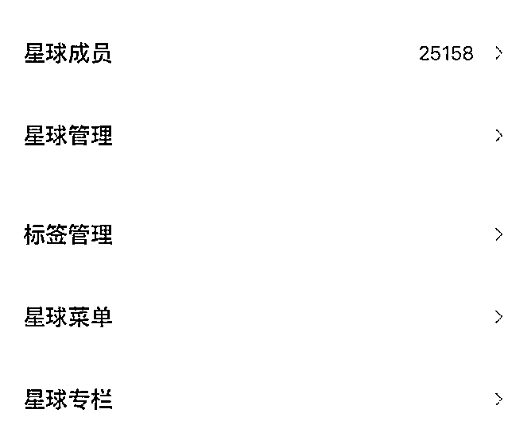

# 放弃网易 200 万年薪，2 个月创建 2.6 万人社群复盘

> 原文：[`www.yuque.com/for_lazy/thfiu8/dl9sxykgvvlaktfq`](https://www.yuque.com/for_lazy/thfiu8/dl9sxykgvvlaktfq)

## (精华帖)(232 赞)放弃网易 200 万年薪，2 个月创建 2.6 万人社群复盘

作者： AI 探索者

日期：2023-09-18

大家好，前一段时间在生财做了下分享，亦仁大大喊我进生财航海家群，第二天我就进了。

进了航海家群，我发现亦仁老大的航海家是真牛逼，即有能力，又热爱分享，还能相互之间疯狂链接。一下子眼界就被打开了。

于是想着把上次的分享再写详细点，分享给所有生财的朋友们，也让我能和生财的大家们，产生一些更奇妙的链接。

我把最近半年的经历做一个分享，希望我的分享对大家有所帮助：

我算是一个非典型互联网从业者，在过去的从业经历里，**干过技术、技术管理、产品管理、运营管理；创业过，还担任过大厂业务总经理。**

读书期间，我是典型的学渣，大学四年玩了两年多游戏，挂科好几门。

大三学校对我进行了口头警告，加上游戏账号丢了，这之后我开始认真学习，先后考过了四六级、高级程序员和华科计算机专业研究生。

2008 年从华科计算机专业毕业，加入腾讯，2010 年-2015 年作为 360 初创核心员工，见证了 360 从 500 人到上市的全过程，这期间也从高级工程师晋升到产品技术总监。

**360 上市后我套现了过千万，拿到了人生第一桶金，在北京买了几套房。**

随后我创业三次，第一次创业是在手游领域，融资 500 万，但最终没有做成，后面两次创业都是在线教育行业，都没有大成。

2020 年我加入网易担任一个部门的总经理，同时开启了写作和超级个体之路，三年时间在全网积累 50 万读者。

在网易的三年，我操盘了**年收入 10 个亿**的业务，实现了业务整体盈利，团队也获得了网易有道各种奖励，更获得了网易集团创新奖：

离职创业之前，我还在网易成功晋升，这次出来创业很多人不理解。但真正了解我的朋友都知道：这货天生就是个创业折腾的命。

在其他人眼里看来年薪几百万的大厂高管，就应该知足了，但我却偶尔在深夜失眠整晚。不是因为赚得多或者少，而是那种追求自由和探索的感觉，始终吸引着我。

所谓梦里挑灯看剑、梦回吹角连营。

半年前，我发现了知识星球的新玩法：跑通投放，快速扩大规模，我认为，**基于知识星球，也可以做出很大的事业。**

所以我放弃了大厂 200 万年薪，毅然决然出来创业了。

我做了一个星球，2 个多月时间做到 2.6 万付费用户，这个星球的定价是 299 元。

**总计 GMV 破 500 万，规模在同类中稳居第一，是 2-5 名的用户量总和：**

之所以在起步阶段能快速做起来，我自己总结是以下五点原因：

✅ 商业&运营能力职场的背书

✅ 自媒体的起步流量

✅ 身边的大佬人脉和 KOL

✅ KOC 资源

✅ 启动投放模式

这里面最重要的是投放模式，下面我分 5 个方向来详细阐述下～

**社群首先是产品，产品必须爆**

知识星球的本质是 PGC+UGC，更底层它也是一个产品。

**做过产品经理的人都知道，产品的品质决定了产品的生死。**

但社群总要招第一个人，社群总有冷启动的问题，这个时候内容不可能太多，这个阶段如何让你的产品有价值呢？

这个阶段我采用的策略，是借力身边的人脉，疯狂拉了一群大佬给我的星球站台，比如投资大佬吴世春、许朝军、IT 大佬刘江、自媒体&运营大佬黄有璨等等：

有了这些大佬的加入，这个星球的价值就不言而喻了。

**但 PGC 要尽快过渡到 UGC，延续爆品。**

无论靠星主、靠嘉宾的方式都是短期的，一个社群要想长期保持活跃，最核心的是要尽快从 PGC 过渡到 UGC。

在渡过初期的冷启动后，我快速制定了一套 UGC 激励体系，简单点说就是把社群的 KOC 找出来，并用精神和物质奖励，让这些 KOC 持续输出高品质内容。这里要感谢亦仁老大开创的知识星球社群的玩法模式了。

在我们社群发展 1 个月后，我也弄了一套 UGC 激励体系，有了这个体系之后，社群的内容输出开始变得高质量。

除了这些，运营活动非常关键，比如各种快闪的短期活动、线上直播和线下见面会，以及我们正在策划的实践课程。

同时因为星球会员数增长太迅猛，对很多星球来说，要发展到第二年第三年才会做线下活动，而我们在第二个月就陆续开展了北京、杭州、上海、深圳等地的线下见面会。

社群要的是链接，线上的快闪活动和线下见面会，能对会员产生极强黏性。

我们也策划社群的千人大会，进一步让会员们产生互动和黏性。

本质上用户交钱来到社群，如果不参与任何活动，那么用户是没有任何获得感的，他们也不可能有复购和续费。

**社群的增长方式：投放和口碑为王**

我自己的号算是冷启动时期的增长，这部分是社群的基础。

但我的号总计也就带了 7000 个会员，当然我的公众号并不大，只有不到 20 万读者，这个数据也非常不错了。

之所以能快速做到**2.6 万**人，原因还在于另外两点：

**首先是投放**，投放的方法主要是两个：公众号、视频号 CPS、CPT，当然目前也在尝试校企合作方式和线下代理的方式，继续推我这个产品。

一般来说，大家都很少用投放的方法做知识星球，作为知识付费的入门标配，知识星球更多被大 V 们用做自己公众号的变现方法，做了一个轻产品去交付。

而星球这个产品是典型的社群产品，人越多、内容越多，越好推。

反之在发展的初期，星球内容少、人少，自然不好推。

**这里说一个核心：刚需性话题星球，是可以尝试投放的。**

比如很典型的副业搞钱、赚钱思路、个人品 IP/品牌赋能等等，这些类型都有可能走投放模式。

核心是初期如何用最小化成本去投放，我的建议是：**自己先跑通小闭环，验证 ROI 效率，之后找 KOL/KOC 用 CPS 的方式去投放。   **

MVP 的思路非常重要，这里面需要数据能力和分析能力，我之所以快速启动投放模式来做，源自于观察自己账号的数据。

做这个星球之前，我也有一个职场星球，我发现现在做的星球在自己账号的转化率是职场星球的三倍，**核心在于：现在做的星球是一个强话题星球。**

**我也计算了接广告和自己推星球的差距，最起码在 2 倍左右。这意味着一个 299 的品就可以做出来最起码 ROI>2 的效果。**

当我自己推到 2000 会员后，那天晚上我失眠了。我感觉到这次有投放的机会，一旦跑通规模应该很可观。

**CPS 的核心**在于前期一定要有大号帮你背书，且你要认识足够多对你有基础信任的号主。这也算是平时积累的人脉。

这个过程你还需要用社群的远景去感召大号，简单点说公众号大号不缺广告，CPS 这种方式他们一般都不会接受，因为他们会担心用户的口碑。

我当时找到第一个大号之际还在网易，我花了 2 个小时说服了他，让他放弃做同类产品，转而推我的产品。

这个大号推了之后，我拿他的案例撬动了近**200 个**号主一起推我的星球。

我们给大 V 合作方的打款：

这么多号主一起推也导致一些问题，比如打款的问题，再比如记账的问题。

我们花时间都建立了自动化的通道，比如我们把记账的算法都固化在 excel 里，财务填几个数字就能出结果。

跑顺后星球达到**日增 1000**的夸张程度，这个速度连我自己都没预测到，飞速增长的 GMV 和用户数让我快速下定决心辞职 All in。

这里也提一下，All in 后我发了一篇文章，开了一次直播，文章的阅读高达 4 万，直播场观破万，一下带来 1000 多用户。

CPT 我们也在做，这个风险就会大很多，投放的方式分两种，一种是团队自己找号，我们在新榜筛选各种号，另一种是直接找媒介，给一定的抽成。

这里面需要先定位号的方向，要和品一致。我们选择的是：互联网、科技、创业、职场、副业号，这些离我们的品更近。

选出号之后，要观察这些号接广告的频次、评论数、点赞数等等，核心是判断 IP 的强弱。

**IP 越强的号带社群这种品越好带**，这也是社群投放和其他产品投放不一样的地方，绝不能只看阅读量。

我们发现很多 IP 属性强的，可能只有 500 阅读，但一下卖了几十个产品，有些号 5000 阅读也只能卖 10 来个。

整个投放下来，我们的 ROI 是超过 1.5 的，这也让我们具备持续投放的能力。

我总结了一个简单的公式，可投度=**（点赞*评论）/阅读数*报价。**这个值越高，这个号的价值就越大。甚至可以说，这个值基本和 ROI 挂钩。

下面这个号是我们投放的一个号，大家可以看看，哪怕是广告文，这个点赞数和评论数是不是挺可观：

这期间我还尝试了视频号短视频和直播投放，当然这两种方式都是用的 CPS，原因很简单，这种模式很难用 CPT 去定价，同时有时候还需要我和对方连麦一起推荐产品。

**所以大家也不要觉得知识星球不能投放，只要你找好了渠道，选好品，一样是可以做投放的。**

比如前一段时间猫叔启动个人认知星球，一时间撬动了几十个视频号、抖音同时直播，大概率猫叔用的方法也是 CPS 投放。

当然我建议大家，起步之际尽量采用 CPS 的方式进行投放，直接上来就 CPT 风险还是很大的。

在整体 GMV 占比中，我自有渠道大概占 25%，CPS 投放占 40%，CPT 投放占 15%，剩下 20%其实是口碑增长。

**接下来说说口碑增长了，**我们在增长的过程中，疯狂提升产品品质和服务，用产品和服务引爆用户口碑，我们现在每天就有 50 多个用户是会员推广来的用户，这应该算一个很不错的成绩。

短短两个月，我们建设了非常完善的内容栏目和新手引导，同时会把所有用户导入到企业微信，同时我们有完善的激励体系及发掘 KOC 的机制，社群能否持续活跃的核心，其实并不是星主，也不是早期的各种大咖，核心其实 KOC。

**一个社群，拥护它的 KOC 越多，它的生命力越强悍，它的内部口碑增长也就越强。（再次致敬亦仁老大和生财）**

其实很多 KOC 既有强内容能力，同时还有流量，跟大家利益捆绑后，他们就更愿意推荐用户过来了。

另外，口碑的增长也才能让 CPS 持续放量。

原因很简单，CPS 这种本身就是号主们不太愿意的合作方式，只有你的星球口碑足够好，让大家产生：我给粉丝推荐这个星球是为你们好，是给你们介绍了好产品，只有这种感觉产生之际，CPS 合作才能持续。

复盘这个投放过程，我认为只要是强话题性的星球，又或者星球主本身具备强话题性，同时邀请到足够牛逼的嘉宾合伙人站台。星球这个品完全具备可投放性，价格选定在**99-299 元**这个区间，能让用户通过社群或公众号直接关单，省掉决策成本。

那么适当的投放方式下，ROI 就能超过 1。

更别提后续还可以基于基础付费用户建立私域，搭建二阶、三阶品类，实现更大规模的盈利。

**降低退费率是社群生死线**

我们星球最初的退费率高达 20%，这个过程我们快速梳理了内容栏目、课程栏目，同时在迎新流程上改了 10 多个版本。

我们最高峰时期日增 1000 多用户，**迎新**成了很大问题，最终我们采用客服只负责自动回复及问题拉群，招募了一批志愿者给用户服务的方式，极大的降低了退费率。

我们还优化了整个新手课程，给新加入的会员提供直播录播课程，让大家快速入门。

在改了很多版本之后，我们的退费率降低到 10%，对于一个日营收好几万的星球来说，相当于增收好几千。

**利他是最重要的商业模式**

从网易离职到 2 个月做到 2.5 万社群，我最大的感悟是做商业一定要利他，利他就是最好的商业模式。

在网易我是高管，带百人团队，但我依旧会去帮助刚进入社会做自媒体的年轻人，**我会去用自己能提供的价值去链接大佬**，这些年轻人后来很多成了自媒体大 V，这些大佬也跟我保持了很好的关系。

这次能用 CPS 启动星球增长，最核心是我本身就有自媒体号主的资源，否则大家都不信任你的话，CPS 很难谈成功。

再比如我设置的**分销比例**，算是所有社群中最高的了，这也在短期引爆了我的产品。

人的本质都是利己的，但我们要想通一个道理：

别人凭什么帮助你，只有你克服人性做利他的事情，最终才能实现利己，道理很简单，做起来的确很难。

**社群未来的发展**

我们社群已经正式进入 2.0 阶段，在这个阶段我们开启了线下活动，这段时间我在好几个城市做企业家内训活动，同时也组织了五场会员线下见面会。

**深度链接是关乎社群的生死之战**，所有没有线下活动、没有实战活动的社群，最终结局一定是 over。

同时我开始考虑搭建社群的二阶、三阶产品，如果没有升阶产品，一个 299 单价的社群最终是不会有太多利润的。

一旦搭建出来类似 299 元-1999 元-9000 元的产品体系，如果 299 元转 1999 元转率是 9%，1999 元转 9000 元转率也是 9%，那么在前端投放哪怕 ROI 只有 1.0，最终的 ROI 会高达 2.0 以上。

**这场仗要远远比第一场仗难打很多很多。**

以上是我最近的一些洞察和认知，希望这种分享对大家有帮助。

最后，想强调一些关于投放的认知：

**商业只有投放起来，才算真正的商业，商业只有利他，才是持久的商业。**

* * *

评论区：

胖大玲 : [强][强]摩拜
鹤涵 : 洋哥 yyds
GoWalker : 洋哥牛逼
子白 : 原来如此，洋哥 666
阿满-擅长沟通 : 感谢分享
张稳健 : 老实交代，你和胖大魔啥关系[捂脸]
胖大玲 : [捂脸][捂脸]都是“胖大”家族的，我们家不光有“胖大玲”“胖大魔”还有“胖大海”……
David Tree* : 好像没有看到星球名字啊

* * *