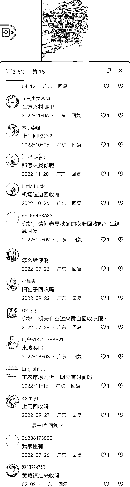
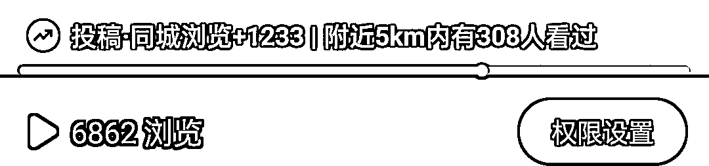
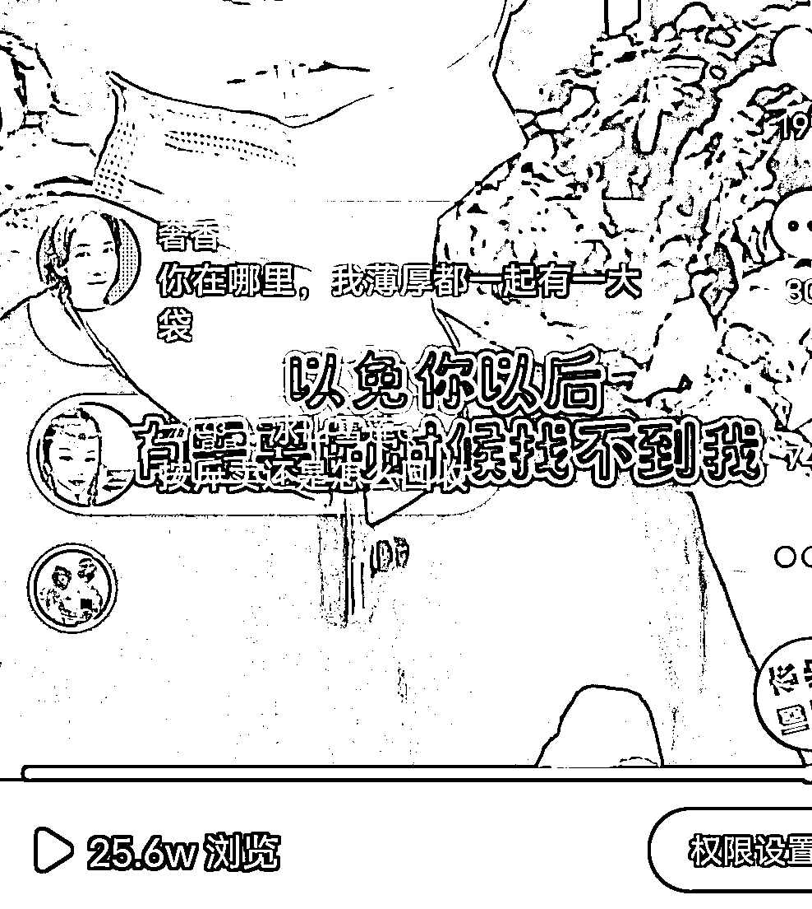
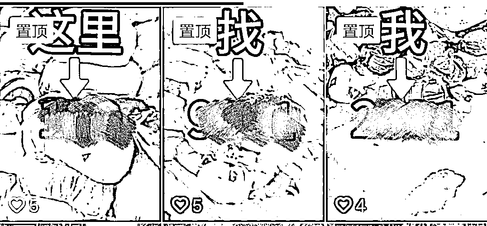
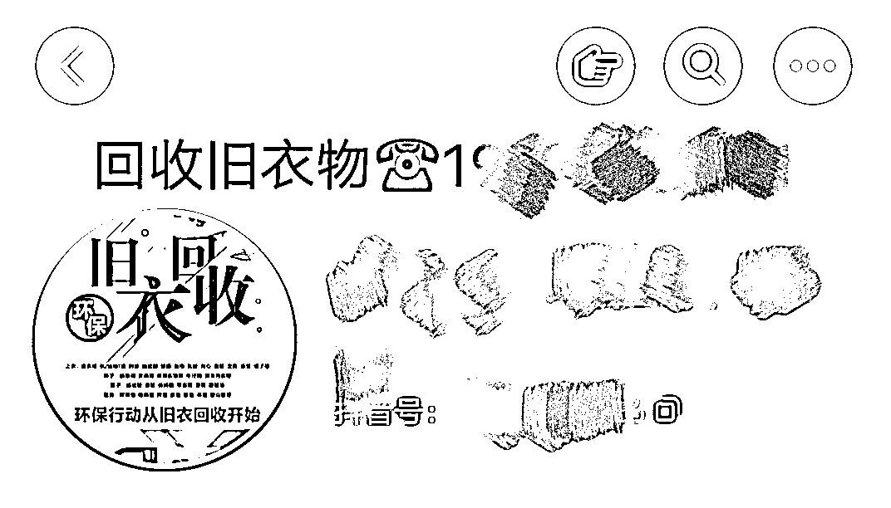
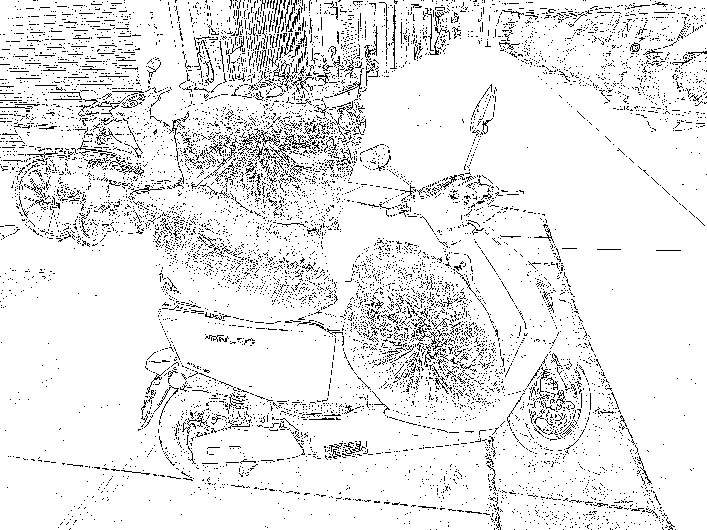

# 旧衣服回收，2 毛一斤的回收价怎么做到 75%以上利润？

> 原文：[`www.yuque.com/for_lazy/thfiu8/vklommhv3zm6vxbl`](https://www.yuque.com/for_lazy/thfiu8/vklommhv3zm6vxbl)

## (精华帖)(187 赞)旧衣服回收，2 毛一斤的回收价怎么做到 75%以上利润？

作者： 黄柏宁

日期：2023-09-20

旧衣回收大家想必都不陌生，但旧衣服回收了后怎么卖？回收一斤的价钱是多少？如果卖出一吨又能挣多少，做旧衣回收这个项目，整体的收益空间是什么样的呢？

今天，就结合自己的实操经验给各位圈友分享下，希望能对大家有所启发。

# 一、**我为什么会去做旧衣服回收？**

大家好，我是黄柏宁。一年前，我还在汽车城里一个 4S 店做汽车销售，每月的收入只有 8000 左右，勉强够一家人开支，再加上我还有 50 多万负债，想靠汽车销售这份工作除去开支还能还债几乎不太可能。

当时每天都很焦虑，不知道怎么办。偶然间，我在微信公众号里看到一篇网创公众号发的文章，讲得是如何在淘宝做无货源赚钱的内容，当时很兴奋，于是我进去那个公众号里看完了所有的文章。。。。。

简直刷新我的认知，钱还能这样子赚。我通过搜索，找到了很多这样子的网创公众号。白天就上班，一有空就去公众号看文章。

但是，我这份工作是一份销售性质的工作，十几二十万的产品，客户都不是一次性就能成交的，需要时刻跟踪客户备案意向信息。

而且还经常培训，晚上还要开会到很晚，没有精力再去实操我看到的项目了（当时不知道生财，报了好几个其他的培训项目）

我想，这样不行，我得找一份不需要脑力，只付出体力就有收入的工作，这样下班的时候，我哪怕身体是累的，但至少心不是累的。

我把汽车销售的工作辞了，陆续做了美团骑手，代驾，快递员，最后去了一个互联网废品回收公司做回收员，公司跟城市各商铺商家都有合作，每天就是过去合作点回收废品，经常也会有个体住户的业主找我们过去收废品。

这期间，我发现，同事这些回收员不愿意去个体住户家收废品，因为涉及到进小区登记，收到的废品还要用小拖车拖出来，相对比较麻烦，不像商铺那样方便，去到就可以直接收。

我还发现，废品种类里有一种旧衣服，商铺的商家是没有的，只有业主老百姓家里才有，而且量还很大，如果说把这些旧衣服收回来，跳过公司这一层，直接出到专门收旧衣服的厂，那利润对于我来说，也还是可以的。

就这样，我就着这个想法，自己出来干了。

**接下来，**我将从以下几个方面去跟大家讲解这个项目具体是怎样的。

# 二、**旧衣服回收背景**

随着人们生活水平、收入水平不断提高，对穿着打扮越来越讲究，服装的更换周期越来越短，旧衣服的淘汰速度越来越快，这就意味着废旧衣服的量会越来越多。

相信很多人都听过这句话“女生的衣柜永远少一件衣服”“旧的衣服永远没有新的好看”

加上现在各种网购平台的便利，衣服直接从工厂到消费者手里，免去了很多费用，消费者可以以很便宜的价格就买到新衣服。

大量的旧衣服产生，处理旧衣服的方式通常是填埋或焚烧，不仅对环境造成极大的破坏，而且也是资源消耗，劳动力的浪费。

那么我们旧衣服回收就是废旧资源的再次利用，在一定程度上也是对环境的一种保护。

如果你有途径回收大量的旧衣服，就不愁没钱赚了。

那么，我们该如何入手做旧衣服回收呢，有以下三点

1.  **怎么收？**

2.  **怎么卖？**

3.  **卖给谁？**

# 三、旧衣服**怎么收？**

在旧衣服行业，我们收的旧衣物品类有：**旧衣服，旧鞋子，旧包包，旧被子，床上用品四件套，毛绒玩具，窗帘**。

我是上门去到业主家里统一按照 2 毛钱一斤回收，也就是 400 元一吨回收回来，按照 1600 一吨（统货，就是不分类）卖出去，我这里是三线城市的价格参考标准，像广州深圳那些好的城市，衣服质量也会高，卖出的价格能达到 2000-2500 之间。

正常来说，我们上门去到业主家里回收回来的旧衣服，会包含一年四季的衣服（夏装+冬装），还有以上其他品类。

如果回收过程看到只有单一品类，比如全是冬装或者全是或大部分是脏，烂，霉，湿，大面积污迹的衣服，那你要注意了，业主是不是把好的衣服挑出来卖了，剩下的垃圾给你，也防止有同行把垃圾倒手卖给你。

**那我们怎样知道面前这堆旧衣物能不能收？**

（1）**整袋衣服全是冬装的不能收**

因为旧衣服最终是要运到非洲去的，非洲那边只有少部分地区 7.8 月份会冷，需求量比较少，对应的价值也比较低。

但是如果是其他品类夹杂着冬装属于正常情况，可以收。

我刚开始做的时候就是不懂，为了追求量，会遇到些同行扮业主，或是业主把其他品类挑出来，单独把整袋冬装卖我，我一见到量比较大，都收回来。

其实这种情况，大家也不要担忧，别忘了我们只是 2 毛钱一斤收，100 斤也就 20 块钱，1 吨也就 400 块钱，试错的成本相当低，自己的货量达到 5 吨就可以出货了，上家一跟你说，就知道了。

冬装一吨的出货价格是 500-800，亏钱倒不会，就是我的货是 1600 一吨出的，量多了会影响我货的整体价值而已。

我当时就是这样，知道 5 吨就能出货，什么货我都收回来，够量我就联系上家来出货，出个几次，他教我几次，我就懂了，无非就是前期多赚点，少赚点的区别。

（2）**大部分是脏的，烂的，霉的，湿的不能收，少量属于正常情况，毕竟是旧衣物。**

我们的旧衣服，收回来，最终是要运到非洲给人穿的，因为还是要给人穿的，非洲那边的人就算再穷也会挑新的干净的买。

所以说，如果把这些脏烂破霉的衣服运过去，非洲老板们不买单，浪费的就是人工费跟运费，所以你的上家也不会要这种衣服。

少量是可以的，因为我们卖的是统货，里面什么品类都有，好的差的，我们没有经常仔细挑选，只是在回收过程大概看一下，所以含有一定的垃圾比例是正常的。

湿的为什么不能要，倒不是说重量问题，我们衣服打包在袋子里或被单里收回来，这么多衣服，我们不可能再拿出来晒的了。

而且这么多，你回到仓库也不知道哪袋是湿的了，湿的衣服在仓库里，过几天它会发霉，也会影响到它旁边的衣服。

**除开以上两种情况，都可以收了，收得越多，就赚得越多！**

**怎样能有源源不断的旧衣服回收？**

**线下的方法**：

**（1）派名片**

很多小伙伴听到派名片，相信大部分都跟我一样，打心底里觉得这种推广方式很 low。

“什么？我们好歹是混生财圈的人，为什么不搞线上推广？舒舒服服，人在家中躺，单从天上来”

相信我，我跟你们一样。

但确实是一个月收 13 吨旧衣物的同行跟我说的，跟我关系还挺好的同行，他不会做线上，所以只能依靠线下。

那他是怎么做的呢？

他每天上午抽家长送孩子去幼儿园的时间段，在市区各个幼儿园每天上午派 40 分钟名片；然后他白天都在收衣服，下午小学学校放学的时间段，去学校门口把名片派给等孩子出来的家长；

同样，晚上下晚自习的时间段，他去中学学校把名片派给等学生出来的家长。

有孩子的家庭，都会有很多旧衣服需要清理，孩子大了衣服就不合穿了，孩子越来越大，家长年轻时的衣服也不会再穿，需要清理了，这些都是准客户啊！

**（2）车身广告**

这个同行还有一招就是“车身广告”

这个大家应该不陌生了，我们经常能看到各种车上面都印有广告。

在收旧衣服的路上，如果你的交通工具上印有你回收旧衣服的信息以及联系电话，每天行驶在城市的各大街道就是一个移动的广告，更具真实性（很多人不知道旧衣服可以上门回收），随着你做的时间长了，会有很多业主联系你去他家收衣服。

我在我的三轮车上印了广告后，效果很好，进小区里收衣服停在门口的时候，很多业主会拍照存一下电话，很快就有人联系我了。

线下推广的好处就是：业主的位置集中，不会让你东收一个西收一个，经常是这一条街道的小区就能收满车，缺点就是需要你持续做一点时间才出效果，大概 1-2 个星期。

**线上的方法：**

我刚开始做旧衣服的时候，不确定自己能不能做下去，心里也有点不好意思，首先就是通过抖音不露脸的视频来获客。

我把家里衣柜的衣服拿出来放在沙发上，拿手机对着拍了几个视频，编辑一下视频的文字，就是说我在哪？收了多少衣服，你们的旧衣服别丢了，可以找我过去收。

就是这样子拍一个视频 5S-6S 之间，配上一段音乐或者是你口述一句话发（大家好，我在**市区内回收旧衣物，家里有闲置的旧衣物不要的可以找我过去处理一下），然后这个视频给我带来了 10 几个客户

收了 10 几个业主家的旧衣服后，我手机上就拍好了 10 几个视频素材，就是这么对着他们的衣服拍一段 5-6S 的视频，到这个时候，我手机上就已经有用不完的素材了，因为我每天拍这么多视频，就发 1-3 个视频，根本发不完。

很快，我就达到了 5 吨的量，出了一次货，拿到手里的利润有 6000 块钱，对于当时很长一段时间没有收入的我很开心，确定做这个我能赚到钱，就没有那么不好意思了，于是后来拍抖音，我尝试了真人出镜。

我发现真人出镜的视频，视频下方会有这个提示，不知道是不是这样流量更精准了，但确实能给我带来更多的客户。

我真人出镜的视频是这样拍的，背景是小区，衣服，街道都可以。

“大家好，我在**市区内回收旧衣服，如果说你家里面有不要的旧衣服，旧鞋子旧包包的话，不要再随便乱丢了，**市区的话我都是可以上门去收的，你只需要去主页一个电话联系我，现在请先关注点赞保存一下，以免你以后有需要的时候找不到我”

当然，你的抖音号要留好联系方式，人家才能联系到你，我说一下我留了联系方式的几个地方：

1.认证企业号

这个生财里很多教程，我就不啰嗦了，某宝 39 块搞一个营业执照就行。

2.置顶三个视频的封面合起来就是我的联系方式。

3.抖音背景图

三个地方能找到我的联系方式，然后只要视频里引导一下有需要的去主页找我，基本上就没问题了。

同时我也在视频号引流，跟抖音一样的操作，区别是视频号我都是发真人出镜的，我发现不是真人出镜的播放量很低或者 0 播放量，真人出镜的我发的都有 1000-1W 播放量。

但有时候会跑到 2000 多的时候会提示视频重度营销减少曝光，我也不管，继续发，还是会有业主找我收衣服，也没见封号什么的，我心里想着 2000 多播放量也够了。

# 四、旧衣服回收后**怎么卖？**

怎么卖就简单了，前期我们怎么收回来，就怎么卖出去，这个在行业内叫卖统货；

还有一种就是你的货量达到了 8 吨以上就可以分拣卖，行业内叫卖分拣货：

1.  按照旧衣服品类分为：夏装 A，夏装 B，冬装，羽绒服，擦机布，白布，毛衣

2.  按照被子品类分为：老棉，丝绵，化纤棉

3.  按照鞋子分为：男鞋，女鞋，童鞋，拖鞋

4.  等等。。。。

每个厂分拣后的品类大体上这样，小范围不同，有些厂不分擦机布，毛衣这些，等你做到这一步需要学分拣的话你的上家会教你的，比较简单。

分拣后的货每吨货平均能多 200-300 的利润，一个熟练分拣工一天只能分一吨多的货。

我现在一个月货量 15 吨左右，也是卖统货，毕竟分出来也不过是多 3000-4500，我把精力更多的放在收货上，主要是我没耐心分货。

卖统货就很简单，怎么收回来，就怎么放回仓库，记录一下收了多少货，这样心里有数，够量就联系上家过来拉。

# 五、旧衣服**卖给谁？**

旧衣服行业分为：前端回收-中端分拣-上端出口。

我们上门回收属于前端回收，自然是把货出给中端分拣。

行业内会出现很多新手小白很聪明，他们想，如果我跳过中端分拣，直接把货出给上端出口，那不是利润更高吗？

其实如果你一个月没有 100 吨以上的分拣货，注意，是分拣货，我们平时收回来的是统货，还没分拣的，上端出口的这些工厂根本瞧不起你的这点货量，他们一般有固定的合作中端分拣供货给他们，你把那点货运过去，他们会割你的，说你的货不达标这样那样的。

最好找当地周围的分拣厂出货，这样能减少很多不必要的麻烦。

怎么找当地分旧衣服分拣厂呢？

1.地图搜索旧衣服分拣厂或者再生资源利用

2.抖音搜索，这个是最精准的，每个城市都会有 1-2 个旧衣服分拣厂的，他们也有抖音。

联系他们过来看货，出货，运费一般是工厂出的，我们协助一下他们搬一下上车就好。

# 六、**旧衣服行业的利润**

我们上门回收旧衣物呢，是统一按照 1-2 毛一斤的价格回收回来的，不要不好意思，旧衣服它本身价值低，去回收的价格就是这么多。

在业主眼里，这些他不要的旧衣物就是垃圾；你上门免费帮他清理就等于是一个免费的工人，不仅不收他钱，还给他钱，很多业主都是乐意的。

我按照一吨 400 元回收回来，1600 一吨出，一吨利润 1200，我平均一个月 15 吨货，后期也会考虑做多几个抖音，请回收员帮我收货。

# 七、**做旧衣服的门槛和风险**

做旧衣服前，前提投入

1.交通工具

我用的是三轮车，1.2×1.6 车卡的，二手的 2800 一台

2.一杆秤

我用的是这个

3.麻包袋装衣服

后期收到被单的话可以用被单打包，前期需要准备一些麻包袋。

4.印名片（看自己）

想做线下的需要印名片，拼多多 20 多有 500 张了,再准备 2000 收货资金，一共 5000 块资金就可以做旧衣服这个项目了。

做这个旧衣服项目，没有什么风险，管好自己的口袋就行，网上有一些吹牛逼说分拣后卖，能赚多多少钱的，吸引你交 6888 或者 9888 去跟他们学习分拣.

然后就能以这些价格把货出给他们，就能一个月赚 10 万 20 万的，都是假的，货到地头死，他说你货不达标你也没办法，别贪心，免费给人家打工了。

脚踏实地的去收货，跟当地或附近一个分拣厂合作好，分拣这些很简单的，他们会免费教你的。

**记得，无论任何形式，让你交钱的都是骗子。**

解决以上问题后，就可以做了，毕竟不是什么难的行业，就是收到旧衣服，然后卖出旧衣服。

最后，再跟大家聊一下，我刚开始做的时候，遇到的几个问题。

1.心态上的问题.

刚开始做回收废品的时候，特别放不开，拉不下脸面，特别害怕亲戚朋友跟以前的同事看到我做这个，怕人家笑，不知道有没有朋友会像我这样，我当时开着收货的三轮车，哪里人少就往哪里开，就是怕被人看到，后来实在没了收入，着急，硬着头皮就一直干下去了.

现在，身边的朋友都知道了，也没什么，其实当时还是我自己的问题，男人一旦成了家之后，只要不违法犯罪，能赚到钱就行，脸不脸面的东西，不重要了。

2.预算的问题

我刚从那个废品互联网回收公司出来的时候，手头里是不够预算买电三轮车的，但当时还不确定自己脱离公司后，能不能自己找到上门回收的单子，于是我一边按照上文中说的推广方法推广，有人联系了我就开着小电炉去收

这就是我当时收货的小电炉。

出了 3 次货后，我就买了电动三轮车了，没经历过，你是不知道换了三轮车后有多舒服，拉货数量大了，也不用担心货物老是掉了，坐着也不挤了。

3.收不到货问题

前期我也经历过一个星期收不到货的情况，准确来说，是不知道怎么能收到货。

当时已经辞职自己出来干了，也有点后悔，万一我收不到货咋办啊？每天就在街上开着电瓶车晃悠看那些干回收的人是咋找客户的（我们这里很多河南人在这里收废品）。

真就这么巧，我看见一个回收旧衣服的老头，60 来岁了，当时他车里有半车货了，于是我就一直开着车跟着他，他应该是有固定帮他收货的人，每去到一个点都有个阿姨把衣服搬出来给他，直至他收满一车，我在后面一路跟着他回到他的仓库。

知道了他仓库的位置后，我每天早上都会早早来到这里等他出去收货，接连几天都能看到他收到不少货。

"一个 60 多岁的老头都能做得到，我有什么理由做不到"这是我跟了他几天后的想法。

我假设他做了很多年，线下经验很丰富，手里掌握了一些能帮他收货的资源，但有一点是肯定的，他这个年纪不会做线上，线上推广肯定比线下效果要好得多，线下尚且都能收到这么多货，那如果我做线上，何愁收不到？

我回到家里，马上把家里的衣服拿出来撒在一处拍了个视频就发到抖音去了，第一个视频，不会做，很粗糙，就已经有几个人私信找我了。

就这样，一直发视频，接单，就是这样做起来了。

以上，就是我做旧衣服这一年多的经验与心得，第一次分享，文笔不到之处还请见谅！

* * *

评论区：

lujy : 很优秀
半条咸鱼 : 这行现在饱和还是空缺呀，看到很多地方都在有搞这个的
Jeffrey : 刚才在高德搜了一下，换吗旧衣回收点挺多
大锅 : 没想到利润这么高
醉心 : 一天大概 1000 斤，请问大概要跑多少家去收呢
蝈蝈、 : 那是回收箱吧，不是上门收货的
慕一 : 竟然看到湛江的[强][强][强]
黄柏宁 : 被你看出来了[呲牙]

* * *