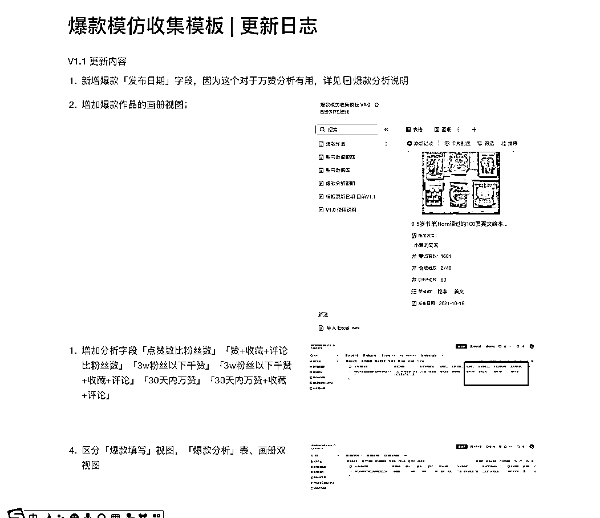
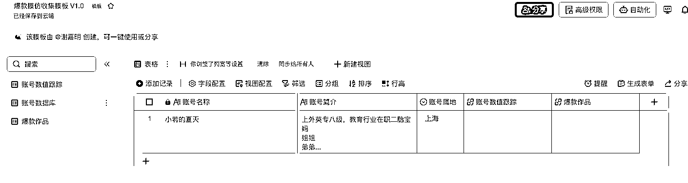
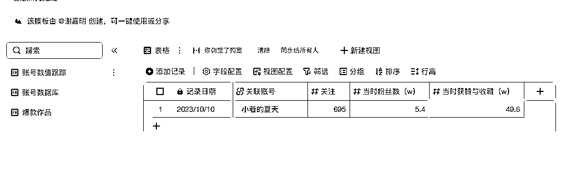
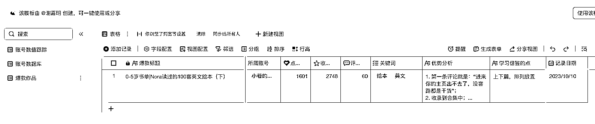

# 爆款分析数据库 流量人必备 V1.2 模板分享

> 原文：[`www.yuque.com/for_lazy/thfiu8/ngrxmtxm6e40g74s`](https://www.yuque.com/for_lazy/thfiu8/ngrxmtxm6e40g74s)

## (76 赞)爆款分析数据库 流量人必备 V1.2 模板分享

作者： 嘉明 Lock

日期：2023-10-10

航海手册中看到，很多时候我们都要从各平台挑选可能适合自己的积累素材，这时候简单的 excel 表格虽然也可以使用，但肯定不如多维表格来的功能强大，今天顺手做了一个简单的「爆款模仿收集模板」，希望对大家有帮助

V1.2 更新 https://jyzigyb0ly.feishu.cn/base/STzvbyI7ja5SfQseNsMc9qrwnoh?from=from_copylink

2023 年 10 月 11 日 我自己也用了一段时间，里面有些爆款记录数据了，为了大家更好地使用模板，里面的数据我就不删了，更新日志也在模板里了，之前忘记开通权限了，现在已全部开通。

如会使用其他同类工具，也可以，推荐如：维格表、notion、wolai、flowus

V1.2 更新内容 2023 年 10 月 11 日

1.  1\. 爆款作品表格增加『感觉可以模仿指数』；

2.  2\. 爆款作品表格增加“图文”，“视频”分类；

3.  3\. 在「爆款分析」视图中，增加账号当前粉丝数（取账号数值跟踪的数据），辅助进行是否爆款、是否适合模仿分析。

1.  4\. 对账号单独查看分析，增加对应「粉丝数」字段

V1.1 说明 2023 年 10 月 10 日 下午

V1.0 说明 2023 年 10 月 10 日 早上

简单说明：

1\. 找到账号，把账号名称填入「账号数据库」即可。如有其他需要，也可以多创建几列，分别记录「账号属地」「账号简介」「账号头像」等信息。

2\. 在「账号数值跟踪」数据表中记录，先选择关联的账号，然后输入「关注」「当时粉丝数」「当时获赞与收藏」，觉得不需要关注和获赞数据也可以不填，删除该列。

3\. 在「爆款作品」数据表中添加对应的爆款数据，同样，先选择关联的账号，然后输入「点赞数」「收藏数」「评论数」「关键词」「优势分析」「学习借鉴的点」，最后的「记录时间」是取的这条数据创建的时间（系统自动）。

待收集了很多数据后，就可以开始通过筛选、分组，以及后面的仪表盘进行分析和模仿啦 嘻嘻嘻，顺祝大家一起赚钱钱

大家觉得模板有用，还麻烦点个小拇指鼓励下新人哈。
后续出数据分析使用攻略的还会再分享的。

* * *

评论区：

Mr. 胡添翼 : 先点赞后观看，养成好习惯[呲牙]
嘉明 Lock : 已更新 V1.1 按航海手册增加了一些数据判断，具体可见更新日志。欢迎大家使用新模板。

大家对这种类似的多维表格创建有需求的话，也可以找我帮忙，乐意效劳。
嘉明 Lock : 可以实现各种简单系统功能，如 CRM、ERP 等
小黄 : 圈友太强大了[强]回去就试试看

* * *