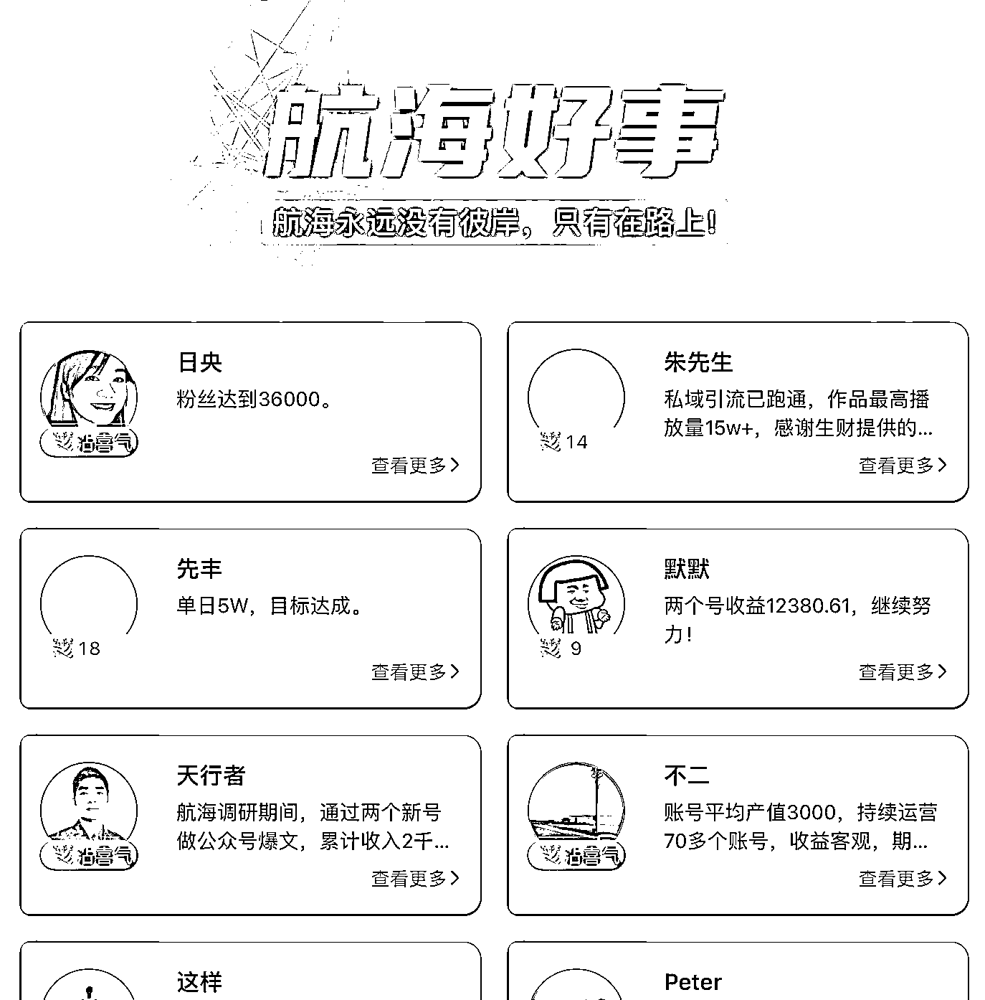
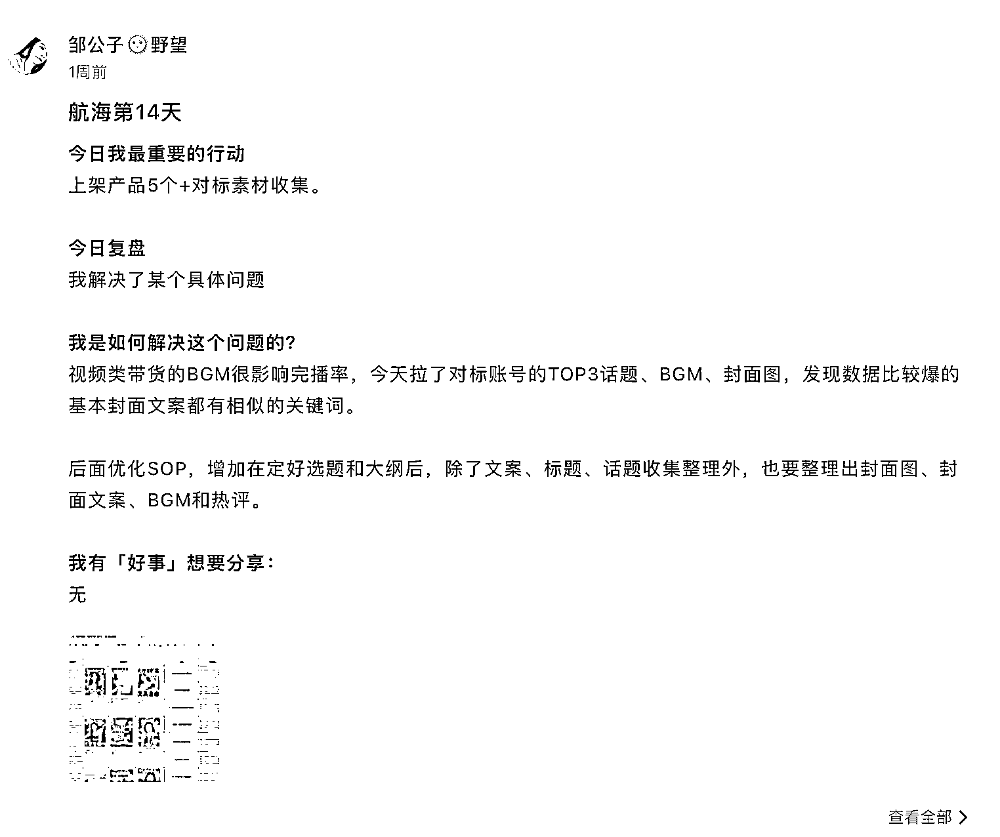

# 如何靠近当下有结果的人？——航海好事使用指南

> 原文：[`www.yuque.com/for_lazy/thfiu8/dkk8ce3dwiazamo8`](https://www.yuque.com/for_lazy/thfiu8/dkk8ce3dwiazamo8)

## (67 赞)如何靠近当下有结果的人？——航海好事使用指南

作者： 郭晓文

日期：2023-09-27

> 以上，都是新手在入门项目时经常会遇到的问题。
> 
> 之前和生财里面的实战家连麦的时候，很多实战家都表达过同样的一个观点：
> 
> **「入门项目，要靠近当下有结果的人」**
> 
> 为什么呢？
> 
> 因为，靠近当下有结果的人，你才有机会：
> 
> 1.  看到更完整的项目全貌，便于选择和执行（反面是看到一张截图，就上脑冲动干）
> 
> 2.  看到当下依然可行的项目玩法，不容易自我怀疑，精神内耗（我努力掌握的玩法到底过时没，我的操作到底变形没……）
> 
> 3.  看到落地性强的操作细节，不至于一听就会，一做就废（理论家给方向，实战派给操作细节）
> 
> 靠近有结果的人，开头提到的那些问题，很多自然会迎刃而解。
> 
> 看到这里，你应该理解了为什么要靠近当下有结果的人了。
> 
> 说得更直白一点，就是，你已经知道了要**「做什么」**。
> 
> 接下来，我会结合这生财有术的航海好事栏目，跟大家聊聊**「怎么做」**
> 
> 聊「怎么做」之前，我们先仔细拆解一下「做什么」——靠近当下有结果的人。
> 
> 1.  谁是当下有结果的人？
> 
> 2.  什么叫靠近？怎么靠近？
> 
> ## 谁是当下有结果的人？
> 
> 什么叫当下有结果的人？谁是当下有结果的人？
> 
> 想必，大家脑海里第一时间会浮现出写精华贴的各个大佬，或着是生财官方筛选出来的小航海教练。
> 
> **这是对的。但不够。**
> 
> 大家可能忽略了「有结果的人」这句话隐含了场景——在什么事情上有结果？
> 
> 我的答案是：在你当前面临的问题上。
> 
> 而你面临的，觉不仅仅是项目的技术问题。 你还有：
> 
> 1.  总是无法专注，在不同项目之间反复横跳的问题
> 
> 2.  期望值不符实际，容易感到挫败和放弃的问题
> 
> 3.  不知道怎么拆解问题，没有正反馈却又不知道如何下手的问题
> 
> 4.  不懂复盘，总是机械式执行，没有进步的问题
> 
> 5.  ……
> 
> 那，谁是在解决你正在遭遇的这些问题上有结果的人呢？
> 
> 结合小航海栏目来说，就是：**一起参加航海的，拿到成果的明星船员。**
> 
> 那怎么找到这些明星船员呢？
> 
> 生财团队已经找好了……无论是「航海好事儿」栏目，还是「精选日志」，都可以帮你很好的找到这些明星船员。
> 
> （再次想起了之前@老瞿的比喻，每年花两千块钱，雇了亦仁和生财一大帮团队给自己打工……）
> 
> ## 怎么靠近？
> 
> 我刚才看了下这次小航海的总结帖，发现：
> 
> 1.  总结帖下面点赞的人很多
> 
> 2.  明星船员的好事日志点赞虽然少了许多，但还是有的（被评为好事儿的日志，往往是报喜的日志，是结果）
> 
> 3.  明星船员的日常日志，几乎都是零点赞（日常日志里面的动作，才是好的结果出现的过程）
> 
> 人性如此，喜欢凑热闹，当观众，去观看别人的成果。
> 
> 但，还记得我在实战家访谈直播间常说的吗？
> 
> **一直当观众，只会让你越来越焦虑。当参与者，你才能一步步走到舞台中央。**
> 
> 也就是说，我们靠近有结果的人的目的，是当参与者，是让自己知道怎么做。
> 
> 用这个标准来衡量的话，请问：
> 
> 1.  给有结果的人点赞，算是靠近吗？
> 
> 2.  加这些有结果的人的好友，算是靠近吗？
> 
> 都不算。
> 
> 和大家分享一下，我理解的「怎么靠近」吧。
> 
> 第一步，你先初步筛一波人可能是在你需要解决的问题上有结果的人出来。
> 
> 以航海好事儿栏目为例，你可以先在这个栏目里面，找到和你做的是同一个项目的人
> 
> https://search01.shengcaiyoushu.com/activity/story
> 
> 
> 
> 第二步，点击头像下面的「查看更多」➡️点击头像，观看这些人的历史足迹（帖子、评论、以及历史参加过的所有实战活动的日志情况，尤其是实战的航海日志）
> 
> 
> 
> 判断一下：
> 
> 1.  他的成绩靠谱吗？（那么多人，不排除有人是以引流为目的，杜撰的成绩）
> 
> 2.  他的基础如何？
> 
> 3.  他一路走来遇到并解决了哪些问题？他是怎么解决的？
> 
> 4.  这些问题有哪些刚好也困扰着你？你能否用他的解决方式来解决自己的问题？
> 
> 以这次航海好事儿里面露出的圈友@邹公子🌞野望 为例。
> 
> 既能在她往期的日志里面看到当下会遇到的各种技术上的问题以及解法（如果有遇到同样的问题，能不能用上？）
> 
> 
> 
> 也能看到她有过长时间没有正反馈，差点放弃的经历，是继续坚持做才有了结果（如果你也在经历同样的情况，会不会受到鼓舞，更坚定的走下去？）
> 
> 
> 
> 第三步，通过前两步仔细了解，以及用行动去验证了解到的这些信息之后，如果你发现这个「有结果的人」确实能帮到你，那你还可以添加微信，用私聊、知识付费等各种方式进行咨询。
> 
> （隐藏的一步……你也可以向鱼丸许愿，让这位小伙伴上实战家访谈栏目，和我一起榨干他……）
> 
> * * *
> 
> 简单来说， 靠近，是让你看到更多当下有结果的人的行动痕迹。而很多刚刚自我突破的圈友，行动痕迹都在航海日志里面。
> 
> 航海日志，真的是长期被大家忽视的大宝藏。
> 
> ## 写在最后
> 
> 今天这篇文章，是「靠近当下有结果的人」这句话的适用于生财有术圈友的践行指南。
> 
> 借此机会，我也希望让大家感受到「知」和「行」之间的差距。
> 
> 很多人之所以会成为高认知穷人，是因为他只听道理，却不做。
> 
> 要真正通过道理去改变自己，让自己变得富有，变得幸福，我们不仅要知道做什么，还要理解为什么要这么做，更要知道怎么做，并且，通过一次次的实践，去调整自己的认知和动作，最终达到「知行合一」。
> 
> 如果你也认可，不妨，先按照这篇文章去操作一遍，尝试去靠近一下，对你来说「当下有结果的人」。
> 
> 我是郭晓文，最懂新手的男人。
> 
> 日更公众号：郭晓文
> 
> 往期精华文章：
> 
> 1\. [`t.zsxq.com/12xdyMzhP`](https://t.zsxq.com/12xdyMzhP) 我是怎么从低谷走出来的
> 
> 2\.  [`t.zsxq.com/0eK5P83vF`](https://t.zsxq.com/0eK5P83vF)【生财使用实例&锦囊】从搞钱新手到最懂新手的男人，我在生财有术的三年
> 
> 3\. [`t.zsxq.com/0cterLU8z`](https://t.zsxq.com/0cterLU8z)【新人参加见面会后必读】如何正确利用见面会获得的信息？
> 
> 4\.  [`t.zsxq.com/0b7J0cQoU`](https://t.zsxq.com/0b7J0cQoU) 【保姆级教程】从零到一打造一个高质量交付的训练营
> 
> 5\. [`t.zsxq.com/0bxyNOlWA`](https://t.zsxq.com/0bxyNOlWA) 【手把手带你把一篇精华帖转化成可执行的 SOP，抓住下次来临的红利】
> 
> 6\. [`t.zsxq.com/03UbAyJAE`](https://t.zsxq.com/03UbAyJAE)【如何利用生财有术，抓住视频号带货的红利】
> 
> 7\. [`t.zsxq.com/fU3F2jU`](https://t.zsxq.com/fU3F2jU) 《抖音引流 Tips 合集：鱼钩思维+企业号专属引流方式+常见误区》
> 
> 8\. [`t.zsxq.com/niQ7iIe`](https://t.zsxq.com/niQ7iIe)【红包封面售卖】一周时间，搭建一个自裂变的赚钱系统
> 
> 9\. [`t.zsxq.com/RRrfqJE`](https://t.zsxq.com/RRrfqJE) 【操作手册】公众号 1 个多月时间做到几乎篇篇 5w+，进阶版「manchuan」玩法
> 
> 10\. [`t.zsxq.com/uZnyr7I`](https://t.zsxq.com/uZnyr7I)  抖音月均播放量 4 个亿的短视频创作心法
> 
> 11\. [`t.zsxq.com/Uzv3Nrv`](https://t.zsxq.com/Uzv3Nrv) 抖音小程序依旧可以稳定日入过千的玩法，实操手册
> 
> 12\. [`t.zsxq.com/b2FuNnq`](https://t.zsxq.com/b2FuNnq)  茶叶垂直领域，抖音直播做到月营业额 200w
> 
> * * *
> 
> 评论区：
> 
> yoyo : 对新手的心态总结的简直了，太精辟了
> 天启 : 太适合新手了，第一次跟着航海走就知道看手册，然后闭门造车
> 
> 
> 
> * * *