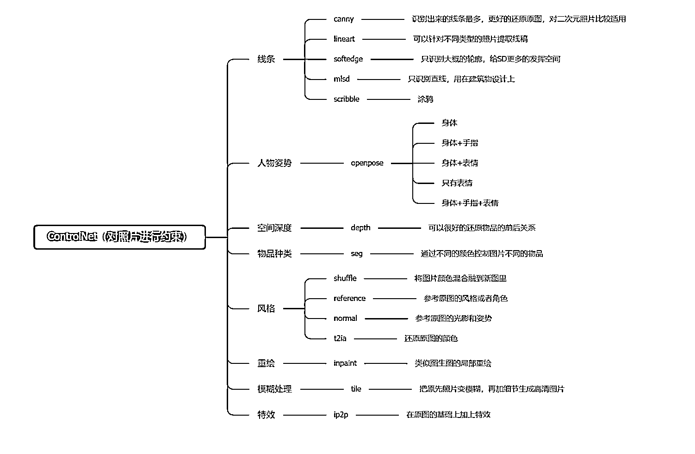
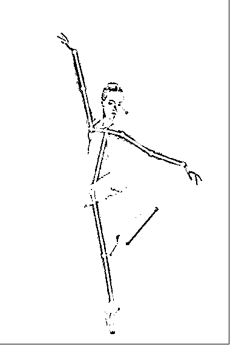

# 从零开始学 AI 绘画，万字 Stable Diffusion 终极教程

> 原文：[`www.yuque.com/for_lazy/thfiu8/gg96bxhsd8drztg5`](https://www.yuque.com/for_lazy/thfiu8/gg96bxhsd8drztg5)

## (精华帖)(179 赞)从零开始学 AI 绘画，万字 Stable Diffusion 终极教程

作者： 吴东子

日期：2023-10-07

《从零开始学 AI 绘画，万字 Stable Diffusion 终极教程！全新升级版》

各位好，我是吴东子

2022 年 8 月，一款叫 Stable Diffusion 的 AI 绘画软件开源发布，从此开启了 AIGC 在图像上的爆火发展时期

一年后的今天，率先学会 SD 的人，已经挖掘出了越来越多 AI 绘画有趣的玩法

从开始的 AI 美女、线稿上色、真人漫改、头像壁纸

到后来的 AI 创意字、AI 艺术二维码、AI 幻术等等

而之后伴随着技术的发展，还会出现更多玩法，以及更多机会

与此同时，我相信很多朋友看到别人生成出那些有趣的图片时，都想过自己亲自上手玩一下

但是碍于 SD 的操作复杂，又不得不放弃

没关系，我将会出一套 SD 的终极教程，不会有过多枯燥的原理讲解

而是用奶奶都能听懂的方式，手把手带大家把这个软件用起来

结合一个又一个的例子展示，让你学完后不仅能立刻做出同款好玩的图片，还能在娱乐的同时掌握 AI 绘画这个新技术

这套课程分为六节课，会系统性的介绍 sd 的全部功能，让你打下坚实牢靠的基础

1.SD 入门
2.关键词
3.Lora 模型
4.图生图
5.controlnet
6.知识补充

同时之前看过东子教程的朋友应该都知道，我希望能够做出来真正好的作品，让大家真的可以学会 SD

我的上一篇 SD 终极教程也很荣幸能广受好评，有将近 3w 人学过

而这次的教程则是全新升级版，我们团队重新打磨了半个月时间，一共 2 万字，400 张图，希望能做到让大家学 SD，看这一篇就够！

另外，课程所需要安装包、大模型、Lora、关键词库，都已经给大家全部打包好放在网盘里了

花了很多时间才整理出来，希望对你有帮助

[`ry5hwpuf7b.feishu.cn/wiki/space/7272418982156566532?ccm_open_type=lark_wiki_spaceLink`](https://ry5hwpuf7b.feishu.cn/wiki/space/7272418982156566532?ccm_open_type=lark_wiki_spaceLink)

* * *

评论区：

Clown : 感谢感谢，真的很详细！
大吉要发光 : 正好我想学这个．谢谢东子大佬
芷蓝 : 表格很有价值～
涛子 : 太感谢了，小白都能入门了
林勇 : 厉害了！！！如何炼制 Lora 在那一期有？
阿泉 : 感谢大佬分享，正抓脑阔想怎么做呢
亦仁 : 感谢分享，已加精华。

* * *