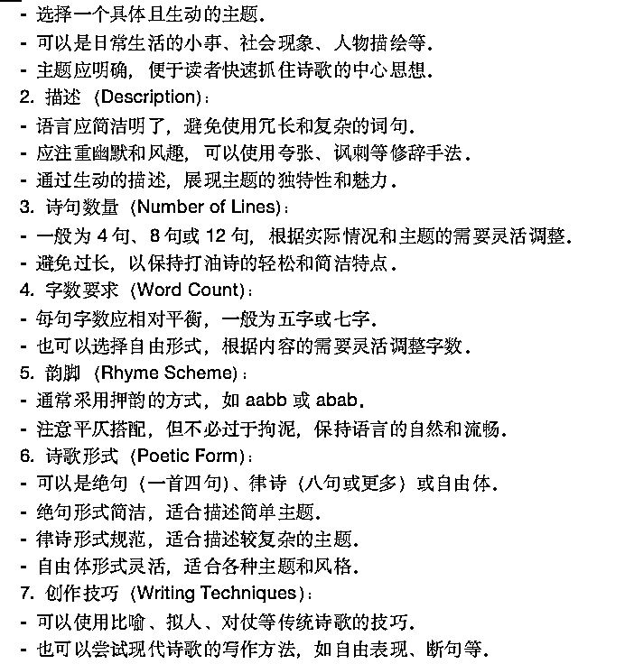
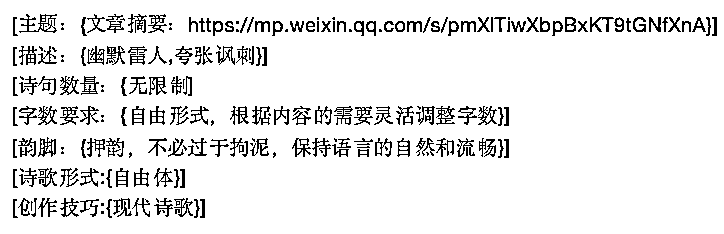

# 打造差异化｜小众爆文｜ChatGPT 写“打油诗”

> 原文：[`www.yuque.com/for_lazy/thfiu8/vg6sz5qm20tx565p`](https://www.yuque.com/for_lazy/thfiu8/vg6sz5qm20tx565p)

## (82 赞)打造差异化｜小众爆文｜ChatGPT 写“打油诗”

作者： Ai 指令师-越越

日期：2023-09-25

**生财有术航海行，一帆风顺走四方。**

**银鳞万顷闪太阳，金币如沙铺海床。**

**船头一站是大王，左手金杯右手棒。**

**海豚跃起成行列，鲸鱼跳舞献殷勤。**

**海盗海怪通不怕，一呼百应皆英俊。**

**只见他们把船推，一路狂欢到天明。**

**但愿此行皆顺利，满载而归笑哈哈。**

**生财有术不等闲，航海寻宝正当年！**

大家好，见字如面！

**我是 AiGC 生活化的深度应用者-越越**

深度分析——AiGC 辅助数据分析

深度利用——AiGC 赋能电商运营

深度结合——AiGC 结合自媒体运营

“公众号爆文”赛道让我赚得了互联网的第一桶金

“爆文”项目资源慢慢被割裂，出现了千篇一律现象

抓住**文章爆的特点，**打造差异化，抢占空白领域

**爆文特点：题材稀有、内容有趣、语言吸引**

利用未被开发的空间

打造竞争差异化

是形成强竞争力的关键

对比传统的公众号文体

“**打油诗**”文体相对新颖

**打油诗可以评判事件、发表观点、加深记忆、增强完读率**

相对**新颖**的文体能提高“爆文”的差异化

接下来，我将会分享我的研究

昨天晚上 9:00 发的打油诗推文（新号，前几篇文章为个位数）：

**什么是打油诗？**

打油诗是一种源自中国的古老诗歌形式，它的特点是**语言幽默、诙谐**，形式简单，通常用来描述日常生活中的小事或表现诗人的个人感受。打油诗最早起源于唐代，当时的士人或文人在闲暇时创作，用以**调侃时事或自娱自乐**。

**“打油诗”市场分析**

1.  **创意与新颖：**打油诗的**独特形式和幽默诙谐**的风格可以吸引读者的注意，为公众号增添新颖和创意的元素。

2.  **简短易懂：**打油诗通常较短，**易于阅读和理解**，适合在移动互联网时代的快节奏生活中阅读。

3.  **文化传承：**通过公众号传播打油诗，可以推广和传承中国传统文化，吸引对传统文化感兴趣的读者。

4.  **多元内容：**打油诗可以作为公众号内容的一部分，**丰富内容类型**，吸引不同类型的读者。

**打油诗文体 ChatGPT 指令**

指令飞书链接，可复制：

[`txt6wm3b04b.feishu.cn/docx/XvPjdoi8iopNDSxd99vcXe2bnBf?from=from_copylink`](https://txt6wm3b04b.feishu.cn/docx/XvPjdoi8iopNDSxd99vcXe2bnBf?from=from_copylink)

角色指令如下：

实操指令如下：

指令解释如下：

实例演示如下：

指令一：角色定义

指令一运行结果：

指令二：

指令二运行结果：生成“打油诗”

**百问百答：**

**Q：打油诗文体组成公式**

A：打油诗文体=爆款标题+打油诗+话题背景介绍，爆款标题选择与背景介绍请详见公众号爆文航海手册

**Q：打油诗用途**

A：最为常见的就是作为开头引入文章，使读者耳目一新，增加完读率。

**Q：打油诗文体素材来源**

A：打油诗文体素材适合“热点话题”、“娱乐话题”等，尤其是评判某件热点事件时尤为有用，因为这种文体写得人不多，会给人耳目一新的感觉。

**Q：****打油诗文体能爆吗？**

A：一篇文章能不能爆取决于很多要素，其中最主要的是素材选择和关键词布局。打油诗文体目前来说可以提高文章的完读率和可读性，从另一种角度就是指提高差异化，毕竟目前写打油诗的文章很少，说明有较大的市场潜力。

**Q：打油诗能单独写吗？**

A：经过测试，单独写打油诗的效果也是有的，新号能达到几千阅读量，当然这也和标题、素材、号情况相关，但不排除打油诗的作用。我建议将打油诗文体与其他正常问题结合书写。

**Q：打油诗具体的格式有要求吗？**

A：打油诗没有规定的格式，但是为了让文体内容读起来朗朗上口，因此在指令说明中添加了解释，可以阅读以上图案中的信息。

* * *

评论区：

乔帮主 : 场景挺有意思的，结构化提示词最近蛮火的
纳彩｜玄學 : 确实还挺有意思
良辰美 : 牛逼！
云珞 YunL : 太优秀了
Verol 维诺 : 有办法能实现稳定的中文押韵吗
Ai 指令师-越越 : 可以啊，得确定具体场景
Verol 维诺 : 就是说唱那种的单押双押，每一句话韵脚都押韵，我试了下中文不是很稳定、，可以交流一下
Jaffe 西木 : 指令大师

* * *