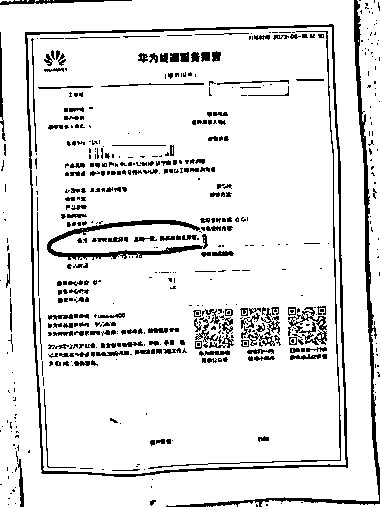
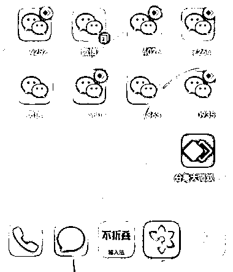
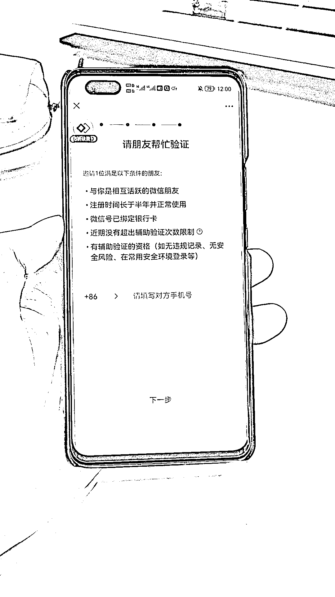

# 怎么安全使用微信（从注册到封号）？

> 原文：[`www.yuque.com/for_lazy/thfiu8/dk5r1xi1s9ycrq4s`](https://www.yuque.com/for_lazy/thfiu8/dk5r1xi1s9ycrq4s)

## (精华帖)(229 赞)怎么安全使用微信（从注册到封号）？

作者： 希平

日期：2023-10-07

怎么安全使用微信（从注册到封号）？
随着公域流量越来越贵，很多公司的业务都会用私人微信承接流量，以便后续做转化、交付、售后等服务。
微信从诞生到现在，已经有 10 多年了，安全规则早已完善，如果我们不注意违反了，那么微信号就可能被封了。
过去一年，我每天跟 30+ 微信打交道，期间看了无数篇相关的文章，也踩了很多的坑。
趁着国庆放假，就输出这篇经验贴，希望给大家提供一点帮助。

目录：
一、基建：手机、手机卡
二、微信：注册、养号、使用（自动通过、安全阈值、收款、对付同行）、被封（警告、预警、临时、永久）

为给你更好的阅读体验，请移步语雀：[`www.yuque.com/maoxiaodd/operation/fex5ygyhcwimtony`](https://www.yuque.com/maoxiaodd/operation/fex5ygyhcwimtony)

* * *

评论区：

文少 : 优秀啊
希平 : 感谢铁子来支持[呲牙][呲牙][呲牙]
坏脾气的小可爱 : 厉害
希平 : [呲牙][呲牙][呲牙]
远帆 : 这个真解决了我最近的难点
平凡小吴 : 这个对完私域的超级有用，超级干！谢谢圈友
希平 : [呲牙][呲牙][呲牙]
希平 : [玫瑰][玫瑰][玫瑰]

* * *