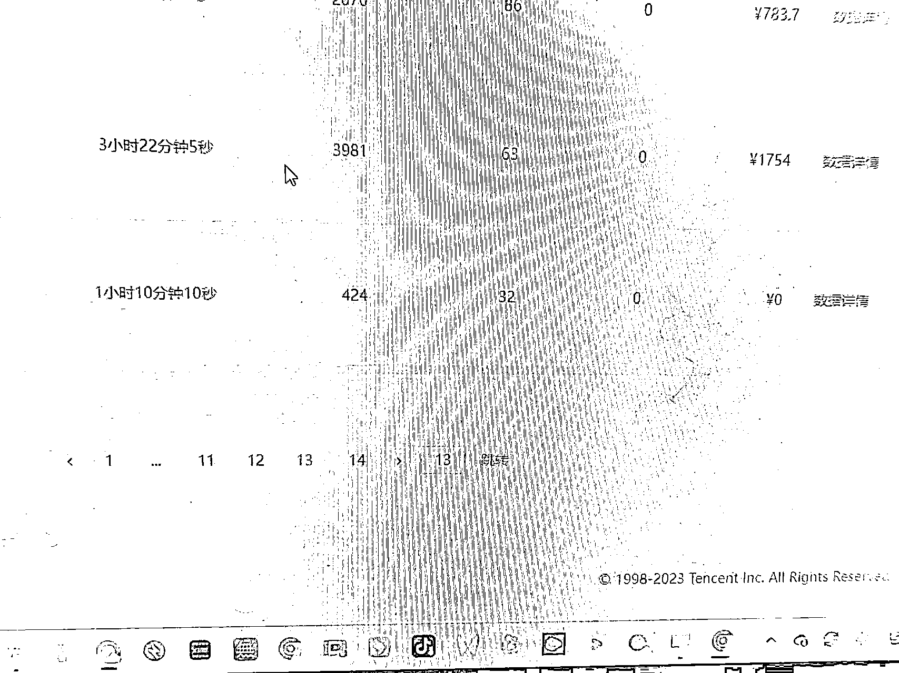

# 理发师转行视频号直播带货，十个月 GMV 100w 是种什么体验？

> 原文：[`www.yuque.com/for_lazy/thfiu8/ncdaw7dnwprlarxg`](https://www.yuque.com/for_lazy/thfiu8/ncdaw7dnwprlarxg)

## (精华帖)(100 赞)理发师转行视频号直播带货，十个月 GMV 100w 是种什么体验？

作者： 夏俊虎

日期：2023-10-13

大家好，我是夏俊虎，来自安徽合肥，目前全职视频号直播带货，十个月时间 GMV 累计是 100w+，算是有一个初步的结果。之前我自己是开美发店的，也就是托尼老师，哈哈，美发行业闭坑指南也可以问我。

从一个理发师转行全职视频号直播带货，过程并不容易，但我始终坚信：只要有决心，有策略，我也能在这个大舞台上找到自己的位置。

生财里面应该有很多圈友跟我一样，正在单打独斗的做各种项目，或者是刚入局视频号直播的新人。这篇文章，就是我想和大家分享我这样一个普通人，为什么选择跳出自己的舒适圈，探索视频号直播这条不太熟悉的路。又是怎么在生财慢慢的成长并拿到一些结果的，希望我的历程对大家有一些参考意义。

在航海期间也和大家分享了这 10 个月以来我在视频号直播上积累的经验，感兴趣的朋友们也可以点链接查看：**[《2022 年 10 月底入局视频号直播以来的一些直播心得》](https://search01.shengcaiyoushu.com/docx/N6oOdHeexobKCXxk8vRcCioSn7g#RWZAdnsRJoWlbExWyDoc2LFindb)**

## 2022 年 6 月航海，我跑通了视频号带货最小闭环

我是 2022 年 4 月 18 日加入生财的，之前其实 19 年就在曹大的公众号看过介绍，可是那时候自己的认知没有达到，白白错过了三年时间，如果早加入也许可以赚更多的钱。做更多的项目，现在的互联网思维也会更好。

加入生财那时，我还在开着理发店，空闲时间就会拿起手机看帖子。可以说这些内容彻底的打开了我的眼界，各种赚钱的项目真的可以打开一个人的商业思维。我还记得，在第一个月，我每天至少读了两万字以上。

和刚进入生财的许多圈友一样，我越看帖越兴奋，心里想着，这么多赚钱的项目，似乎都可以一试。然而，与此同时，我也感到焦虑，因为我不知道从哪里开始，不确定哪个项目适合我。

在迷茫之间， 6 月航海来了。在各种项目里，我选择了视频号短视频带货，我认为这是一个新起来的短视频平台，和成熟的抖音相比，视频号对于那时还在新手期的我来说，竞争压力小很多。而且我在生财也看到了不少关于视频号潜力的信息，**几乎所有的信息仿佛都在推我入场。**

那次航海是我第一次做互联网项目，我特地准备了五个号，当时也不会选品，于是随便挑选了一个产品试水，从大家提到的产品中挑选了一个，从抖音找对标账号的视频，下载，用 CR 去重软件简单处理一下，然后发布了。

很幸运的是，航海差不多 10 天以后，我出单了。第一个出单的品，就是圈友发帖分享过的租房合同。此外，我还开始在其他四个账号上发布了曹德旺的视频，这些正能量名人短视频很容易引爆，其中一个账号每天至少有几万次的播放量，有些甚至超过了四五十万。只用了十几天的时间，其中一个账号的粉丝就增加了 6000 多个。

发的短视频爆了以后，我挂了曹德旺的自传书籍《心若菩提》这个书出了两单。航海教练在群里和我们说过，视频爆了一定要直播，所以曹德旺的这条视频爆了之后，从网上买了这本书，我回家就直接怼脸直播。第一次直播也没什么经验，在直播间主要就是展示一下《心若菩提》的目录，同时介绍曹德旺小时候的经历，引导大家下单，直播了两小时才出了两单。虽然不多，但是给了我极大的正反馈。

无论是播放量、涨粉情况还是商品价格，都让我感觉到当时真的是平台红利期。整体下来 6 月份的视频号带货航海，我通过直播+短视频，一共变现了 300+ GMV，佣金 100+，**算是初步把视频号带货的最小闭环跑通了吧。**

尽管我当时仍在理发店工作，但我感觉自己需要找到一项更有潜力的项目来赚钱，因此我继续阅读各种帖子，寻找机会。

## 2022 年 8 月航海，我补齐了直播技能

这次我报了抖音半无人直播的航海，一是之前的航海经历让我意识到了直播技能的重要性，二是感觉未来几年直播带货这个行业还是很有上升潜力的，杠杆效应很大，纳瓦尔宝典里说了利用好互联网平台是普通人最好的杠杆工具之一，短视频和直播带货都属于这类。

一条带货短视频爆了几十万人都可以看到，转化也会很不错。直播间如果爆了单场也是几万几十万甚至上百万的观看量，线下实体行业几天内想要这么大的曝光量太难了，基本不可能。尤其半无人直播的玩法对直播间和主播要求都不是很高，普通人也可以做，所以一直想找机会尝试。至于带什么货，当时也没想好，但这不影响我先学一些基础知识做好准备。

航海手册里面的内容和教练在这次航海中的直播分享都特别干货。我整体观看了两遍，还记了笔记，算是把直播带货的底层逻辑彻底搞明白了。虽然我不能说自己已经精通，但作为一名普通人，我至少对直播间的各个流程有了基本的了解。我懂得了为什么平台会推广直播间，理解了直播间的浅层数据和深层数据之间的关系，也明白了为什么直播间的那些主播急切的需要观众的点赞和互动，还有求关注等等原因，以及加粉丝灯牌的重要性。

在航海期间，我还准备了一个抖音账号，学习了抖音的直播伴侣和开播初级步骤。然后，我开始在视频号上同步直播，卖了一款叫做小酥肉粉的产品。这是在教练的直播分享中提到的一种厨房调料。我找到了视频号上的对标账号，是两位东北的大姐轮流直播，看起来她们的直播转化业绩相当不错。

我看了几场她们的直播，然后尝试模仿她们的直播间，买样品回来测试开播，可惜一单都没有出。尽管我提前准备了直播的话术，但当我开始直播时，我还是感觉非常懵逼，不知道说什么，说起来像背书一样，磕磕绊绊的，不够流畅。差不多熬了半小时后，我自认为失败了并结束了直播。

那天，我尝试了三次直播，每次都只坚持了二三十分钟，自己感到毫无头绪。我老婆说我平时下厨很少的人，卖那个肯定不行。我自己后来回想了下，感觉老婆说的对，这种品完全不是我的菜。

那期航海结束以后，我继续看帖子找项目，**加入生财快半年了，我还没有“赚到钱”，很焦虑。**

当然也不是完全没有变现，期间在生财看到了抖音同城引流的帖子，于是做了六七个抖音号的矩阵来尝试为自己的美发店引流。主要方法是一个蓝 V 号开通抖音本地生活团购，其余的小号发短视频引流，首先直接下载抖音美发同行视频，CR 去重以后直接发短视频引流，主推卖理发店的男士烫发套餐。

这种做起来效果还不错，因为实体店的大部分老板对于互联网引流还是很陌生的，会做的还不是很多，所以竞争对手不多。每天一个短视频几百播放量，多的有几千几万播放量，几个号加起来每天门店曝光率都不错。慢慢的也有一些烫发的男客是通过抖音来的，也属于是间接变现了。

但我还想找到变现更直接的项目，于是继续在生财找项目。期间看到了小说推文好像还不错，但考虑了几天，又看了一些帖子，感觉这个项目好像做不长久，同时自己也不是很感兴趣，所以没有操作。

## 2022 年 9 月航海，我终于找到了自己的项目方向

再一次直播带货的尝试来自 2022 年 10 月 10 号那天亦仁发的一个视频号的风向标，短短的以下几句话让我看到了方向：

> 
> 
> 我看了一下亦仁的截图，这些直播间场景简单，投入很小，基本花不了几个钱，而且主播看上去也不是很专业，都是普通人，属于圈友们经常说的“可以打得过的同行”，关键这么简单的直播间，很多都有几万场观 - 几十万场观，这就是平台的红利期啊！**现在回过头看这就是项目的异常值啊！**
> 
> 而且我自己也在视频号刷到了很多类似的直播间，心里有个声音告诉我：**这种直播带货我可以模仿测试一下，自己下场搞，应该不比他们差太多。**这个直播场景试错成本很低，我自己可以直接模仿，而我在 8 月航海学的直播基础知识这时候也可以用上场去实战了。
> 
> 想清楚后，我马上开始行动，风向标里第二张图是卖书的直播间，我以前也想过在直播间卖书，但一直都不知道从哪入手，这不就是测试的机会吗？
> 
> 而且我有一些线下实体店的销售经验，视频号怎么开播我也会。亦仁都说了可以赚钱，我自己判断也是可以赚钱的，这么简陋的直播间，场观还这么高，随便怎么样也可以出单的，就是赚多赚少的问题，这就是赚钱的信息差啊！
> 
> 当机立断先搞起来试试再说。
> 
> 接下来几天就是刷视频号的直播广场，专门刷这类的直播间，顺利的找到了几个对标的账号。
> 
> 我挑选了一个做的不错的直播间一比一模仿，包括视频号账号简介和名字，他卖什么书我就上架什么书，也划分了低价福利品、微利品、高单价的利润品等等，跟别的类型的直播间得上品其实都是一样的逻辑，也是这个时候，我深刻领悟到了**同行就是最好的老师。**
> 
> 这 200 多本书，光上架就要 4 个多小时，因为视频号达人上品只能手机上品，有链接可以电脑添加快一点，没有链接只能一本本的在手机上搜索，然后再一个品一个品的添加。因此虽然计划是准备从 10 号那天尽快开始，其实还是到 10 月 26 号晚上九点多才开始测试的，拖延了一个礼拜。
> 
> 第一场测试直播是我在理发店下班回家以后开播的， 2 小时 46 分钟，卖了 445 元 GMV，佣金 100 多一点。
> 
> 这个直播场景搭建起来很简单，用的是我平时自己看的一些旧书，还有一些我儿子的课外书四大名著之类的，也就 二十几本书左右，另外打印了一张 A4 纸，写上 “书店搬迁，十元十本” ，不用真人出镜，露手就可以开播了。
> 
> 这场直播话术也很简单，都不像现在还介绍书。那时没有样品新书，就是简单的说书店有活动，然后有小号简单互动，再没有其他的话术。去年 10 月份的视频号自然流真的很不错，就是这么的简单场景加上简单的话术，不到三小时直播的场观 1800+，卖四百多。
> 
> 
> 
> 下播以后，我挺开心的也挺激动的，因为自我感觉还不错。**终于找到了一个我自己相对来说比较喜欢的项目，内心不反感的，就算后期真人出镜我也不排斥。**而且整体直播下来节奏也很舒服，这样播个十几天，把生财的门票钱赚回来应该没问题了～
> 
> **没错，我当时就是想先赚回门票钱。**
> 
> 接下来几天，我每天晚上都会把店交给招来的发型师打理，我提前下班，8 点从理发店回家就开播，每天播两小时多一点，每天都有六七百的 GMV，好的时候有一千。
> 
> 10 月 29 号那天，我直接早起 6 点半开播，那天卖了 2000 多，晚上 8 点多到家又播了 2 个多小时，也卖了大几百，这样当天 GMV 有 3000+。
> 
> **我开始有了投入更多时间搞直播的念头。**
> 
> 到 11 月 8 号那天，直播间小爆发了一下，6 个多小时卖了 1.4w+ GMV，当晚就决定接下来几天不去理发店了，全身心搞几天这个项目，看看怎么样。
> 
> **所以从第二天开始，我就把理发店交给招来的人打理，自己开始全身心的去直播。**
> 
> 去年十一月的视频号直播真是红利期啊，那场小爆发以后，应该是账号权重也上去了，接下来一段时间直播间自然流场观过万很轻松，我基本每天都播六七个小时，多的时候九个小时也有，反正就是拉时长。整个 11 月的变现结果也不错，GMV 有 19 w+。
> 
> **就这样我持续的做这个项目，转眼到了年后，我判断直播整体比美发好做一点，索性直接把理发店转让了。**
> 
> 其实自己也有犹豫，想过同时搞两个项目，一边招人管理店铺一边直播。这样实体店和互联网都有，收入更有保障一点，因为自己也不知道目前这个直播项目可以搞多久，不敢完全放弃美发行业。
> 
> 然后我老婆就说了，把店关了，全心做肯定更好，实在不行可以到时再重新开店，我想想有道理。而且我内心也偏向于全职做直播的，所以把理发店转让了，全身心的探索视频号直播带货。**圈友们如果找到适合自己的项目，该深挖的时候，还是建议全力以赴哦～**
> 
> ## 2023 年 2 月，我找到了适合自己的第二个品类
> 
> 店转让以后，我把电脑绿幕直播也学会了，也听了一些圈友关于视频号直播带货的分享，准备试试书以外的其他产品。
> 
> 期间刷直播广场看到了各种品，自己也买样回来测试了不少，有人参含片、小夜灯、睡眠香膏、冰箱清洗工具套装、万能胶水……反正年后一月底和二月初测了七八种品，但是这些品基本都没有赚钱。
> 
> 我还尝试了用直播的方式再次卖租房合同，结果第一场就违规。后来我看到模仿的对标同行搞了一个直播间封面是律师的，我第二天也模仿了，开播十分钟就因为涉嫌肖像权违规，直播卖租房合同的尝试就此作罢。
> 
> 一直到 2 月 19 日，我看到直播广场上有一个卖养生茶的直播间，感觉不错。因为这个品大部分是女性需求，也是年纪偏大一点的客户会买，我感觉很符合视频号的人群画像。潜意识里感觉这个品可以尝试。于是我迅速地买了样品，回来准备测试，**结果前三场都是零成交。**
> 
> 但是我没有放弃，因为我发现，直播广场每天都有直播间在播这个品，转化都不错，也有其他的我认识的小伙伴在卖，反应销量都不错。同时这个品受众相对来说很广，属于正常人都可以买回来尝试的。**这样到第四场直播，终于，三个多小时，我卖出了 1700+ GMV。**
> 
> 这个类型的品佣金都不错，这算是我除了书单以外，又找到了一个稳定的可以直播的新品类，这种类型的品特别适合视频号的人群，而且带一点功效类，所以属于一个弱刚需品，不过话术不注意规避敏感的话，也会容易违规。
> 
> 
> 
> 总的来说，我 2 月 19 号开始测试的这个品，每天播两三场，时间逐渐拉长，2 月 23 号那天上午八点多开播第一场，播了三个多小时，卖了 3000 多，第二场直播是下午三点左右开始的，这场爆单了，一直播到晚上十点多，场观有八万人，GMV 有近 9w，最后因为平台判违规直接把直播间掐断了。
> 
> 其实到最后一小时我已经播不动了，想休息时就让我老婆拿着产品读话术，简单的介绍介绍产品，我躺下来休息五六分钟，然后再上去播。直播间在线一直稳定在五百多人，直播两小时以后基本每分钟都有成交。
> 
> 现在想想，那时我的话术还是不够到位。因为我后来看到有很多的订单没有付款，如果逼单再熟练一些，那场直播 GMV 可以做的更好更高的。
> 
> 下播以后我看了违规原因，是因为下午 4 点多讲了违规词（秒杀）这两个字。不过还是让我播了七个多小时，应该是真人掐断的。感谢视频号的工作人员看我爆单了，没有第一时间给我把直播间掐断，要不然就没有当天的收入了。
> 
> 第二天休息了一天，第三天开播 7 个多小时，三万场观又卖了 2.6w+。不知道是努力还是运气好，可能都有吧。
> 
> 这样在二月份基本都围绕这个品一直在播，视频号广场也出现越来越多的同行入局卖这个，很多人民币玩家也入场了，这个品的转化到二月底就比较难了。
> 
> ## 2023 年 3 月，我的主旋律是“焦虑”
> 
> 转眼到 3 月份，我又开始尝试书单号，用之前的话术和节奏来直播。可能是 315 的原因，每次开播，不定时就会违规断播，一点都不客气的，违规原因也是简单的几个字——不正当营销，每次都是这几个字。我试过投诉好几次，没有用，投诉都不通过。
> 
> 我当时有两个书单号轮播，还尝试了用别的号卖养生茶，也容易违规，但是养生茶的直播时间可以久一点，问题就是转化率比较差。
> 
> 这段时间，我每天能“被迫”开播六七场，因为几分钟或者十几分钟，就会有一个号违规被掐断，只能换下一个号播，感觉就像跟平台玩猫抓老鼠游戏一样，甚至在想视频号直播带货是不是玩不下去 了 ，都准备放弃回去继续开店了。后来跟圈友交流了养生茶直播违规是因为绿幕的原因，后来我打印了背景广告板直播，养生茶的直播违规就很少了。
> 
> 而且因为二月份刚刚经历过的小爆发，和三月份整体业绩对比起来，更加让自己无法接受，所以三月份一度很焦虑，偶尔失眠、状态也不好。
> 
> 我把生财里面有关焦虑的文章看了七八篇，知道了焦虑的一些原因和解决办法。
> 
> 不直播时，直接跑到那种基本完全没人的偏僻公园，一坐就坐两三个小时，手机都不带，彻底的放松自己。发现这样的方法不错，什么都不想。完全放空自己，这样几天过后，才慢慢的好一点。
> 
> 这期间我也做了一些调整，试着打破当下的焦虑感。
> 
> **1\. 招了一些兼职主播过来，跟我一起播。**兼职主播一般工资在 50 到 80 一小时，这样自己可以稍微轻松一点。
> 
> **2\. 优化把直播间的场景和 OBS 里的参数设置。**直播间画面也比之前更清晰，看起来也更专业了。
> 
> **3\. 开始有意识的加一些客户到微信。**比如遇到偏远地区像新疆内蒙的客户，他们那边不支持下单，我会直接在直播间私信她们，然后等她们回复以后，我就可以发微信二维码给他们加到我微信上继续转化。这种加到微信上的客户转化还不错，每个月也能卖个大几千，花的时间精力也不算多，而且也有不少可以回购的客户。
> 
> 所以大家如果遇到有不能买的客户，或者复购率高的品，一定要想办法把顾客沉淀到自己的微信上，这样粉丝多了，越到后期越轻松。而且视频号目前对引流到微信环境比较宽松，毕竟是导流自己的产品，不像别的平台引流到微信容易违规。
> 
> 3 月底也参加了生财的全国见面会。见面会还是很开心的，两天时间看到了亦仁，涛哥，还见到了 Erik 教练，感叹哥等等朋友。还参加了一些组局，聊了一些项目的，看看大家都在做什么。多交流可以缓解自己的焦虑，因为你会发现别人其实也在克服项目的各种困难，大家都在努力。
> 
> ## 度过了上个瓶颈期，我仍未停下脚步
> 
> **现在我发现了，做项目大概就是不进则退。**
> 
> **如果自己只满足于当下的项目方式，就会被其他人超越，成为别人的“哈尔滨程序员”。**
> 
> 我在四月份和五月份还是直播养生茶为主，偶尔卖卖书，虽然对比起来，养生茶的转化没有书单好，但是胜在佣金更高一些，而且高很多。
> 
> 到了六月底，可能是因为马上暑假了，我突然发现很多书单号的直播间数据都很不错，而这时养生茶进入到淡季，我又测试了一些品，效果都一般，所以又把心思放到书单上了。
> 
> 七月份直播比较稳定，这个月我一直在研究真人出镜卖书的形式，转化率明显比露手的要好很多。其实之前就看到一些后起的同行直播间早就开始真人出镜了，而且他的数据一直都不错，甚至超过了我。现在回过头来想想，我自己大意了，没有重视起来真人出镜这个转化优势，当时自己也只尝试过两次，因为转化率都不是很好所以没再继续深入研究。
> 
> 因为没有做到居安思危，时刻迎接变化和发展，不然说不定我的书单整体销量数据可以翻倍。
> 
> 另外我之前直播都不是很重视直播广场的图片以及直播间的场景，只是做到差不多就行，因为一个偶然的事件改变了我的看法：
> 
> 8 月 7 号晚上 10 点左右，我刷视频号直播广场时，看到同行的直播间爆单了。于是我分析了一下他的直播间的不同之处，发现主要是直播间的字幕跟上当时的热点事件了，直播广场的图片也蹭上了当时的热点，所以场观有 20 多万。
> 
> 事不宜迟，我马上开播也跟上了一波，两小时就卖了 7000 多的 GMV。第二天我就优化了直播广场的图片，以及直播间的字幕，正好也是暑假，整个八月份算是迎来了一个小爆发，这个月整体的 GMV 也有 20W+。
> 
> 
> 
> 现在总结做直播还是要多找对标同行，以及不停地迭代升级，我如果一直保持去年的直播间场景不变，早就被淘汰了。我也发现很久没看到一些之前的同行直播了，说明他们大概率已经换项目了。
> 
> ## 10 个多月的经历总结
> 
> 整体来说，直播带货这个项目，无论想卖什么品，想做的圈友找到对标同行，人货场一比一模仿即可，如果视频号没有的话，抖音去找找应该都有对标的可模仿的直播间。所以说这个项目没有秘密可言，全部都是透明化的。**发现自己可以做之后，先把最小闭环跑通，赚到第一块钱，然后去优化去放大，去深耕拿到更好的结果。**
> 
> 视频号目前看不到准确的同行后台数据，但是也有小技巧可以大概的推测，比如看场观，看橱窗销量等等，看是不是一直在直播，还有骚操作的可以直接花点钱给对标账号投流看看转化数据怎么样。只要用心花一些精力都可以大概的搞清楚他们的转化数据。
> 
> 也正是因为没有很精准的同行后台数据，所以现在视频号直播还不像抖音那么内卷。我认识的一些同行朋友，从年后一直做一个单品，已经播了八九个月了还在做。当然也是佣金比较高的品。说明如果找到好的品，这个项目相对来说还是比较稳定的。
> 
> **当然做任何项目都是需要坚持、投入时间精力的。**我从去年首期视频号带货航海参加以后，后面基本每期视频号带货航海都参加，就是想学习圈友对这个项目的各种知识以及方法。一定要保持一个开放的心态，多去行动，多去实操，实操才会有反馈，才会有进步和成长。
> 
> 我感觉自己的执行力整体还算可以，咱们新人刚开始做项目一定要舍得投入时间去测试，可以多尝试。不能只在自己头脑中想象，还没有做就先胆怯，只要咱们投入成本不是太大，先去勇敢的尝试，在做的过程中肯定会发现问题，而且在做的过程中肯定会有收获也会有成长的。生财里面的项目很多，只有做了才知道什么是适合自己的。
> 
> 目前我还是以视频号直播带货为主，但是今年也利用空闲时间尝试了小红书电商，闲鱼二手书，还有公众号流量主，这些航海我都参加了，有的项目变现了，有的没有变现，但是那也没有关系，我提高了自己的认知，知道那些项目到底是怎么赚钱的，也许以后有机会还可以拿出来继续做的。
> 
> 然后真的建议各位圈友们，**遇到自己适合的项目一定要坚持。**只要这个项目别人还可以赚到钱，就不要轻易的放弃。
> 
> 亦仁不是有句话吗，随便哪个互联网项目，都不多一个能年赚百万的人。我能做成视频号卖书以及养生茶的项目，也是因为**能力+兴趣+资料+平台时机都挺“适合”**的。
> 
> 1.  因为做实体美发店，我具备了一些销售技巧；这对直播间卖养生茶很有帮助，我的直播间话术相对来说比较接地气，适合中老年人群。而且也能知道她们的痛点在哪些地方，针对性的去塑造产品卖点。
> 
> 2.  因为比较喜欢看书，所以对书的解说话术准备上，有一些小小的基础；
> 
> 3.  再配合生财的航海以及生财的海量资料，我学习了很多直播的底层逻辑；
> 
> 4.  加上一个平台的红利期，所以可以拿到一些小结果。
> 
> 其实说实话，每天直播挺累的，因为无论你上一场直播多好，每一场新的直播都是从头开始，也就刚开始极速流好一点，会有平台基础的推流，但是如果你当天状态不好，照样会是零成交，即使是现在，我一天只变现几十也很正常。
> 
> 但是互联网项目就是这样，没有一直稳定的。太稳定的项目马上就会卷起来，很多人就会冲进来，其实有门槛才会难住一部分人，同时只要你跳过了项目的门槛慢慢的你的收入相对来说就会稳定一点了，你就可以拿到这个项目这个平台的部分红利了。
> 
> 所以接下来我要做的事就是想拍口播类的 IP 短视频，然后利用直播去转化。希望可以做的长久一点，慢慢的轻松一点。欢迎做短视频和直播的圈友跟我交流，因为一个人做项目有时也是很无聊的。
> 
> 以上我作为一个普通人的切身经历，篇幅已经比较长了，但其实每天的行动和个中滋味，有限的话语还是表达不完全。如果汇成一句话，那大概是：**只要付出肯定有收获！**
> 
> 最后祝圈友们在自己的实战的项目上都实现日入过万！让我们一起生财有术！
> 
> * * *
> 
> 评论区：
> 
> 肉松 : 做项目不进则退，深有同感[强]
> 夏俊虎 : 是的😁
> 澎湃九月 : 老哥 牛逼[呲牙]
> 夏俊虎 : 一起加油😊
> 亦仁 : 感谢分享，已加精华。
> 亦仁 : 非常棒，加油加油
> 夏俊虎 : 感谢亦仁 激动😁
> 夏俊虎 : 谢谢亦仁[呲牙]
> 
> 
> 
> * * *