# 想先赚到第一块钱，不妨运营一个闲鱼 iPad 数码店铺

> 原文：[`www.yuque.com/for_lazy/thfiu8/qwbx3waf0f35irtf`](https://www.yuque.com/for_lazy/thfiu8/qwbx3waf0f35irtf)

## (89 赞)想先赚到第一块钱，不妨运营一个闲鱼 iPad 数码店铺

作者： 戴智慧

日期：2023-09-26

闲鱼是一个做项目从 0 到 1 拿正反馈比较快的平台。如果一个项目每天花 1-2 个小时，一个月可以赚 4 千多，大家会不会有点心动。

我在做的闲鱼 iPad 项目就是这样的一个项目。从去年暑假到现在，我大概赚了五六万。

为了来验证是否还能赚到钱，前段时间我重新开了一个新店铺，从上架怼链接到回复成交，做到了 6 天内出单，净利润做到了 300。

下面，我就来全盘分享闲鱼 iPad 店铺运营的经验，希望能给圈友们带来实质性的帮助，让大家可以直接落地实操赚到钱。

圈友们好呀，我是智慧，03 年在读飞行学员，也是一个地地道道的农村娃。

我是今年四月份来的生财，来到生财之后发现里面有很多的牛人大佬，我也非常喜欢看一些大佬的生财贴，大佬的生财贴真的值得反复阅读，这给自己的视野和认知带来了非常大的提升。

然后生财整个运营团队也非常用心，我自己现在目前是参加过五月份的航海，以船员的身份参与盖洛普航海的学习打卡

生财的志愿者、领队大大们还有整个幕后团队都真的超负责和用心，五月份的航海体验和收获有很多，我能明显得感觉到自己学了盖洛普之后，生活学习工作方面都有了一定的赋能成长，然后也链接到了非常多谦虚、真诚利他的圈友。

然后现在九月份的大航海是正在进行时，我也非常荣幸能够在这次航海中作为志愿者去为咱们的船员进行服务，去为他们的成长赋能，当我收获到正反馈时，真的也非常开心，真的觉得非常有意义！

然后呢，也非常感谢生财官方能够看见我这个新人的小成绩，来邀约我对闲鱼数码 iPad 店铺这个项目进行分享，当鱼丸来跟我邀约的时候真的非常开心哈哈，也让我明白每一个人都有自己的经历和价值，只要是对人有帮助有利的都是可以大胆分享的。

我是从去年暑假开始运营的闲鱼 iPad 店铺，从去年暑假到现在，我因为运营闲鱼 iPad 店铺，有了五六万的存款。

这个成绩对于当时的我来说真的是想都不敢想的，进入大学两年来，虽然很渴望赚钱，也干过一些小活，但顶多也就是小打小闹赚个几百块

但直到我遇到了这个闲鱼项目，我才实现了存款的一个小跨越，到了五位数这个阶段，实现了自己在大学的小经济独立。

当然其中最大的原因当然还是因为自己内心真的非常渴望赚钱，内心真的非常渴望能够靠自己在大学实现经济独立，能够想买自己喜欢的东西不犹豫，能够想去哪里游玩就能够有底气去游玩。

所以心中有这个信念，我一直都在不断寻找赚钱的方法，当我遇到了闲鱼 iPad 这个项目的时候也是非常珍惜，然后全力以赴的去做，也因为自己的努力取得了一些成绩。

我自己做这个项目的情况是在上学期间大概平均一个月能赚个四千左右，也就是出个 20 单，每单的利润在 200 左右，然后寒假可以做到八九千，因为自己上学期间还要兼顾学业，以及学校工作等，赚得没有寒假多。

上学期间大概投入闲鱼的时间只有 1h～2h 左右，包括上架，谈单，售后这些，如果可以全职做，多开店铺，一个月上万是完全可以的。

为了这次的分享更加真诚，我也重新起了个店铺，来对咱们这个项目进行验证是否还能赚到钱，因为既然分享出来了，我也希望能够真正的让圈友们可以直接落地实操赚到钱

我自己重新起了一个新店铺，从开始上架怼链接，到回复成交这一整个过程，做到了 6 天内出单，净利润做到了 300。

所以这次的分享我也很有底气，因为我确确实实是通过自己的经验和实操又把成绩干出来了，大家可以看看我这个新号的成绩截图：

接下来我将从 **iPad 优质货源寻找**、**店铺运营差异化**、**谈单话术及快速回款**、**店铺运营一些小技巧及注意事项**、**闲鱼数码 iPad 店铺小劣势**、**最后总结**这六个主题进行全盘分享。

希望我的分享和经历也能够给一些还没有实现 0-1 的圈友们带来实质性的帮助。

# **一、iPad 优质货源寻找**

**（1）找同行**

因为咱们这个项目就是卖的数码 iPad，所以咱们选品方面不用自己去愁，直接去闲鱼找同行那些做得好的店铺去谈合作就行

同行真的是万能的，他可以解决我们的话术、文案、素材图片（后面会讲），还能给我们提供货源，因为同行是希望有人帮他卖的，这样他也能从中赚点差价，何乐而不为呢？

当然，有些同行的售后很不靠谱，这个也是要自己多去寻找多去谈合作，最后挑出几个靠谱的老板，建立长期合作就好

当然这个过程虽然说得轻松，其实也是要花大量时间才能找到诚实靠谱的老板，我自己是和很多老板都建立过关系，最后有深度链接的也就是长久合作的老板就两个。

第一个老板因为我觉得他对顾客的售后不负责，导致我自己也很被动，然后就帮卖了大概 100 多单的样子终止了合作，然后换了一个老板之后，这个老板的 iPad 和整体售后还行，所以一直合作到了现在

反正只要咱们多去寻找，靠谱的老板总可以找到的哈哈。具体怎么找同行合作货源的方法呢有两个：

① 直接发布链接等同行来给我们发消息，因为咱们的店铺足够垂直，会有很多供应商手底下的经销商会来找咱们进行帮卖的。

② 自己去搜索框搜 iPad，找那些运营得比较久，评价也还不错的店铺，咱们去私聊老板，去谈合作就行，做个海王多去找，这样总能找到靠谱的老板，我自己以前也这样干过哈哈。

**（2）iPad 货源介绍**

在这里呢？

为了让咱们圈友能够提高自己的转化成交率，我这里再介绍下 iPad 一些重要的质量分类，其他的关于 iPad 知识咱们可以到实操的时候，顾客问我们，我们就去问百度或者拼多多，这样对 iPad 了解更快。

我们卖的 iPad 有扩容机和原机这两类。

**1、扩容机**

扩容机呢就是进行过内存扩容，和一些小维修，它的成本价比原机便宜一两百，所以它的利润也是很高的一款机子。

这类机子呢，咱们就卖给那些对 iPad 不是很懂的就好，也就是不懂升级还原、扩容翻新什么的就行。

（当然，机子质量都是没问题的，咱们也是真真正正的做到售后质保半年，有问题会立即回答的那种）

**2、原机**

原机就是 iPad 没有进行过任何维修，都是原装的，它的利润会低一两百，当然也看顾客需求。

如果说顾客一上来就说要原机，那么我们就把原机的成本加上自己想要的利润就好，一般原机在闲鱼二手市场不怎么好卖，因为顾客就会觉得贵，当然如果对方很懂，咱们确实也可以少赚点，利润控制在 100 左右就行。

以上两类 iPad 呢，自己个人觉得质量都是没有任何问题的，因为我自己用的就是扩容机，用了大概一年多了，还没出现什么问题。

所以建议咱们如果要做这个项目，主卖扩容机就好，因为它的售后和原机的售后是一样的，一般来说没什么大问题，除非对方顾客很挑剔，这种顾客咱们一开始在谈单的时候就别卖了。

我自己之前刚做这个项目的时候为了成交，一开始谈的都是挑剔的顾客，真的很心累面对这种挑剔的顾客，收到货各种挑麻烦，所以咱们一定要做好筛选，好顾客爽顾客也有很多的，这个咱们可以大胆放心。

# **二、店铺运营差异**

**（1）账号准备**

首先咱们先准备闲鱼账号，一个人的身份证可以注册三个闲鱼号，也就是对应着三个支付宝号和三个手机号。

（注意：如果我们自己的身份证绑定的三个闲鱼号都因为违规而永久封号了，这个时候就别再用自己身份证去注册支付宝号了，因为即使注册了，闲鱼上面也是发不了宝贝链接的，含泪的教训经验，这个时候可以用家里人的身份证进行注册）

**（2）店铺资料差异化完善**

闲鱼号有了之后，咱们就可以开始完善自己的闲鱼资料了，因为咱们这个项目的定位很明确，就是卖数码 iPad，然后呢我自己当时对 iPad 人群定位在大学生这个群体。

因为首先我自己就是大学生，我自己也是因为想要省钱所以才来闲鱼买的二手 iPad，那当然就会有更多的大学生想要来闲鱼买 iPad，而且每年都会有高考生，考研生，所以 iPad 对大学生的需求来说一定会是非常大的。

所以我根据这个想法，给自己的店铺专门定位成卖大学生的 iPad 的店铺，给自己的形象塑造成学长，这就是一个差异化的地方。

我因为这个细节，成交了非常多的学生，家长，因为这很容易能够获取对方的信任，拉近彼此的距离，关系近了，下单成交就是迟早的事情。

具体怎么做呢？我拿我最近起的新号做个示例，请看截图：

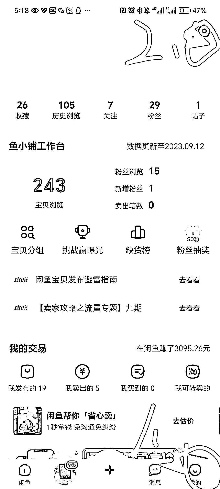

① 点击我的，然后点击右上角的设置

② 然后点击个人资料设置

③ **头像、背景：**就用符合大学生的照片，比如自己的风景照，自己的背景照等等

**昵称：**这个很重要，也就是自己的店铺名字，咱们可以起个和大学生相关的店铺名字，具体的可以自己发挥想象力了哈

**简介：**这点也很重要，可以写一些拉进和顾客关系的描述，也就是从产品的针对人群，具体的活动福利，售后保障等等角度写，主要目的就是为了能够更进一步让顾客觉得我们的店铺很有信任度

然后剩下的几个不是特别重要，可以自己随便设置一下，一定要都去完善好就行。

这样一个店铺的门面也就相当于咱们实体店当中的门面就这样设置好啦！

**（3）发布低价引流链接**

**① 什么是低价引流链接**

也就是我们发布的链接文案和视频或者图片是很新款的 iPad 照片，比如 air5、20Pro 这种，然后价格标的却是老款的 iPad，那种 6 代、7 代的价格。

咱们这个低价引流链接主要目的就是为了吸引顾客的点击咨询，然后我们有人来问了就可以自己引导推荐这种低价的 iPad。

因为这个低价引流链接在平台上很受欢迎，也就是流量、曝光很高，大部分顾客都是因为低价吸引进来询问，这个时候我们可以说链接的最新款暂时卖完了，然后问对方的需求和预算，去给他推荐性价比最高的这种类似的引导。

转化率大概是每 20 个人问有 1 个成交，所以咱们前期保持耐心就好，哪些顾客是有意愿的，咱们其实一开始通过他们的咨询就能看的出来，后期流量多了，有经验了，咱们抓那些意愿强的顾客回复就好。

**② 文案、iPad 照片素材在哪找**

好啦，现在咱们知道了低价引流链接的意思了，那么我们的文案怎么搞呀？我们的 iPad 照片素材从哪找呀？

这个其实很简单，咱们要记住数码 iPad 的链接在平台爆过的，也就是很火的那种链接的文案和照片我们完全是可以重新搬运的。

也就是文案和照片或者视频我们都可以直接从同行那直接搬运过来，这比自己写文案节省了大量时间，而且效果其实是一样的，我自己以前爆过的链接，我现在拿来用，依然还是可以爆起来。

所以这个咱们去需要去找同行或者去淘宝上找素材都是可以的，用生财大佬们经常说的一句话就是先抄再超，这个咱们闲鱼 iPad 数码店铺这块依然适用。

**③ 链接的发布具体如何操作**

因为有些圈友可能在闲鱼这块是小白，我自己当时刚接触也是闲鱼大佬手把手教的，所以在这里，我把具体的链接发布操作也细节得展示出来，方便咱们圈友们更好的落地实操

大家请看截图：

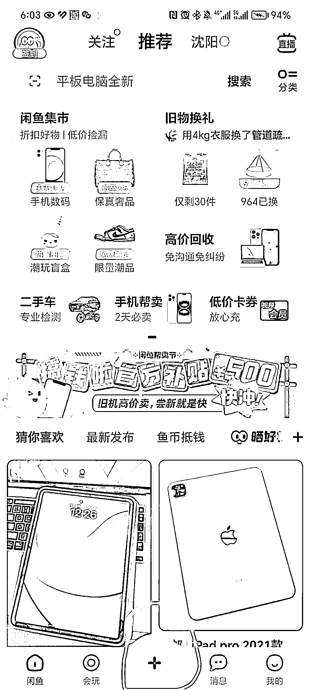

1）点击+号，然后点击发闲置，就来到了 p3 的页面

2）在 p3 这个页面，咱们按照截图标记的 1234 的步骤来，1 把找来的文案复制上，2 把找的爆款素材照片或者视频也传上去

（告诉圈友一个小秘密，视频爆款的概率更大，一年的经验毫无保留分享哈哈）

3）3 点击进去更改自己的发布地址，这样咱们就可以享受到全国各地的流量了：具体的操作继续截图给圈友们看看

咱往下滑找到更多其他区域，然后就可以在各个城市发布了，每个城市都可以发，最好是一个一个轮流着发，尽量保证全国各地都有咱们的链接在

4）然后 4 是点击**价格与库存**，进去修改价格，价格就设一千左右的价钱就行，同行原价随便设个 3999，或者 4999 这样，凸显下差异

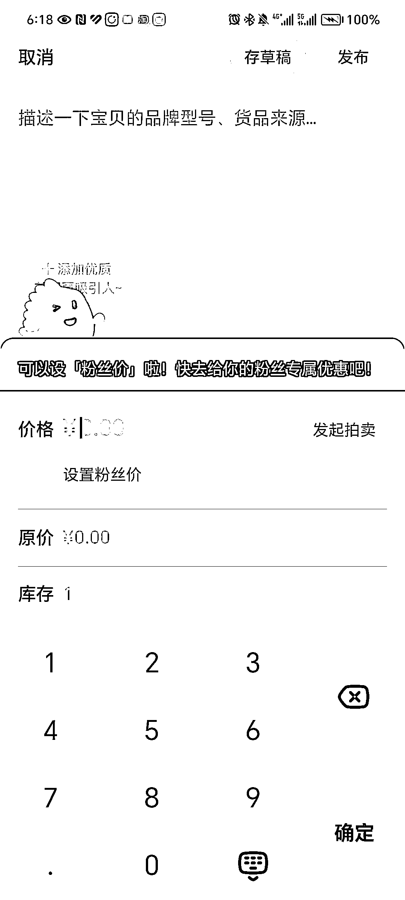

5）然后咱们就可以点击右上角的**发布**，进行正常发布就好啦

6）链接发布之后还有些提高链接曝光度以及留住顾客的小技巧也截图分享给圈友们：

### 提高链接曝光度：

点击左上角签到，我们可以先点击赚经验，然后进去以后我们可以正常去完成这些任务领闲鱼币；闲鱼币领了之后的作用是可以点击 2 急速卖，可以推广增高链接曝光用；

然后 3 闲鱼币抵扣，我们点进去把我们的链接都设置**成 10%的抵扣**也是可以起到增大曝光的作用

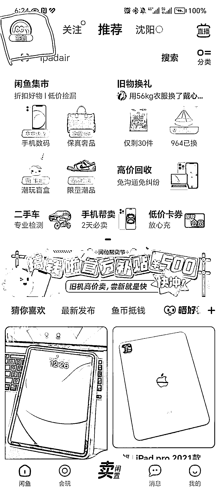

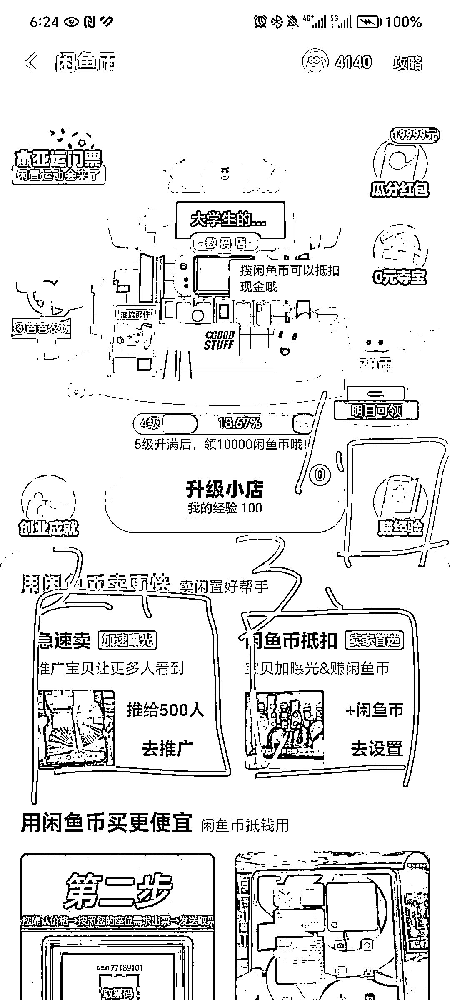

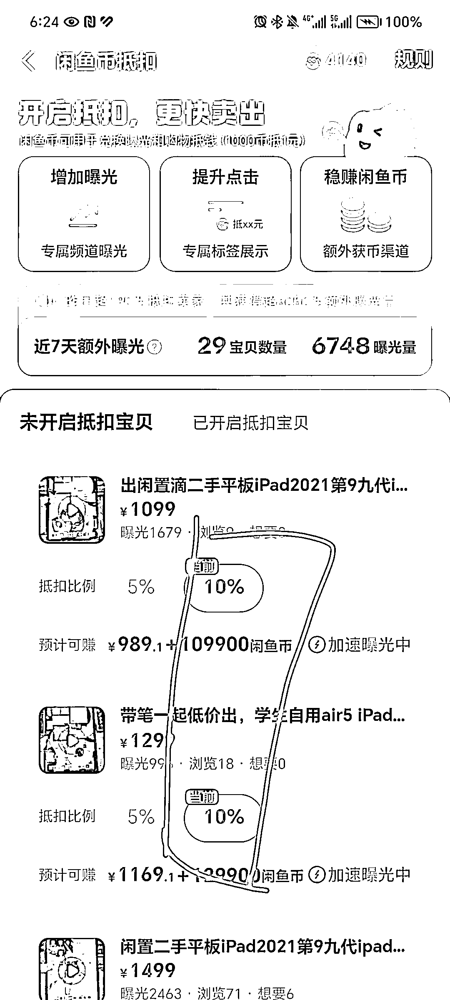

**留住顾客的小技巧：**

p1:点击我的，然后点击我发布的

p2：点击自己刚刚发布的链接

p3：点击右下角管理

p4：然后点击自动恢复设置

p5：勾选默认恢复，自己进行编辑，我也把我的自动恢复设置分享出来啦，圈友们可以进行自己的人设定位和风格进行适当修改～

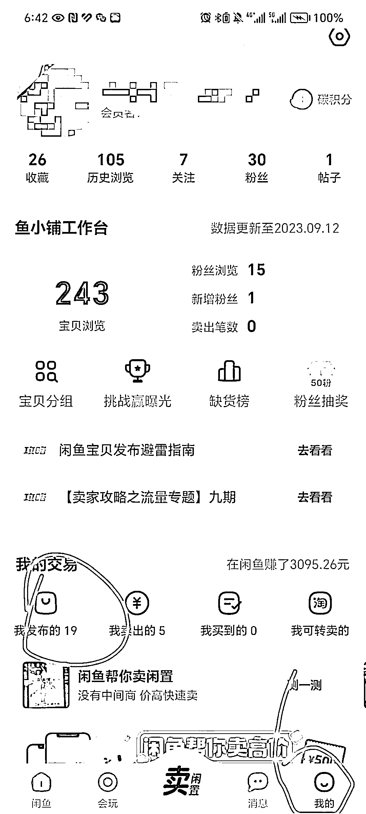

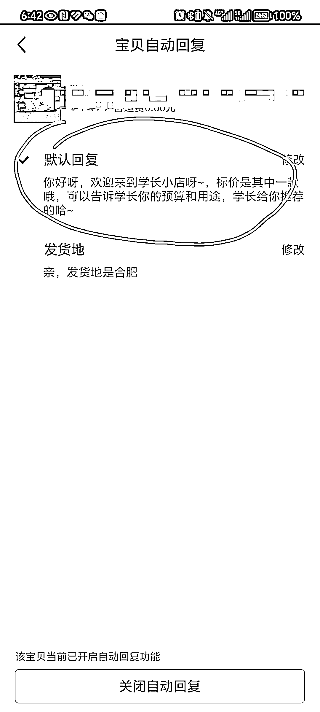

**④ 注意的点**

以上就是链接发布的全部具体操作哦，然后呢咱们这个链接的发布是我们每天都需要去做的，当然耗费时间也不多，但是必须要发，

因为每天发链接，每天保持活跃度可以增加我们店铺的权重，提高曝光，这样我们的店铺才会慢慢有人来咨询

因为新店铺起号是有个过程的，任何项目都一样，需要一个过程，像我自己以前教我同学做的时候，最快的是七天出单，也就是从注册账号到开始发布链接、谈单、成交盈利。

**一般来说建议新号多怼链接，每天发布五个以上的链接，怼到 50 个以上，到时候你就知道流量多到回不过来的感受啦哈哈**

**三、谈单话术及快速回款分享**

**（1）准备谈单话术**

**① 怎样总结自己的话术框架**

谈单话术咱们需要有一个自己的框架，有了自己的框架之后，当我们面对顾客的咨询时，咱们可以把顾客带到咱们的框架里来，当顾客进入我们的框架之后成交的概率是很大的。

千万别顾客问什么咱们答什么，这样咱们大概率会失败，那么具体怎么去总结出自己的逻辑框架呢，同样也是继续去找同行，我们可以用同学的号，或者是拿自己其他的小号（别用自己的店铺号，因为同行也很聪明）去问同行，看看同行是怎么成交我们的。

这样我们就知道一个好的销售，是怎么一步一步把我们带入他们的框架中以及被成交。

**② 我的话术框架分享**

为了省去圈友们的时间，这里我把我自己的话术框架大概分享出来，圈友们可以适当借鉴，总结出属于自己的风格框架，我还是继续上截图，让大家看看我的成交案例，这样咱们圈友就可以对话术框架有个大概的了解了。

**案例一：**

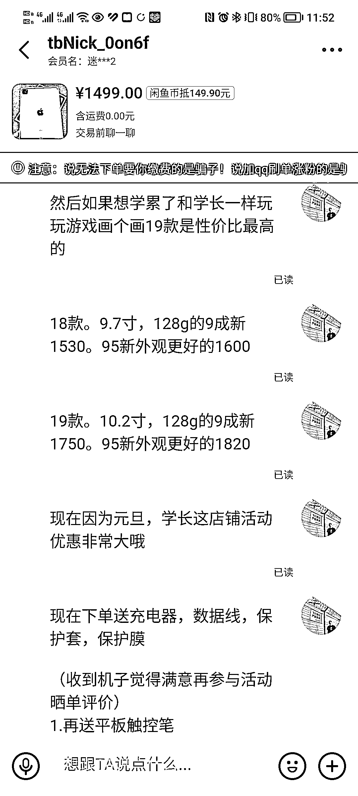

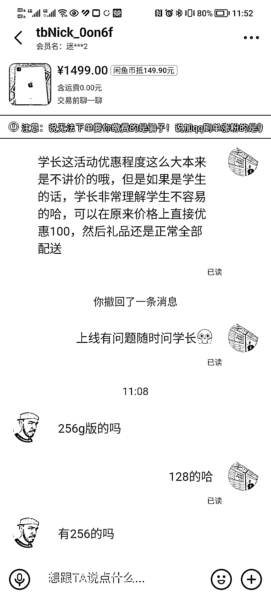

**案例二：**

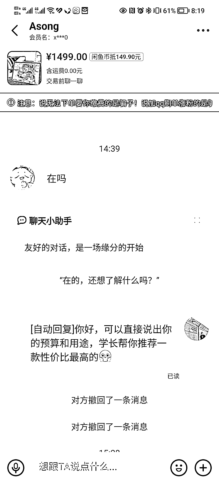

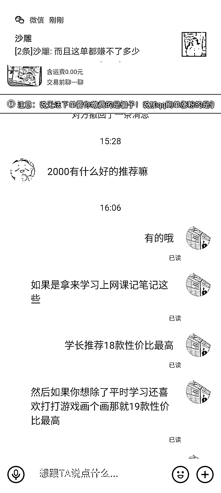

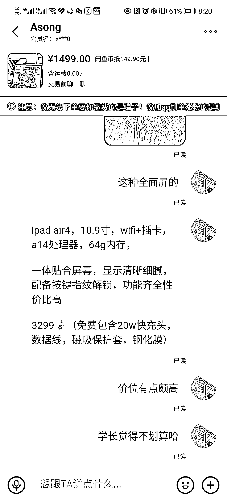

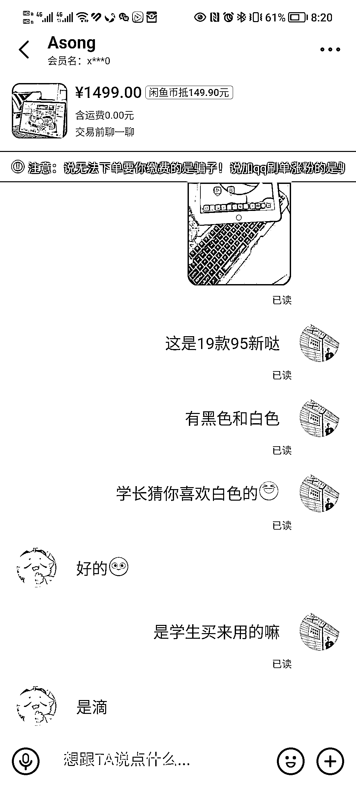

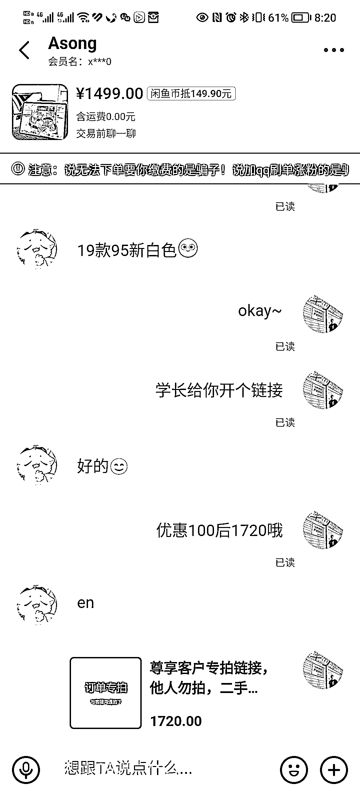

**③总结：**

看完我的案例分享之后，相信各位圈友已经对话术框架有个清晰得认识啦，这里，智慧再给圈友们总结一下：

首先就是问对方需求和预算，然后咱们根据对方的预算推荐预算内的 iPad 就行，然后再增加两部分惊喜环节，就是店铺活动，配件多多；然后再就是学生还会给学生价，让顾客觉得在咱们这非常划算。

咱们只需要做到的就是在这些配件以及优惠的价格基础上去定价，成本价往上加个 300 左右，然后这样下来保证我们每一单能做到利润 200 左右就是非常 ok 的，而且这对整个市场也是很合理的利润区间。

咱们之所以比同行成交率更高是因为咱们的人设以及谈单的两个惊喜话术环节以及咱们的专业度，这些话术以及 iPad 的定价到时候咱们都是要复制在咱们的粘贴板上，这样顾客一来咨询，我们就能马上回复。

因为咱们做电商，只有及时回复，成交的概率也会越大，然后够专业，顾客也会更信任我们，好啦，这里是谈单话术的分享。

**（2）如何快速让顾客确认收货，收回货款**

上面的谈单话术那点其实也就说明白啦，就是店铺活动送的配件，等闲鱼平台显示顾客已经签收，那么这个时候咱们就可以发一段话术。

也就是 24 内确认收货好评之后，学长就会给你发剩下的礼品哦～类似于这种，一般顾客确认收货用着没问题都会快速确认收货。

这个小技巧的：

好处一：可以快速收回货款，因为我们一开始是要自己掏腰包掏成本钱去老板那一件代发的，如果顾客不确认收货，咱们可得要等 10 天，节假日像春节还要更长时间，所以这个小技巧一般三天左右就能收回所有货款＋利润真香哈哈。

好处二：就是给咱们的店铺提供了优质评价，当咱们店铺的好评价越来越多的时候，那么自然而然就会有越来越多的顾客会更加信任我们，我上面那个案例分享就是我之前那个店铺已经有几十条好评了，所以一般顾客都会直接信任咱们。

当然并不是要圈友们都和我一样去送配件，省事的也有比如说返还邮费什么的都可以。上面的话术以及两个惊喜环节大家都可以按照自己情况和想法进行更改，找到属于自己风格的就好。

# 四、关于店铺运营的一些小技巧及注意事项

**（1）快速起号小技巧**

**① 刷单**

哈哈，这个咱们圈友应该都很清楚啦，特别是做电商的圈友们，应该都很熟悉，前期我们刚起号的时候，我们可以每天刷一单。

具体就是发一个价钱 0.01 的链接，让朋友拍下，然后自己发货的时候选择无需发货也就是线下交易那种，这样朋友可以直接点确认收货，然后马上好评。

好处就不用再重复了哈哈，上面也有说到也就是增加顾客信任度，拉近距离快速成交。

**② 每天保持更新**

前期咱们上够 50 个链接之后，然后曝光也起来了，这个时候咱们就每天保持更新一个链接也就足够啦，当然如果到了淡季，也就是突然一个号没什么流量来问了，那就多发几个就行。

**（3）闲鱼玩家申请**

**① 闲鱼玩家是什么**

这是个闲鱼上面的一个称号，可以让自己的店铺看着更专业，当然违规封号的概率也会因为这个称号会降低，我自己以前申请过一个闲鱼玩家

当时我自己大店已经被永久封停了，但是因为这个称号的缘故吧，平台后来又给我解放啦！

**② 闲鱼玩家申请条件：（最近又严格了）**

粉丝数≥1000（可以刷）、三个月内发布 20 个优质帖、优质帖有 30 个互动量、一个月内发布五个以上链接（这个很简单）、三个月内成交 7 个订单以上、好评率≥90%

这些可以等咱们做专业之后，非常熟悉闲鱼运营咱们再搞这个，前期能出单就行，能出单就行，能出单就行

**（3）注意事项**

我们运营闲鱼的时候一定要一号一机一流量，这个咱们做过闲鱼的应该都知道，一个账号对应着一台手机和一个流量，千万不要连 WiFi，不要连 WiFi，不要连 WiFi

如果连了 WiFi 或者是一部手机多个店铺就是会导致我们的流量受限制，也就是流量很少，总之不要连 WiFi 和手机多开店铺就行

**五、闲鱼 iPad 数码店铺的劣势**

因为咱们玩的是低价引流的方式去获客，然后这种方式以及数码 iPad 这个品本身会被闲鱼管控得很严，也就是会不定期进行违规删链接，然后严重的时候会直接永久禁封咱们的账号。

这就是咱们项目目前来说的一个劣势，我自己的亲身经历就是 3 月份抓的特别严，因为 315 打假嘛，然后闲鱼平台也是一样抓得非常严，我当时的大店就是在这个时候被封的，可心疼死我了。

不过呢，虽然项目的劣势就是在这里，但是一个店铺依然还是可以给我们带来七八千甚至五位数以上的收益的，我自己以前死掉的店铺都是给我带来了万把块的利润再死掉的。

我们可以重新用家里人的身份证重新起号就好，矩阵店铺越多咱的收益也肯定就更多，我自己以前寒假的时候同时运营三个店铺。

成绩最好的那天是从早到晚回不过来的消息，然后净利润是 1800+，当时我自己都傻了，我靠，竟然一天赚到了以前我妈上班的半个月的工资，当时真兴奋得睡不着觉哈哈。

# **六、售前售后常见问题**

**为了让刚开始接触这个项目的零基础宝子们能更快速上手，这里再写一些售前售后顾客比较常问的一些问题以及对应的回答话术，希望对咱们有所帮助呀～**

**(1）售前常见问题**

**①流畅吗，卡不卡？**

你好呀，非常的流畅不卡顿的哦～，苹果的系统是平板里面很好的哦，并且再加上苹果的优秀的处理器，流畅运行所有的 APP 都没问题的，喜欢可以拍下哦

**②能看一下爱思检测报告吗？**

当然可以呀，咱们的 iPad 质量非常好的哦，稍等我给您拍一下。拍完之后回复他，您看一下爱思检测报告，电池效率非常高！，您看这台可以吗？

可以的话点击右上角的我想要输入地址我改价格付款后今天就可以安排发货的哦～，顺丰速运很快的哈，大概两天左右就能收到了哦。

**③ iPad9 新和 95 新有什么区别呢？**

哈哈他们的区别就是使用痕迹上哦～，9 新的磕碰痕迹比较明显，95 新的外观很好哦～，但是带上保护套都是一样的，如果对成色要求不高，建议 9 新就够了哦

当然如果想要成色好的，可以拍 95 新的哈～，现在拍下今天就能发货哦～

**④太贵了，能不能还可以优惠一点，能不能便宜一些，别人家的价格比你这便宜等等聊价格的行为**

哈哈你很厉害呀，有比价意识，我以前买东西也喜欢货比三家哈哈，这样才能不吃亏嘛，不过你放心哦～，咱家的 iPad 都是一分钱一分货的哈～。

售后方面可以做到七天无理由退还，然后还免费赠送质保 180 天服务哦，收货之后有问题是可以随时问我的哈，我这边看到都会及时回复和解决的哦

**⑤哪里发货呀？**

咱这是深圳发货，顺丰速运哦，大概两天左右就能到的，喜欢可以拍下呀

**⑥快递包邮吗？**

贵重物品咱这是到付的哦，为了机器的安全，是发顺丰到付的哈，是为了机器怕被暴力快递损坏或者被调包毕竟比较值钱，您收到机器检查机器没有问题再签收哦～

**⑦机器是不是纯原的有没有暗病拆修过吗？**

**问这个问题的顾客一般就是懂 iPad，所以这个时候咱们就要拿原机给他进行介绍：**

机器都是保证纯原机器，无拆无修的哈，支持七天质量问题可退可换，还免费赠送半年的质保的哈！发货前都是会拍全面的验机报告和配置图给你确认的哦，确认没问题再给你发货，可以大胆放心哈

**⑧.是不是国行的？**

iPad 不分版本的哦，无论国行、美版、日版、港版、韩版等在使用上无任何区别，只是销售国家不同，变成不同版本，插卡版的 ipad 均支持国内 3 网 4G，无需卡贴，使用上都是没任何问题的哈

**⑨你们店在哪里 可以面交吗？**

我们店在深圳哦～，如果距离近的话可以的哈，如果在别的地方可以发顺丰快递哦，顺丰速运很快滴哦，大概 2 天左右就到了，很快，收到机器质量有问题可退可换的哈，还有半年质保，可以大胆放心哦

是这样的哦，你可以先考虑考虑，但是咱们这也是最后三台了卖的非常快，我给你看的是成色最好的一台了，喜欢真的要抓紧哦，咱的价格不能说全网最低。

因为毕竟还有组装机价格更低，但是咱们能保证您买到价格合适的，机器质量无拆无修最好的机器！信誉和售后咱加特别看中！也可以拍 50 定金单，咱这给咱预留的哈，到时候考虑好觉得不需要了也可以随时取消的哦

**（2）售后常见问题**

**①iPad 怎么突然掉电很快**

你好呀，iPad 电量是和温度有关的哦～，冬天温度低，咱们的电池电量就会存不住电的哈，这是正常的现象哈

**②怎么充不进去电，充电很慢呀**

平板它的储电量很大哦，充电的话都是正常充电，它不像是手机有超级快充哦，咱们可以晚上充过夜，然后白天正常使用哈～

**③iPad 怎么创建账号呀？**

免费注册 apple id 的官网：

1.  登录苹果 ID 注册界面 [`appleid.apple.com/account`](http://appleid.apple.com/account)

2.  进入网站按照导向步骤操作

**④账号注册了但是显示激活不了**

把你账号 ID 和密码给我哦，我这边给你激活一下，就能正常使用了，要保持在线哦，要发个验证码给我～（咱们在自己 iPad 上登录 appstore 进行正常激活就可以了）

**⑤刚去查了序列号发现是官换机**

二手 iPad 不分这些哦～，咱给你发的 iPad 都是成色好，电池好可以正常使用的哈，不用担心哦～，可以正常使用的

**⑥95 新也不是很新呀，还是有磕碰的**

这是正常的哦，95 新毕竟也不是全新哈，多多少少都会有一点点小痕迹的，给你看看咱们 9 新的实拍视频，你看，区别是很大的哈

# 七、最后总结

以上的所有 sop 都看完了以后呢，咱们再总结下自己之后每天需要做的基本内容：**发链接、闲鱼币抵扣、做闲鱼币任务领闲鱼币推广曝光、每天点击我发布去擦亮、谈单**

基本熟悉之后，每天 10min 左右就能完成基本的运营，然后接下来的时间就是给在谈单上。

如果咱们圈友有和我一样还是学生阶段的，或者是宝妈呀没做过自媒体，不知道干啥项目的，副业也没有赚过五位数的圈友们，这个项目还是很值得推荐的哦～

因为真的门槛很小，我自己去年暑假真的是啥都不懂，就是靠这个差异化运营 iPad 店铺赚到了自己的人生第一桶金，让我自己在大学自信了非常多！

因为我刚开始入校的时候自卑的其中一个原因就是家里没钱，然后我家里人也从小给我灌输家里没钱的理念，导致我就是很自卑，什么都不敢买

自从我做了这个项目赚了第一桶金，我整个人都自信多了，因为我想吃什么都可以吃，想买自己穿的舒服好看的衣服就会去买，想去哪里玩就去，这种感觉真的很爽！

最后呢，也非常感谢圈友靠谱女神、芷蓝女神还有理白男神带我来到生财，发现生财这么一个强有力的组织，里面不仅有很多优质信息，对自己的个人成长方面、视野方面都有帮助以外，还有非常多的真诚利他的圈友，能在生财里面遇到这么多大佬朋友真的非常开心哈哈。

最后的最后，希望咱们生财的圈友们都能够找到属于自己的人生第一桶金的项目，一起慢慢变强变富！

* * *

评论区：

胡哥 : 正好公司抽奖了个平板，你那边收吗大佬，22 款银色 64g 的
清一 : 智慧好牛啊！！
梁靠谱 : 中国机长，太优秀啦
阮清风 : 哇撒，超厉害
高普通不普通 : 厉害啊
坏脾气的小可爱 : 太厉害啦！
一群 : 机长牛逼！
米卡写作 : 智慧太棒啦！

* * *