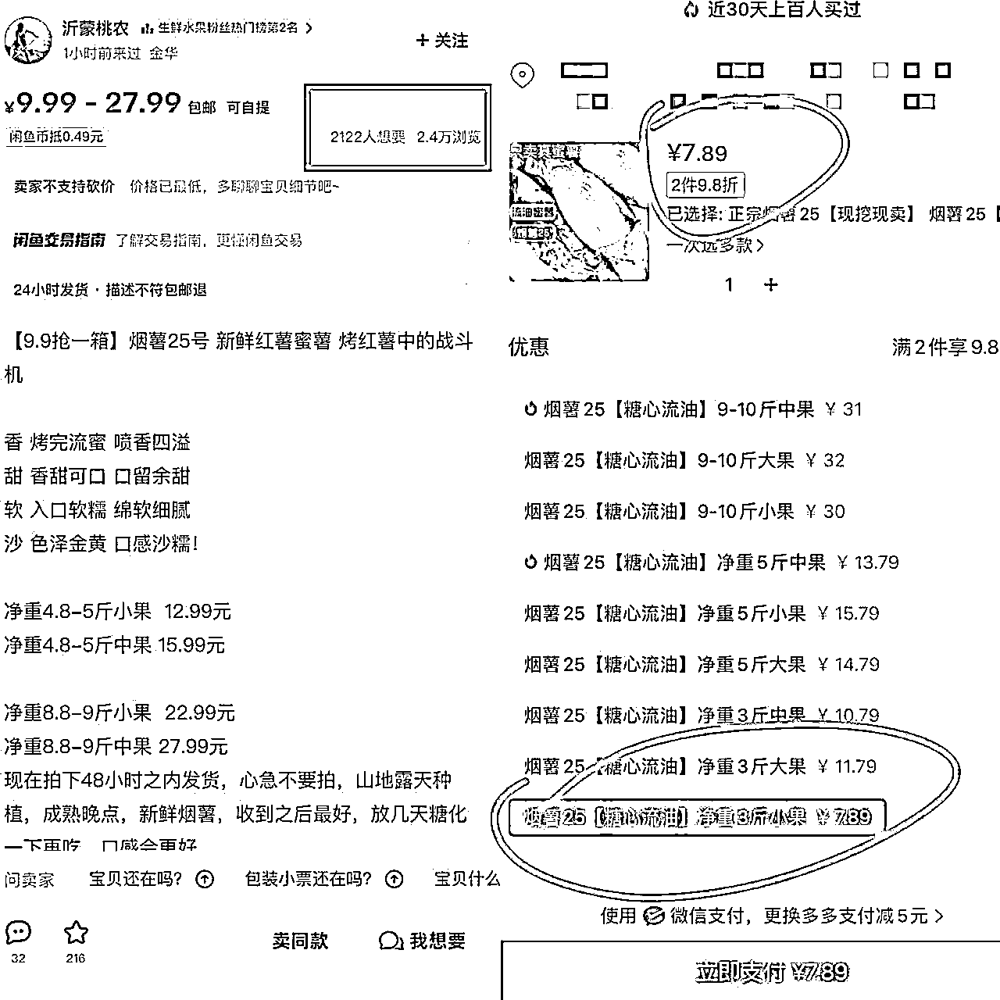
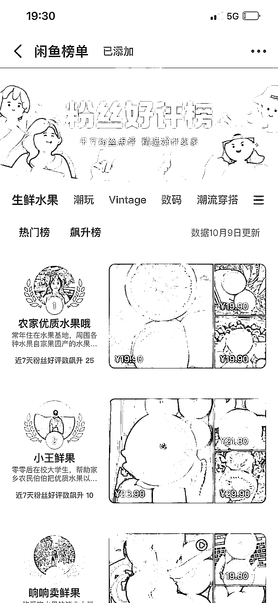
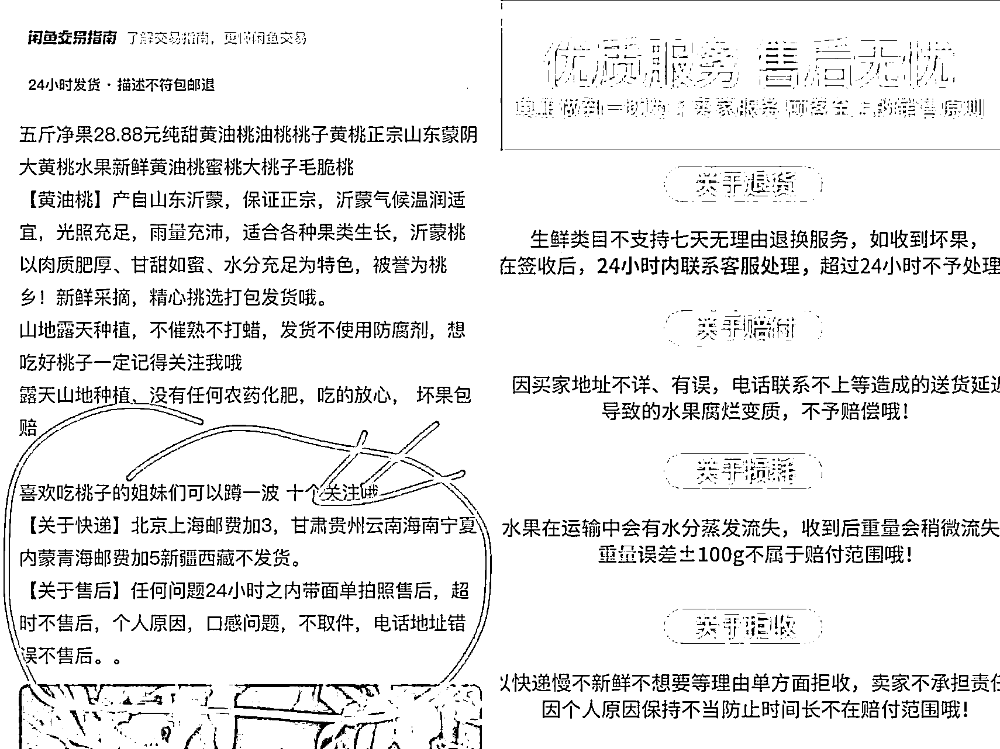

# 闲鱼不会选品零反馈？分享一个必出单的品类

> 原文：[`www.yuque.com/for_lazy/thfiu8/tk2g0hmnsw8ng1me`](https://www.yuque.com/for_lazy/thfiu8/tk2g0hmnsw8ng1me)

## (31 赞)闲鱼不会选品零反馈？分享一个必出单的品类

作者： 饼饼同学

日期：2023-10-12

大家好，我是饼饼。最近不少小伙伴跟我说自己想尝试闲鱼卖货，但不会选品，上架了几个产品都不出单，没有正反馈。

今天我来跟大家推荐一个热卖品类，只要认真去做，一个星期内必出单。这个品类就是水果农产品。

我们学员内测一般上架一两天即可出单，虽然这个品类的利润有限，只能赚点零花钱。适合给初入闲鱼的小伙伴锻炼手感。

一个号跑通后，多号放大去操作其实收益也不错的。

水果农产品这个品类自带季节性需求，并且产品日常化，不用担心对产品不了解，客户咨询的时候一问三不知。

当然水果生鲜类会有一定的售后损耗率，教程最后也会教大家怎么尽量避免。

那咱们现在开始聊聊具体的玩法操作。

## **主要拿货渠道**

万能的拼多多。不要去找其余的渠道，拼多多就可以了。

不管是损耗部分补差，还是全额仅退款，只有拼多多能符合要求，其余平台售后翻车率高，处理也不爽快！

**第一步：找对标店铺**

不管是哪个玩法第一件事都是找到对标店铺，一定要是店铺有出单的链接才有参考价值，这一点很重要。

像下面这个 5 斤 23.9 的猕猴桃，同行每天单量不少且稳定，这种链接就可以参考。

这个价格在拼多多也非常轻松就能找到供应商。

9.9 定价策略的链接，对用户的吸引力更大，出单更多，数据更好。

虽然 20 以上是利润款，但并不代表 9.9 没有利润。

像这个烟薯 5 斤小果 9.9，拼多多上价格是 7.89。

这种价格的拼多多商家有很多，所以一定要提前去看大部分同行定价策略。

选择最容易让客户接受的价位来做，不要自己乱定价。

价格误区：

不是所有水果都只能卖低价哈~ 闲鱼上也有走精品的品种，或者贵价水果比如榴莲。

同样也要参考同行的定价，这些类型不一定是定价越低越多人买。

##### **如何知道每个月份应季热卖的水果？**

1、闲鱼榜单可以做个参考选品

2、 小红书搜索 xx 月份应季水果

## **第二步：图片文案**

文案：

一定一定要直接搬运同行的，不然有时候自己瞎写容易触发违规，比如什么做成罐头，水果干，有些是没有认证无法使用的。

还有一点要注意：

#### 文案要提前做好售后说明！

找的对标文案，最好是直接找有说明售后处理的。

没有的话也要自己加上，或者说九图里面一定要有售后说明。

不然如果有坏果产生自己是不占理的。

图片：

不需要真实，越假越吸引人，仓库，或者产地图最好，产品图多汁鲜艳更吸引用户点击。

## **第三步：找供货店铺**

刚刚第一步我们去找了对标同行的定价价格，那现在只要比同行低价的，都是可以作为我们的供货商家的。

不要去考虑商品好坏。水果生鲜这种就是你去原产地都没办法保证百分百没问题的。

我们要做的是：多家下单，因为很多规格很多水果在拼多多上面第一单都是最低引流价。

多家下单，并且记录售后，后面做久了，出单多了再去跟商家谈长期合作。

这个部分饼饼就不演了，大家随便搜索个水果都会发现拼多多就是最低价。

### **售后少的店铺怎么找？**

我们不可能每家都自己买来尝试，所以直接去找小红书上面种草的评论水果，一般都不会怎么踩坑。评论区素人准确率更高。

同时带有百亿补贴的店铺可以优先下单。

**第四步：开通鱼小铺**

方便客户自助下单以及设计规格。

之前饼饼建议店铺有流量的时候就尽量不要开鱼小铺，但水果生鲜这个品类，有接到鱼小铺的邀请即使有流量也要开。

不用担心断流的问题。这种日常品，即使断流了也很容易起来，并且记得每天闲鱼鱼币推广 的任务。

并且开通：24 小时发货，和描述不符包退。

## **第五步：做数据，人工干预**

做数据不仅可以自己用小号给产品下单，还可以更换产品的定位，调整价格。

定位后期可以把产品的链接放在水果的原产地，增加信任度。

## **第六步：引导关注**

每个链接一定要带引导关注闲鱼号的内容，争取搞到千粉开通玩家。

同时如果你这个店铺做得不错的情况下，可以去办理下营业执照，能上架的产品会更多样。像茶酒等类利润也会更多。

注意事项：

没有证件的情况下只能卖初级农产品。

初级农产品是指种植业、畜牧业、渔业产品，不经过任何添加，只是自然或风干的产品，此类产品可以在闲鱼出售。

带有预包装的食品是不能上架的，大家要注意。

### **问题一：建议做垂直品，还是杂货品？**

贵价水果做垂直，低价水果做杂货多链接

### **问题二：一天的上架数量有限制吗？**

我个人的意见：1 天之内最好 5 个水果就行了。不需要太多。

## **高阶玩法：引流自己的客户到私域**

单纯靠卖水果赚钱，可能大家都觉得一般般，但是水果类的引流效果很好。客户收到产品后，可以拿每日抽奖引导到微信参与。

后续不管卖什么产品，做什么项目，这次的客户都是潜在用户。

好了，这个玩法简单好操作。大家可以大胆去尝试一下~

* * *

评论区：

暂无评论

* * *