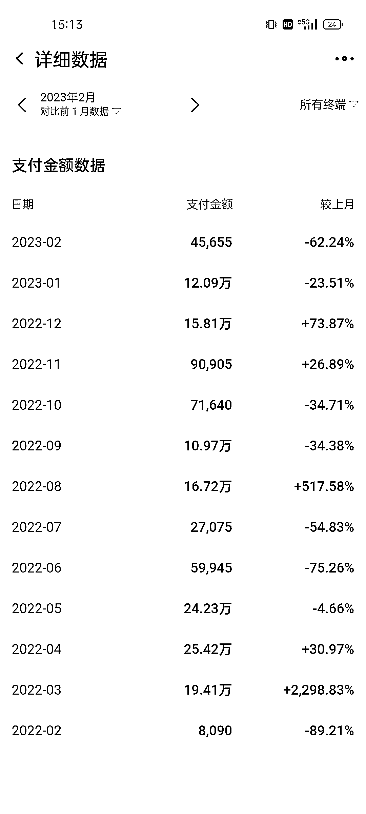
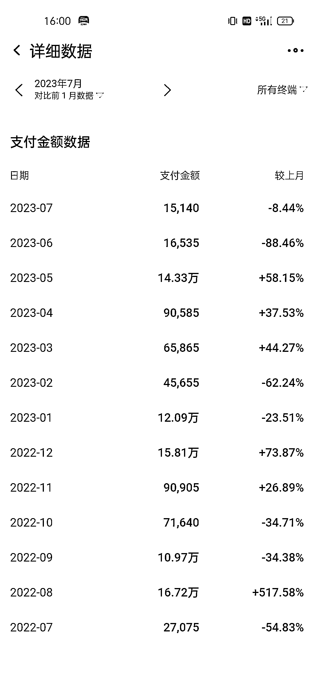

# 小红书教育赛道 GMV1600 万-年，小团队创业心法

> 原文：[`www.yuque.com/for_lazy/thfiu8/iy0r25z6polprwuf`](https://www.yuque.com/for_lazy/thfiu8/iy0r25z6polprwuf)

## (精华帖)(114 赞)小红书教育赛道 GMV1600 万-年，小团队创业心法

作者： 珍妮子

日期：2023-10-07

小红书教育赛道 GMV1600 万/年，小团队创业心法

大家好，我是珍妮，和咱们生财圈的陈铭 Ivy 一起合作创业。
👉👉这是陈老师的精华帖
👉👉
大家感兴趣的可以戳戳。

我们深耕教育板块，主做留学，在 22 年帮某机构做了 1500w GMV，自营业务做了 160w+GMV。

团队直到今年 8 月前，只做两个业务，只铺小红书平台。A 业务 3 个全职，1 个兼职。B 业务 1 个兼职，两个老外全职和 N 个中外临时工兼职，加上我和 Ivy 两人，这是一个 9 人为核心的小团队。
👇👇
这篇文章大纲如下，方便大家直接关键词定位到具体版块：
1️⃣留学赛道业务分类
2️⃣怎样找留学行业的对标账号
3️⃣矩阵号和 ip 号该铺哪些内容
4️⃣怎样铺量做矩阵号内容
5️⃣后端如何转化流量
6️⃣怎样识人，招人
7️⃣小红书平台今年的常见问题和解决办法

1.  小红书一模一样的图片，是否可以反复发？

2.  同样的图片和文案，能不能反复发？

3.  爆款文的时间选择，真的需要在近期吗？

4.  封面被用户看腻了，怎么换封面都曝光量不如从前怎么办？

5.  我的账号被封了很多，每次做起来又被封了，怎么办？

6.  midjourney 到底怎样辅助教育板块引流？

7.  tiktok 怎样辅助教育板块引流？
    8️⃣我对留学赛道现在和未来的看法

❤️此处非常非常感谢 Ivy，没有你就没有我，没有你我只能吃够被社会毒打的苦，最后去乡镇当老师。没有你，就没有现在的业务，感谢你这些年来对我的点拨，指导，和陪伴。

❤️感谢靠谱，因为有你，这篇本来只是一个散装的稿件，终于成型，有了体系。你的营养美学带我度过了整个孕期让人美滋滋。

❤️感谢叶叶，你是宇宙开始的源头，我们都是因为你两年前的盖洛普优势点拨，才一步一步走到现在。

❤️感谢生财这么一个大圈子，感谢生财团队的伙伴们提供这么优质的平台。

👉全文较长，大家可以戳链接哦

[`t.zsxq.com/12tvEOFgZ`](https://t.zsxq.com/12tvEOFgZ)[`wfftwwt027.feishu.cn/docx/C5SedRs3LoSnOex9xDFc9Cvgnff?from=from_copylink`](https://wfftwwt027.feishu.cn/docx/C5SedRs3LoSnOex9xDFc9Cvgnff?from=from_copylink)

* * *

评论区：

梁靠谱 : 珍妮 ivy 牛逼
珍妮子 : 感谢谱子！！！❤️❤️❤️
芷蓝 : 太牛了
珍妮子 : 感谢芷蓝姐！！！❤️❤️❤️我在玩赚受益很多！！
哎呀妈 : 好棒哦~
珍妮子 : 感谢感谢！❤️❤️❤️
胜遇 : 牛呀牛呀
阿甘｜豪华车买手 : 太厉害了

* * *