# QQ 频道怎么引流 1500 人私域？核心在找对“词”

> 原文：[`www.yuque.com/for_lazy/thfiu8/aq0v4g0i2ixrt8xz`](https://www.yuque.com/for_lazy/thfiu8/aq0v4g0i2ixrt8xz)

## (51 赞)QQ 频道怎么引流 1500 人私域？核心在找对“词”

作者： 易小北

日期：2023-10-09

QQ 频道是一个很值得关注的引流渠道，但很少有人会关注到。

这个大家可能不太会注意到的 QQ 平台，我却靠演唱会相关的频道引流了 1500 人。下面，就跟大家分享下我是怎么做的，希望对你们有所启发~

大家好，我是易小北，专注 QQ 号 SEO 引流，曾经做过 400 多个茅台酒的长尾词 QQ 群流量。今天分享的是我在 8 月 21 发布的风向标实操，具体内容可以看下。

QQ 频道搜索暴利引流，单凭演唱会一个词引流微信 1500 人，拉满 3 个票务交流群，演唱会刚开始只有我自己的频道。

流量上来了，不少人开始模仿我建的频道，其中违规了 2 个，搜索无数据，搜索演唱会实现霸屏，自己的三个频道上榜，最多人员 1000 人，加入自动推送加微信账号，模仿跟我做这个词的太多，公布下卷死同行。

图 3 无人竞争频道，就不放关键词了，不然有模仿我的词[呲牙]

图 4 图 5，频道搜索规则，一般新建频道第二天除了人数是❌，拉 10 个人进频道就能有搜索结果，阳光准则出来❌，基本就废，很难恢复。

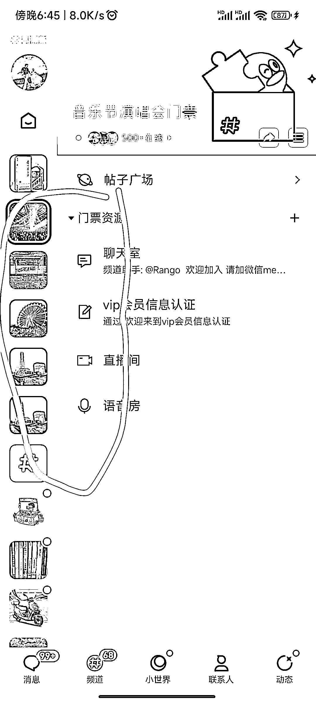

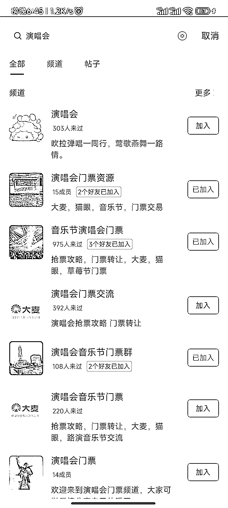

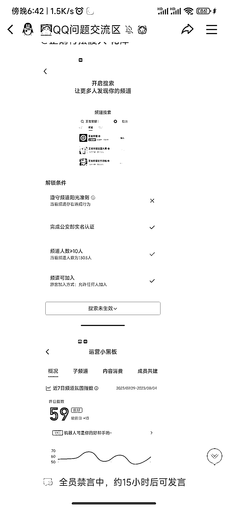

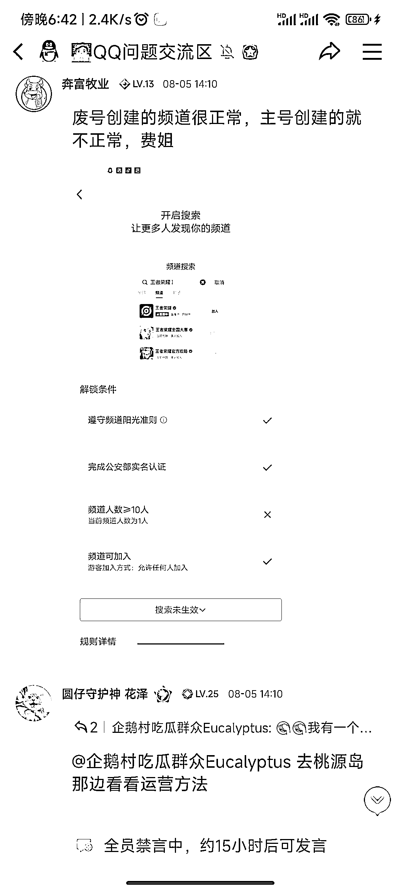

演唱会频道我是在 6 月份创建，刚开始没打算引流，看到不少人加入，才引流微信，中间有过两个频道同一天违规，重新建新频道的时候还没有竞争对手。

8 月份各地演唱会太多，才有很多人模仿我创建频道，引流方式跟我一模一样，频道机器人自动通知加微信好友，拉群。目前开学流量也下滑。

本项目难度可以为 0，别人模仿我的频道就有流量，前提条件是找到一个有流量的频道作为对标，选择的词频道不能太过热门，确保搜索首页马上显示。

举个下面的例子，二手手机频道，属于我模仿别人找的流量词，二手书频道是我首创的词，我自己做过 400 多个茅台群，各地茅台同城交易群，超市茅台活动群，还有招聘找工作都有一定的了解。

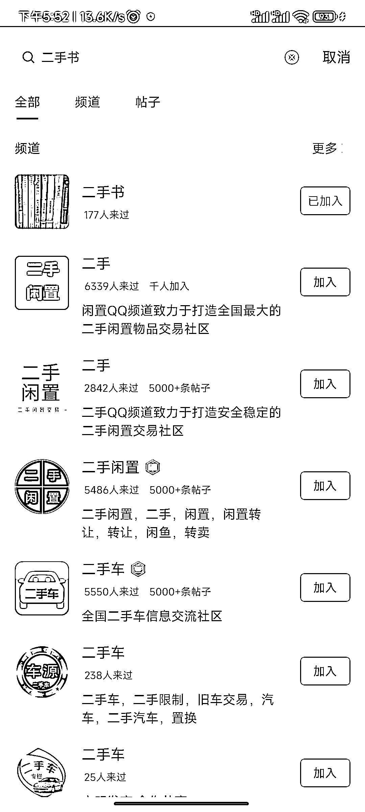

简单举例同城频道，目前来讲二三线城市同城频道不多，除了有大学城市的频道。

同城的租房找工作，大家可以参考一下别人如何布局，同城的需求应该有很多种，这种也是别人布局早，他的频道也是今年创建，可以一直吸取同城流量。

这个同城频道，有一个词招聘，属于违规词，通过搜索招聘，什么也不能搜到，一个正常的词会违规，主要在于很多很多骗人招人干坏事。

我做过一个词，流量不错，小红书，里面很多，招人发帖点赞赚钱的，自己还拉一个群，结果群被封了，小红书，也是违规词，选词要注意下。

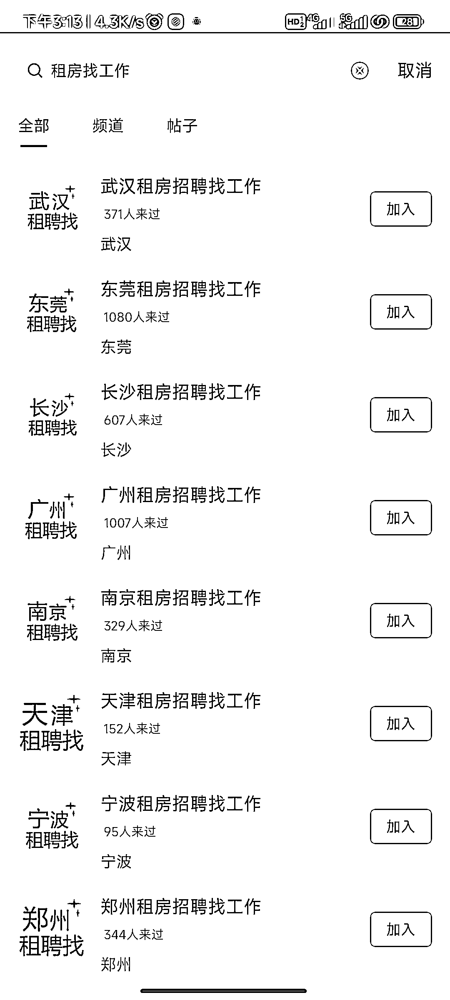

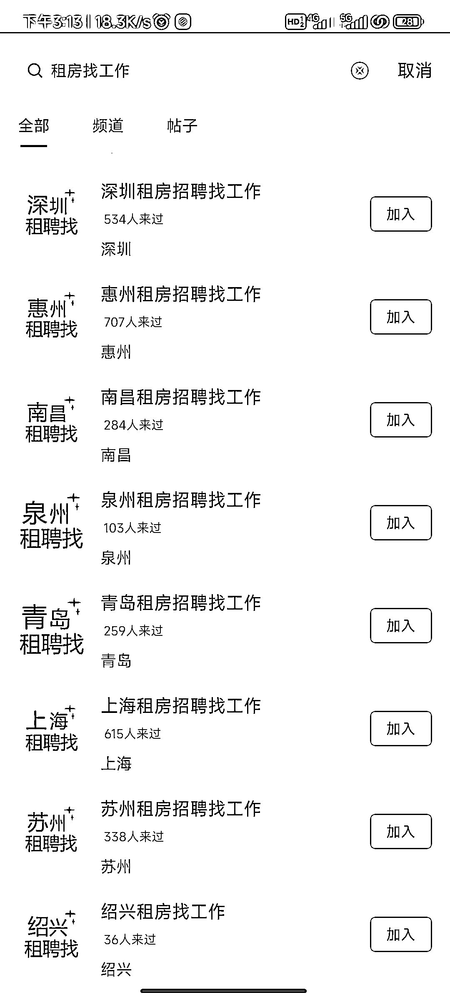

关于创建频道的条件：

1.  QQ 频道一个 QQ 可以创建 3 个频道

2.  一个手机号可以申请 5 个 QQ

3.  一个个人信息认证 2 个 QQ

自己申请 10 个 QQ 就可以做测试频道词了，自己的 10 个小号，全部进自己所创建的频道。

新号基本都可以开通 QQ 频道，新注册账号是默认开通 QQ 拼道的。

关于变现方面的目前来讲，我主要靠朋友圈带货，拉群是附带的引流钩子，有个群可以通过卖微信群变现：

做什么业务赚钱呢，推荐一个方向

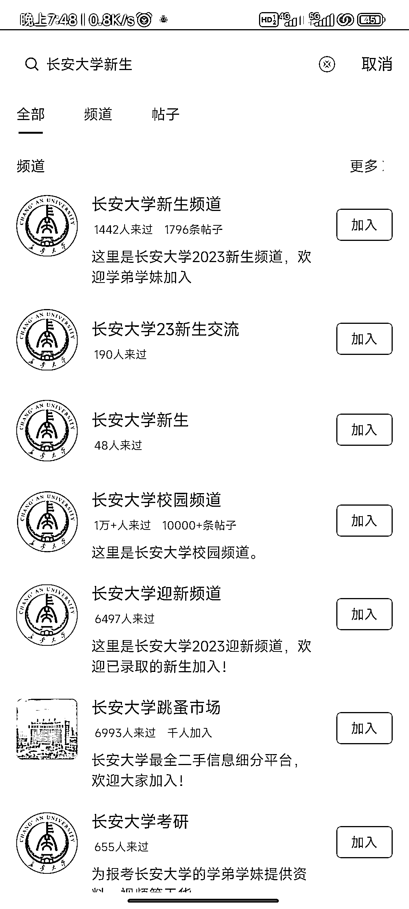

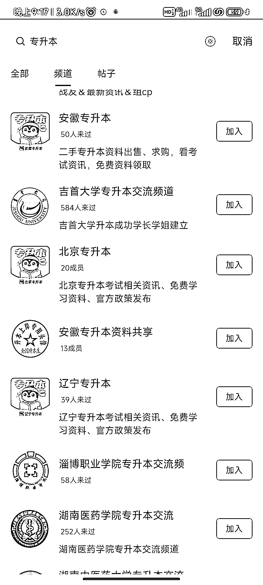

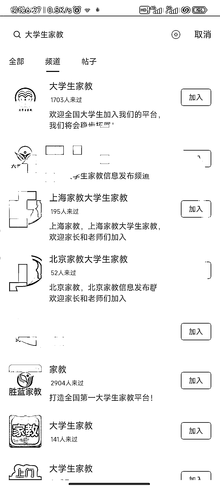

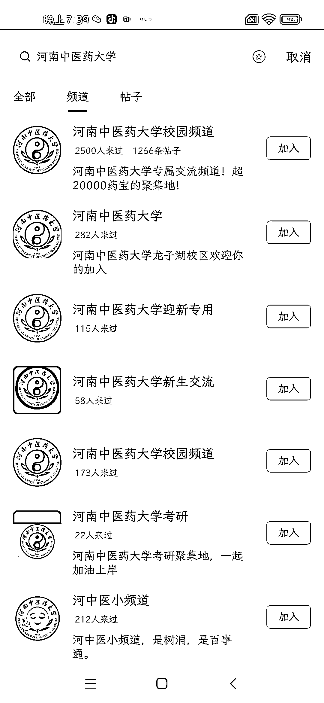

全国 3000 多所大学，专科大学频道数量不多，很容易依托大学名字吃学生搜索流量，引流私域做学生需求业务。

新生流量，考研，家教，专门本，已经有比较成熟的变现方式。

具体变现方式，可以加需要做业务的频道，观察频道主如何变现，还有就是生财找关于大学生变现的案例做模仿，先模仿成功的商业模式，他们的模式是经过市场的检验，有的学校频道少，就可以提前布局下，引流搜索流量这一块。

以大学的名字进行搜索，只要学校频道少于 7 个，那新建频道排名必定能在首页显示

本项目操作流程比较简单，不用写文章，做视频，拍图片，唯一的缺点，在于自己能不能坚持选词，刚开始自己选择的词长期没有人员进频道，是否每天都在创建新频道做测试。

比如我创建的一个频道生财有术，星球的都知道，但是这个频道我创建半个月，至今为止没有一个人通过搜索加入。

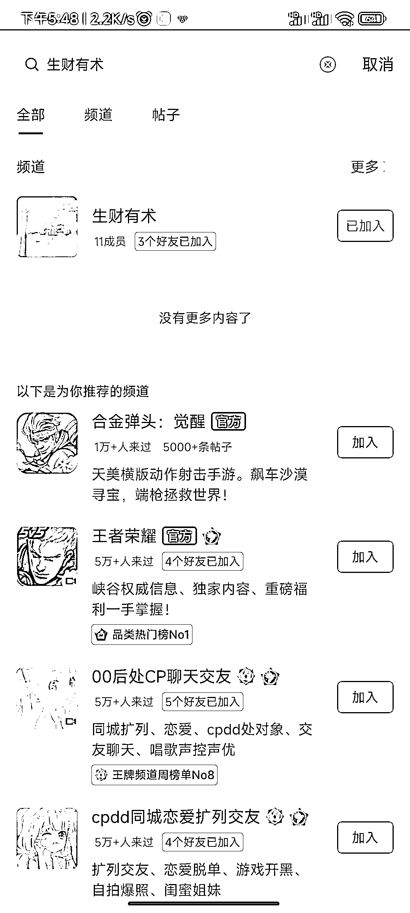

* * *

评论区：

才 : 如果词不行，一直没人，可以换个词重新弄频道，还是留着？
易小北 : 换词重新建频道就可以
黎涛 : 可否留个微信交流下？
易小北 : wu256123

* * *