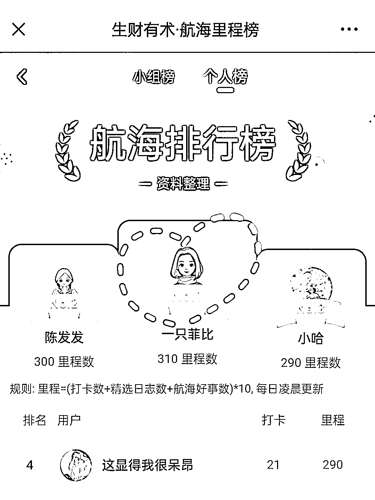
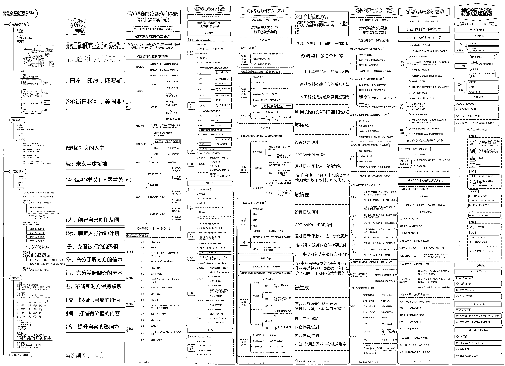
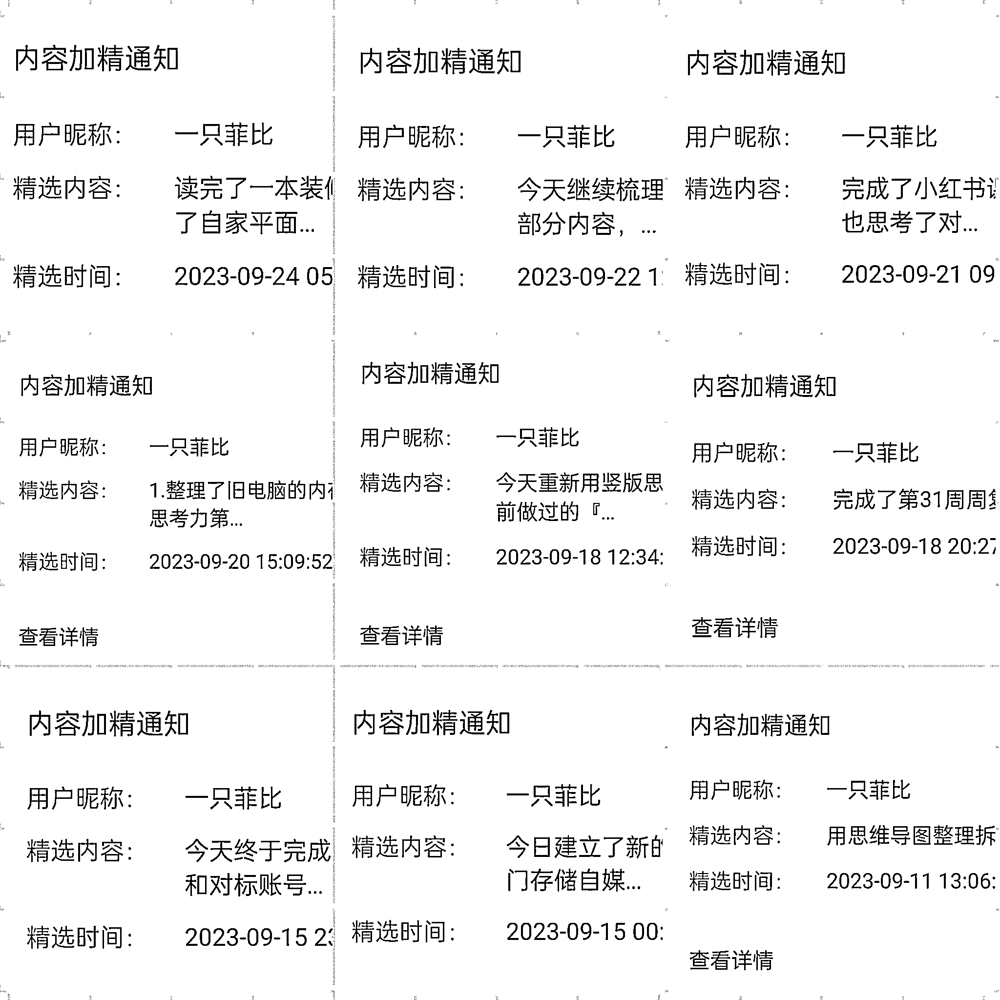

# 结构化思维赋能资料整理，实现高效调用、拒绝形式主义

> 原文：[`www.yuque.com/for_lazy/thfiu8/gti4qvdqn2g0a8os`](https://www.yuque.com/for_lazy/thfiu8/gti4qvdqn2g0a8os)

## (114 赞)结构化思维赋能资料整理，实现高效调用、拒绝形式主义

作者： 一只菲比

日期：2023-09-28

『结构化思维赋能资料整理，实现高效调用、拒绝形式主义』

大家好，这里是菲比，双一流工科毕业、中美双学位硕士，500 强央企工程师，喜欢用结构化思维解构一切的 INFJ。

前两天航海刚刚结束，很高兴我这个第一次参加航海的新人，在资料整理航船中拿到了第 1。共输出思维导图 9 张、精华帖 11 篇、做公开分享 1 次。

航海带给我很多收获，也帮助我沉淀了多年的思考、实践与经验。

文章分为三部分：
资料用时方恨少，精准存放快速翻找
结构化思维赋能，更高效地调用信息
结构化计划复盘，拒绝无用形式主义

全文 3000+字，多图预警，具体请移步飞书查看：

[`n28vbku1px.feishu.cn/docx/WxJGdct2Fo4U0IxXwEucxSdKnlc?from=from_copylink`](https://n28vbku1px.feishu.cn/docx/WxJGdct2Fo4U0IxXwEucxSdKnlc?from=from_copylink)

* * *

评论区：

青锋徐 : excel 复盘比较好，最近接触太多太多信息了，我感觉脑袋快塞不下了
一只菲比 : 接受信息时尽量精简，要输出的时候再扩充
高普通不普通 : 哇塞，满满干货
刘小 6 : 666666！！
捧着风的小雨 : 学到了
王俊雄 : 泰裤辣！！！
梅子 : 好牛！！
坏脾气的小可爱 : 太厉害了！

* * *