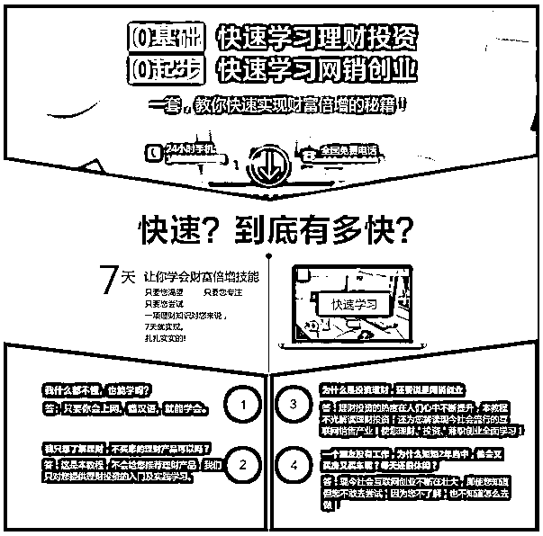
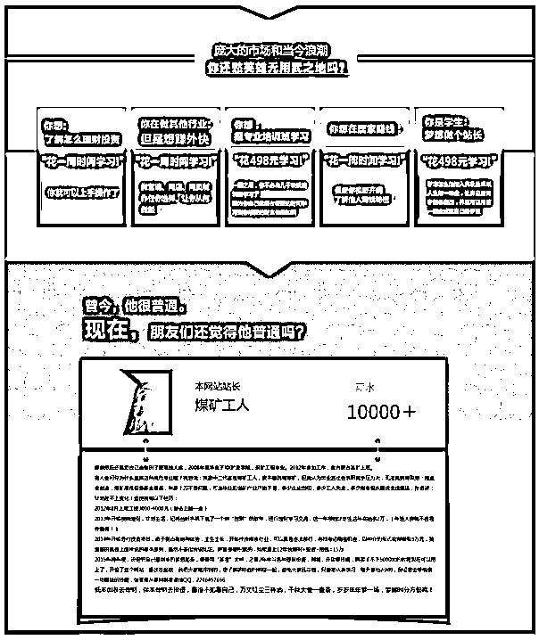
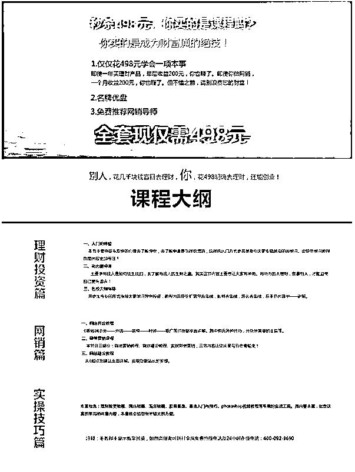
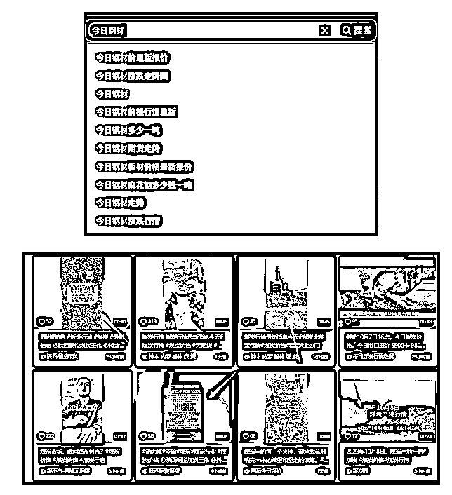

# 卖虚拟资源如何转型发财，实现被动收入

> 原文：[`www.yuque.com/for_lazy/thfiu8/iu0p9goyypgtrrlz`](https://www.yuque.com/for_lazy/thfiu8/iu0p9goyypgtrrlz)

## (95 赞)卖虚拟资源如何转型发财，实现被动收入

作者： 领飞懂运营

日期：2023-10-08

**我是领飞：一枚宝爸超级个体户在家创业 10 年。**

**我这人，从我进入互联网创业第一天起，就酷爱“空手套白狼”，**做中介搞钱的事情，原因是我第一桶金赚到，或者受第一任老师影响造成，所以各位在互联网搞钱第一次赚到，真的能影响后面选择。

比如：你做电商赚到，日后你总研究电商

比如：你做 CPS、CPA 赚到，日后你总研究 CPS、CPA

比如：你做知识付费赚到，日后你总研究知识付费

比如：你做无货源电商赚到，日后你总研究无货源电商

。。。。。。**人，总是惯性使然选择，**所以学习搞钱一定要选择格局大的方向，不然只能是个网络小混混，我很后悔当初为什么不学习电商运营，不学习平台流量思维，现在格局小了，只会卖课。

（经验之谈，仁者见仁，智者见智）

**起初我在百度竞价卖教程，**有 2 年我疯狂时候上线 50 多款独立网站页面，都是我自己琢磨出的方向，比如：刮腻子教程，很奇葩，对吧？管他的呢！想到了就去做，一个页面 300 元成本，成功了天天赚 3000 元，教程就是搜索整理一堆视频进行整理，淘宝卖 5 元，我卖 500 元；

**我写到这里，大家想到什么思维了吗？**

【卖装修技工技巧教程】刮腻子、吊顶、电工布线、水暖等这些工种，这个是市场现在缺口很大。

那个年代百度搜索绝对是主流，很多人也想不到淘宝有虚拟教程出售，以及价格便宜，他们觉得肯定不好，其实我就是从淘宝买和全网搜，整理、细分、归类罢了；卖虚拟资源这件事，我可以算是老鸟中的老鸟。

**其实卖虚拟资源，就是把一堆杂乱无章的烂柴火，你能摆放整齐，打包被人买走，价格就高。**

现在翻看我之前的做的设计页面，仍然很 Nice！很 Beautiful，哈哈，自嗨一下，现在让我去设计，绝对没有这样的耐心了。（显摆下我的设计，回忆满满，图片太长了，只能截图）

上面的图片，其实就是一篇销售信，我们卖项目，销售信至关重要，其实格式模板都差不多，如果你经常看广告，吸引你的销售信一定要收藏起来，对于你日后有巨大的帮助。

现在你要卖资料，很难再有一个单品成为爆款，如果不做品类平台小程序，很难有发展，版权纠纷也很严格，所以卖资料不如卖信息差。

**把整合资料的原理，变为整合信息差**

如下：

举一反三，这样的信息差整合，绝对没有版权问题，关注几个权威的网站，和资深的行业博主，就能够复制到公众号。

**由于操作简单，大家是不是可以矩阵，是错成本也是非常低，就像我当年疯狂搞 50 个百度竞价单品一个劲头。**

**其实操作行业信息差有一个诀窍，**能使你快速聚类人气，那就是“把价格标低”，同行看到之后，肯定联系你，至于你有没有货源不重要，你可以说：卖掉了，关注我，有好货第一时间联系你。

这个套路对谁都没有损失，我们的目标就是聚人气，人有了很多事情就都能干了。

**再给大家举个例子：广告设备行业**

这个行业在线下也是属于高暴力、高竞争的行业，他们制作广告的设备特别的贵，比如一台打印机几万到几十万不等，二手需求很强烈，这就是信息差。

**起号还是那个套路，把价格标低，**之后就能吸引很多广告行业老板，之后引入到你的微信，挨个交流，你是一个广告二手设备商，有需求都可以找我。

当你通过这招吸引 1 万个老板，自然就有设备回收买卖的真实信息了，之后还是空手太白狼，让信息流转给广告老板，你做担保交易就行了。

比如：一个老板要卖一个设备，另一个老板肯定要去现场验货，如果信息不符，是不是损失了差旅花销，这时候就需要你担保信息的真实性，赚担保费。

OK！任何行业都有二手设备的需求，越是热门行业，越是需求量大，千万别找冷门，二手设备也是能矩阵操作，做的人也不多，所以我们要多行业矩阵操作。

就写这么多吧！

**这些是我早些年干虚拟资源项目经验，对于当下转型的建议，**如果你之前习惯赚虚拟资源的钱，还没有拿到大结果，或者是还是小打小闹，求生存在拥挤的赛道，整合信息差变现绝对值得去做，空白市场太多了，做的人也少，脱颖而出的概率就高，总比传统的卖教程资源强很多，最后掌握几个行业长期占有信息差，被动收入不是不能实现。

我写了 2 本书，创业 10 年的经验总结，大家有兴趣看下《套公式创业运营》一万个项目就是一个；《复盘》唯复制强者，方拥有基本盘；不知道生财能不能发，所以电子书大家自己获取吧。

* * *

评论区：

希声 : [强][强]
富强 : 套公式创业运营
森 : 这文章也是一种引流方式，厉害
小 Q : 整合信息差，优秀
亦仁 : 非常精益的创业思维，如果用在一个有大机会的赛道上，是降维打击。

* * *