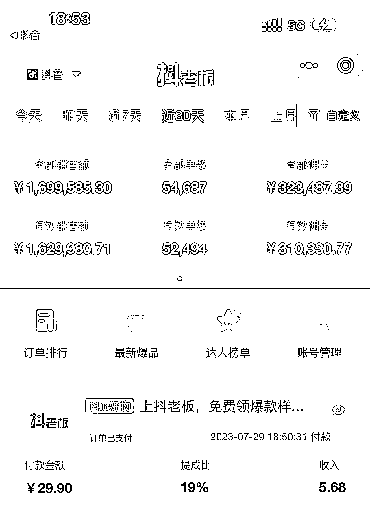
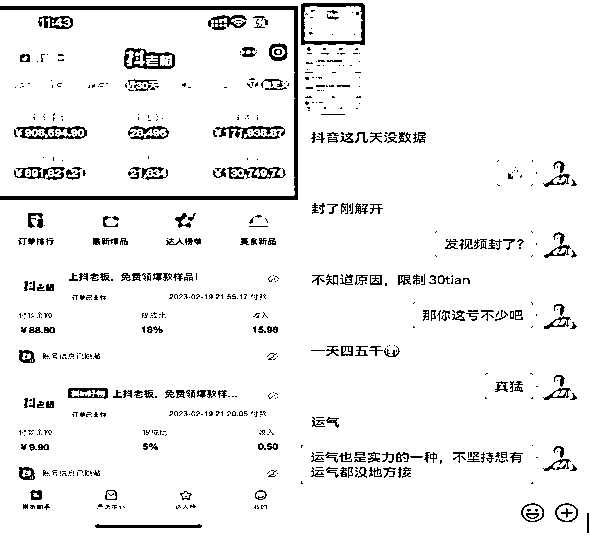
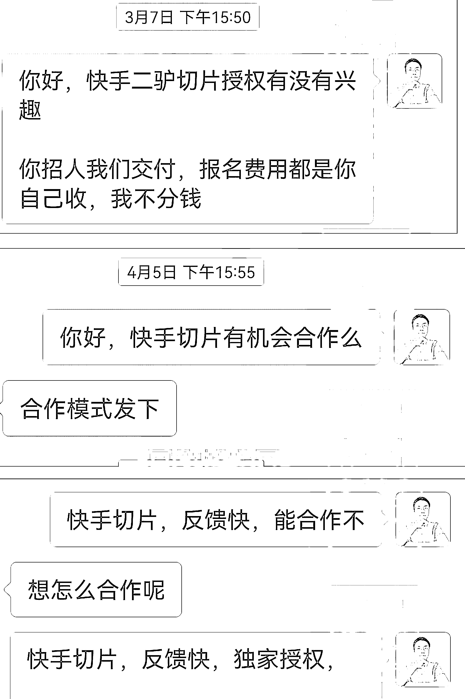
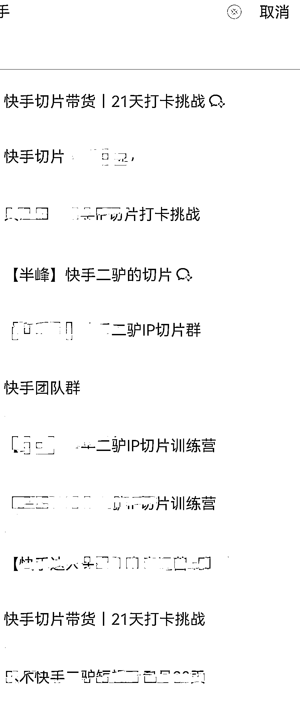
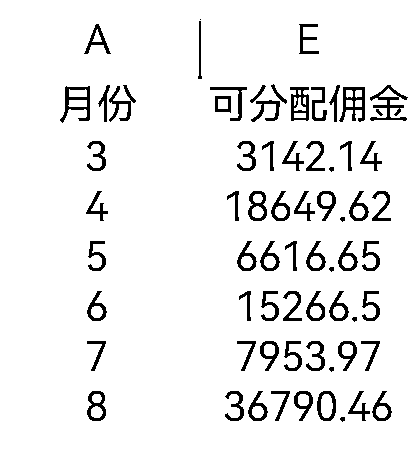

# 就算没资源，比学员多做一步也能成为 1000 人团队的切片团长

> 原文：[`www.yuque.com/for_lazy/thfiu8/fdwwo2dsv3437qgb`](https://www.yuque.com/for_lazy/thfiu8/fdwwo2dsv3437qgb)

## (精华帖)(63 赞)就算没资源，比学员多做一步也能成为 1000 人团队的切片团长

作者： 半峰

日期：2023-10-12

去年 8 月底快手初试运作二驴的切片，我就跟着一起做了，虽然当时是测试阶段，但每个月的业绩都在翻倍的增长。

从服务商和二驴团队确定正式的切片商业化运营开始，我就申请了团长，然后和人合作，靠他们招募剪辑团队，我来交付的方式，组成了一个千人的切片团队， IP 也从最初的一个二驴增加到了后来的 6 个网红，做到了利益最大化。

下面就来分享下我从几十人到千人团队的经验，希望这些思路对想从 0 开始做团队的朋友有一些帮助

生财有术的朋友们，大家好，我是半峰。

4 月 3 日加入生财，虽然是刚加入生财的新人，但对于生财我已经有了 3 年的了解，从第一本 2021 年的生财日历开始，又有了 2022 年的生财日历，加入的一些社群的群主，成员也都有生财的老朋友。

我也通过各种途径学习过生财的一些精华内容，对于自己的成长很有帮助。于是在 2023 年加入到生财有术。不仅自己来到了生财还带着几位朋友一起来到这个谈钱不伤感情的地方。

既然来了就不能只学习，还要多分享，我就来分享下我 2023 年做的项目：快手的 IP 切片

现在做的快手网红切片带货项目，犹如去年的抖音切片，还处于起步期很有前景。

2023 年的 2 月我成为快手 IP 切片的团长，当时只有网红二驴的一个 IP 的授权，现在已经有 10 个快手网红的授权，切片团队达到近 2000 人。

之前有写过一篇帖子，主要针对于想要做快手 IP 切片的个人如何获得授权，以及从选素材，挂车等的保姆级实操的内容[快手切片，普通人做项目都是靠正反馈引导前进](https://asmdqdmydn.feishu.cn/docx/EpmTdjFJ3obnOOxxrPAc6bBJnud)

# 一、IP 切片带货

IP 切片带货，圈友们大多数应该都知道，就是把网红直播的片段剪辑出来发送到短视频平台来带货。

抖音 IP 切片去年那真叫一个火，各个网红，明星都放出了授权。

同理快手网红切片也是通过剪辑快手网红直播片段发视频来带货。

对于切片现在还是非常热的，并且热度不断增加，尤其是抖音的切片，基本有流量的网红，明星都授权了切片。

**（1）为什么做 IP 切片带货？**

一个项目如果能从消费者到参与者到平台多方受益，那这个项目一定是可以持续发展起来的，IP 切片带货就是这么个项目

对于 IP 来说，明星、达人也都是人不可能 24 小时直播，但他们下播了他们的影响还在。

还有很多人因为时间问题想看直播却看不到，切片就很好的解决了这个问题。

将主播的直播视频录下来剪辑后，让想看的人去看流量也很大，也让只能看一次的直播变成无数个视频不断传播还能带货出单，在直播场景外给主播带来持续的收入。

对于剪辑手来说因为主播的流量更大，热点更多，通过剪辑切片的效果比自己拍摄素材发布也要好很多，流量大才更容易出单，让现有素材的利益最大化。

对于平台更不用说了，出单越多平台赚的也越多，何乐而不为。

并且 IP 切片带货是个可以作为长期项目操作，直播带货一直进行，IP 切片也可以一直做下去。

之前只有抖音有网红切片授权，现在快手，视频号，小红书也都看到抖音在切片带货这一块的效益，看到了 IP 切片的潜力，也都开放了切片这个板块。

**（2）为什么选择快手切片**

对于了解切片带货的朋友，说起切片大家大家第一反应还是抖音切片，这个确实抖音切片从 2021 年开始尝试 2022 年快速发展，切片授权做的人很多。

之前的帖子（[快手切片，普通人做项目都是靠正反馈引导前进](https://asmdqdmydn.feishu.cn/docx/EpmTdjFJ3obnOOxxrPAc6bBJnud?from=from_copylink)  ）也有介绍到我们从去年开始就做的抖音切片，有账号现在还稳定月佣 10w+，只是这个是几率太小了。

看到这个数据羡慕不，我也好羡慕，可是太难了，本来是我团队的，因为业绩好被机构直接签了，现在我除了能看看数据流流口水和我一毛钱关系都没有了。

现在抖音切片授权已经卷的太厉害了。一个 IP 三个月内就布局上万个账号，竞争非常大。现在入局有点太激烈了，账号跑出来的比较难，反馈来的慢，普通人难坚持。其他几个平台刚刚开始推广这方面还是有很大机会的。

比如嘴哥授权刚开放就 5000 人了，这竞争你会是跑出来的那个账号吗？

不主推抖音还有个原因就是抖音的成本太高，首先开橱窗需要粉丝，互关速度慢，还可能被标记，但是买粉丝现在成本都 200 左右了，再加上还需要 500 元保证金。这就需要大几百的成本。

这样无论是作为公司矩阵做账号还是个人做账号成本都比较高。

还有违规的问题，抖音限流不告诉你原因，是剪辑的原因还是什么的，有时候涉及肖像权直接封号。本来抖音流量给的也不好，就这样整体出来的成绩不是很好。

于是在快手开始内测切片的时候我们就参与了测试，之后业绩做得挺好就在 2023 年 2 月份的时候和二驴团队确定了正式的切片商业化运营。

**（3）快手 IP 切片的前景**

直播带货这个玩法就是从快手开启的，快手主播的带货额也都不错，而且老铁的信任度很高。

快手切片现在还是初期，授权切片的网红还不多，做切片的人也不多。暂时还没有那么大的竞争，还处在蓝海阶段，前景还是可观的。

**（4）快手切片的优势**

**1、账号要求低，资金投入低。**

一个人是可以实名两个快手账号，营业执照可以认证 5 个账号。

想要实现躺赚的同学，建议两个账号同时操作。

0 粉丝 0 保证金开橱窗

**2、快手切片的优势还有处于初期参与的人少，反馈来的非常快，剪辑的人更有动力。**

快手挂车视频一天可以随便发，正反馈一来一天都想多剪几条，剪辑的多反馈给的更多，就这样正循环。

# 二、千人团长

这次主要分享下我是如何在一个月的时间成为千人团长的。

圈友中很多大佬，带着几千人，几万人的团队，我这团队人数不值一提。

这次分享主要是对于我这种未形成影响力的小小 IP 做成千人团队过程的回顾，希望对于想做团队，但个人影响力不够的朋友有个参考。

**（1）为什么成为团长**

在做快手切片之前我接触过抖音 IP 切片，在去年的时候带着几十人一起做了一阵郝劭文的切片，算是一个小团长。

团队出单我有团长佣金，只是后来坚持下来的人太少，团长佣金没有赚多少。

不是团队都不出单，是出单好的被郝劭文机构直接签了，和我无关了，他这边一个月的佣金 10w+，我也只有看的份了。

虽然自己团长佣金没赚多少，但我当时自己的账号有一个品爆了，出了一些单，可惜链接挂错了，介绍 29.9 的品挂个 6.9 的链接。

剪辑大包装挂车小包装。发作品也没坚持，后来授权解除了。

但也因此让我看到了切片带货的潜力，之后在去年 8 月底快手初试运作二驴的切片，我就跟着一起做了。

因为是测试阶段，没有对外放授权，机构这边只做了有 100 多个账号，从 9 月份到 12 月份，切片这边每个月的业绩都在翻倍的增长。在 2023 年 2 月份的时候服务商和二驴团队确定了正式的切片商业化运营。

我申请了团长。每个服务商授权团长的要求不同，我们服务商要求是保证金 1 万元，如果团队 GMV 达到 100W 就退换保证金，根据团队业绩的完成情况会有不同比例的团长佣金。

直接和服务商直接签团长合同。团长就可以招募剪辑手了。

**（2）剪辑人员招募**

2 月末正式放开授权，对外招募剪辑手，最初是自己招募授权人员。

为了让报名的人能够坚持发视频，设置了一个小门槛，做的付费打卡的方式。199 元打卡 21 天，21 天内每天发布 2 条视频，完成后全额退款。

通过已有社群，朋友圈，公众号发文章做宣传招了有 100 多人，当时大家反馈来的也挺快。

因为快手上刚开始推广切片项目，做的人少竞争小，流量给的都不错，有人第一天就开始出单，打卡群每天都会有出单反馈。

一个星球左右都有爆单的一天几百的，上千的总会给大家激励，出单率能有 20%以上，这种情况也让我越来越有信心，也想更快的去推广。

**（3）团队合作**

我个人的影响力还是小，这个招募速度太慢了，于是我就想到了和人合作。

他们招募我来交付。我就去联系已经进的社群的群主，以及朋友圈经常看到的 IP，将项目介绍，以及学员反馈发给他们，看他们有没有兴趣来合作。

合作方式：他们收费，可以做收费授权，收培训费，或者收打卡费，这个费用他们收多少都是他们自己的，我都不分钱。

我这边跟进教程培训，答疑，和下面的用户建立信任，额外团长佣金中分出一部分给他们，只要他们招的人出单，这个佣金是每个月都结算。

因为大家都是做互联网项目的，都会不断推出项目做培训或者提供给社群交付，所以这个项目对于他们也是挺好的。就这样合作了几个 IP。

这里面有采用打卡方式的，也有直接收培训费的，一般打卡的就把我邀请进群我来交付，他们省心。

收培训费的因为价格不同，有的就自己来交付，怕我这边价格对他那边学员有影响。

有的招募了几十人，有的招了上百人，大 IP 一个文章就上 500 人的，就这样我这边整体快速实现团队 1000 人。

后来陆陆续续还有继续合作的，现在有近 2000 人。

**（4）团长收益**

如果只看上面的人数，感觉一两千人的团队，团长应该挺赚钱吧，但是理想很丰满，现实很骨感。当大家兴致冲冲准备大干一场时，现实总会给一点小阻碍。

下面是从 3 月份开始（因为 2 月份开始的团队授权，3 月份有第一次结算）每个月的可分配佣金，团长佣金是从可分配佣金中按比例提的。

具体比例就不发了，因为每个服务商给的会不同。团长到手就是在几千到 1 万多的佣金。

3 月是我自己招募第一个月比较少正常，4 月是团队发展起来的第一个月，佣金提高了，以为后面会越来越高，本来正反馈来的很快，各个群里都兴致勃勃要大干一场，有学员刚上手就开始爆单。

谁知 4 月末快手开始抽风，切片总被判作品同质化严重限流，只要一爆单就限流，各种报白名单也不能根本解决问题，打击了很多人。

5 月 -6 月一直就这样拖着。7 月后后半月切片流量又开始干起来了。这个 7 月佣金低是因为这个佣金是已经结算的，7 月末的订单都没有结算所以佣金体现在 8 月里面。

现在看来后面流量应该会好起来了。

因为中间的限流，实实在在的让很多人停止了更新。都说 2080 法则，有时候 1090 才是正常。1000 多个账号，最终一直继续的不到 200 个。也就 1/10 的人在持续发布作品。

但能坚持下来的，收益也还可以的，没有收益确实很难坚持。

虽然有的学员不发二驴的了，但有新的 IP 也都可以继续参与授权剪辑。只要想做都给提供，这是互利的事情。

并且都建了专属的群，有的网红本身想把切片做好，比如太原老葛，他们机构会直接有老师来做培训。官方培训，素材提供的也更多。

目前增加了一些授权，二驴家族，太原老葛，芈姐，高迪，蒙安夫妇，陈先生，后续还会继续签。

IP 切片各个平台也都在重视，是个可以长期做的项目，做成团长，前期推动起来，后面也有个保底收益。

# 三、合作创造利益最大化

这个分享就是我团队发展的过程，主要是让利，共赢。也可以用在其他一些涉及到推广，合作的地方。

如果自己有成型的项目，想要快点推广，就可以找有影响力的人合作起来。前提要保证自己能交付到位，要不也影响了别人的信誉。

# 四、项目总结

快手切片做到现在有半年了，由最初开始招募剪辑手看着人越来越多，每天群里晒爆单图。

那时候大家都充满斗志，赚钱的想要更上一层楼，没出单的看着一起进来的人爆单也是充满了希望。

作为团长看到大家赚钱心里也很高兴，不辜负我的交付，不辜负大家的努力，再到后来各种限流的出现，打击了一大批人，流量少了，出单难了，很多人这个时候放弃了。

我们也和快手反馈了这个问题，但一直得不到很好的解决，五六月份看着持续更新的账号越来越少，我们想让大家坚持，但又感到无力。

只是我们知道这只是个短暂的过程，后面会好的。

我们没有停止授权，同时还在对接更多的 IP，由最初的一个二驴的增加到了后来的 6 个网红。只有在低谷时做好准备才能在机会到来时狠狠抓住。

在 7 月份看到大家反馈的的时候，我们看到又好起来了，持续更新的账号再不断出单，一个月佣金几万的账号多了起来。由看到 8 月的数据一直在走高，同时我们对接的网红也到了 10 个。

半年时间虽然不长，但也算是经历了一个小起小落，无论经历限流还是经历爆单一直在更新。

因为他们看到这个事情是可行的，值得做的，才能够一直更新下去，坚持下来的剪辑手收益都有提升。

身为团长的我们也是一样，在遭遇大面积限流的那段时间，有的团长也在抱怨，后来也不太推广这个授权了，团队的人也不持续更新，慢慢的就停了。

我一直相信快手切片后面会更好，因为抖音也经历过这个时期，现在抖音切片风生水起，我没有停止，还在不断招募，签了新的 IP 也让授权时有了更多选择，看着这又开始好起来了。

最后扯点玄的，先调整心情再做事情，做好近期不赚钱的准备。

有咨询的朋友问我做切片多久能出单；怕做不起来；适合做吗等一类的问题我都会和他说不保证能成。做成需要各种条件的保证。

作品质量，随便发发被判搬运啥的这种没有流量必然不出单，即使作品剪辑的好也不一定能爆，模仿同行爆单的作品，模仿他的模板，他的文案，他的转场，一般效果也都不错；

作品数量，发个几天没流量，不出单就放弃了，这种是最多的，有数量才有机会，连发都不发这谁给机会；

运气，这也是很重要的原因，有人第一天就爆单，有人剪辑一个月没出单，这个除了作品质量，数量，运气也是一个很大的原因，有人就是被追着送钱有什么招。

有的号就是不出单，那就增加号，人家矩阵做几个号，几十个号才做出爆单的号，或者继续剪，1 个月不出单剪辑 2 个月，2 个月不出就 3 个月，我们真有 3 个月没出几单第四个月开始爆单的，只是你能坚持到这几个月吗？

无论是自己剪辑发视频还是做团长都是一样的，不会都成，大多数人不会一开始就能收到正反馈，但不要遇到一点挫折就退缩了，放弃了。

就如黄小刀大佬说的“创业就是最高级的游戏，默认大多数人都不成功，默认自己不成功。但要做到的是要比你们成功，第一我要干，第二我要赢”我们要自己做到更好，超过了别人剩下的就是自己，剩者为王。

做事有个好心态，不限于切片。

因为相信，才能去坚持，坚持了才有机会看到想要的结果。

* * *

评论区：

珊瑚海 : 我现在是老葛团队的剪手 刚开始做[呲牙]
半峰 : 老葛现在切片流量还是不错的，素材，培训给的也好，加油
亦仁 : 感谢分享，已加精华。
亦仁 : 这个团长模式不错
半峰 : 自己号召力不够，只有多想办法了😃
半峰 : 谢谢亦仁老大
慕青 : 怎么链接
牧羊人 : 能交流一下吗

* * *