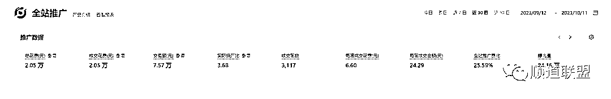

# 拼多多无货源的前世今生

> 原文：[`www.yuque.com/for_lazy/thfiu8/gipxun0uc3v84dh6`](https://www.yuque.com/for_lazy/thfiu8/gipxun0uc3v84dh6)

## (30 赞)拼多多无货源的前世今生

作者： 顺道

日期：2023-10-12

1.  **商现在分为两种种类型，一种是有货源（精品店），还有一种是无货源。**精品店的意思就是自己有货源仓库，产品自己打包发货，除了自己有货源之外还需要具备客服、运营、美工等工作岗位。售卖的产品基本上都是自己有货源。

2.  ** 优势**：

3.  1 上限很大，之前货源有优势或者运营技术牛逼可以做出来爆款，在电商市场的红利期做出来几个爆款很快实现财富自由。比如义乌很多具备供应链优势的人一年就那几个月就吃得很饱。（雨伞，雨鞋，年货等）

5.  2 具备一定的壁垒，比如有的厂家开模一套就几十万，具备成本，外观，技术上的壁垒。

6.  **劣势：**

7.  1.近几年供应链之间的差距越来越小，你这边出来的爆款，其他工厂几天就出来同款了，同质化很严重，到了后面 PK 的就是价格，拼的是财力。

9.  2.售后风险，自己囤货就会有很大风险，比如服装普遍退货率都是 60%以上，很多做服装的销售额 3000 万，一年算下来净利润 20 万，甚至还赔钱，因为库房还有大量的退货和因过季或者款式淘汰留下来的尾货和库存。更别说还有很多产品进了一堆货，根本就卖不出去。

11.  **无货源的意思就是不需要进货囤货压货，通过信息差来赚取利润。**

13.  **优势**：因让别人发货，售后也是厂家（上家）处理，没有风险，通过平台之前的信息差，消费者购买行为之间的信息差还有产品之间的信息差赚利润，可以批量复制店铺，通过多店实现利润增长。

15.  **劣势**：单店利润有限，因产品价格图片发货没有优势利润主要通过多店的模式，所以无货源也叫做店群。

**市面上无货源的几种派系**

目前市面上玩无货源的主要分为暴力派和精细化派。

**暴力派分为以下两种**：

1 利用平台红利铺货（采集），玩所谓的免费流量。就是把本平台或者其他平台的链接批量传到自己的店铺，通过博概率进行出单，比如把多多上的产品传 5000 个到自己的店铺，一天可能出 50 单。（抖上拼）把抖音精选联盟的产品平价传到店铺或者比抖音卖价还低传到拼多多平台，出单后，再抖音精选联盟采购赚取佣金。

红利期：一个新的电商平台建立的时候，站在平台的角度，因需要扩充平台产品品类和数量，希望大量的卖家入驻，所以都会有一段时间的平台红利。于是诞生出来一个无货源的方法：采集，顾名思义就是采集别人的商品链接加价传到自己的店铺，出单后在采集那个人的店铺购买给客户发货。采集爆款，采集单类目卖的好的，采集跨平台的产品数据，平台前期是纵容这种事情发生的，所以这个红利期就让做无货源的人就做起来很多的店铺，但因为这种方法比较暴力，到现在给平台带来的价值降低，平台就出现了很多的规则出来限制这种野蛮式的操作。目前拼多多市面上百分之 95 的人都是采集，批量做单店一个月利润普遍在 200-800。

 弊端：

批量的采集商品传到店铺，有些出单的商品根本找不到货源，所以就有一个拍单率的问题，店铺看上去今天利润有 50，但是算上扣款店铺扣款，拍单率等问题实际上很难赚钱（大部分铺货的人不会算利润）。2 抖音拍单遇到拍单号限制的问题，抖音上有佣金的都是商家为了前期拿销量挂精选联盟进行推广，后期达到自己的目的后就把佣金进行了调整，比如原来有百分之 20 的佣金比例，多多出单很好，突然佣金比例变成了百分之 1，就不赚钱了。很难实现批量化，稳定化。

2 寻求平台漏洞，疯狂裂变，寻求平台稽查严重的类目进行盈利，比如黑五类。（所谓的技术漏洞，就是通过某一个方法和技巧，快速让自己的产品有流量，有了流量就有了销量，就有了利润。这里出现了很多方法，比如：S 单，动销，退款单，大额单，上下架。电商黑五类指的是经营减肥、壮阳、增高、丰胸、医疗器械这五种产品的电商，而“二类电商”是在原先黑五类的基础上进行了拓展，增加了一些新的产品如佛牌、治脱发、茶叶、望远镜、转运符、在线算卦等产品。这些都是平台重点打击的。但是利润高，还是一直有大批量胆子大的年轻人疯狂尝试。法律等维度风险都极大。

弊端：

本质上就是再跟平台做对抗，所以不属于长期主义的生意，个人永远跟不上平台更新后台的速度，这个月研究的黑科技有用，下个月就被稽查了，而且目前各大平台都会秋后算账，冻结资金，巨额罚款都会接踵而至。大部分多多被冻结资金的商家都是个人违规，售卖产品擦边或者缺斤少两等问题。在我看来只有一种人能再这个模式上赚到钱，就是发现漏洞黑方法出现的时候，极短的时间可以达到疯狂的裂变，比如天猫店群那一波，有的人一周之内开了 100 家天猫店，有大量的资金和成熟的团队。只做了 4 个月赚了 2000 万。而往往大部分人没有这种能力。自嗨的研究黑方法就是浪费时间自欺欺人。

**精细化分为以下几种**

精细化派：顾名思义就是不暴力的靠产品数量，店铺数量来盈利。通过一些选品方法进行产品的筛选，通过后期的产品优化店铺优化进行盈利。这里出现了几种玩法的出现：蓝海，截流，小爆款。

 蓝海：概念：现存的市场由两种海洋所组成，即红海和蓝海。“红海”代表现今存在的所有产业，也就是我们已知的市场空间比如卫生纸。;“蓝海”就是竞争小的市场，有需求，价格不透明，主要不是打价格战的细分类目。比如西红柿绑曼夹，是不是都没有听过？这种就是蓝海的又细分需求的产品。

截流：批量找到同行出单的产品，通过售价低一点或者开车来截取这些产品的流量。

小爆款：通过无货源筛选出适合进货的产品，然后通过单店打法来操作，可操作成功率更高，风险更低。

**无货源店群的底层逻辑：稳定是最好的发展 **

** 市**面上普遍的无货源商家普遍有个特性就是焦虑。焦虑的点就是所有的玩法和技术本质上都是跟平台做对抗，一夜之间死了多少店铺，一夜之间店铺没有了流量，我遇到过很多拼多多所谓的大佬几千家店铺，通过所谓的高人效，快速起店理论一夜之间店铺全部被清洗，忙了大半年耗费了大量的精力，人力，财力，最后什么也没有落下。说难听点赚钱的多少，纯粹的靠平台的脸色，靠运气。所以在几年前我就告诉自己，一定要做有沉淀的东西。无货源沉淀的一定是店铺，如果一个方法迟早要被清洗，只能赚 2 个月钱，就算再有诱惑，赚的钱再多，这种钱也不赚，不碰。因为一旦赚了这种钱，最可怕的是人的心态发生的彻底的改变，后面的每次思考和选择都在追寻这种快速暴富的方法和项目，好高骛远，越来越焦虑。最让我印象深刻的就是一个有 600 家拼多多店铺的同行，不知道 SKU 是什么，不知道坑产，只知道软件采集，注册店铺。这种的公司沉淀不下团队，沉淀不下店铺，也沉淀不下那颗躁动的心。细思极恐的是这种人是店群人有很多，所以我从来不羡慕那些几千家店铺的店群选手。因为本质上都是再跟平台做对抗。

**电商的本质：把好的产品交给到有需要的人手里   **不管是精品店还是无货源店铺本质就是把好的产品交给到有需要的人手里，服务好客户，处理好售后。两者之间是没有区别的，不可能电商里的每一个卖家都自己有仓库自己雇人发货，那为什么平台要打击无货源呢。因为严重干扰了正常的平台的秩序，因自媒体的发展，现在很多小白和公司都加入了无货源的阵营，都是软件采集，一个店铺几千上万个产品，出现了大量的店铺根本没有服务可言，上架产品价格乱加，客服没人回，售后不解决。很多厂家一直优化他的产品都没有你这种无脑铺货几千个商品的流量多，这对于那些精品店来说是不公平的。其实平台是支持无货源的，官方的小二一直告诉商家多开几个店铺去增加业绩，希望你开店，但是不希望你店群式的无脑铺货，店群一定程度上可以降低商家的试错成本，以阿里的淘宝和天猫为例，天猫是做一些品牌的高端业务，而 C 店就是天猫的选品库，比如你最近选择了一个蓝海的品类，或者新型的市场，因为品类太小，天猫是肯定看不上的，怎么办，先上淘宝店去做，如果没有货完全可以让厂家代发，淘宝的大数据就会根据这样的数据进行观察，如果发现你这个品类，一直处于流量的上升趋势，且整个品类在逐步的扩大，就可以用天猫去承接你的业务，提高整个平台的业绩。平台希望无货源的商家干什么呢，就是填充他产品库的不足。比如说一些蓝海的产品，前期可以利用无货源去做，但是不能去一些红海的市场盲目的铺货去扰乱市场，这是本质。还有一个就是有人的地方就有江湖就有信息差，不可能一个产品全网统一的价格，有的人就相信京东，有的人就只在淘宝购物，有的人就是拼多多的忠实粉丝。再说平台下同样的商品价格各不相同，因为有的人就相信便宜的，有的人就买贵的，有的人就相信销量高的，有的人就相信图片拍的高档的，有的人就相信评价多的，各种需求下的信息差，都一定存在无货源。所以你只需要把选到一些特殊人群需要的特殊产品，客服聊好，发货售后处理好，产品优化好，无货源将会是一个目前市场中最好的项目，没有之一。原因：1 可以复制  2 可以复利（沉淀店铺）  3 创业成本：一台电脑。4 办公地点：没有限制，有网就行。

**拼多多无货源现在主要的方法 ：**淘上拼    因为现在拼多多整个平台的产品品类数量还是没有淘宝多，所以拼多多希望更多的店群来拼多多开店是为了扩充拼多多的产品库，因为拼多多本身就是低价平台，所以拼多多无货源店铺找的厂家基本上都是拼多多的，但是拼多多在去年的时候就不让个人店和企业店铺发货的时候使用跟拼多多上家一个单号，专营店店铺还可以用拼多多的厂家单号，今年所有的拼多多无货源店铺都不让使用上家拼多多的同一个单号，因为严重影响平台秩序内卷平台。我们在前年的时候就已经在做淘上拼了，好多人有个疑问那**为什么淘宝的货源价格比拼多多贵我们加价还能在拼多多上面卖出去呢**，这里就是我经常说的流量的底层逻辑。很多小白包括做了很多年的店群人都不明白的这个很简单的流量分配机制。对于平台而言他不可能把流量全部给了一个厂家或者价格最低的那个商家，从 2 个点来解释一下这里：1 电商的流量一直都是二八原则甚至一九原则，20%的头部商家分 80%的流量，80%的中小卖家分 20%的流量，平台如果把所有的流量给了头部卖家（这里指价格最低的或者综合实力最好的厂家），虽然他们能给平台带来最好的 GMV，但风险太大，这些商家产品好服务好还好说，但是一旦这些头部商家拿到了所有的流量不好好服务客户，偷工减料，会造成大量的客户流失，带来巨大损失的一定是平台，所以平台一定会有一个赛马机制，不好的下来，好的上去。比如淘宝当时就是把直播流量大部分都给了薇娅，李佳琦，但是薇娅后来绑架了淘宝，双方闹得很不好，比如快手的辛巴，在直播间多次直接开骂官方人员，但是快手官方根本无可奈何，因为一旦这些人离开去其他的平台不光是 GMV 的损失还是大批量的客户流失，抖音很聪明，你会发现很多几千万粉丝的网红过一段时间就刷不到了 ，很多几百万上千万粉丝的主播直播直播间只有几千人甚至几百人，为什么，因为抖音平台不会让任何人绑架平台，他本身的流量分配就是 4321 计划，意思就是 40%的流量给企业品牌自播，商家自播，30%给网红达人（底部主播），20%给了抖音的活动，10%是大主播争抢的流量。

拼多多虽然是一个低价平台，但是不是你是高价就没有流量。只是你高价在这个平台就没有低价获取流量容易，但我们是无货源呀，别的低价商品一个月卖上万件，我们只需要一个产品一个月卖 10 件，店铺 200 个产品，就卖了 2000 件，一件赚 5 元，就赚了 10000 块。2 很多小的类目细分产品大部门的厂家就看不上这个类目，因为容量太小，对于我们而言就是一个好的机会。3 电商平台的产品都是基于需求产生的，每年都会有很多新的需求，而拼多多无货源店铺就是持续满足这些新品的需求

**几年创业经历下来，我一直觉得决定学习差距的核心在于心态。心态直接决定了你学习的质量和获取正反馈的速度。**

店群发展的这几年有很大的一部人通过店群赚到了人生的第一桶金，但是我碰到了所有做店群的人无一列外都有一个共同点：**浮躁**，特别是做过黑科技（大额卷，铺货，货损等）的人，他们都有一个误区: 店群就是赚短期的钱。店群就是短平快，死了再注册店铺，以有多少家店铺为荣。这类人学习大部分都会问以下几个问题：

1 几天起店？

2 一组多少个店铺同时起？

3 一个人能管多少店铺？

却很少有人问我一个问题：**店铺能活多长时间？**

**其实这里的根本就是 2 个观念的区别：短期主义和长期主义的较量。**

**论长期主义和短期主义，简单的讲就是赚短期的钱还是长期的钱。**

1 当没有赚到人生第一桶金的时候，第一笔收入底层上更多的是打开自信，有通往新大陆的激励作用，但大部分的人第一笔金的到来了往往决定了往后成长环境中的心态。如果第一笔金是带有投机行为的，往后的生活中必然要跌大坑，如果第一笔金是巨大的体力劳动，往后的生活中脑袋上认知板必然封死，如果第一笔金是靠脑子认知抓住红利，往后的生活中必然一直在追寻 飞上天的红利，可人生能有几次红利的机会呢？那么到底短期还是长期好呢？

2 如果没有过第一桶金的经历，可以进行短期主义做一些短期回报的项目，增加自信，如果有过第一桶金，我奉劝各位，放弃短期主义，果断长期主义。

3 短期主义者有几个特性:

扪心自问啥也不会

普遍的焦虑

拿运气赚来的钱都凭实力亏掉

短时间收入的那段时间被他们视为圣经，造就了一个新的市场:割韭菜

4 三年疫情影响了太多了经济，却这时候还有太多的实体人还再扩店铺，期盼着疫情很快结束，却发现三年时间把一辈子的积蓄都赌在这份未知的天灾上。又比如抖音上的餐饮加盟，短期主义疯了，挤破脚的往里闯，听着他们的半年回本，投入几十万加盟所谓的品牌，渴望救世主的到来。明确的说近几年这里的生态位不存在的。

5 以店群这种轻资产不需要进货压货的项目来说，你先问问自己这个赛道的钱在哪里？在哪里呢，在<活着>。顺应平台发展，不要只知道群，不知道店。如何活着？电商的本质就是:把好的产品交给到有需要的人手里。你提供好的产品给平台给客户了吗，怎么提供好的产品？怎么给客户？如何更好的服务客户？如何让平台知道？想明白这几个问题，你就明白为什么某宝某多逗音为什么相继出来了打击无货源通告。所以铺货，动销，低价引流大额券等操作被查死是早早晚晚的事。

6 长期主义后那种短期回报的项目是不能碰的，他会害死人。沉淀不下来团队，还有内心的一切操作都是打开地狱的钥匙，除非你摔了大跟头，焦虑的一夜一夜睡不着，痛彻心扉才能领悟我说的这些。

7 市面上好的项目，红利项目太多了。价值观的长期坚守，却常常被低估。我今天看到一句话:你可以长时间投入，一个月，三个月，五个月你还能长时间觉得难但是很兴奋去钻研，这就是你的命运所在，心流长期加成，也就更容易干出成绩，成就中事或者大事。这背后的说的就跟因果关系一样的，世界很奇妙的，真正的沉淀之前往往不是一帆风顺的，淘汰了一批打开地狱之门的人。

**近几年见了太多的开实体店倒闭的商家，实体店受疫情，客户群体局限，地理位置受限，前期资金投入巨大，管理成本人员成本高等影响可以说一地鸡毛。所以近几年一定要轻资产，一定要轻资产，一定要轻资产，重要的事情说三遍！我现在做生意遵循三点：1 这个生意投多少，赚多少  2 有没有人做成 3 是不是睡后收入  比如送外卖，今天送就有收入，今天下雨不送就没有收入，在我看来这个就不是一个好的行业。**

**目前市面上无货源的几大坑！**

**1 免费流量。目前多多的生态很多低价的有货源厂家想拿到自然流量都很难，更何况无货源商家想拿自然流，想拿免费订单，因为物流单号的问题，大部分目前铺货做免费流的人都是拍淘宝，不管是什么截流还是什么好听的玩法本质上都是再博概率。拍淘的缺货比例还有虚假轨迹罚款让大量的订单是没有利润甚至亏钱的， 还有一个因为大量的铺货店铺产品数量多，职业打假人，商品外观侵权商标侵权等官司接踵而至。我们做过所谓的铺货店铺，一个月有的店铺利润 800，一个官司 5000 和解，一个职业打假人和解 400.**

**2 强付费。目前很多商家做强付费最大的坑就是不会算账，举例保本投产 2，投产开到 2.5 觉得有利润，实际还要算退货率，算退货包运费后台店铺扣款（目前拍淘宝，后台的店铺扣款达到 3-4 个点左右） ，大部分强付费的店铺感觉营业额很高，但实际上没有利润。这个无货源店铺保本 2，开到 3.68，纯利润才 1 万。所以好好会核算利润很重要。**

陆续分享中。。

**一切致富的过程都是你长时间的对一件事情的聚焦，除此之外赚到的钱都会凭你的实力亏掉。感谢电商的路上与你相识，也庆幸我们都在这条路上，这里有漫天的星光，和一路歌唱。**

* * *

评论区：

儒先生 : 我就是因为大额券入的坑，前期大额券确实有红利，后期也是凭实力亏进去了，搞电商首先一点就是要会算账，太多搞糊涂账的死掉了，在去年全站刚出来的时候，认识的好几个同行，看着漂亮的数据就飘了，因为算不明白账硬冲死掉了。我试了一组店铺，发现不行及时的收手，亏的不算太多。
儒先生 : 才发现，原来是做精细化的顺道大佬
暖阳 : 看得很有感触，说得句句扎心没毛病，去年多多视频红利抓了一些，做的短视频带货，今年这会不行了，平台规则改了，正打算了解无货源就刷到你的帖子了，也算是对找项目有一个新的定义了，收益匪浅！
顺道 : [强][强][强]
小工 : 您好，抖上拼  有什么好的拍单软件推荐吗

* * *