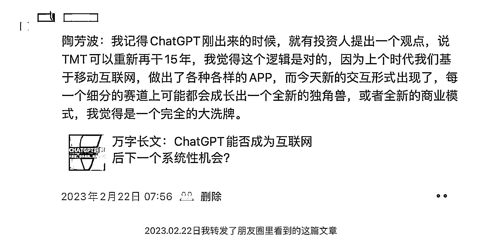

# 入局 AI 八个月小赚 6 位数经历复盘

> 原文：[`www.yuque.com/for_lazy/thfiu8/gtq0qyp2762i696y`](https://www.yuque.com/for_lazy/thfiu8/gtq0qyp2762i696y)

## (36 赞)入局 AI 八个月小赚 6 位数经历复盘

作者： 叫我峰兄

日期：2023-10-25

上周末有空，对自己入局 AI 大半年的经历做了一个复盘，希望也能给生财的圈友们提供一点点有价值的信息。

感谢亦仁大佬提供生财这个平台，今年在生财收获很多，从之前一个职场小白兔，只知道在工作中任劳任怨，到现在知道原来上班还可以做副业，如何选适合自己的副业，从 0-1 的整个 SOP 生财都有完整的介绍，在这里还能找到志同道合的朋友，遇到问题还有大佬请教，这个平台太赞了，真诚的祝福生财越办越好，也祝每个人都能在生财拿到结果。

以下是正文部分：

大家好，我是峰兄，一名程序员，目前在一家世界五百强外企从事 IT 相关工作。这篇文章主要讲述今年 ChatGPT 火爆全网以来，自己在 AI 方面的一些探索、心得，也算是对自己的 AIGC 之旅的一次回顾。

随着 GPT 的爆火出圈，我从今年 2 月份第一次真正的接触 AI，起因是在朋友圈看到一个朋友分享的万字长文，文章的大概意思是：上个时代我们基于移动互联网，做出了各种各样的 APP，而今天新的交互形式出现了，每一个细分的赛道上可能都会成长出一个全新的独角兽，基于 AI 的底层能力，所有的 APP 的交互方式都将改变，所有的 APP 都将重做一遍。这次的 AI 浪潮不同于之前的，由于 chatGPT 底层能力的开放，AI 使用的门槛已经足够的低，每个人都可以通过 AI 来提效、创业、为自身赋能！

**本文的章节主要包括：**

**第一段经历：GPT 镜像站创业**

**第二段经历：提示词学习**

**第三段经历：训练专属私有模型搭建企业知识库**

**第四段经历：加入点金帮，点石成金，专注 GPT 企业培训及企业级 AI 解决方案**

## 第一段经历：GPT 镜像站创业

我个人是程序员出身，这里也要感谢时代，也算抓住了移动互联网尾声的一点点红利。当年做小程序赚了第一桶金，不过这两年小程序趋于饱和，已经完全变成了一片红海市场。移动互联网刚刚结束，没想到 AI 时代这么快就到了。

当时我就想在这样的历史机遇下，做点什么好呢？想来想去，还真让我想到一个点，当时国内直接访问 ChatGPT 是没办法访问的，这个大家应该都懂。既然这样，就做一个国内的镜像站吧，做一个中转代理，降低使用者的门槛，让大家都能方便快捷的使用上这么好的工具。

说干就干，当时找了几个平时玩的不错的朋友，大概说了一下想法，没想到大家都不谋而合，于是我们的 AIGC 镜像小分队就这样成立了。由于大家都有自己的本职工作，只能在晚上和节假日时间参与到镜像站的开发，但好在之前大家都合作过，有一定的默契，另外，大家有一致的目标，因此，项目的进展还算顺利，从规划原型图到开发、测试、上线，用了仅仅一个多周的时间。我们的模式也是简单粗暴，游客可以免费使用 10 次，超过 10 次就要充值会员才能继续使用。当时还想着会不会一日暴富呀，后来才发现想多了，遇到的坑比天上的星星都多，命运的齿轮开始转动。

为了更好的阅读体验，完整文章请阅读飞书链接：

[`l0lupq5bcjq.feishu.cn/docx/FJRLdF3l0oQb00xOe49cpT62nqC`](https://l0lupq5bcjq.feishu.cn/docx/FJRLdF3l0oQb00xOe49cpT62nqC)

* * *

评论区：

模拟宇宙 : 峰兄执行力很🐮请问什么资格可以加入点石帮啊，大厂算法，有数据挖掘和大模型微调应用经验。求链接
乔帮主 : 受峰兄邀请来单独回答下你的留言，方便的话微信私聊链接下，我是点金帮创始人[握手]

* * *