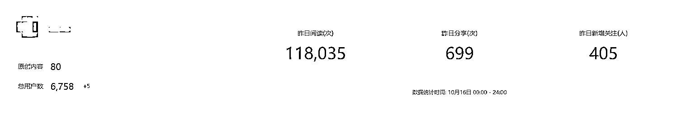
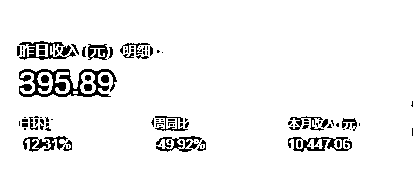
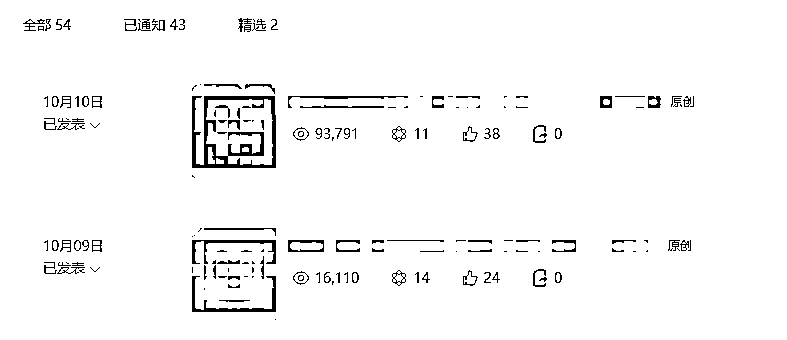

# 公众号爆文项目一个半月以来的一些总结

> 原文：[`www.yuque.com/for_lazy/thfiu8/nyd5rdezzq0t0sri`](https://www.yuque.com/for_lazy/thfiu8/nyd5rdezzq0t0sri)

## (65 赞)公众号爆文项目一个半月以来的一些总结

作者： 羽

日期：2023-10-17

做公众号以来，也有了一些心得和体会，写一篇文章总结一下，也是第一次在生财发文。

**一、相关数据**

截止到发文时刻，粉丝总数 6758，去掉流量主的相关粉丝，一个半月新增粉丝 6000+

十月份流量主收益 1 万+

第一篇文章是 9 月 4 日发布的。

目前阅读量最高的一篇文章，阅读量 143w+，每天还在以一两万的速度增长。

这个账号能起来，也是因为这一篇文章爆了，10 月 5 号之后，连续多篇文章起量上了 10 万+，粉丝数量每天增长几百人。

一切都是源于大爆了一篇，导致整个账号所有文章的阅读量都上了一个台阶。

目前每天新发的阅读量可以上到 1w 以上。

**二、一些心得**

1.日更很重要

从 9 月 5 日开始日更，没有断更过。日更开始一周后小爆了一篇两万多阅读量的，后面就掉池了，直到 10 月 5 日大爆之前，每天阅读量只有几十。好在是坚持了下来，迎来了第一篇十万+，百万+。

2.标题很重要

大爆的这一篇，标题就能引发读者争议，很多读者发来私信，表达了不同意见。后面连续几篇，都是差不多的思路，也都收获了 10w+，一周之后相类似的标题才没有了流量。

3.利用好精选

很多人都会把自己阅读量最高的文章标为精选，我的选择是把一些质量不错，阅读量没起来的文章标为精选，然后定期更换。

下面的 2 篇精选，第一篇刚标为精选的时候，阅读量没有突破 2w；第二篇刚标为精选的时候，阅读量没有突破 5000.

4.群发次数用完了，有内容直接选择发表也是可以的，会有流量的。

以昨天为例，早上群发完了之后，当天又陆续发了 4 篇，最高的一篇也有一千多阅读。

上周五发表的，也有两千多阅读。

5.不标原创也有流量，主要还是看标题能不能吸引人进来看，能不能提供信息增量

在拆解对标账号的时候，发现了一批矩阵号，做了有四五年时间，就是从各大网站摘抄内容，编辑一下，备注出处，每篇也都有几万阅读量，每天发布四五篇内容，流量很可观。

这给了我思路，后面准备新开两个号，以转载和摘抄为主，和现在的这个大号形成联动。

6.勇敢大胆的写，不要怕写错

你认为很简单的常识，至少还有几百万人不知道。

7.完成比完美更重要

* * *

评论区：

天一生水 : 被踢出流量池十几天了，现在阅读量都很低，怎么搞啊[流泪]
悟空悟空空 : 优秀啊！
Pemberry : 什么原因被踢出去的呢
苏公子 : 我和你一样，今天这个账号被取消原创，原因是有一篇文章过审的时候发现抄袭了，直接限流小黑屋了……

* * *