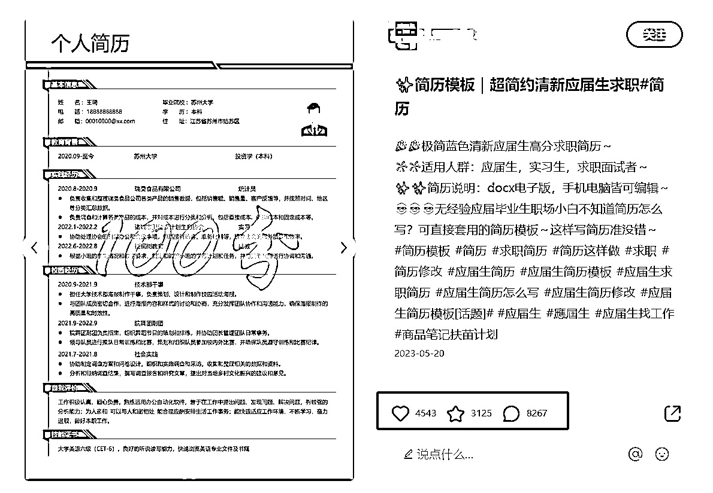
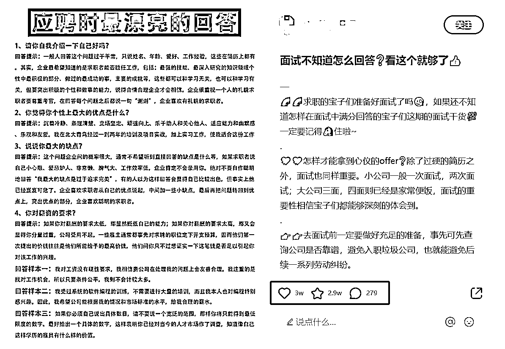
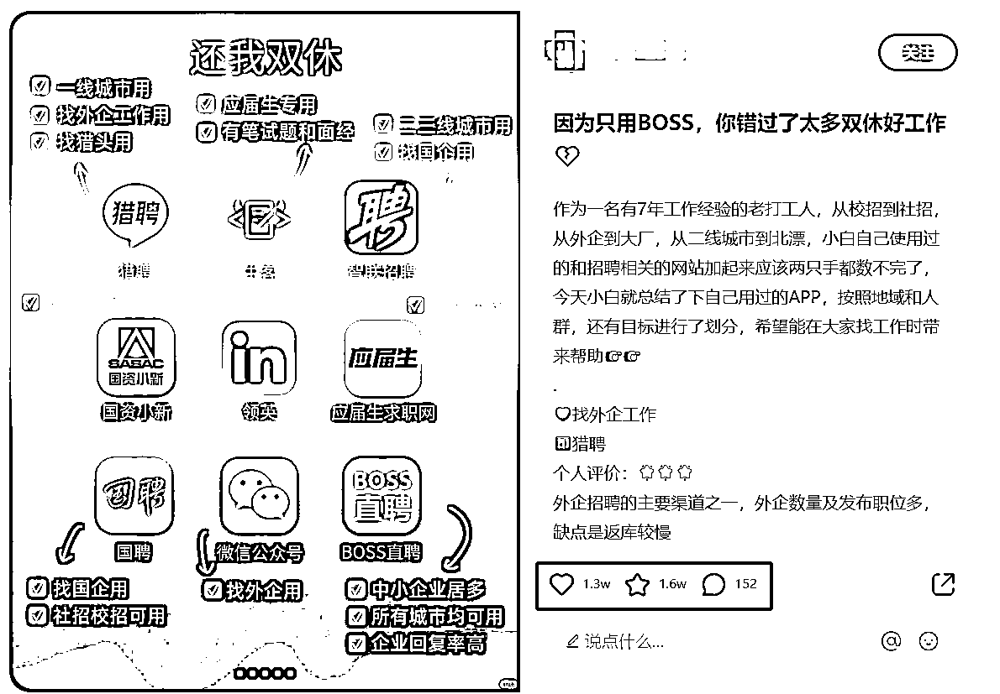
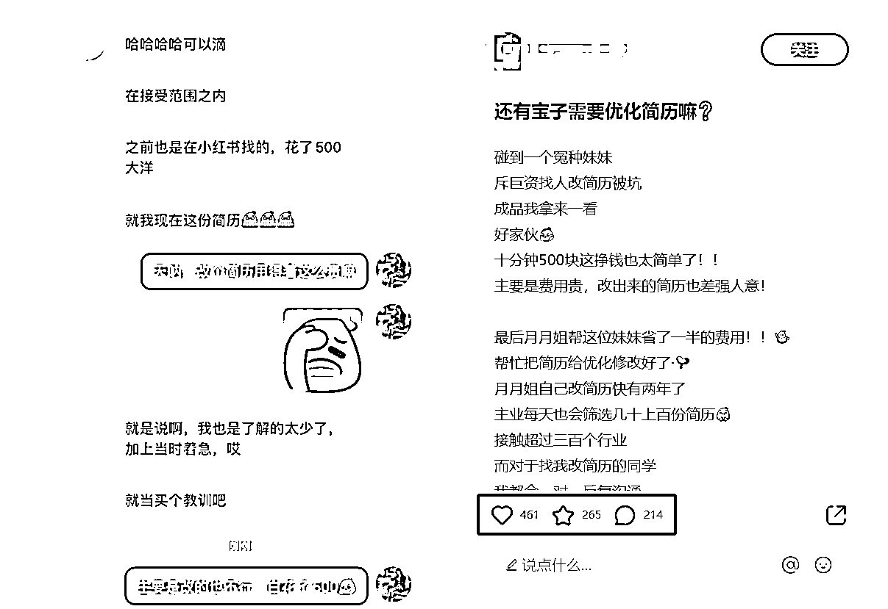
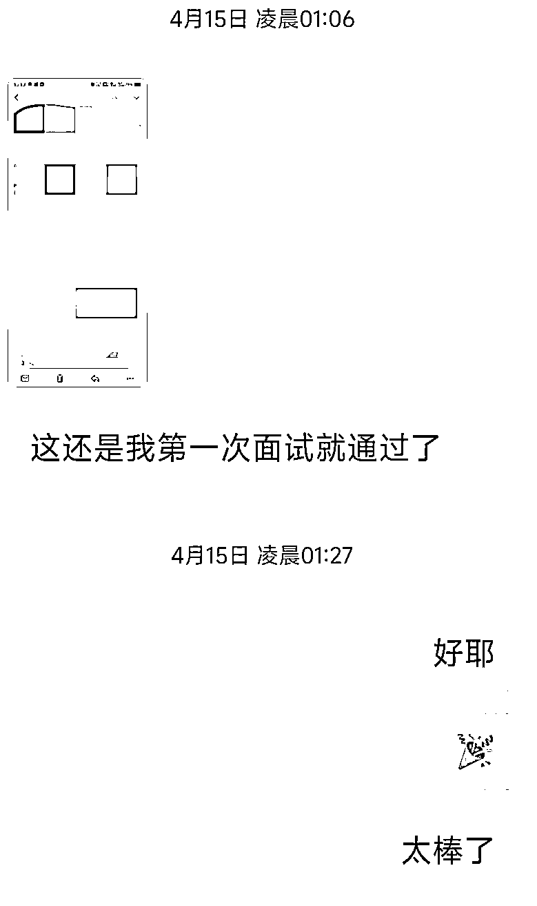

# 简历修改、面试辅导，如何小红书获取精准流量变现？

> 原文：[`www.yuque.com/for_lazy/thfiu8/xe0ca4wfqvnpiagg`](https://www.yuque.com/for_lazy/thfiu8/xe0ca4wfqvnpiagg)

## (33 赞)简历修改、面试辅导，如何小红书获取精准流量变现？

作者： Shawn

日期：2023-10-23

金九银十，新的一波招聘旺季又来啦，这背后有哪些赚钱的机会呢？

对很多求职者来说，找工作除了好时机，就是要具备各种“拿 offer”的技巧：简历排版、美化，面试技巧、话术，都是他们是需求。

而需求的背后就是赚钱的机会。我们可以做简历修改、面试咨询辅导服务，在小红书上发布干货知识，引流私域做交付转化，后续还可以把产品工具化。

我就是通过小红书发干货笔记，0 粉实现开单，800 粉丝时已成功引流交付近 300 人。

今天，就给大家分享我在小红书上，引流大学生做求职辅导的副业项目的整个流程。

### 一、什么是小红书求职辅导项目？

项目原理其实很简单，在小红书发布**求职干货——引流私域——做简历修改/面试辅导服务变现。**

### 二、小红书上发什么？

众所周知，小红书的流量价值是非常高的，精准且用户整体付费意愿也高。

这个项目在小红书上发布的内容主要分为以下几类

**（1）求职干货，建立专业度**

求职干货主要围绕两个方面去写：简历和面试

1.  简历：简历撰写技巧、常见误区、模板合集、案例分析......

2.  面试：面试常见问题分析及回答、突发情况应对、面试准备......

这块选题非常简单，在小红书上找对标账号的内容参考即可。

上图！

通过分析简历细节来展现专业度，简历截图+红字分析非常容易出爆款

直接发布免费简历模板合集，很容易吸引用户

一问一答的形式，干货感极强

**（2）求职信息，增强实用性**

每逢秋招或春招时候，可以通过各个公开渠道搜集大厂的招聘信息做合集分享，对大学生来说吸引力非常强。

当然如果是做某个行业或者专业的，也是同样的思路。

收集整理招聘信息，排版发布合集即可

发布招聘 App/网站/渠道等合集

#### （3）服务过程，增强信任感

在日常交付过程中要及时留存相关素材（截图），主要有：

1.  用户评价：来自用户的真实评价和结果反馈，如收到了面试，面试通过了，拿到 offer 了等等

2.  交付过程：沟通的时间，交流的一些问题等等

3.  转推荐：用户觉得服务好才会推荐朋友来，这是最有说服力的素材！

记得打码

当然，截图发布到朋友圈/小红书等平台时**最好把头像截掉、隐私信息打码或事先取得用户同意。**

上图！

这俩图是我自己的素材

### 三、引流私域

引流私域这块就不用怎么说了，笔记发布后，及时回复私信和评论区，**注意采用多种方式避免违规。**

小红书的优势就在于长尾流量会持续不断且十分精准。有多精准呢？

举个例子，在我发布几篇笔记一个粉丝都没有的时候，就引流成功变现第一单！

**0 粉变现，**就是这么快乐！

上图！

### 四、如何交付及变现？

**（1）简历修改：**

**交付：**

方式多样，一般是使用 Word 版简历模板进行修改（有需要的小伙伴可以联系我）或使用网站进行修改调整，推荐使用*超级简历：[www.wondercv.com](http://www.wondercv.com)*

**变现：**

按照客户需求可以分为不同的服务内容，比如

1.  简历修改指导：针对简历情况进行分析，给出修改意见；

2.  简历代修改：和用户进行详细沟通并交付一份可直接投递的简历；

3.  简历制作：帮助用户从 0 到 1 制作一份可以投递的简历。

4.  收费方式按照从低到高设置梯度即可，**前期可设置在几十左右，用低客单价吸引用户，积累案例和经验。**

5.  后续再不断涨价，客单价在 200￥左右。

**（2）面试辅导**

**交付：**

一般按照以下流程开始面试辅导服务：提前收集信息（岗位描述/个人简历）——要求用户提前准备问题——模拟面试——问题沟通分析——给出辅导记录，也可以按照自己的方式来；

**变现：**

按电话沟通小时收费，平均在 100￥/h。

### 五、问题与卡点

**（1）前期没有交付案例：**先从第一个用户做起，价格可以低些，积累案例素材，再滚雪球式的提价，这个时候要做的就是高频的更新，最好日更；

**（2）注意避免违规：**可以通过小号置顶笔记、表情包、图片等多种方式引流，轮换，避免违规；

**（3）流量一般：**若流量一·直不理想，可以考虑在其他笔记下截流，注意不是直接打广告，而是发专业回答，如*“球球大家帮忙看下我的简历**”*类似这样的笔记下，就非常合适发布评论截流，一天刷个七八个，顺带可以养号；

若遇到同行在自己笔记下截流，及时删除拉黑即可；

**（4）交付问题：**交付前注意讲清楚不同的交付方案，如沟通时长、交付结果、收费标准等等，最好先收取一定比例的定金，避免浪费时间；

**特别注意讲清楚交付后要求再修改的情况，**像我的话一般是交付后 1 个月内可以再次简单修改；

**（5）砍价问题：**会遇到部分大学生喜欢砍价，一般是要求小红书点赞收藏或发个朋友圈代为宣传。

### 六、普通人入局的建议

（1）小红书上最不缺的就是大学生群体用户，最重要的还是建立专业度及信任感，并不是说非要名校海归、互联网大厂出身的人才能做这个项目~~（当然有更好）~~。也并非是人力资源行业的人才能做。

（2）掌握基本的简历排版及撰写技巧，这是非常重要的，对于简历专业术语、行业知识等必须有一定的掌握，有些同学的行业或者专业是完全不了解的，那也不会接，不然就是砸自己口碑。

（3）可以**专注在某个行业/领域进行运作**，最好是自己做过的或者熟悉的行业，这也是一个思路，比如人设是“外贸行业拼搏多年的师姐”。

以上就是我这一年多以来在业余时间操作小红书大学生求职项目的经验分享，希望对各位朋友有所帮助，也欢迎各位小伙伴找我交流，一起进步！

* * *

评论区：

Adela : 人力资源工作，方便加一下微信吗？
Shawn : 可以的👌🏻
热爱 : 好棒
Shawn : 冲冲冲😘
程为自己 : 需要简历以及面试辅导，可以交流一下吗？
Shawn : 可以的[得意]

* * *