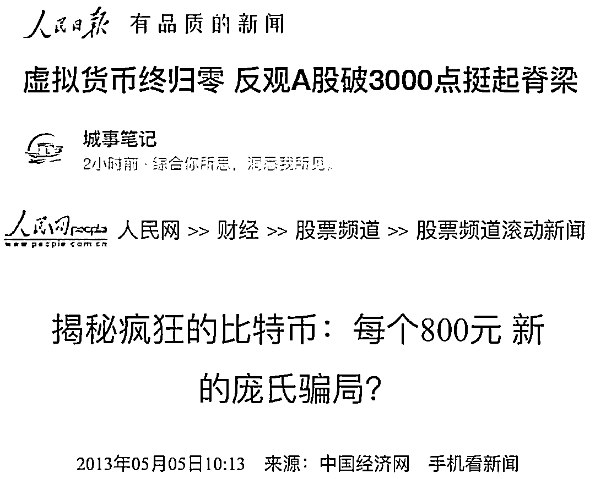

# 平均 30%涨幅背后的定投故事

> 原文：[`www.yuque.com/for_lazy/thfiu8/nthophi5o3ui5a8g`](https://www.yuque.com/for_lazy/thfiu8/nthophi5o3ui5a8g)

## (26 赞)平均 30%涨幅背后的定投故事

作者： Start9527

日期：2023-10-24

这段时间股市有明显的波动，于是各种声音都不绝于耳，甚至汪峰和章子怡的离婚及各自离婚与股市的预期都被各种扒出来，好像真的是那么回事儿似的。吃瓜之余也更加确定了我对于 Web3 赛道的喜好，也更加确定了我要坚持继续做布道的信心。

奉上一张 Web3 圈子特别喜欢的图

大 A 还是那个大 A，但是比特币早已经不是 13 年的那个比特币了。它这一路走来的惊心动魄和艰难险阻，就像是唐僧取经一般，需要历经那九九八十一难，难难致命，难难皆被飞来横祸，而当前它才走到第几关？未来要面对的艰难险阻还有多少弯？当然，即便前路如此，也抵挡不住他劫劫高的态势。

所以，我们以史为鉴的回看比特币的周期（上图所示），就以它的减半周期作为投资它的最佳策略，所以，最近在我的社区开始发起为期 100 周的定投赢，第一周定投时的比特币价格为：26500 左右，时至今日已经浮盈~~15%+~~（发文章时发现已经涨了 30%多了），而我们定投的标的还包括了：ORDI，FLOW，OP 和其他的高风险标的，所以综合浮盈差不多就是~~15%+~~（发文章时已经是 30%+）的样子。那么本期内容就和大家分享一下我们的定投故事。

三个主题分别是：

1，定投的标的及逻辑

2，定投的意义

3，定投标的筛选

**特别提示：Web3 有风险，入场需谨慎，因为有可能会损失你的全部本金。**

**1，定投的标的及逻辑**

Web3 这个赛道的二级投资和股票的交易类似，都是有各种各样的板块，这里做一下基本的罗列。包括：公链板块，链游板块，二层网络板块，DEFI 板块，元宇宙板块，基建板块，平台板块，MEMECOIN 板块，DEFI 板块，RWA 板块等等。

每个板块也都有代表的标的，所以，我们定投大多都是从这些板块中去做选择；我们的定投逻辑如下：

投资金额为 1000 元的倍数（资金实力雄厚就十倍百倍的来，资金少一些的就 0.5 倍，0.2 倍也可以）

预计会分成 5-7 份

其中 1 份占比 40%，为稳健型定投标的，包括：BTC 和 ETH。

BTC。优势：抗跌，独占 Web3 赛道近一半市值的绝对龙头，而且生态在慢慢起来，劣势：涨幅相对而言不会特别惊人；

ETH。优势：生态已经是一个庞然大物，长期的龙二，涨幅预期比 BTC 更高。

40%仓位，主要是因为稳定，即使综合涨幅 2.5 倍也不会让本金有亏损。

其余 60%皆为风险相对高一些的标的（除 BTC 和 ETH 之外的标的皆为土狗，风险相对较高，其中也有长短线差异）包括：

公链：如 FLOW，SOL，APTOS，NEAR，ATOM 等

二层：如 OP，ARB，以及还没有发币的 ZK，STARK 等

链游：如 MAGIC，IMX，AXS 等

元宇宙：如 APE，SAND，MANA 等

基建：LINK，ENS 等

平台币：BNB，OKB 等

MEMECOIN：DOGE，PEPE，SHIB 等

DEFI：AAVE，CRV 等

Lsd：LDO，SSV 等

RWA：COMP 等

等等板块，从其中选择 4-6 个标的进行投资，风险高回报就可能会更高，尤其是牛市来临的时候，惊喜会不断。

其中还有时下有热度的短线标的，可以快进快出的参与。

**2，定投的意义**

经济是有周期的，而这种股票货币类的产品是经济周期性更加直观的表现，整体会呈现为波浪型上升的曲线（详见达里奥关于经济周期的解说，下方为截图），在这个曲线中有一个很重要的位置就是低点，理论上如果我们能在低点买入高点卖出，那大概率就可以获得超额的收益，逻辑很简单，但是低点什么时候来，我们却不得而知，所以作为精明的投资者他们就总结出了微笑曲线的定投策略，正好取得就是低点周围的一个片段（如下图所示）。

微笑曲线 A 点开始建仓，B 点开始出售，区间内定投

即使我们买不到最低点，但是在整个可能是低点的附近长期定投大概率是可以无限接近那个最低点的，从而拉低整体的投资成本，然后等到收益达到一定时间后，再分仓卖出，以此获得高额回报。所以这个就是定投的意义。

而关于定投策略大面上一般是可以分两种，一种是定期定额，另一种就是定期不定额。

定期定额，就是总共投 10000u，每期投 100u，一共投 100 周；

定期不定额，就是根据微笑曲线的前提假设，我们是可以把定投的筹码成本进一步压低的，假设价格曲线是按微笑形式走，那么就在微笑的低点投多一些，微笑的高点投少一些，这样平均成本就更低。但是相信我绝大多数投资人是不想思考的，那么就按照定期定额来就好，虽然赚的不多，也不至于错过。

**3，定投标的筛选**

我们第一期的定投标的是从第一部分的标的中选择了五个，其中包括：

**稳健型标的**

**A，BTC，**40%仓位，核心是 ETH 生态当时示弱（当然写文章期间已经有所回调，但我们继续坚持 BTC 即可），不是最佳定投 ETH 的时机，等 BTC 达到一定数量，等 ETH 生态表现更好的时候，我们可以拿一部分 BTC 去兑换成 ETH，甚至还可以参与期权等高阶玩法来扩大收益，这样操作也可以拿到更多的 ETH，所以 ETH 的定投没着急参与，当然撸空投的玩家，把 ETH 当作 GAS 的另当别论；

**中低风险型标的（可以持续定投的，周期性波段标的）**

**B，FLOW，**基本面极好的，我曾经是 FLOW 中国社区大使所以相对而言比较熟悉它，近期 FLOW 的 CTO 终于开始推进 EVM 的工作，会在类似于 ETH 二层生态上有探索，这个相对而言是极好的利好，虽然盘面表现一般但是绝对可以长期定投；

**C，OP，**属于 ETH 二层网络，它的 TO B 业务非常不错，大客户挺多，这种业务不太缺钱，再者随着昆丁升级和二层网络空投预期临近，它一定会有爆发的机会，而且定投它也是相当于在定投 ETH 的意思；

**D，ORDI，**它算是 BTC 生态的最重要 MEMECOIN，相对而言它的涨势一定会比 BTC 更猛，而且市值不算高，我们会选择继续定投。

以上标的，可以作为中长期定投标的，除非有大问题，我会提前通知换仓或者出售。

**中高风险型标的（快进快出的短期标的）**

**E，BIGTIME，**本次我们是 12 号开始定投最大原因就是它的催化剂效果，在当时冷静的行情中，BIGTIME 无疑是一丝希望之火，尽管开盘已经有接近 20 倍涨幅，我们也是依旧冲进去了，而且拿到 50%左右的收益，仅仅一天时间而已，也让学员感受到了这个赛道的神奇。

**以上标的仓位均为 15%。**

截止现在，ORDI 领涨接近~~25%~~（发文时已经 60%+），BTC 涨幅超过~~15%~~（发文时已经 30%），FLOW 差不多~~10%~~（发文时 20%+）收益，OP 表现不佳仅有~~5%~~（发文时 15%）涨幅，BIGTIME 是短线大多数学员都或多或少拿到了一些收益，当然也有后期冲进去有浮亏的，但是仓位小，其他标的的收益基本可以覆盖它的损失，绝大多数学员第一期定投的综合收益应该都在~~15%~~（发文章时已经 30%+）以上了。

当然，我们定投赢还会不断的解锁新的技能，比如：挂单，比如：看深度，市值等来分析标的，比如：期权等可以扩大定投收益的一些操作。

以上就是我们 Web3Going 社区第一期定投赢的实盘分享，希望可以帮助大家更好的了解 Web3，我是你们的好朋友，生财有术 Web3 航海四期教练 Start，一起参与 Web3 慢慢变有钱，Gogogo！

* * *

评论区：

暂无评论

* * *