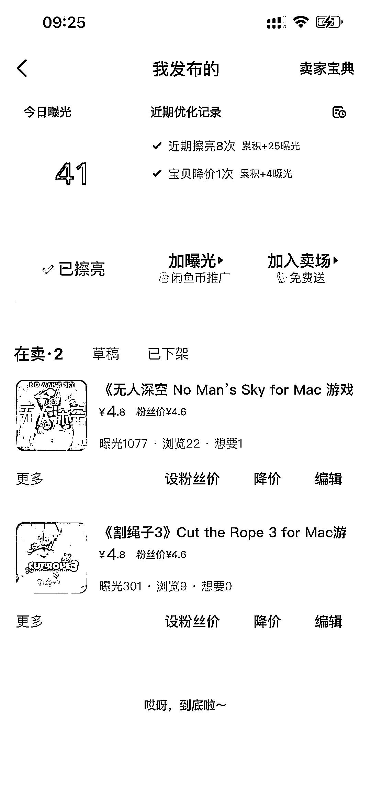

# 闲鱼虚拟产品—从上架到出单，只需要两步

> 原文：[`www.yuque.com/for_lazy/thfiu8/uk20rmsy46pnc93p`](https://www.yuque.com/for_lazy/thfiu8/uk20rmsy46pnc93p)

## (42 赞)闲鱼虚拟产品—从上架到出单，只需要两步

作者： 西昂

日期：2023-10-23

闲鱼虚拟产品—从上架到出单，只需要两步。

大家好，我是西昂。

今天给大家介绍一个比较适合小白操作的小项目——闲鱼虚拟产品。这个经过我们测试后，确定能够开单的，而且见效还挺快~

以前闲鱼是禁止出售虚拟产品的，现在已经没有这个限制了。但是一些比较敏感的产品还是无法出售的，比如 chatgpt 等内容。

只要是在生财呆过一段时间的圈友，应该对虚拟产品都比较了解了。说白了，就是不需要发物流的产品。一般有资料、课程、素材等等，都属于虚拟产品。

今天我们操作的是 Mac 的游戏软件

这个是我测试的新账号，上架两个产品后就成功开单了。

飞书连接：[`u0yrmcie7v.feishu.cn/docx/O6cXdnySjoeJ9yxxnyPcT4benKc?from=from_copylink`](https://u0yrmcie7v.feishu.cn/docx/O6cXdnySjoeJ9yxxnyPcT4benKc?from=from_copylink)

* * *

评论区：

Jeremy yeu* : 现在咸鱼可以卖虚拟？资料？
西昂 : 是的
西昂 : 对了，前期不建议上软件。自己手动发就可以，耽误不了多少时间。

* * *