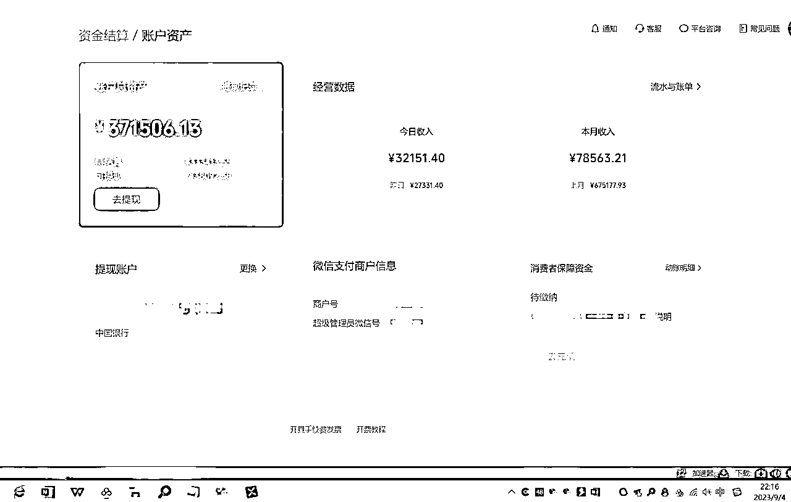
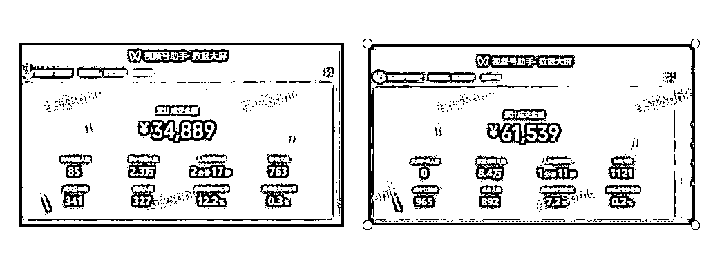
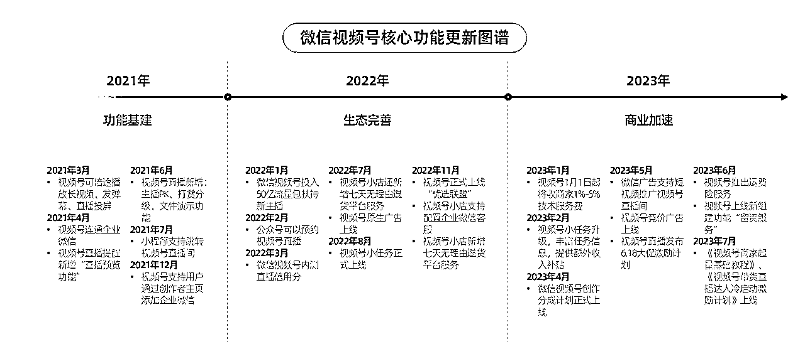
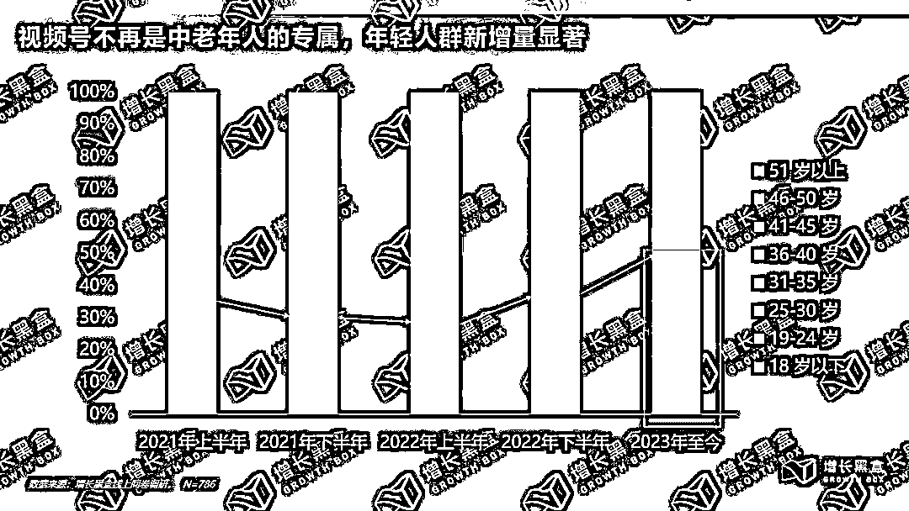
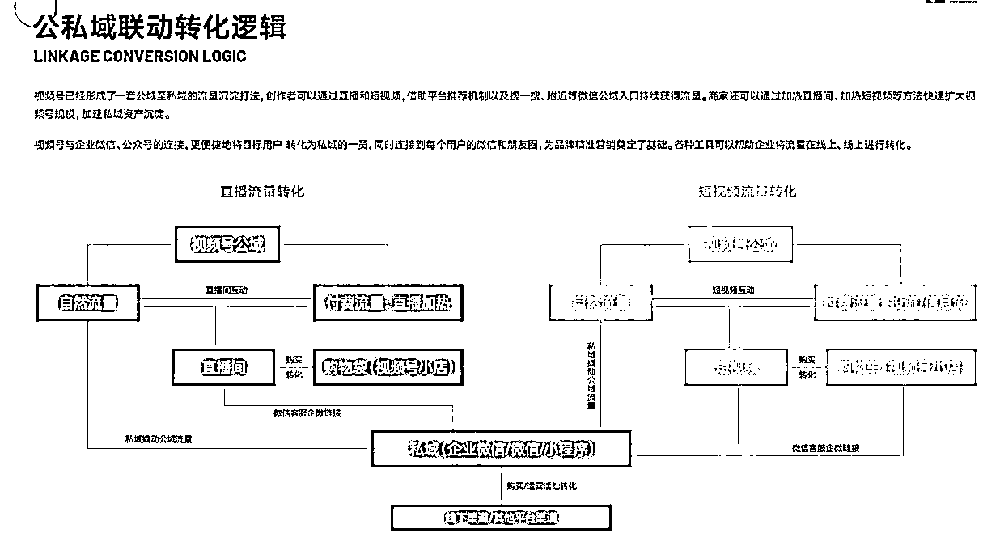
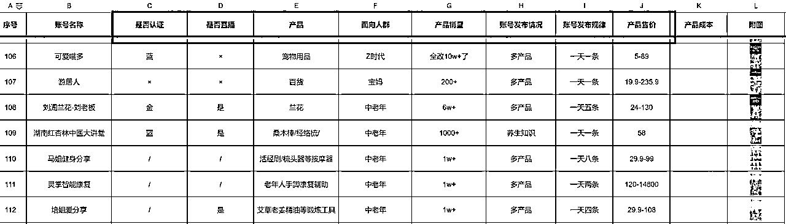

# 视频号带货的运营逻辑与趋势

> 原文：[`www.yuque.com/for_lazy/thfiu8/wc12sfz2n4sgb0t7`](https://www.yuque.com/for_lazy/thfiu8/wc12sfz2n4sgb0t7)

## (76 赞)视频号带货的运营逻辑与趋势

作者： 李诚 Sonic

日期：2023-10-25

大家晚上好，感谢生财，很高兴能和这么多优秀的小伙伴分享视频号相关的内容，看到很多熟悉的小伙伴，咱们航海教练、志愿者和圈友们都是卧虎藏龙，今晚我先开个头，给大家分享一下视频号的一些经验，主题是《视频号带货的运营逻辑与趋势》，分享完会有 10-15 分钟的答疑环节，有问题可以到时候一起交流。

视频号商业化已经 2 年多，迭代了上百次功能，各项功能也不断地完善，尤其今年视频号整体转化效果明显提高。

平台上升期，如何跟着平台的方向打深，打透，获得长＆短期的综合利润，当然发展的同时平台也有一定的不完善，容易引起限流，封号，店铺清退、无法提现等情况，所以今天和大家分享一下微信视频号运营的一些经验和感受。

【自我介绍】食材供应链及电商团队；航海家圈友/视频号带货航海教练
【坐标】广州天河

视频号相对于抖音快手有一定的信息差和红利期，生财开始带着全网卷视频号赛道也一年多时间了，目前的红利一样有，只是对于内容的要求更高和更快，目前是百花齐放，没有抖音快手那么卷，还有很大的成长空间。

晒几张图，部分视频号和店铺的数据图，主要是想提醒大家，流量红利，依然是低成本入局的好时机。

首先来分享一下我对视频号生态的理解

今年微信视频号的更新节奏加快，商业化相关功能成为重点，同时生态治理也在不断加强。

今年 1-8 月，视频号官方更新了 60 个功能和指引文档，去年全年才 49 个，从这一点看腾讯很重视视频号整体的发展。在腾讯 2023Q2 的财报中，又一次提到了视频号的亮眼成绩：广告收入突破 30 亿，直播带货的 GMV 同比增长 150%。

微信视频号在活动策划、运营扶持方面动作也有所增多，之前公众号时代主打一个“无欲无求”，从 C 端到 B 端，生态运营变得更加变得更加主动积极。今年视频号生态治理类动作也在不断增多，整体的生态环境更良好。

微信视频号无论是从基础设施还是线上运营，投入力度在持续加大。微信视频号不断释放积极信号，成为不可忽视的蓝海赛道。

视频号创作者权益从低到高给与不同的流量和服务功能扶持，如果你在某个行业有垂直的内容分享，认证后的流量会相对较好，偶尔不小心违规的抗封也比较好。

视频号作为一个不到两年的电商平台，2022 年视频号带货的 gmv 已经超过 1300 亿，消费者规模超 7000 万，入驻商家数量更是接近 100 万。发展趋势其实我是非常看好的。

注：这个数据非常保守，去年视频号小店 12 月才上线，12 月之前微信小商店，有赞，爱逛，等十几个平台都可以挂载在视频号里，尤其很多自营小程序，所以实际上成交率数据会高很多。

换个角度看，和抖音快手比数据感觉差异挺大，但是咱们别好高骛远，大海里鱼多也更加凶险，湖泊里竞争少风险系数也低。

做过电商相关的会有些了解，抖音的客单价 30-60 为主，快手 30-50，视频号的客单价很多 200+，且复购率更高，退货率少，退货率对比抖音我是深有感触，低很多。

22 年开始，30 岁以下的人群在新增购物者中占比越来越高，如果再看 45 岁以上的“中老年”，其流入占比一直保持稳定，作为中坚力量没有太大变化，现在视频号正在向“老幼通吃”的轨道前进。

首先，他们不再只关注产品的价格，更注重产品的质量、品牌和服务。此外，他们也更愿意为提升生活质量和享受生活付费。

其次，是这个年龄段消费能力的提升，这个年龄段的人群大多已经建立了稳定的家庭和事业，他们的收入水平相对较高，消费能力也更强。他们在购买商品和服务时，不仅考虑价格，还注重性价比和品质。

第三，这个人群消费需求非常多元化，包括教育培训、旅游度假、健康养生、家居装饰等各个方面。他们对新鲜事物接受度高，愿意尝试并投资于各种新的产品和服务。

1.流量红利，没有抖音标签准和稳，但起号起流量还是相对容易。
2.利润红利，抖音大部分行业比较卷，视频号普遍价格比抖音高 1-3 倍。
3.人群红利，二三四线城市和中老年触网少，信任度高，退换货较少。
4.投放红利，视频号投放官方放量，转化较高，关键点在于素材过审，投放测品和售后率。
5.最重要的一点，私域。视频号非常非常非常容易引私域，私域为王，一定要把私域重视起来，其他平台大部分都是一次性生意，如果你能把私域做起来，那么你的利润是 5 倍 10 倍的指数型增长。

近期我们视频号带货矩阵、后端店群，也逐步延伸做了一些引流私域的动作测试，引流给本地 or 相关项目导流，效果非常的不错，建议大家多刷同行账号，多测试玩法，存在即合理。

视频号人群三类部分的组合：
以直播销售农产品为例，抖音直播间装饰的更豪华，这样才能抖音获得停留和推流，上面说到的这类用户大概率有看到过相关直播间，但会认为产品价格高不是因为产品本身好，而是被用于营销设计了。

而在视频号中，主播们蓬头垢面，直接在田间地头直播，向观众展示真实的农村生活和优质农产品，这些用户反而更加相信产品质量，更容易促成下单。

这类人群偶尔会在别的平台买过东西，但是有更多的亲友给他推荐视频号上的内容和产品，人群性质相对匹配。

然后他们浏览引起兴趣后，发现可以直接购买，尤其现在上线了先用后付，看着直播确实便宜就下单了。他们对比的是超市便利店线下渠道，价格上视频号有天生的降维打击。

我们之前发现有一些订单收货地址都是体制内的地址，确实挺有趣，他们对于软件和产品的选择可能更谨慎，手机没装其他软件或者不敢乱用，视频号在微信里面，有天然的进入优势。再加上视频号推荐都是亲友逻辑，是他们爱看的，早安中国，大美河山，按这三个穴位睡觉不打呼等等内容，他们天生对视频号有好感。

接下来进入实际玩法的分享，视频号的变现渠道，航海手册里面分享的非常详细，我再贴个简单的图片，除了带货视频号更有价值的是私域的沉淀。

有些圈友利用视频号做中高端客单价的产品，反而效果比带货利润更高。

品对人，男人要成功，女人要美丽，老人要健康，孩子要聪明。亘古不变的四大需求点。

建议大家每天一定要有 1 小时的选品（刷视频），把你的账号设置为你的目标客户，比如是中老年人的产品，那么就设置为 50 岁，去点赞一些 50 岁人会看的视频，然后持续的刷，看系统推荐什么内容给你，觉得不错的就记录下来，我是要求团队小伙伴每天浏览记录 10 个以上的账号做分析。

不要单纯在一个平台刷，视频号、抖音、快手、小红书、多多视频都可以去刷，因为每个平台有自己的推荐算法和标签算法，人群用户也有差异，多参考比较好

大家可以看下我上面发的选品表，已经 1000 多个账号，其实已经筛选起码 2000 个以上的账号了，因为很多账号是重复的或者一个团队的，当你觉得这个产品不错，就去留意他发了多少视频，发布频率是怎么样，是不是认证账号，是否开播等因素再去参考是否拿一两个账号去测试。

另外之前的航海资料有几个圈友分享的选品思路都可以作为参考，比如晓文、唐僧肉的直播课建议大家有空查看。

这里给大家一些直达链接：
《视频号视频带货选品思路分享@一盘唐僧肉》：
《视频号视频带货选品思路分享@郭晓文》：

另外建议大家善用数据工具：

这三个工具基本上覆盖了全网的指数，可以查看产品每天的活跃度、搜索量等数据，值得同步参考和借鉴。

很多小伙伴会问有没有视频号的数据工具。
有，但是不推荐，因为腾讯不允许抓取数据

新视，友望，百准，蝉妈妈，包括最近兔展也在尝试做数据工具，我们都买过体验对比过，但无论价格高低，数据都有误差，其次是和他们很多高层沟通过，都收到过南山必胜客腾讯的律师函。

所以自己按自己的类目去搜集和整理数据，反过来看这也是我们做视频号的一个壁垒。

抖音目前为什么那么卷，就是因为有数据工具可以像素画拆解和模仿。视频号目前没有比较好的工具，未来一段时间也不会有，这给我们目前在做视频号的有一些天然的屏障和时间壁垒。

关于视频快速剪辑教程，我也有次专门直播分享也有专门讲解这一块的内容
《0810 如何快速制作带货视频@李诚 Sonic》：

关于视频的发布时间可以参考下图

参加航海的圈友一定是对视频号很大期望，我先泼一盆冷水，每次航海都有一部分小伙伴没有拿到结果，有些会找我私聊分析各种原因和利弊，但每次航海视频号的出单结果一定有不少黑马，数据都非常耀眼，绝大多是之前都没做过视频号，差异在哪里？

在于判断自己要做的事情和投入的精力究竟有多少
第一，报了几个航海，每个都有多少时间和精力去实操，看了≠会了，会了≠有结果，
第二，是否有基础功加持，什么叫基础功，我认为是学习能力+已有技能经验，视频号带货的基本功我认为是选品，视频剪辑，直播，无论你做什么平台的带货，选品定赛道是很重要的，具体拆分不同的平台有具体的玩法。

第三，是视频剪辑和直播
（1）如果你擅长直播，你可以不做视频，直接开播带货；

（2）如果你不擅长开播，是否有视频剪辑或者仿拍、拍摄的基础，那么可以不考虑直播优先投入精力做视频内容，无论是实拍还是混剪，数据好都是大哥，视频爆了怼脸直播就可以出单，不用担心自己没有专业直播间，说话磕巴不好意思等因素，可以去直播广场看看大部分直播间非常“接地气”，当然如果跑顺了，把直播外包出去找圈友合作代播，共赢。

（3）如果你有货源，先确定这个是否自己正在做的货源，不是家里亲戚或者其他哥们的货源，再到选品中心看下同行卖什么价格，给什么佣金，最好买几个样品回来感受一下，知己知彼之后再来考虑要不要在视频号开店或者做达播模式。

（4）如果你手里有团队或者人员，建议自己带着小伙伴来实操，而不是看个大概觉得差不多了就照猫画虎安排小伙伴甚至招个人去帮你实操，大概率没好结果，不要高估自己或者伙伴们的执行力，躬身入局再复制和放大。

先发一个航海图，确定我们这次航行的目的是什么

通过航海手册、群内分享、自己实操，确定航海对于自己的难度后，判断自己是冲基础目标还是进阶目标，有目标才有计划，才能去落地。

（1）没接触过电商和带货的，建议先完成 0-1 的基础目标，跑通小闭环。在小闭环中学习实操对视频号、剪辑、直播有个认知，掌握视频号的基础运营。

（2）做过电商带货或者直播的圈友，建议冲进阶目标，因为本身可能会选品，剪辑，拍摄，直播，矩阵号，开店的某一个环节，只是没做过视频号，通过咱们航海手册和群内交流，可以快速入局和避坑，大大缩小了自己的起航准备摸坑时间，效率就提高很多。

以上就是关于视频号玩法和进度分享，希望对大家有一些帮助，多看航海手册，多刷航海群。

看了下群里的信息，有些是视频号的新人，有些已经是视频号有一定结果的圈友了，很多熟悉的面孔，有幸比大家早一些入局视频号，可以在这与大家分享，各位也是我的老师，我们一起航海，多实操，多爆单，欢迎大家链接！

* * *

评论区：

方瀚 : 诚哥 YYDS
琴歌剑舞 : 先赞后看
李诚 Sonic : 一起爆单
李诚 Sonic : [抱拳]

* * *