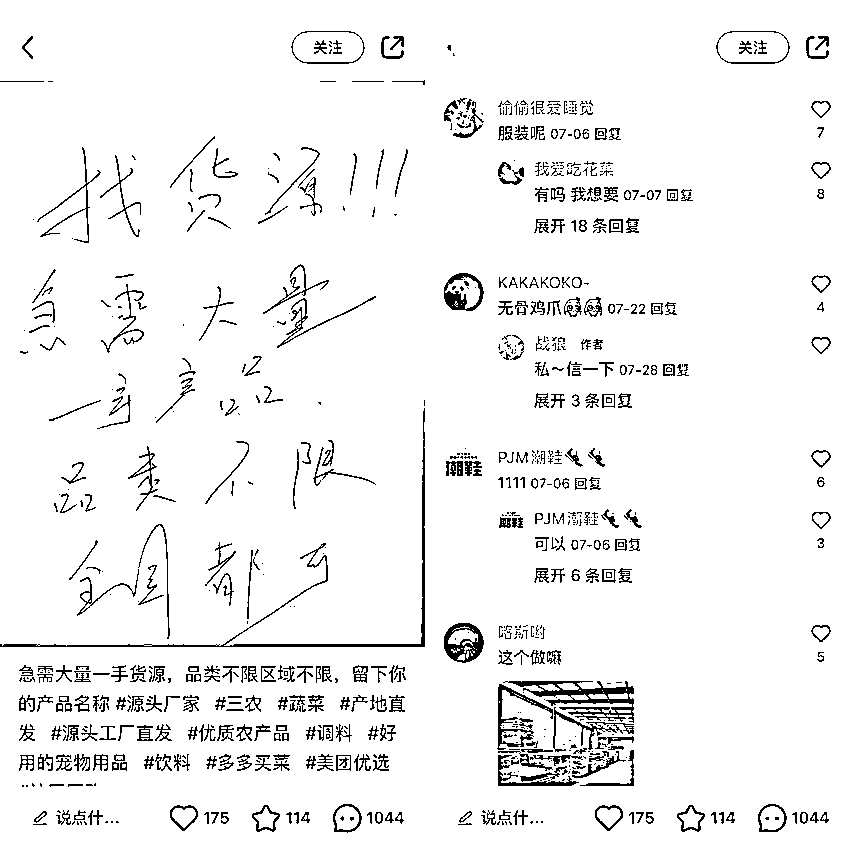
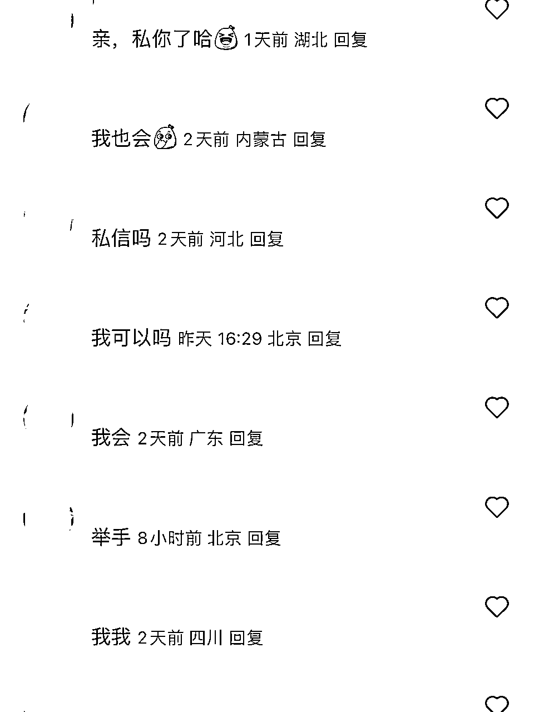
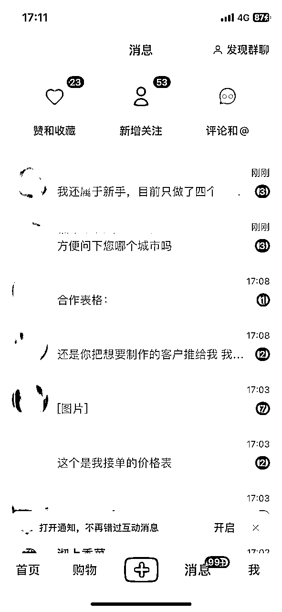

# 如何利用小红书笔记找一手货源

> 来源：[https://nivut760ftk.feishu.cn/docx/A1OsdlcbmoEuGoxOx3fceigwnif](https://nivut760ftk.feishu.cn/docx/A1OsdlcbmoEuGoxOx3fceigwnif)

怎么获得一手资源？这是很多人都头疼的问题

就拿我身边的朋友举例，朋友他很看好一款产品，去市场调研发现竞争力很小，未来发展空间机会很大，于是去找了各种渠道，发现都没有拼多多的拿货便宜

但头疼的是，拼多多品控是出了名的差，还摆着一副你爱来不来的态度，让他非常的难受，一时半会陷入了困境！

你想想，你有没有遇到过他这样的情况，到最后不得不因为产品质量的问题，把项目给搞黄了！

我就是有这样的经历和体会，才知道他们的那种“痛”，所以我打算用文字来分享自己如何轻松高效的找到货源经验的

在这里，我更多想传达的是一种思路，而不是具体的教程，思路可以灵活变化，可以举一反三，可以应用到你自己的项目身上，但教程就不一定了

# 传统的找货方法

就拿我之前找货的来举例吧，之前我都是怎么找的呢？

当我很看重一个产品的市场发展后，我第一时间就先去1688、拼多多上找产品货源，看看哪个产品价格更低，质量更好的，然后再跟商家进行沟通，看看初期能得到什么进货价

但在跟商家沟通的过程中，因为他知道你的量不大，所以就常摆着一副你爱来不来的态度，非常的傲慢高冷

而且初期的拿货价，不一定是最低的，要想拿货低，只能走平台。这样在很大程度上，限制了产品的发展空间

在找商家的过程中，因为是我主动去找的，效率非常的低，一天下来可能找到合适的都没几家，非常的消耗人的精力和时间

于是我在想，有什么办法可以轻松又高效的找到货源呢，而且还不用看商家的脸色呢

# 新式的找货方法

有一天我在逛小红书的时候，无意刷到了这条笔记

初看是没什么新奇的，当时就滑走了

滑走后马上想到，咦？我能不能借用他的这个方法来找货源呢？

联想到了当时心情是比较兴奋的，灵感说来就来！行动说干就干

我就马上找来一张A4纸，写上自己对产品的需求，标题和文案也是照抄他们的，当时在想，打算先测试看看这个方法能不能行得通！

要是能成，就可直接的省掉我大部分的时间和精力

带着好奇又兴奋的心情发完了这条笔记，没过几分钟，就很快有人来到评论区留言了

很开心，开心的是因为这个方法将可能直接取代我之前低效率的找货方法

为了好好利用这些主动来的商家流量，当有人来评论后，我马上就引导他们主动的来私信找我沟通

很快，我的私信页面就被他们给攻占霸屏了，当时的页面是这样的

夸张吧！我也觉得有点夸张！

而且这还只是个新号而已！注册到引流都不到1小时，就吸引了那么多的商家主动找我，很开心的

但商家资源一下子太多了，我都不知道该如何去选择了

于是我就冷静了下，思考我需要产品的哪些需求细节，写了下来后，我就通过这些需求的标准，从上百位商家中，挑选那些不达标的，不合适的我都默认是被淘汰的，直接不回复他们了

然后剩下的这些，都是能符合我要求的商家了，然后我再设立一关，就是价格

看看谁给的价格越有优势，我就选择跟谁，谁的价格高，我就直接淘汰掉

就这样，大多数的商家都被这关给淘汰了，剩下的基本上都是合格的，但还有一点，看他们能不能接受初期量少的情况

要是不能接受的，又淘汰掉一波商家，真正能通关到这里的，已经是不剩几家了

所以这时我才会跟他们加微信聊更多的合作细节

我就是靠这个方法去吸引大量想要出货的商家，然后再通过我的需求去层层筛选和淘汰，到最后才是最接近我想要的理想合作商家

这就是我整个的找货过程

要是你还不太明白，可以到小红书上搜：“急需一手”、“一手货源”的帖子，看看他们都是怎么找商家老板的，然后去复刻他的文案模板过来，放在你这个项目上就行了，就这么的简单

# 有货源后怎么玩

当你有了这些一手的货源后可以怎么玩呢？

我这有两种玩法，你做个参考

## 无货源

说到无货源，现在还想在小红书上玩无货源店铺的，基本上是不太可能的了，因为平台打压的力度实在是太大了，只要你的货是从拼多多或1688上拿来的，或者经过第三方电商平台的，99%会被封店

为什么？

因为平台能检测到你的物流单号是经过了第三方平台的，但凡有这种情况，一律都被打压得喘不过气来

但你拿到最新的一手货源后，情况就不一样了，你可以大胆的在小红书上开店卖货

为什么？

因为你找来的商家，都是通过微信联系的，当你出单要发货时，商家给你的单号，是不会经过其他电商平台的，然后你用商家给你的一手物流单号填在小红书店铺上，就完成了交易环节

所以你就可以很放心的在小红书上做无货源，平台他也查不到你到底是不是无货源

这也是一个非常好的优势所在，这是拼多多和1688所没有的

## 私域

如果你不想在小红书上开店也没关系，你可以借用他们的资源优势，在小红书上卖货引流，把全部的流量都导进你的微信上

当有客户下单后，你就直接让商家那边发货就行了，跟商家月结，这样也是最省事省力的

不用开店交押金，不用看审核机制，不用垫货款，不用囤货发货，你只需要引流就行，单靠这个赚差价，已经比很多的上班族强了

在这里，我可以悄悄的告诉你，接下来会有个产品快迎来短期的流量小爆款，基本上一做就小爆

因为到时候我也会去提前布局，在这我只能给你个小提示：水果

飞哥只能帮到这，剩下的靠自己去领悟和摸索吧

要是能抓住这个品的源头，按照我这个方法去实操的话，一个月赚个几千上万的零花钱，那是很轻松

好了，今天的分享就到这里了，要是你们有哪些不清楚的地方，再来后台跟我沟通

我叫艾小飞，擅长用案例讲流量的男人，我们下期再见！

原创：艾小飞

转载可私信

禁止搬运和抄袭

微信：aifei9977 （记得备注来意）