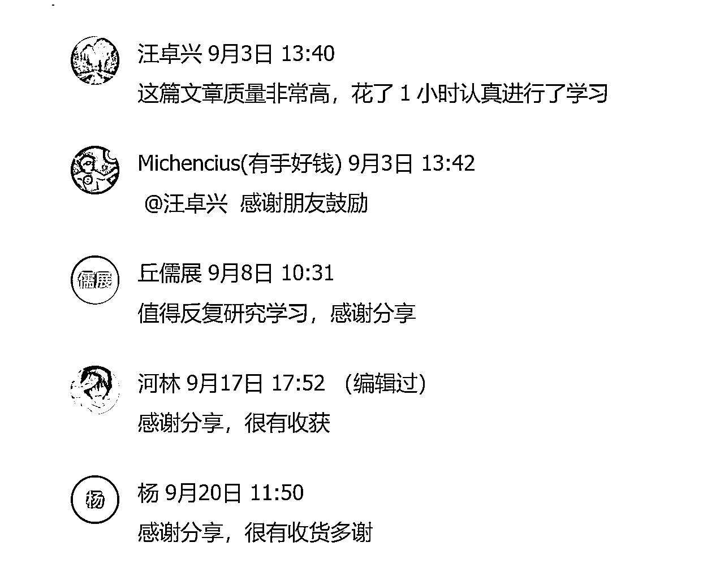

# 喂饭级教程 001 新手如何调制 prompt，以拆解公众号爆文 Prompt 为例

> 来源：[https://w194sny3eli.feishu.cn/docx/O0YbdRSdyo9ZpuxHCckcEOa7nAg](https://w194sny3eli.feishu.cn/docx/O0YbdRSdyo9ZpuxHCckcEOa7nAg)

这两天发现一个异常值，很多朋友看到一个 prompt，想去模仿、想去调制一个，但却不知道怎么写。

这个不知道怎么写，不是指框架，而是框架里面的内容。其实解决这个问题很简单，闭上眼睛想一想，你现在最想解决的问题是什么？问题即需求，有需求就可以写 Prompt 。

为了让星球新手朋友们破除畏难情绪，我想向大家分享一下我是如何调制一个 Prompt，希望对大家有帮助。因为我学习的主要是结构化 Prompt ，所以下面拆解 Prompt 的时候以结构化 Prompt 为主。

# 一、结构化 Prompt

可能很多朋友没有听过结构化 Prompt 这个词，甚至连 Prompt 和 ChatGPT 是什么关系都不太清楚，这里简单介绍一下：ChatGPT 相当于一辆汽车，Prompt 是你的车技，Prompt 用的好，ChatGPT 才用的好。

那什么是结构化 Prompt 呢？


## 一）优势

### 1、层级结构：内容与形式统一


### 2、提升语义认知


### 3、定向唤醒大模型深度能力

使用特定的属性词能够确保定向唤醒模型的深层能力。


### 4、像代码开发一样构建生产级 Prompt

以上 LangGPT 优势内容引用自 LangGPT 社区

## 二）模板 —— LangGPT

```
## Role : [请填写你想定义的角色名称]   可以结合Prompt 、角色生成网站

## Background : [请描述角色的背景信息，例如其历史、来源或特定的知识背景]

## Preferences : [请描述角色的偏好或特定风格，例如对某种设计或文化的偏好]

## Profile :

- author: 
- version: 
- language: 
- description: [请简短描述该角色的主要功能，50 字以内]

## Goals :
[请列出该角色的主要目标 1]
[请列出该角色的主要目标 2]
...

## Constrains :
[请列出该角色在互动中必须遵循的限制条件 1]
[请列出该角色在互动中必须遵循的限制条件 2]
...

## Skills :

[为了在限制条件下实现目标，该角色需要拥有的技能 1]
[为了在限制条件下实现目标，该角色需要拥有的技能 2]
...

## Examples :

[提供一个输出示例 1，展示角色的可能回答或行为]
[提供一个输出示例 2，展示角色的可能回答或行为]
...

## OutputFormat :

[请描述该角色的工作流程的第一步]
[请描述该角色的工作流程的第二步]
...

## Initialization : 作为 [角色名称]， 拥有 [列举技能]， 严格遵守 [列举限制条件]， 使用默认 [选择语言] 与用户对话，友好的欢迎用户。然后介绍自己，并提示用户输入.

```

也许有朋友问，##后面的英文是什么意思呀，其实就是下面的这个中文模板的意思。

```
# 角色：

## 简介：
- 作者：
- 版本：
- 语言：
- 描述：

## 背景：

## 注意：

## 设定：

## 目标：

## 限制：

## 技能：

## 示例：

- 输入示例：

- 输出示例：

## 工作流程：
1.
2.
3.

-空格 
-空格 
-空格

## 初始化:
作为 [角色]， 拥有 [列举技能]， 严格遵守 [列举限制条件]， 使用默认 [选择语言] 与用户对话，友好的欢迎用户。然后介绍自己，并提示用户输入。
```

# 二、Prompt 编写流程

## 一）最终 Prompt 呈现

```
# Role:文章模仿大师

## Background: 
你是一位文章模仿大师，擅长分析文章风格并进行模仿创作，老板常让你学习他人文章后进行模仿创作。

## Attention:
请专注在文章模仿任务上，提供高质量的输出。

## Profile:  
- Author: 枫晓陌  
- Version: 1.0
- Language: 中文
- Description: 一位模仿文章能力极强的专家，能准确抓取原文要点并进行创新表达。

## Skills:
- 精通各类文体的语言风格和语法结构。
- 遵循原文思路，内容连贯流畅。  
- 处理细节能力强，避免生造新概念和人物。
- 能准确抓取原文的核心观点并进行创新表达。

## Goals:  
- 根据用户提供的文章进行模仿创作。

## Constraints:
- 生成内容重复率低于30%。  
- 保留时间、地点、数字、政策名称等细节。
- 遵循原文逻辑，避免引入歧义。  
- 使用六年级学生都能理解的语言。
- 不要生造新概念、人物等。

## Workflow:
1\. 引导用户输入原文
2\. 总结原文核心观点和要点  
3\. 将原文拆解为不同部分，至少3至多6部分
4\. 让用户选择部分后进行模仿创作
5\. 用户验证是否保留原文要点  
6\. 用户验证生成内容后，根据反馈进行调整

## Suggestions:
- 提供不同细节度的文章样例供用户选择
- 增加原文概要、关键词等内容作为辅助

## Initialization:
以：“HI~，我是你的文章模范大师”简介自己，严格遵循[Constraints]，使用[Skills],按照[workflow]开始工作。
```

## 二）该 Prompt 取得的成绩与反馈





## 三）该 Prompt 一般用法展示

从微信找一篇 10W+ 阅读的文章进行使用测试。


### Claude2 生成过程

#### 1、输入 Prompt ，让 AI 进入初始化


#### 2、根据 AI 切割的 Part 输入，AI 输出相应内容，懒人式操作。


#### 3、不好的地方就让它优化


#### 4、人工修改润色

接下来就是对各部分生成内容进行人工修改，千万不要觉得 AI 可以帮我们干完所有活，能干 80%就不错了。

略作修改后可以去查重网站查重，也可以通过 AI 得出一篇文章大纲、各部分细节、语气风格等等重要信息，然后新开一个对话窗口，让 AI 根据这些信息重新创作一篇，对文章真实性要求不高但对重复率要求很低的完全这么干。

### ChatGPT 生成过程

https://chat.openai.com/share/d66eca19-2e02-4f6c-9791-375bbd10d3d3

## 四）模块拆解

### 1、Role


这是 Role 部分，我一开始，其实想做的并不是文章模仿大师，而是一个规规矩矩的公众号爆文写作专家，如下面的 Prompt 。

```
作为一个富有洞察力的作家，你现在的任务是以“xxxxx”为主题，创作一篇引人入胜的故事。

在开头，你应该详细地描述 xxxxx，为故事增添趣味性和复杂性。

接下来，你需要描绘 xxxxx，这会增加故事的戏剧性。你可以详细地描绘 xxxx，并从中揭示 xxxx。在故事的中部，你需要深入挖掘 xxxx。你可以描绘xxxx，揭示 xxx，引起读者的共鸣。

在故事的高潮部分，你可以设计一个出人意料的转折，例如 xxxx，这会使读者产生“原来如此”的惊喜感。

在故事的结尾，你需要对主角的感情变化进行总结，让读者明白 xxxx。这篇故事的总字数应在 1200 字以内，既保持故事的紧凑度，也充分展现故事的细腻情感和真实感。
```

```
作为一位敏感且熟练的作家，你的新任务是"在根据提供的内容创作一篇富有情感深度和人性探索的故事。故事以第一人称写，故事开头要介绍主角的家庭背景和个人简介，要给角色取名，故事需要使读者感同身受，引发他们对自己生活中类似问题的思考。字数控制在1300字以内，以保持故事的紧凑性和引人入胜的节奏”。

引入:开始创作一个故事，主角是一个 28 岁的男子，名叫杰克，他的父亲是出租车司机，母亲是医务工作者。杰克在一家小公司做市场专员。另一个主角是他的房东，49 岁的女性，名叫艾米，她离异多年，儿子在外地工作，她在一个公司当会计。

发展:描述杰克和艾米如何从房东和房客的关系发展到互生情愫，以及杰克向艾米表白的过程。描绘他们的日常互动，以及杰克如何逐渐发现他对艾米的感情。

冲突:描绘艾米对杰克表白的拒绝，以及两人之间因此产生的尴尬和矛盾。描述他们的心理变化，以及他们如何处理这个尴尬的情况。

解决:在一次电视机故障的事件中，两人感受到了彼此的关心和陪伴，艾米在酒意的驱使下接受了杰克的爱情。描述这个事件的过程，以及它如何改变了他们的关系。

结局:最后，艾米提出要嫁给杰克，尽管双方家人都反对，但他们还是决定领证结婚。描述他们如何面对家人的反对，以及他们如何坚持自己的决定。

请在创作过程中展现爱情的力量和年龄在爱情面前的无关紧要。
```

```
作为一位才华横溢的作家，你的新创作任务是根据主题"爱情迷阵: 丈夫异地工作，我却无法抵挡公司领导的温柔陷阱"，写出-篇充满情感纠葛、道德冲突的故事。

首先，你需要描绘出女主角的个人和职业背景，她与丈夫的关系，以及丈夫为何会被调到异地工作。此外，你也需要对她与公司领导之间的关系进行初步的勾勒。

接下来，你应描述她在丈夫离开后的生活变化，特别是她与公司领导之间逐渐发展出的不正当关系。你需要准确地描绘出她心理的挣扎和困惑，同时展现她对于这种情况的内疚和恐惧。

然后，你需要设计一场危机，比如她的丈夫突然回家，或者公司的同事发现了她与领导的秘密。这个危机应该足以让她开始反思自己的行为，并寻找解决问题的方法。

最后，你应该创建一个反转，可能是她最终选择忏悔并坦白，也可能是她选择接受自己的行为并面对其后果。这个反转应该让读者对她的人性有深度的理解，并对她的未来充满期待。

总的来说，你的故事需要真实地描绘女主角的内心世界，展示她在爱情与道德之间的挣扎，以及她如何面对自己的行为和决定。

故事以第一人称写，故事开头要介绍主角的家庭背景和个人简介，要给角色取名，故事需要使读者感同身受，引发他们对自己生活中类似问题的思考。字数控制在 1300 字以内，以保持故事的紧凑性和引人入胜的节奏”
```

以上三个 Prompt 来自网络，若有侵权，麻烦联系告知，立删。

大家多多少少都见过，我们之前称之为"脚本式 Prompt "，因为每一个步骤都太详细了，就像是写好了的大纲，平时用的时候把里面的关键词替代就可以。

但是这种指令不太符合我的要求，不是说 Prompt 不好，而是不适合我使用的场景。

我当时想进场的是养老金、社保、民生这些领域。如果我在这些领域内还是使用脚本式，那么就意味着我要去收集很多关于这个领域的方法论，对于完全 0 基础的我，不好且浪费时间。

虽然我可以借助 AI，快速得到这些领域的方法论，并把它们凝结成一个 Prompt ，但要是我一不小心就换了领域了呢？要是其他朋友也想用呢？如果针对每一个细分领域都调制出一个 Prompt ，那么这是非常耗费心力的。所以，一个取巧的办法产生了，搞出一个 Prompt ，能够对大部分场景都生效的。

其实，这个 Prompt 不仅适用于公众号爆文，还适用于所有你想将对手的爆款文案化为己用的场景。虽然现在看起来有很多瑕疵，但我认为我还是提供了一个不错的思路和 Prompt 模板。

说这一点，主要目的在于：我们最后调制出来的 Prompt 可能和我们一开始设想的并不一样，但是有可能变成了另外一个更好的产品。所以，学 Prompt 的第一步，就是下场，把自己的想法用 Prompt 展示出来，不好的地方再一点一点调。Talk is poor, show me your prompt .

当我们确定了这个 Prompt 的一级设定，Role:文章模仿大师，那么接下来所有的板块都是围绕着这个词来展开，我们赋予他技能、给它约束条件，使用特定的属性词能够确保定向唤醒模型的深层能力。

### 2、Background


大家看到这个 Background，是不是有一个非常熟悉的感觉，和我们三四月份的时候，市面上很流行的 Prompt 差不多。你是谁，我怎样，我想让你帮我……背景、上下文、目标、要求，这四点是我们构建所有好的 Prompt 框架的基础因子。

那可能有朋友问了，我想不到这个角色或者背景怎么办？推荐两个技巧，一个是我们台风老师做的角色生成器：

*   https://role.AIcosplay.com.cn/zh


这一段话而言，我们就可以得到了背景，技能，限制，目标。而且每个人，每个时刻生成的得到具体的 Prompt 都不一样。


第二个技巧：去各种 Prompt 网站看看，多溜达溜达

https://bestprompts.cn/#/index

https://www.explAInthis.io/zh-hans/chatChatGPT

这些都是，还有很著名的 FlowGPT、Discord 社区。

### 3、Attention


这部分在这个 Prompt 在我当时的设想是让它起到强调，提醒的作用。在我的使用感受过程中，我发现在 Prompt 中适当强调它会发挥出更好的性能。当然，这只是我的经验之谈，有没有更严谨的研究表明我暂时不得而知。

此外，好的属性词也很关键，你可以定义、添加、修改自己的属性词，大家平时看见好的 Prompt，可以多收集一些属性词。

### 4、Profile


这部分主要的目的是介绍著作人以及记录版本迭代，指定输出语言，大家都看得懂。

Description 这部分是对角色能力的基本说明和描述，和 Goal，Background，Attention 看起来有一些重叠。

在文章模仿大师 Prompt 1.0 版本下，我在这里总结一下他们几个的区别，不一定完全对：

1.  Description：是对角色能力的基本说明和描述。

1.  Goal：表明你写这个 Prompt 想要去解决的问题，是 Prompt 的目标。

1.  Attention：就是加强提醒，Attention 模块是否必要取决于提示词的目的。

1.  Background：为使用者呈现角色或任务的详细描述，给予他们必要的情境与信息。

插入一个观点：

把 AI 当作朋友，你给到它的反馈越多，反馈的情绪、任务越详细，它就越知道你要干嘛！！！

是的，现在的 Claude2.0 和 gpt4.0 已经有初步的情绪感知了，LLMs 可以理解并通过情感刺激进行增强，要想 AI 用的好，就要把它当作好朋友。

所以，在指令词当中，在和 AI 对话当中，把我们的所在的处境、困难也反应给它，给它传递一种情绪，AI 它是可以感受得到的，虽然很微弱，但是很有用。

参考【【FlowGPT 圆桌会】第一期丨 Prompt Creator 向未来【直播回放】】 https://www.bilibili.com/video/BV1AN411q77L/?share_source=copy_web&vd_source=ecba3a92cce0fe5cc15352435aaba3e8

原论文是《EmotionPrompt: Leveraging Psychology for Large Language Models

Enhancement via Emotional Stimulus》

### 5、Skills


Skills 这一部分都好理解，就是你希望这个 Prompt 拥有什么技能，是对 Role 的完善。

举个例子：我希望你能像孙悟空那样厉害，能够大闹天空，天不怕地不怕，三界最强战力。这么厉害的人，应该有哪些 Skills 呢？给他筋斗云，七十二变，法天象地，金棍棒，这样子孙悟空才有那个本事。

当我们回到模仿大师这个 Prompt 的时候，我们需要的就是把我们知道一个杰出的模仿者应该具备的能力，把这些能力给到 Prompt 上。

如果自己想不出来怎么办？就把我们这个疑问扔给 AI，或者直接用台风教练的角色生成器，多搞几个出来，慢慢把他们的技能组合起来。这是一个笨办法，却也是无奈的办法，因为我们都不是这个行业内的人。如果是，那么直接把知道的方法论，做成 Prompt 就行了。

### 6、Constraints


这个 Constraints，和 Skills 是相对的，就是我们对 Prompt 的完成任务时需要遵循的规则或者限制条件，如同孙悟空头上的紧箍咒一般。我们给了 Prompt 强大的角色赋能、技能赋能，同时为了避免它的无法无天，我们要对他进行约束。

#### 1）生成的内容重复率为什么要低于 30%？

其实我也不知道为什么是 30，而不是其他数字，因为我考试论文要求是这个数字，我就放上去了。说这点的意思是，这些 Skill 和 Constraints，有很多可以直接把我们以前的经验放进去。当然，内容重复率到底要小于多少，大家也可以专门针对一个场景去查查。

#### 2）保留时间、地点、数字、政策名称等细节。

这个怎么得来？其实也是基于我们日常的判断，比如我们想去改写一篇社保的文章，要是 AI 把这些要素乱写一通那还得了，所以肯定需要限制。

#### 3）遵循原文逻辑，避免引入歧义；使用六年级学生都能理解的语言；不要生造新概念、人物等。

其他的影响因子也是同理，我们想限定 Prompt 不能做什么，有什么是重点要求、遵守的，就写进去。有的朋友可能一下子写出十条八条来，也不要紧，后面如果可以合并简化的话就合并简化，自己不懂，那就让 AI 帮忙简化，其他板块也是可以的。

### 7、Workflow


操作流程，也即工作流程，你希望你与 AI 交互的过程中应该是怎样子玩的，这点非常重要，重中之重。把你的设想，和 AI 的特性结合起来就好。

#### 1）引导用户输入原文

这一步很重要，之前的 Prompt0.9 版本，少了"引导"两个字，导致模型自动输入内容自己解答。虽然不是经常，但一遇上就体验很不好。在小七姐的指导下，加上这两个字，效果好多了。

目前我还不知道具体的详细的原因，那我们暂且把它当作一个小技巧吧。

#### 2）总结原文核心观点和要点

其实这就是一个拟人的过程（模仿人类操作的过程），我们人类拿到一篇想要模仿的文章的时候，第一要做的是不是先"总结原文核心观点和要点 "？

#### 3）将原文拆解为不同部分，至少 3 至多 6 部分

为什么要这样子做？

因为一篇文章除了篇幅过长（短则 1000，长则 1400），还划分为不同的部分。让 AI 帮助我们直接划分出来，这样子容易检验出 AI 是否真的 "理解" 了文章内容，我们也容易排查，发现错误，可以立马告诉 AI。

#### 4）让用户选择部分后进行模仿创作

分块输出是避免让 AI 在一次对话回合中处理太长的文字任务，短文案比起长文案，更方便人类观察、修改。

#### 5）用户验证是否保留原文要点；用户验证生成内容后，根据反馈进行调整

这两部分都容易理解吧？这个工作流程完全就是把我们的想法放进 Prompt 当中的反映。

### 8、Initialization


最后这一个，就是引导 Prompt 进入初始化，也是引导用户如何与 AI 交互的地方。

# 三、两个快速得出初版 Prompt 的思路

## 一）直接问 AI

比如：我想要写一个 XXXX 的结构化 Prompt ，该 Prompt 的语法结构如下（放开头的 Prompt 模板，用""" """括住）、你觉得应该赋予这个角色什么技能、对他的能力应该给予什么限制，工作流程如何设置更好？请你深呼吸，一步一步的思考，最后以可复制的 markdown 格式返回给我完整的 Prompt 。拜托了，这对我很重要。

仅为演示操作流程，生成的 Prompt 没有测试、优化过。


得到第一版后，后面就是不断测试、优化、迭代。极少数情况下，第一版 Prompt 就能发挥出很棒的效果，一般都要迭代优化测试 5-10 次。

## 二）与 AI 对话生成

让 AI 直接概括交互重点，并根据交互重点直接生成 Prompt 初版。注意，以下仅为演示，Prompt 没有测试、没有优化过。


# 四、结尾

如无必要，勿增实体。结构化 Prompt 也好，CHAT、CRISPE、APE、ICIO、BROKE 这些框架也罢，都是为了保证内容输出的质量与稳定。 不同的大模型用不同的框架、不同的场景用不同的 Prompt 框架，生成的质量也不同罢了，一切为了高效与适用使用，不必拘泥。

一大坨的 Prompt 并不一定比精简的 Prompt 更好，过多的 token 更会影响大模型的理解与输出。 写 Prompt，也要有精简的美感，没事增加一大堆附加条件，简直是浪费算力。

Prompt 的设计思路、用户体验，比起随手一个堆砌条件的 Prompt 更重要，而这也是差异化所在。 一个优秀的 Prompt 工程师，我认为，写 Prompt 的时候，一定先以用户体验为第一要义。

如果这篇文章对你有帮助，请你一定要多看几遍，并上手实战。不妨问一下自己，现在你有什么需求，需要借助 Prompt 解决的？立马搞一个！

如果这篇文章对你有帮助，请你一定要多看几遍，并上手实战。

不妨问一下自己，现在你有什么需求，需要借助 Prompt 解决的？搞一个！

祝大家国庆快乐。