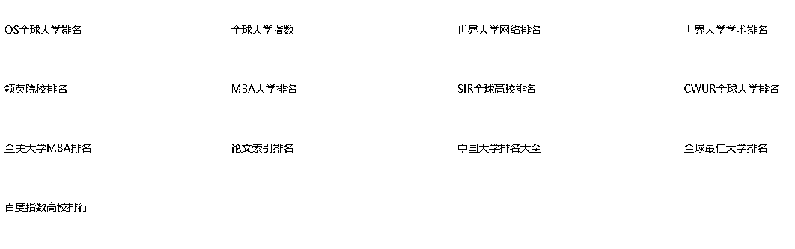

# 一无所有，一无所知的普通人，怎么赚到第一桶金。

> 来源：[https://crse5s1mvs.feishu.cn/docx/B0mWdVOFsoKxPjxwheOcLhm2n2b](https://crse5s1mvs.feishu.cn/docx/B0mWdVOFsoKxPjxwheOcLhm2n2b)

大家好，我是王永超！任何时间，对于普通人，都有机会！现在互联网与ai交替时代，搜索+提问，就是机会！

以考研为例：

进入赛道前，先思考：

1，能做多久？

2，能赚多少钱？

3，从哪里入局？

4，怎么晋级？

能做多久？

都知道教育体系一般情况下，不会更改！

但，我们不能赌，要看事实。

先查一下，在不同的教育体系下，考验是否都存在。

空间：国外美国，意大利，日本，

不管搜出来是什么，我们只需要明确，这个需求，空间上是一直存在的。

时间上，查询开始时间，此项目在1865年以后，已经可以做了，

从时间+空间上考虑，我感觉，我这辈子，是没希望，把这行业，熬没了。

能赚多少钱？

搜一下：从人数，价格方向去搜

这只是上限，并且看到各个平台都有大量的人在做，

有人做，就证明，这个项目，没问题。

还要去加几个同行，看看他们的规模，对方能做到的，就是自己能做到的。

这里就不加了，可以加自己感兴趣的赛道去看

看到很多大同行，小同行，知道了这个方向是对的！

那么就开始为广大的考研人员，出一份自己的力，为自己以及家人争取一个更好的生活！

这句话很重要哦。这叫大义，是给自己和后面团队抗压利器。

从哪里入局？

操，别人都干那么牛逼，我怎么能争得过。

操，也操完了，不甘也没办法，确实争不过。还得想办法入局这个赛道。

赛道很大，很宽阔，不止有培训，私教，还有资料，社群，课程，等等。

找个自己能入局的，比如说资料。我们有向上的心，还怕争不过小卡拉米吗？

找资料，同时，我们再学资料，别人卖资料，我们卖资料+陪伴。我学完后教给他们就行了。后面学的多了，再出课，再做培训啊。

别人，资料卖多少钱，我们资料+陪伴也是多少钱，价格优势，服务优势，资料优势。

资料优势，怎么打？

在百度上搜资料，一般都是些杂乱的东西，整理起来确实超级难。

同行的资料，一般是：同行+淘宝

我们：

<1>考研，资料 filetype:pdf

这边只是演示，可以加上特定的专业（英语，公务员，等等）。filetype:后面加上文件名称。

只显示这一类型的文件。

<2>考研论坛

这种大类目，专业类目，基本都会有特定的论坛，把论坛的东西，过一遍。

也建议所有搜索都用谷歌，下面是搜索对比。

如果实在难以解决，那就用百度吧！

<3>淘宝，

起步，只买便宜的，不卖贵的，管它多好。最后赔也就赔点时间。

这些所有工作，都是“产品”阶段的东西，做好产品很重要，但是没有流量，也是白搭。先做个差不多的产品，先卖起来，后面再优化。

<4>教育数据，大学排行榜，高考工具

当别人的只是资料，咱们还给提供资料之外的东西时，咱们就是竞争力。

<5>ai工具。

使用ai工具就是要学会提问，我的提问技巧就那样，就不献丑了！感兴趣的私信我，给你一份提问技巧。

--------分界线-----------

下面就是资料引流了，这方面的东西，就不多说了，以上这些东西，就可以让一个人入局到任何一个行业了。

提供资料/食物/（自己填写）时，加上带你学/带你吃/带你（自己填写）时，自己的相关知识就会猛进，就可以做更深层的东西，高端/社群/1v1咨询等

（不要局限于以上内容，公众号，别人的社群，相关app等等，有耐心去搜，总汇什么都有）

怎么晋级？

晋级的方向，在一开始就做了相关调查，就有一个方向了。

同时，在搜索时，也观察别人都在做什么，在互联网上，信息差就是搜索的数量。

别人对一个行业，搜一次，甚至都不愿意搜，咱们去搜10次，100次，1000次，之间的差距，就不言而喻了。

有些时候还是要花钱，买一些资料，社群，课程。这样晋级更快。

走出去，看看别人都在做什么，有些东西，想破脑袋，也不知道还能这么玩的。

总结：多搜，花钱，走出去。

现在这个时代：掌握搜索+提问的技巧，就会先人一步，无论是否创业，一定要会搜，多搜，不断的搜