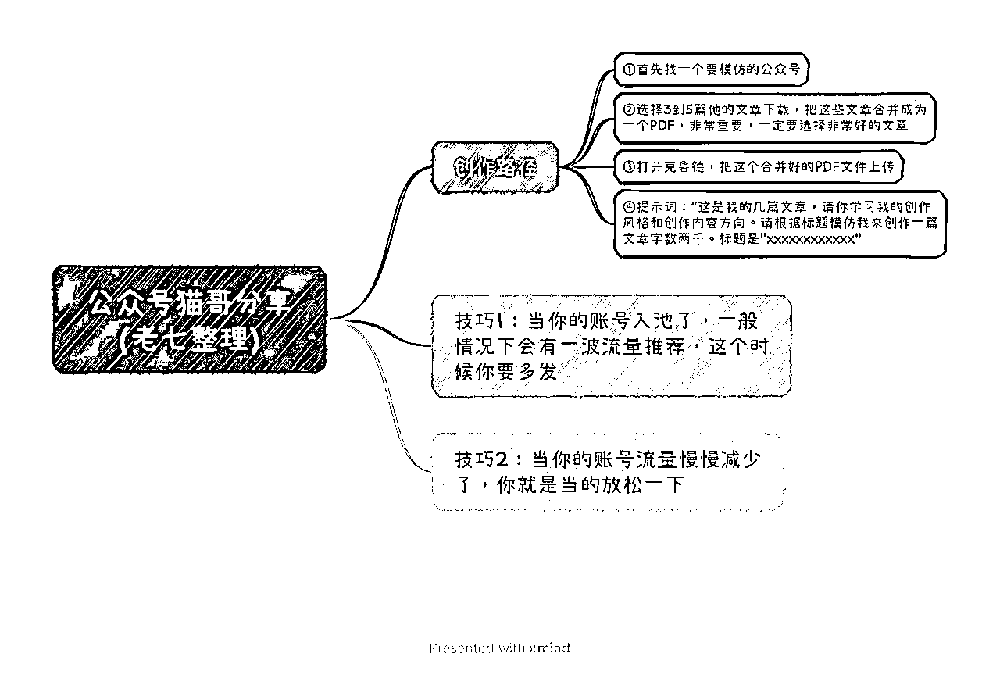
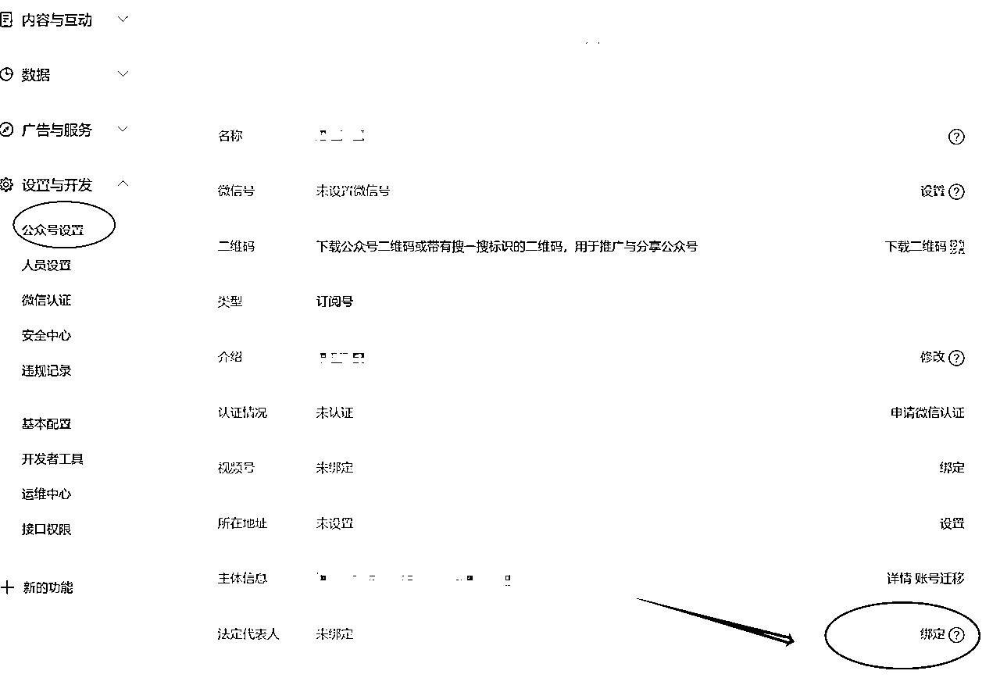

# 公众号流量主收益20w后悟出的底层逻辑

> 来源：[https://ex5bha8e8ip.feishu.cn/docx/BBnmd2RgFoItqXxazMrcQdIxn6g](https://ex5bha8e8ip.feishu.cn/docx/BBnmd2RgFoItqXxazMrcQdIxn6g)

本篇文章，在生财有术获得加精。

hello，大家好，我是猫哥。

地区：郑州

介绍：8年创业人，生财有术航海家，公众号航海教练，公众号猫哥创业记主理人。目前在做公众号流量主项目，累计运营公众号2000+，公众号流量主收益200w+，合作达人1000+。

公众号流量主这个项目是为数不多的值得长期做的项目，相比别的项目，优点有很多，操作简单，变现链路短，回报率高，容易拿到结果。

下面就是这个项目的核心，把握这几点，你在这个项目拿到结果是没啥问题的。

第一，如何快速生成文章

第二，如何大量分发

第三，项目核心

# 第一、如何快速生成文章

公众号本身还是一个内容平台，最核心的还是内容生产，谁能快速生成优质的内容，谁就占据了优势。

目前使用过很多AI工具，包含chatgpt4.0，new bing，notion，claude1，claude2，还有一些国内的模型比如讯飞火星，文心一言等，其中在生成文章这一块，个人觉得效果最好的是claude2，下面简称claude。

对于一些非实时类赛道，比如情感故事，文案鸡汤等，不需要复杂的提示词，一个提示词就可以生成一篇文章。

对于一些实时类赛道，比如娱乐八卦，时事热点等，基本也是几个提示词下来就可以写一篇文章。

claude的使用极其简单，8月的航海群里面，我也分享过，别一个热点的圈友整理了，下面就是使用方法。

利用这个方法，可以快速的生成文章。

# 第二、如何大量分发

当你掌握了快速制作文章的方法后，那么你要解决的问题就是如何快速的分发，简单的讲就是如何发布大量的文章。这里有2个方案，一个是单账号多发，一个是布局多账号，矩阵运营。

首先来说下，单账号多发文章，单账号多发文章并不是乱发，刚注册的新号，实际上发那么多没有什么用，还是坚持日更等待入池，当文章入池以后，就需要多发文章了，可以每天发多次，比如首发4篇，然后分时间段再发几篇。如果某一篇文章爆了，接着跟发多篇就行了。

另外一个点就是多账号运营，这里涉及到注册多个账号，优先考虑使用家人的信息来注册公众号，收款仍然是可以自己。接着可以考虑注册个体户营业执照，这个一定要选择个体户，个体户相比公司成本要小的多。

1个个体户可以注册2个公众号，其中注册第二个的时候是需要缴纳认证费用300块钱。

这里注意的一点是，如果开2个浏览器同时注册2个公众号，就可以卡bug，省去300块钱的认证费。

当然这个方法很多新手操作不来，就会失败。

这里我提供另外一个方法，不需要同时注册，就可以跳过第二个账号的认证。哪怕你使用执照已经注册1个账号很久了，这个方法仍然可以让你省300块钱。

这个方法就是，按照流程正常注册，注册的时候一样选择微信认证，不用管，直接注册好账号，接着在公众号后台里面，找到公众号的设置，找到法人这一项，点击绑定，按照提示进行绑定法人，就可以跳过认证，达到注册账号的目的。

接着就是解决下注册的邮箱问题，可以直接注册2925无限邮箱，真正实现1个邮箱，注册N个公众号。注册claude账号也是可以用的。

## 无限邮箱 后缀： @2925.com

什么是无限邮箱？就是你只用注册1个邮箱，但是实际上等于你有了无数个邮箱，可以设置无数个邮箱别名。

但是这个邮箱收件有时候比较慢。

注册地址：https://www.2925.com/login/

注册教程：打开地址，点击注册账号，输入信息就可以注册了。注册完成后你会获得一个主邮箱。

如何使用多别名：在你的主账号后面，加上任意的字符就可以

比如：我的主账号是cat887999@2925.com

那么我的别名可以是：cat88799_weixin@2925.com, cat88799_1@2925.com,cat88799_taobao@2925.com，

还可以不用加下划线，直接cat8879991@2925.com，直接加上数字或者字母，不过我觉得这样子容易搞错，加上下划线更加直观。

这个别名不需要我们设置，直接注册微信公众或者claude等的时候，加上后缀就可以自动开通这个别名账号。

# 第三、项目核心

这个项目的核心是标题，为什么是标题，因为新号的流量来源大部分都是靠看一看，而看一看的3种推流入口，都是推送的标题 + 图。如果你的标题都不够吸引人，那么这个项目就等于是白做了。你很难起来。所以有时候，你看一个新号，你看看标题，你就知道他的号能不能起来了。

如何获取一个优质的标题，决定着这个项目的成功。

怎么获取？直接找对标，找爆款。找到你所在赛道的账号，最好是这2个月新注册的，然后抄他们的爆款标题。

找对标账号的过程还是非常枯燥的，需要不断的去搜一搜，看一看去搜索。

那么接下来就是一个问题，标题能不能直接一模一样的抄？答案是可以的。

标题本身只有64个字，就算是完全重复也是没有问题的，只要内容不一样，就不会原创违规。

最后，我把做这个项目，觉得最重要的几句话写出来。如果你真的能懂，那么恭喜你，找到了这个项目的灵魂。

1.不要原创，不要原创，不要原创，多找对标，谁爆抄谁！（不是不开原创，是不要创新）

2.爆过的内容还会爆，如果自己爆了哪一篇文章，第二天直接重发一遍！

3.一定要有自己的对标账号库和爆文素材库，非常，超级，very重要！

4.文章的标题和封面比文章内容更加重要！特别是前期！