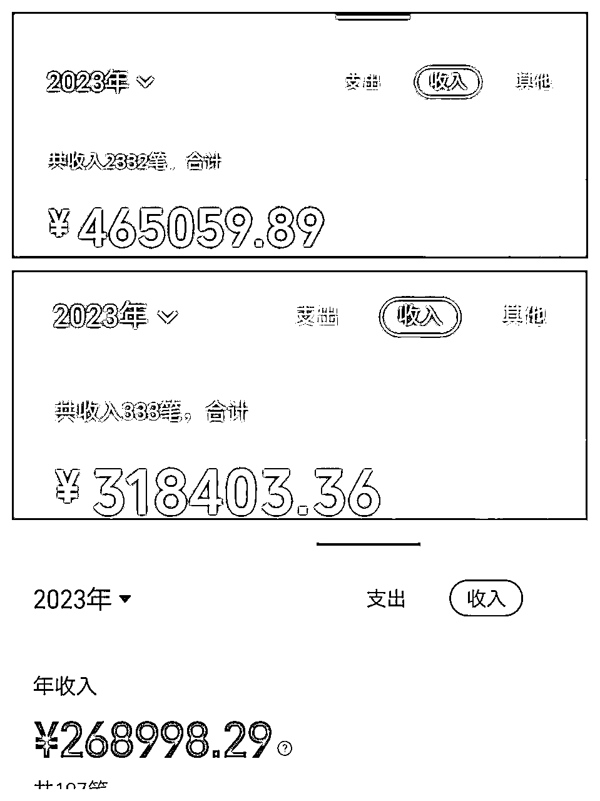
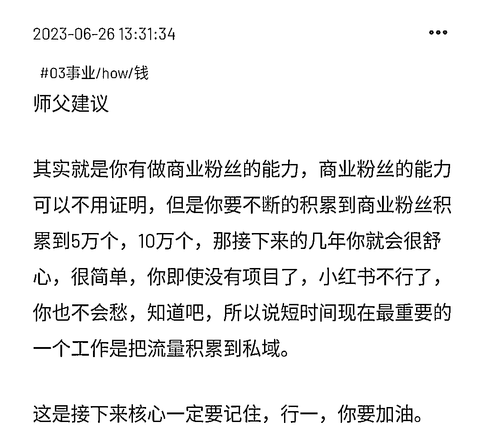
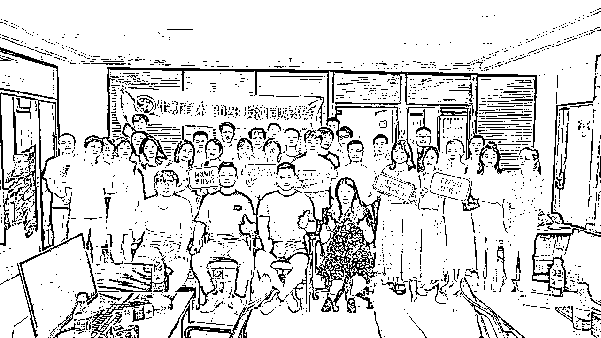
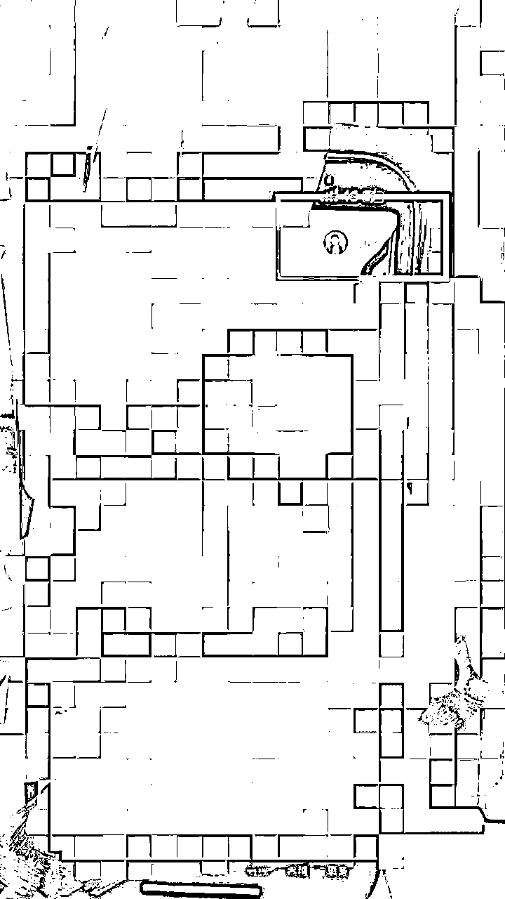
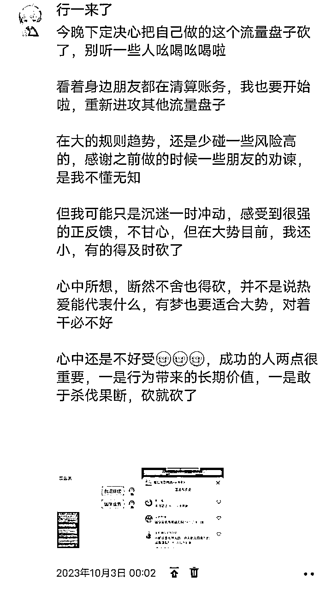
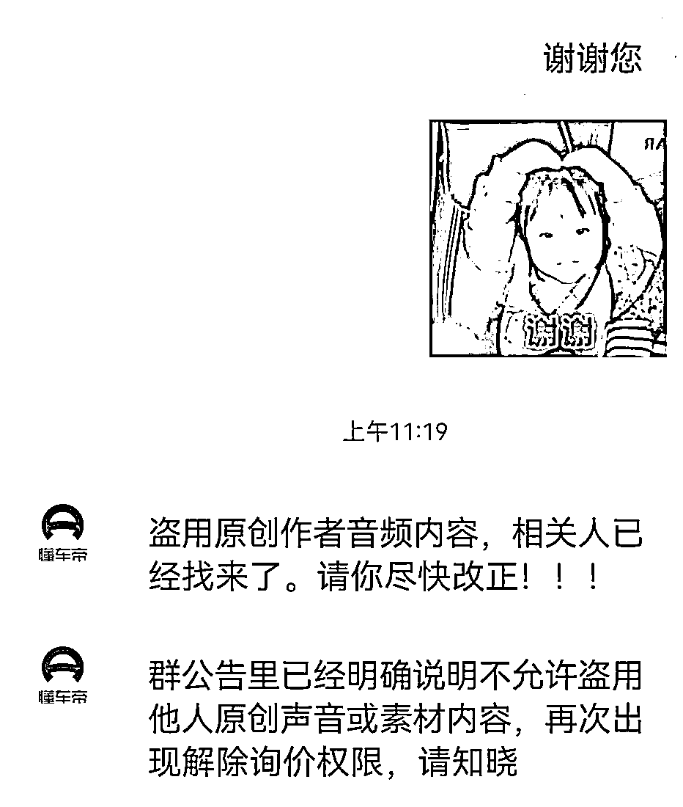
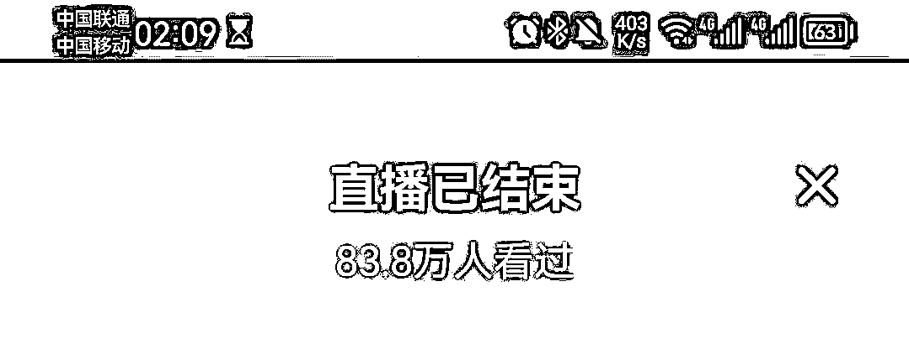
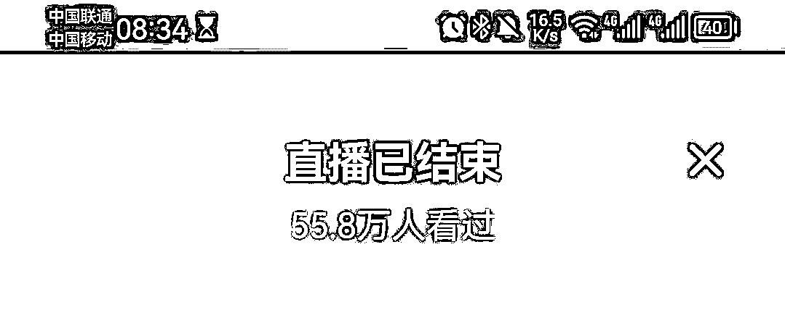
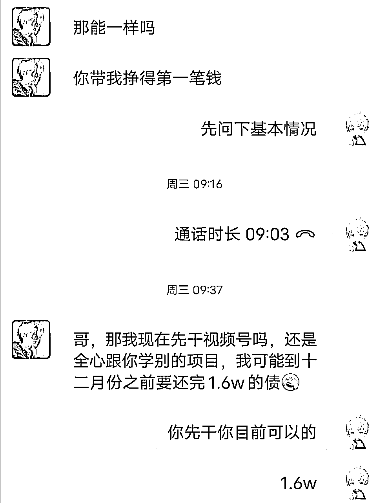
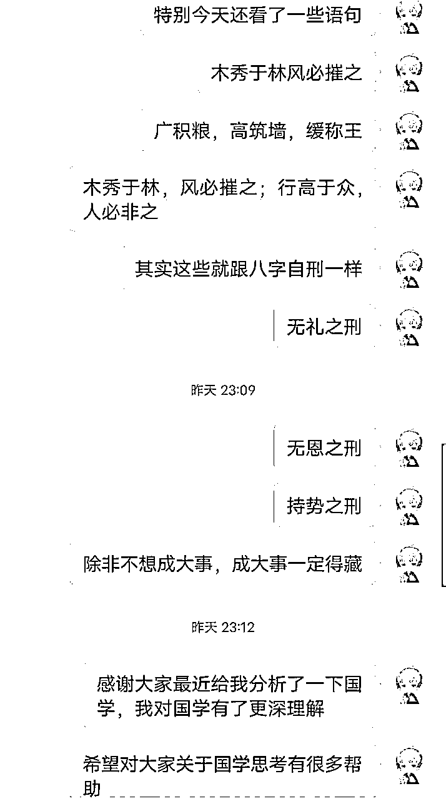

# 那位大学赚了百万男孩最近三个月复盘

> 来源：[https://wxm1taza3m.feishu.cn/docx/Bw3ldHnpmoIp8hxcBsmckCqMnIg](https://wxm1taza3m.feishu.cn/docx/Bw3ldHnpmoIp8hxcBsmckCqMnIg)

各位圈友大家好，很久没来咱们星球输出了。我是行一，一位在路上跟各位大佬学习的连续创业者，目前一家流量公司和一家电商工作室。

很开心吃到小红书电商的红利，破了人生第一个百万，目前小红书电商已经从搬运到了实拍做高客单价产品，一直在不断迭代，从无货源到中转仓，解决了很多问题，这算我一个基本盘子。

在东北就靠这个项目起来了，如果问我小红书电商能不能做，我一定说能，在我眼里，只存在比我做的好的同行，所以一直跟着学就行了。这里感谢我的好朋友@阿成，感谢他一直迭代，我也在迭代，让我这个小红书电商项目一直是我基本盘。

我跟成哥在没进生财就认识了，他是个一线的实干家，进生财我一直鼓励他分享，我觉得他这样实干家不该被埋没，我在这里非常感谢他@阿成。

真的感觉时间过得好快，这三个月我有了对创业更深层次的理解。

小红书电商毕竟属于风口需要追，但内心的我是不忘搞流量，囤积私域，积累高质量流量。

接下来是行一我关于这三个月做的一些事，帮助的一些人，以及对创业新的感悟。

一）做的一些事，全是坑

二）帮助的人，找到天赋

三）创业新的感悟

# 一）做的一些事，全是坑

在决定去长沙开流量公司之前，我问了我师父，我把我目前规划告诉给师父，师父说的话很对。

行一，你积累私域的话，你未来就很舒服，但如果你去一直做这个项目的话。。。

大概就是这样，我去长沙跟我几个好朋友一起搞了流量公司，在做各种流量的调查中，我们几个讨论了很多，我们的后端是要满足这几点，高客单价，高利润，高复购，然后一定是自己的私域。

## 第一，我们做的是知识付费流量。

从刚开始项目拆解到直播引流，我们团队全部跑通了，达到日引300＋创业粉，不过可惜的是粉丝质量太低，转化不理想。加上自己刚开始就看同行后端模式决定做个社群，也就这样瞎打瞎搞，发现转化是个问题。

手里引了5000创业粉在手里，转化是个问题，真的是个问题，因为算一下整体公司费用，还是一个亏的状态。流量在手里不能变现跟废铁是一样的。

如果问我为啥可以那么快跑项目，我可以告诉大家，在我眼里，没有同行，只有师和友，本质都是价值交换，你说你的玩法我交流我的玩法，达到共赢的状态。

我自己跑项目跑了三年了，我跑一个项目会从底层逻辑＋方法论去分析拆解好，然后迅速去模仿，只要通了就复制放大。

当然我不会一直在探索项目中，我现在冲了风口后想的就是一个基本盘，目前基本盘稳了才敢去投资测试。

有人说，在这个年龄，赚了这么多，应该很满足，但我不是不满足，已经很知足啦，我是想朝更大的体量出发。我觉得年轻就应该多闯闯，也是为了找到好的赛道稳住更高的基本盘。

不折腾就不知道我还有这么多没学，同时不折腾就不会成长。

感谢生财提供这么好的圈子，我初去长沙就当了长沙见面会的嘉宾，分享自己创业的经历，也算白手起家到百万体量吧，别人都说我悟性比较高，那暂且就算是吧，弟弟一直跟各位大佬背后学习，高人太多了。

## 第二，知识付费流量切国学流量。

做国学其实我四月就开始跟长沙这边合伙人线上合作，只是后来抖音图文矩阵不能玩了，先停在那，也是之前说国学项目停了。不过来长沙了，一位朋友来这边玩来看我，来到我的地盘，我就接待了，然后跟朋友聊天听到他们国学的暴利。好了，成功转型国学赛道。

测试国学的过程中，我们是最简单的直播引流，最终达到项目一天500＋流量，全靠朋友公司技术那边扶持。国学项目流量是真猛，加上小红书无IP图文矩阵，我也慢慢在国学圈子出了点名声，圈了自己的国学社群。

自己从前端流量，到后端转化，都是一步一步测出来，真的是花了自己很多心血的项目。接下来项目不赚钱还好，项目赚钱了就会出问题啦，跟合伙人闹了分歧。

这里强调一下合伙人真的很重要，之前是在学校创业找了合伙人，被合伙人私下搞小动作，然后出了分歧。这次又到了分歧，一个公司开会要开到五个小时，连续开了三天，很内耗。

四个合伙人，两个要求扩，两个想散伙，好吧，这个项目是我自己用我的关系带来的，之前被他们画了大饼，是我疏忽了，学了技术就想走了，第二次看错了人。

不怕，之前遇到过，只是内心不是滋味，后来跟我这个是好朋友的合伙人合伙了，我们将国学盘子迅速放大，成功稳住了这个长沙公司基本盘，成功实现月利润六位数以上。

做国学盘子真的很感恩，很感谢一些哥哥姐姐来告诉我利弊，但我为了心中那个传播国学文化的梦一直做下去，直到最近把它彻底不干了，国学粉转其他粉进行销售。

不干了不是项目不行，是一些特殊情况，就像我朋友告诉我，那么多项目可以搞钱，你为啥非要搞国学，非要去搞这个风险。

加上去拜访了一些哥哥姐姐，他们劝我这个弟弟，我决定不做了，砍了。

## 第三，国学直播转型抖音小程序cps。

我是不会放弃的，放弃就不是我，在我们国学稳定的过程中，我们开会就说了国学的利和弊，弊端就是法律风险，有点投产比不值得。

我跟我合伙人在我俩成立公司之前都有自己的基本盘，我是小红书电商，他是抖音直播，我俩都是大学创业，都是那个上课在后排拿着电脑看数据的人，哈哈哈，这也是我只身一人前往长沙创业的原因 ，东北这边直接给我合伙人管，自己少分点。

好在有基本盘，还可以瞎折腾。人不折腾不会失败的，还是那句话，好在自己跟我合伙人有做项目和带团队的底层能力。

这个项目又是朋友告诉我的，他给我发这个直播间，让我看看，我没在意，然后研究了下，其实早期就是底下挂懂车帝小程序，这个直播逻辑跟我国学直播引流逻辑一样。

后来由于官方一直给我发这种信息，很不爽，被别人控制后端，自己公司找技术开发了属于自己的小程序，这就是这个项目的测试过程。

我是什么都愿意下手弄脏的人，从图文到短视频，到直播，一路走过来的，想看我怎么认识这么多朋友，我等会告诉你们。

# 二）帮助的人，找到天赋

## 1.做了第一个公益项目

本身自己做创业IP的，这次做了IP一周年公益项目，免费带领一些小伙伴做互联网项目。

那种帮助别人真的十分开心，我是7月开始做公益项目，收到很多人的反馈，因为刚好是我行一IP成立一周年。

## 2.帮助了一个高中生实现他第一桶金

本来是不愿意带他的，希望他好好学习，他把所有钱全压在我这，就留个生活费，感动了我，我就带了。

直到前天听到他是因为母亲在医院负债了才赚钱，那一刻感觉内心的感觉就出来了，特别是我学完国学文化之后，更明白了帮助别人的重要性。

但行好事，莫问前程。

## 3.帮助我的会员做一对一咨询

自己真的是一步步从0到1，从1到10，然后从10到100，暂时只做这些方面咨询，当我给别人做咨询，他们给我的反馈，是我找到自己的天赋了。

那就是用我自己的思考去给别人分析目前所在的情况，然后接下来如何去做，真的对别人来说内心是佩服式的感激，这也是我想继续做IP的背后直接原因。

# 三）创业新的感悟

## 1.人比项目更重要

一是要思考自己是什么样的人，适合做什么样的事；

二是你跟的是什么样的人，他能给你提供哪些价值；

三是你带的是什么样的人，他是不是一个愿意给反馈的人。

## 2.创业玩到最后是资金和资源

一个好项目来了，能不能有投资人投你，

或者你要什么资源，能不能搞到手。

## 3.钱来人来，财散人聚

之前带团队可能我格局还有点小，在接下来的盘子里我会注意这点。

一个人力量太弱小，敢于分钱，敢于给下面分红，真正风口项目来的时候需要是一群跟你的人，而不是马上去BOSS上招聘扩大，那样必然不能迅速占领，养精蓄悦。

## 4.创业不存在同行，只有师和友

我认为一个成为你同行的人必然有他的厉害之处，在我创业路上，我是一直践行这个原则。

遇到好的同行，我是私聊加微信，跟他交朋友，真诚去链接，首先发个小红包喝杯奶茶，然后聊聊双方的一些项目交流，毕竟我是主动方，所以我会去真诚分享自己做项目的经验，看了别人的号，不用担心别人没干货，有的是成为朋友，成为这个领域顶尖高手。

包括我推一些朋友进生财，都是这么帮他的，他们跟我不是一个圈子。我跟很多项目做的好的都是好朋友，因为只要他们帮我在项目上，我都会让别人觉得帮我很值。

## 5.木秀于林，风必摧之；行高于众，人必非之

说一下，我自从跟一些大佬交流，发现国学的重要性，特别跟我自己的国学师傅了解了很多，我自学国学文化，用国学文化选拔人才，通过国学文化去更好帮助自己的公司，走少一些坑。

同时，我属于运气好，站在项目风口吃到了红利。之前也飘过，年少控制不住自己，学国学文化也有这种原因，一定要学会低调，我给我笔记本前就写了这句话。

在路上继续跟各位大佬后面学习，学习更多项目玩法，稳定自己的流量盘子，看到这里，如果收货颇多，希望支持一下行一。

希望大家一起生财有术,写这篇文章想给圈友分享一些我创业的经验，同时希望自己以后牢记这些教训和思考，低调做事，继续前行。