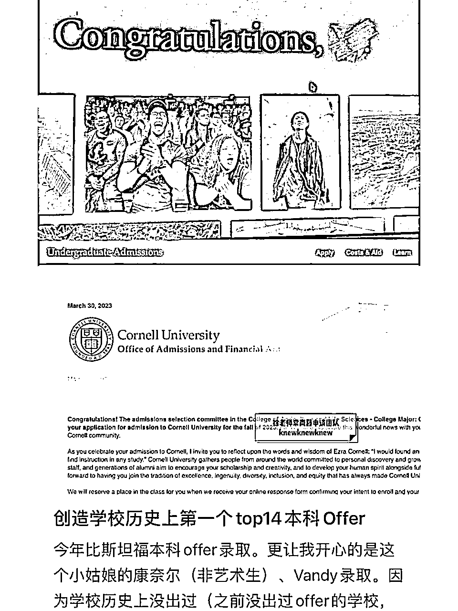
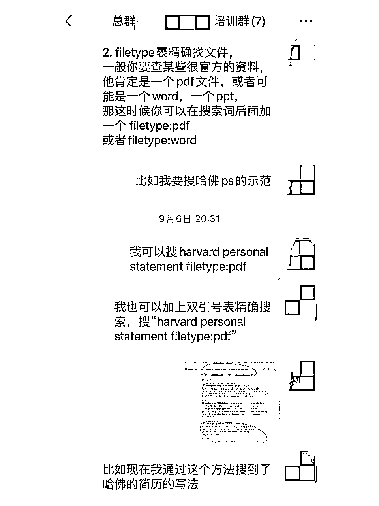
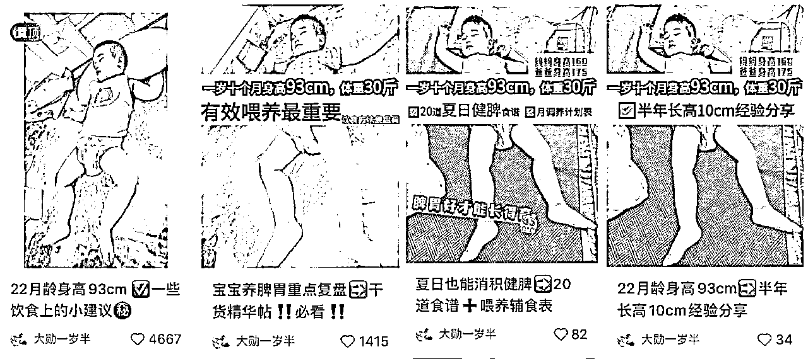

# 小红书教育赛道GMV1600万/年，小团队创业心法

> 来源：[https://wfftwwt027.feishu.cn/docx/C5SedRs3LoSnOex9xDFc9Cvgnff](https://wfftwwt027.feishu.cn/docx/C5SedRs3LoSnOex9xDFc9Cvgnff)

大家好，我是珍妮，和咱们生财圈的陈铭Ivy一起合作创业，这是陈老师的精华帖https://t.zsxq.com/12tvEOFgZ 大家感兴趣的可以戳戳。

我们深耕教育板块，主做留学，在22年帮某机构做了1500w GMV，自营业务做了160w+GMV。

团队直到今年8月前，只做两个业务，只铺小红书平台。A业务3个全职，1个兼职。B业务1个兼职，两个老外全职和N个中外临时工兼职，加上我和Ivy两人，这是一个9人为核心的小团队。

这篇文章大纲如下，方便大家直接关键词定位到具体版块：

1.  留学赛道业务分类

1.  怎样找留学行业的对标账号

1.  矩阵号和ip号该铺哪些内容

1.  怎样铺量做矩阵号内容

1.  后端如何转化流量

1.  怎样识人，招人

1.  小红书平台今年的常见问题和解决办法

1) 小红书一模一样的图片，是否可以反复发？

2) 同样的图片和文案，能不能反复发？

3) 爆款文的时间选择，真的需要在近期吗？

4) 封面被用户看腻了，怎么换封面都曝光量不如从前怎么办？

5) 我的账号被封了很多，每次做起来又被封了，怎么办？

6) midjourney到底怎样辅助教育板块引流？

7) tiktok怎样辅助教育板块引流？

1.  我对留学赛道现在和未来的看法

很多人会抱怨23年业务不好做，但我们在自营业务大量账号被封的情况下，还是做了55W+，并帮某教育机构做了664w GMV（截止到今年7月），今天会给大家分享9人团队如何做出1600w+GMV/年。

自营业务第二个淘宝店铺的支付宝收款截图，

因为中途被人恶意举报，所以更换过店铺和收款账号，22年加上微信收款大概160w+，23年上半年收款55w+

个别账号里帮某机构运营拿的部分佣金

# 留学赛道业务分类

虽然我和Ivy做的是教育赛道，但我们基本只盯准留学生客户。

很多人一提到留学就只能想到留学申请，而这也往往是他们只能赚到留学申请这份钱的原因。围绕留学生这个客户群，可以扒出很多业务：

## 1) 帮国际高中招生

## 2) 国际高中AP/A-level/IB辅导课

## 3) 雅思托福GRE，ACT，SAT，GMAT语培与保过

## 4) 小众留学申请（东南亚，俄罗斯，韩国，日本等）

## 5) 免收中介费，只拿校方佣金的常见国家留学申请（澳洲）

## 6) 又收中介费，又收校方佣金的常见国家留学申请（英美港新澳等等）

## 7) 专做高端定制的保录留学申请（比如送孩子去常青藤牛津剑桥）

## 8) 英文润色与降重

## 9) 留学辅导（包括预科辅导）

## 10) 背景提升（比如付费实习）

## 11) 国内外找工作需要的求职辅导

## 12) 国外租房，买车，二手交易等

## 13) 移民澳洲，香港永居等等

## 14) 留学申诉等

Ivy和我去年只做其中两个业务，正在扩展其中5个业务，至于其他业务，一般都是注意到客户有对应的需求，就顺手推给了我们筛选出来的、信任的合作伙伴。

既然都是要引流留学生，可以发的引流内容就有很多了，比如上述业务中：

12中的内容适合用来发朋友圈增加用户粘性，13中的内容可以与4、5、6结合着发，8、9和14可以发在同一个账号上，10和11可以发在同一个账号上，做7的人可以卖9和10。做5-13的人，可以和做1、2、3的人合作，互推资源。

我们通过这样的方法，实现了把一个留学生的价值挖掘到最大。

# 怎样找留学行业的对标账号

很多新人一上来就学头部账号甚至腰部账号，点赞低于100的笔记坚决不抄，这是不对的。因为头部或者腰部账号的粉丝体量和新账号完全不一样。这些大一点的账号随便发点啥都有可能点赞破百，但这不适合新账号来抄。

还有的运营er觉得点赞破千才值得抄，这也是不对的。留学行业的细分业务太多了，有些业务因为足够细分，所以点赞破百就是爆款，就该马上抄。

有的运营er不观察同行的发表时间，不等到点赞破100坚决不抄，这就会错失时机。因为有的笔记才发表不到2小时就点赞破50，这就说明是小爆款的节奏，应该赶紧抄。一旦抄晚了，平台同质化内容严重，也就拿不到足够多的流量了。

对于一个新号，要先观察这个垂直领域的笔记常见的爆款点赞量是多少，并且要把同行正在做的小号，腰部账号，头部账号都挖出来。

从同行的小号开始跟进，甚至连“他们什么时候发了什么养号笔记，什么时候又把养号笔记隐藏了”这些小细节都挖出来，也就离做成账号不远了。

在某些细分领域，对于粉丝体量低于300的小号，如果点赞超过50，都算一篇小爆款，就该马上抄。

一些内部培训记录：关于如何判断哪些爆款值得抄

# 矩阵号和ip号该铺什么内容

所有的引流内容会被铺给矩阵号和ip号。矩阵号我们在22年年底有21个，因为违规被封，21年剩下15个。个人ip号就两个，更新频率很慢。

## A. 针对矩阵号：

### 1) 以机构名义打硬广，开聚光：

这种特别常见。硬广的素材一般是客户的好评，项目或者服务的介绍。这个没有很大技术含量，前几年这个路子很受欢迎，但现在硬广已经慢慢不受小红书待见，大部分新账号一上来就打硬广，曝光量会很低。所以我们的矩阵号运营者一般是把自己做到至少300-500粉丝，才开始打硬广。

### 2) 以个人名义打硬广：

这种人设一般是：曝光留学黑料、曝光黑中介、曝光付费实习黑机构等等。

以曝光的名义，整理出多个pdf及文件夹来晒图，吸引别人来领某机构的评价反馈，然后借机推销产品。这些pdf有的是在别人的小红书评论区复制粘贴了真实用户的反馈，有的是在领了别人的资料包后去掉水印然后加入一些新的反馈。

后期真实用户看到相关曝光，也会主动给账号负责人投稿，因此曝光黑料越滚越大。

### 3) 以干货、吃喝玩乐活动等吸引用户加V：干货包括发资料，如dissertation模板，美国提供sponsor岗位的公司清单，XX名校新生指南，吃喝玩乐活动包括：万圣节扮鬼活动等。

## B. 针对ip号：

ip号大多要录录视频或者做做图文配自拍他拍照，由于团队的留学生大多毕业多年，所以我们只偶尔做做图文ip，用来讲讲留学申请注意事项。

ip号涨粉比机构号快，但容易停更，除非是每天有充足的精力，可以整ip号，否则不推荐机构一上来就整ip，因为团队里的人多数没有毅力去选素材，剪视频或者定期更新带ip色彩的图文笔记。真有这个毅力的，也不会出来打工了。

除非创始人自己有时间整ip，否则指望员工来做ip号不现实。（以下为创始人本人做ip的例子，内容专业度高）

补充：ip号里是可以夹杂发一些平时发在矩阵号内容的，比如夹杂发一些吃喝玩乐攻略，留学资料包等等。

这些引流素材，除了从日常用户反馈、从同行手中积累外，还可以去谷歌扒，去ins扒，去tiktok扒，去抖音扒，去电子书扒，去淘宝买。

扒的时候要熟练使用高级搜索的方法，比如通配符，正则表达式等等。像*表模糊搜索，“”表精确搜索，filetype表搜索文件类型等等。这些方法一旦掌握，扒素材的速度会大大加快。

一些内部培训记录：关于如何谷歌搜索扒素材

关于搜索技巧课，16还是17年那会，朱丹老师曾经出过相关的高级搜索课，感兴趣的家人们可以去看看，上完课搜索思维会变一个样。

关于tiktok去水印，可以谷歌搜：tiktok video download without watermark，同样的方法可以下载ins或者youtube的无水印内容。

如果是国内的抖音，可以用“轻抖”微信小程序去除水印。

# 怎样铺量做矩阵号内容

我们这个赛道，在去年做到1600wGMV那会，整个团队运营人员只有一个留学生，其他人都对这个完全不了解，大部分核心运营人员都是大专或者二本。

要让他们上路虽然简单但不太轻松：教会他们用微信搜索去搜热门公众号的帖子、用微信读书去看已经被市场认可的资料（遇到微信读书里需要花钱的书，我会再去买特殊渠道电子版发给团队方便他们洗稿）、用谷歌搜索去下载国外的原版资料、用搜狗搜索去扒微信和知乎的热门帖子、用gpt去洗个人色彩不强烈的小红书稿件（防止被告侵权）。

为了防止员工因为英文不好而没法玩转谷歌，教会他们在chrome浏览器安装google translate的一键翻译插件，教会他们用双引号表示精确搜索，用filetype表示搜具体的pdf，word，或者ppt文档。

有的业务，只需要追上业内热点，就可以蹭上一波流量，所以我们会教给员工识别热点的方法，安排每天都蹭一个热点。

一旦数据中心的首页推荐占比明显下滑，就让员工赶紧发一个热点去把首页推荐比例调高。

一些内部培训记录：每周五检查员工账号数据

# 后端如何转化流量？

8月开始，我们后端分为四个部分，分别转化五大版块的业务，其中：

版块1和2是自营，流量全部自己承接，

版块3和4自己人能消化就自己人消化，消化不了就推给其他人转化，

剩下第5个版块只是顺手给其他机构推人头。

其中版块1的客单价低，质量好，大部分客户买了就会不断续购甚至推荐同学来买。

版块2主要免费送留学生刚需服务，并有小群日常分享留学信息差、吃喝玩乐活动等，等积累起信任后，学生就会买版块2的服务。

版块3，4，5都是留学衍生业务，通过版块1和2建立起信任的学生，会乐于了解版块3-5。

如果是矩阵号平台引流过来，对我们缺乏信任，又不需要版块1和2的学生，就得看我们自己的销售有多厉害了。这种情况下，销售周期会长一些，但只要给到客户足够的情绪价值同时让他感受到我们的专业，和服务靠谱，客户为先，长期跟进，是能成交的。

也有部分学生我们会把他推入版块2的群聊，先慢慢培养，建立起信任再说。

# 6\. 怎样识人，招人

对于一个小型公司，用不起985、211、海外名校生，就只能开低薪，吸纳大专和二本生，然后 手把手培训，这类学生工作习惯一般不太行，同样的错误会反复犯错是常事，所以创始人每天都 会花很多精力在这类员工身上，很容易把创始人整生病。

偶尔会有培训完后干活非常不错的，但由于那时候的我们百废待兴，发不起高薪，所以员工也离职了。

后来公司利润越来越大，留得住名校毕业的学生了，我们就把大部分核心岗位交给了名校毕业生，因为培训他们的成本比较低，他们上手速度也特别快。

刚开始创业的时候，985和海外名校生，以及大专二本，我们都招过。名校生确实悟性高，培训成本低；后者就大概率工作习惯不太行，同样的错误会反复犯，所以创始人每天都会花很多精力在后者身上，很容易把创始人整生病。

同时我们也发现，因为我们庙小，名校生流动性比较大，所以我们后面调整了策略，只招，有3-5年以上工作经验的员工，这样的人才，已经经过了社会的磨练，对工作的预期和认知都会比较现实，培训成本相对较低，后期合作也比较愉快。

## 一些招人tips:

### 1)不要觉得自己庙小就留不住一本或者名校生。

现在就业市场不行，是企业招员工的最佳时机。我们有名校生疫情期间创业失败负债，在这时候收到了我们的offer， 人家不仅努力干活，还把自己老公也带过来了，两人一起在家工作超有干劲，我们也很感激这样双向奔赴的团队伙伴。

### 2)不要招没有工作经验的学生，尤其是家境一般的学生。

这类学生往往比家境特别好的学生野心要大，又更容易眼高手低，他们把第一份工作当踏板，但因为没有足够的工作经验，没被社会毒打过，他们往往工作做的不怎么样、职场习惯不行，抗压能力不行，一点小事都求安慰求鼓励，上司带他们很累。

### 3)不需要冲劲的岗位，可以招富二代!

富二代的野心小很多，可能是出生在罗⻢，所以确实不怎么需要奋力奔跑。人家没有创业单干的野心，就想找份工作干干，以免每天待在家里带小孩或者在tz内摸⻥。这类富二代又懂留学，又有好的职场习惯，脑子机灵，工作稳定度高。

很多富二代家里是做传统行业的，这些行业有的在没落，所以富二代也不一定就会回家继承家业。

而且，因为继承家业要吃的苦要学的东⻄比打工时还多，所以有些富二代更愿意在外打工。他们不仅很懂待人接物，而且很能戳到客户痛点，成功引流留学生。

# 小红书平台今年的常见问题和解决办法

1) 小红书一模一样的图片，是否可以反复发？

2) 同样的图片和文案，能不能反复发？

3) 爆款文的时间选择，真的需要在近期吗？

4) 封面被用户看腻了，怎么换封面都曝光量不如从前怎么办？

5) 我的账号被封了很多，每次做起来又被封了，怎么办？

6) 同样的图片和文案如果要反复发，需要用到哪些gpt指令？

7) midjourney到底怎样辅助教育板块引流？

8) tiktok怎样辅助教育板块引流？

## 1) 小红书一模一样的图片，是否可以反复发？

可以的，22年那会，流行图片要去重。其实不是的，我们某个业务铺了15个矩阵号，同样的图片反复发，完全不影响流量，照样做到了1500w gmv。

直到现在，某些行业依旧可以同样的图片反复发。具体可以见下图。所以同样的图片能不能反复发，是取决于那个行业的受众，他们有没有看腻这张图片。当绝大部分受众都对这张图很熟悉的时候，再发，就确实很少有流量了。

以下图为例，（这个不是我们业务，我只是把当时给我们业务灵感的笔记单独截图了出来）

这组笔记都是一模一样的封面，所有笔记都跟考证有关，封面看上去透明度都没有调，也就是毫无图片去重，但笔记点赞量是1.8万，941，733，778，1682，4076，评论区一大片人索要博主联系方式，算是引流非常成功的了。

由此可以证明，小红书，是完全可以同样的爆款图片反复发的，反复发的效果是由你的行业性质决定的，如果反复发效果不好，这不是小红书人为设置规则来禁止你发同样的图片，而是你这个行业的用户看腻了这张图。

有人可能觉得：这是以前才可以这样发，现在不行啦！

不是的，我在下一段会把笔记的发表时间也截图出来，这些笔记就发布在今年5月和7月。

为了保护博主账号不会因为突然涌入的大量人为搜索但不一键三连而导致账号被小红书列为劣质笔记号，我把博主的号打了码，如果有人猜到了是哪个账号，也请不要直接说出来。

## 2) 同样的图片和文案，能不能反复发？

依旧可以，但还是得看受众会不会看腻。如果看腻了，可以用同样的图片搭配不一样的风格，调整文字的顺序，继续出爆款。这里可以借助gpt指令改写。

以下图为例，这是一模一样的封面，甚至标题都没改，一个点赞量4068，一个3926，分别发表于今年7月和5月。除了标签部分有改一改以外，文案部分有适当替换词，比如把“备考视角”替换成“考试难度”，把某些内容复述一遍后改了下格式，就又是一篇爆款。

此外，同样的文案，利用gpt指令前后调换顺序，尤其要调换前三行和末三行的顺序，就依旧可以出爆款，但如果是一模一样的文案反复发，是火不了的哦！

以下图为例，我生完小孩后刷小红书，看到其他行业的笔记，非常震惊：

这个人怎么能做到这么多图反复发，甚至旋转图片发，或者封面上配上不同的文字反复发，还出这么多爆款？

为什么几乎一模一样的图片，有的1167点赞，有的只有34个赞？（此处考虑到下文要带大家分析标题，所以把原笔记发出来了）

直到我把他的笔记文案全部梳理了一遍，发现了这个规律：爆款文案改一改词，前后调换顺序就能继续爆！

以下图为例，封面就没变过，点赞变化却很大差别，原因在于他的文案和标题

先从分析标题开始（以下为我今年5月时做的截图分析）

是的，爆款标题就是这么简单，同一个标题就是可以反复用！

原来新生儿这么脆弱，为什么没人早点告诉我/为什么没人告诉我/没生之前真的不了解/没生之前真的不知道！换着来就ok了！

有些运营er总是不知道：今天抄哪个爆款标题好呀，明天抄哪个爆款标题好呀，结果抄了半天也也没抄对爆款。那是因为你真的没有抄到爆点啊！

“新生儿+脆弱”=激起女性想要保护婴儿不受伤害的心理，

“为什么没人早点告诉我”=激起人们害怕自己因为错过重要东西而带来损失的心理！

这和梨云在课上讲的爆款标题的心理一模一样！

很多人虽然学会了这个爆款标题的背后心理，但她还是不知道怎么取标题，那很好办啊，就是去抄这些爆款标题，前后改改顺序，改改逗号句号或者表情包就ok啦！

如果这样抄封面抄标题，你的笔记都火不了，那不是标题的原因，是你文案的问题！

所以文案要怎么改呢，我们看下图。（本图由于是我们内部培训时做的图，比较粗糙，考虑到时间问题没有重新制图，大家勿怪哦）

以这三篇为例，封面和图片都没问题，点赞却完全不一样。是因为文案不一样。

点赞量3082那篇，最早发表于4月5日

点赞量4653那篇，最早发表于4月9日，于6月6日重新编辑

点赞量18那篇，最早发表于23年6月4日或者之前，于6月12日重新编辑

左右三竖排，分别是点赞4653，点赞3082，点赞18这篇的文案对比。

可以发现：

1)如果你完全照抄爆款的文案，哪怕你自己加入了新的元素，只要你排版顺序不变，你就爆不了（比如点赞4653和点赞18那两篇的区别）

2)如果你想把同样的文案再爆一次（点赞4653和3082那篇），除了改写文案，一定要调整文案顺序。

大家可以看我画蓝圈的位置，蓝圈部分内容差不多一样，只不过把：新生儿24小时内改成了“出生24小时内”。把黄疸值12以下，改成了“黄疸水平不超过12”。这些改写内容大家可以自己改写或者用gpt改写。改写完后注意调整顺序。比如本来放在第二段的， 现在可以放到第一段。

## 3) 爆款文的时间选择，真的需要在近期吗？

不是，依旧看行业。爆款分为横向爆款和纵向爆款。我把横向爆款定义为：不受时间限制的爆款，也就是那些不在乎时间线的品类或者服务。同一个产品，哪怕是一年前发的内容，今年任何时候再发也会火。

纵向爆款：那些逮着某个时间段需要卖出去的产品和服务。

也只有纵向爆款，才会需要留意是不是最近三个月出来的爆款，因为只有在跟着爆款所在的时间点发出去，才能火。

## 4) 封面被用户看腻了，怎么换封面都曝光量不如从前怎么办？

我们在22年12月的时候，其实就遭遇过用户看腻封面的问题，那时候运营助理们每天下发的人头直接削弱到了11月的三分之一。

经过调整，在23年1月的时候把流量又做回来了。以下是我的一些小经验：

不要只看自己这个行业的封面，要看整个产业链上下游所有行业的封面。

举个例子，做教育行业的人，要看留学申请，雅思托福语言培训，专升本，英语四六级，高考，国际高中，考研这些领域的封面。

一个做高考志愿规划的人千万不要只看高考这个领域的封面，而是要辐射到考研规划，留学申请规划，并且最好去看上游产业链的封面，而不是下游产业链的封面。也就是说做高考志愿规划的人就不要去看小升初规划领域的爆款封面了。

具体原因：一个在小升初时就看规划的家长，已经看腻了小升初领域的封面，这时候他的孩子马上要高考了，如果你还在用小升初领域的爆款封面，这个家长已经看腻了，但如果这个时候你把考研领域的爆款封面拿来，可能一下子就击中了他的买点。

比如很多在留学某细分行业已经卷到不行的封面和内容，放到国际高中（ib/a level培训）这一块，随随便便就是爆款。因为对于国际高中生和他们的爸妈来说，这些新封面新知识真是太新奇了，说白了依旧是降维打击。

## 5) 我的账号被封了很多，每次做起来又被封了，怎么办？

很多运营者在今年2-4月那会被封了很多账号，包括我们也是。大家讨论起来，会聊起：我是抄袭别人被封的，我是引流被封的。实际上真的不是这么回事。

Ivy和我有两个业务，A业务铺15个号，总会存在大号抄小号的问题，也被很多对手暗地里举报抄袭过很多次，但是这些号真的没有被封，反而从去年活到今年8月了。

而B业务就不一样了，去年养的那批B业务账号，基本全都挂掉了。我们现有的B业务全是重新起号。

今年2月那会我也以为是抄袭被封，直到我通过人工客服加到了小红书教育板块的总监，她告诉我：这个B业务就是我们重点打击的领域，被误杀是没有办法的。然后我问她怎样可以不被误杀，她发给了我小红书教育板块的内部通知，告诉我：笔记里出现哪些哪些字样，就都有可能被封。而这些内部消息，是只有加上了该板块的总监，才会了解到的内容。

所以大家如果账号反复被封，不要自己猜被封原因，要通过人工客服板块加上总监微信去问清楚才可以哦。

## 6) midjourney到底怎样辅助教育板块引流？

mj在教育板块的引流方法，我试过比较好用的有两种：

A. 真人美女图引流

正如我在前面笔记里截图的那样，一个好看的美女封面会带来很多点击量，我们找到这样一个爆款美女图，保存后在midjourney上用describe命令对图片加以描述，在通过垫图功能，以爆款美女图为基准+生成的describe命令作为prompt，然后用imagine命令生成，切记不要开niji功能，我一般都是开mj model 5.1模式，有时还会用到换脸功能。

不是每个生成的美女图都会爆，我们的某个业务一般是用美女图搭配不受时间限制的横向爆款去发，一旦爆了就把这张美女图封面反复发，甚至左右翻转图片然后发，在今年5月给我们带来了巨大流量和利润。

B. 用来生成留学行业的作品集引流，具体我就不发账号了，大家搜搜就能看到哦

## 7) tiktok怎样辅助教育板块引流？

一个账号的权重，是由点赞，收藏，评论，和关注做起来的。你被点赞收藏评论越多，你就越有可能上首页推荐，就能被更多人关注。

我们偷懒的时候，也会发一些伦敦的tiktok视频，发一发taylor swift的演唱会前排视频，这些视频都是tiktok搬运。但可以给我们的矩阵号带来很多留学生流量。留学生ABCD可能本来是刷到演唱会视频，问我们在哪买的票，买的什么票，但因为他们的讨论，把我们的笔记送上了首页推荐，让真正需要买我们其他留学业务的留学生EFGH看到了，EFGH打开我们主页看到置顶笔记的业务介绍，下单了，变相增加了购买量。

# 我对留学赛道现在和未来的看法

最近几年的留学赛道还是值得做的，但在未来，留学国外不是大趋势，留学中国才是大势所趋，所以留学行业的人如果还在做留学申请这类业务，那么是需要铺第二条业务线的。在未来时代的大风刮过来之前，给自己多铺一条路，才能继续在新时代立足。

以上就是我们在留学赛道做到年GMV千万的一些分享，对留学赛道感兴趣，或者正在做这个行业的老板们，欢迎来找我交流~