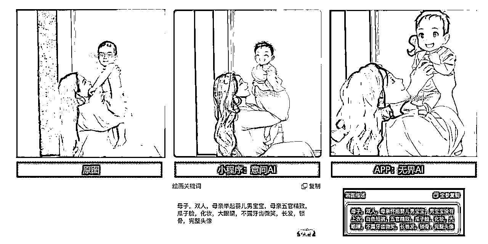
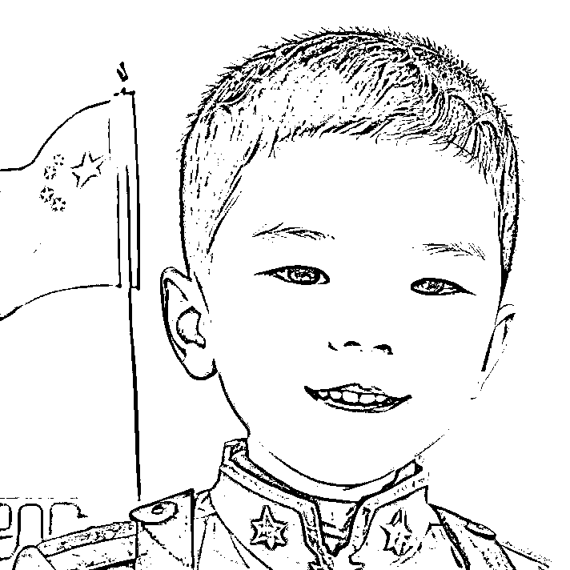

# AI 绘画学习实操心得

> 来源：[https://p4qrowavmb.feishu.cn/docx/Ck4zdUawBoEHY9xbFbLcVPTMnZd](https://p4qrowavmb.feishu.cn/docx/Ck4zdUawBoEHY9xbFbLcVPTMnZd)

大家好，我是书同，我是一个曾从零学习设计到进入世界 500 强外企工作多年的资深平面电商设计，摄影爱好者，自从 19 年有了孩子，有了新的拍摄模特，接过儿童亲子写真的拍摄单子，对摄影的审美还是有些感觉的。

另外，我还有曾经全职开皇冠淘宝店一年的经历，当时店铺经营是提供手工定制服务，对定制类产品一直有兴趣，做过一个 1.5 万粉丝的小红书母婴类账号，这些促成我很乐意去实验儿童人像的定制方向。

这篇文章想主要回顾一下近期对 AI 儿童定制的探索过程，以及 SD 炼丹生成人像学习过程和部分结果

# 一、首先，为什么尝试儿童写真定制方向？

## 一）AI绘画学习和方向探索

在AI绘画刚出来的时候，我作为设计感到危机，立刻学习了 MJ，后来又学了 SD。并且也付费跟了真正靠 AI 绘画赚到钱的人学习了相关逻辑。

个人觉得，虽然 MJ 也很喜欢（下图罗刹精英是 MJ 作品），在人像定制领域，如何提供商业的差异化，就是要像，要抬高门槛，建立护城河。那么就必须是利用好 SD 做到像+创意主题策划，这两点。

秉着先干了再说的原则，所以开始了这场探索的实验过程。市场上对成人模型的教程和模型都很多，技术算不上难，但是因为孩子的案例很少，所以过程里跌跌撞撞，也感谢月起星九一直不厌其烦的帮我找各种解决办法，笔芯

## 二）定制方向的市场/需求分析

1、从人群大类上分

1)宠物

2)孩子（低龄婴幼儿>大童）

3)情侣 ，亲子，等有情感附加

4)成人单人

2、从使用场景分

1)手机壁纸

2)头像

3)写真（形象照，和 Ip 联名，节日节点主题风格）等（这种需求看起来并不太刚需）

4)头像定制出图后再延展为表情包，手工，POD 产品等（还可以延展为定制绘本）

基于以上，属于个人分析，不一定对，欢迎讨论，兴趣出发，先从孩子方向+主题风格策划入手，后面可以根据需求调整。

# 二、理解 AI 技术，如何做到像

在开始我的儿童人像写真创作之旅之前，我首先花了时间深入了解AI技术。

## 一）MJ 人像定制——如何做到像的探索

MJ尝试了以下几种人像风格转换方式，

1、卡通人物

优点：有点点神似，MJ 模型库很大，能做的创意方向很多，很容易做出不错的艺术效果。

这种儿童风格一般会偏可爱的风格受欢迎。但是说实话已经做的有点滥了。

2、3D 人物

优点：上手容易，效果也还行，我这个随便做的，还是不够惊艳。

3、极简扁平效果

1）做了小红书上比较火的一款头像风格，年轻人会比较喜欢

Simple flat vector, Face Shot, Cute, happy kitten with white hair, blue eyes,White shirt,beautiful cute cat, Fashion earrings, flat graphic design, japanese minimalism, minimalist style, red background, by Ichiro Tsuruta, close-up --ar 3:4 --s 100 --q 2 --style expressive

Simple flat vector, Face Shot, Cute, happy kitten with white hair, blue eyes,White shirt,beautiful cute cat, Fashion earrings, flat graphic design, japanese minimalism, minimalist style, red background, by Ichiro Tsuruta, close-up --ar 3:4 --s 100 --q 2 --style cute

2）用亲子照垫图做的一张亲子装饰图

4、真实摄影风格+换脸

以下是小红书部分账号的作品，都是 midjourney 生成加换脸，账号有卖课的应该都是影楼类的买家，还有接单高级定制的。

优点：风格多样，艺术性强，一张图可以反复利用，直接换脸，比起 SD 的 roop 插件,妈妈们反馈，这个像多了。

缺点：不太能稳定输出满足像真人，需要稍作后期，只有正面的脸才容易贴合的好，定价也比较便宜。

Snow, petals flying in the air, Children's surreal photography, a very cute 2-year-old Chinese girl, she defends herself with a sword, in thecenter of the temple, panorama, movie light, a very cute 2-year-old Chinese girl in Hanfu, girl swordfighting martial arts style, Chinese fairy taleoackground is colorful points of light, highlydetailed, dynamic, cinematic, stunning, realisticighting and shadows, dramatic, stunning, 35mmshot, realistic --ar 3:4 --v 5.2

RomptFilm decorated colorful lanterns at a party in the cloud, with many floating lanterns. A 6-year-old Chinese model girl holding a lantern and wearing a white Hanfu looked at the camera with a cute smile and dimples, with a warm glow. Author: Okuyama, Super Detail, Fantasy LOFI Photography, Interior View, Shot on Fuji Film --v 5.2 --ar 3:4

5、问题总结：前面几种，帮朋友做，以及自己做了发朋友圈和小红书之后，效果一般，需要研究妈妈们喜欢的风格。

这三个方式共同的缺点：不够像，需要不停抽图效率低，难度不大市场竞争大，如果不是特别像的级别，就不够惊艳，有些 APP 自己就能实现。

第四种 MJ 换脸方式，也是市面上最多的，方法简单效果也不错，就是有些容易一眼AI，但是妈妈们还是挺喜欢的，也比 Sd 的Roop 像很多，如果不介意的人，也是可以好上手尝试的。

## 二）SD 人像定制——如何做到像的探索

SD 尝试了几个方式：

1、换脸方式——照片转绘盲盒效果

用朋友孩子照片转绘效果，没有放孩子原片，发型，头饰，裙子，鞋子，通过提示词，都还原的还可以。

1girl, blurry, black_hair, long_sleeves, outdoors, white_footwear, bangs, blurry_background, blunt_bangs, hair_ornament, dress, smile, chinese_clothes, green_dress, hair_flower,The Forbidden City Palace,chibi, full body<lora:blindbox_v1mix:1></lora:blindbox_v1mix:1>

2、换脸方式——合影照片转卡通风格

合影有情感加持，但是多人出镜对模型和技术要求比价高，SD 浅浅尝试了一下，做多人一直失败，出来的人都很吓人。反而是用一些基于 SD 的小程序做图，选择二次元风格的，效果还行，有兴趣可以尝试一下。

3、换脸方式—SD roop 插件换脸

从 liblib.ai 下了一个质量还不多的儿童写真大模型，用原模型生成的图，质感确实还不错，不会一眼AI，比MJ生成的逼真很多。

下图是没有换脸的模型直出图，和棚拍模特图，精修图比较非常相近了。

1girl, solo, shorts, shirt, brown hair, child, hat, white shirt, full body, standing, yellow headwear, socks, short hair, sunglasses, watermark, female child, yellow shorts, sandals, english text, t-shirt, glasses, web address, short sleeves, helmet, looking at viewer

a 5-years-old girl, hat, solo, photo background, dress, brown hair, socks, from behind, outdoors, long hair, cosplay, photo inset,Green floral French dress

a 4-years-old girl, solo, curtains, closed eyes, black hair, smile, long sleeves, standing, full body, hair bun, hair ornament, pink and white chinese clothes, facing viewer, earrings

换脸实验：

上图是用照片换脸后的图，缺点：不像,因为涉及到孩子照片，我就不放原片了，妈妈们基本都认不出本人了，所以看起来现在的插件对孩子的换脸效果还有待商榷，或者我还没找到最好用的那款，如果有好的欢迎推荐。

4、换脸方式——定制炼丹

优点：解决了像的问题，门槛高，效果好，

缺点：前期时间花费较多，真实人像的拍摄效果还需要继续研磨

在主题的选择上，策划好是很加分的，可以从共鸣的主题：儿童大多数会喜欢的职业，玩具入手；还可以做节日主题：国庆，圣诞，万圣节，春节，都是发圈高峰期，很有发朋友圈的场景。

Solo, A 4-years-old ((boy)),In this bright scene, a radiant full moon hangs high in the sky, resembling a precious gem. An ancient Chinese pavilion stands by the lakeside, adorned with red lanterns that emit a soft glow. A young boy, dressed in splendid silk Hanfu, sits alone in the pavilion, holding a crimson palace lantern. The candlelight within the lantern casts a gentle golden halo on his face.

In this portrait, a young boy stands proudly in Chinese military attire adorned with a prominent five-pointed star emblem, symbolizing his commitment to defending his country. Behind him, a serene Chinese riverscape, painted with delicate ink strokes, contrasts with his determined posture. A massive red flag flies nearby, representing the flame of revolution and national unity. This powerful image captures the boy's resolve and deep love for his homeland,half-body photo

下面是同一张照片，不同大模型，ip-adapter 搭配 LORA 出图效果，迪士尼风格主题搭配这三种采样方法是测试效果稍微好一些的。下图1是三个采样方式对比的记录。

A 3 year old boy, cute, male focus, solo, smiling, dark hair, blurry background, blur, teeth, jacket, holding leaf, outdoors, bow, looking at viewer, playing ukulele, one foot Stool, blue and white short-sleeved top, white shorts, open mouth, many flowers, green leaves, the background is a small garden,dark eyes, short hair, full body,standing, high quality, 8K<lora:></lora:>

## 三）关于儿童形象炼丹的过程，屡败屡战

1、炼丹基础知识学习

没炼 Lora 之前总觉得很难，特意报了一个炼丹的课程，不过是 IP 方向的，操作过几次，就觉得难度没那么大了，还是挺有意思的。工具用的秋叶的 lora 训练界面，好操作。

2、数据收集和准备

在开始创作之前，我找了 25 张左右人像照片作为训练数据，并进行了必要的数据预处理，包括图像裁剪、大小调整和打 tag。

3、模型选择和训练

选择合适的模型是儿童人像写真创作的关键。我尝试了不同的深度学习模型，SD 1.5 基础模型，麦橘，儿童写真，三款模型做底模，效果是 SD 1.5 最像，其他两个都很难贴近真人本身，训练了 5 次还不行，还在反复找问题所在。

4、创作和后期处理

一旦模型训练完成，我开始使用 AI 来生成儿童人像写真。这是一个充满创造性的过程，我可以调整模型的输入参数，以获得不同的风格和效果。

然后，我进行后期处理，包括颜色校正和细节增强，以确保最终作品的质量。上图是添加插件后的效果对比，固定seed值+ after detail +高清修复，确认细节饱满很多。

因为训练模型不是真人风格模型，尝试了几款大模型之后，我用的最合适的是 checkpointYesMix 这款动漫模型，后面肯定还会多用不同的模型。

In this portrait, a young boy stands proudly in Chinese military attire adorned with a prominent five-pointed star emblem, symbolizing his commitment to defending his country. Behind him, a serene Chinese riverscape, painted with delicate ink strokes, contrasts with his determined posture. A massive red flag flies nearby, representing the flame of revolution and national unity. This powerful image captures the boy's resolve and deep love for his homeland,half-body photo

5、反馈和后期学习

因为 SD 炼丹出写真总是有些失败，也想尝试下 SDXL 炼丹，苦于显卡和内存都不太达标，炼丹看来门槛确实高，先再多多练习SD的 Lora 训练，后面再寻找合适机会学习SDXL。

## 四）变现思路

市场调查显示简单的卡通 Mj 头像已经过了最早的一波流量，很多号开始转为授课了，未来想做一定是要走高端定制路线，我计划是先通过练Lora多研发高品质的定制题材，再从风格策划增加差异化和引爆点。

场景：定制绘本，成Q版形象反差萌，都可以尝试。

想都是问题，做才是答案。尽快通过自媒体测爆款，根据反馈和热点洞察再随时调整。

# 三、总结

从反馈洞察市场反应，经过每一次的探索，反馈是越来越好的，特别是国庆这一批图，可能是因为很像，而且在像的基础上，有一个提升——比生活中看到的可爱孩子多了一些额外的看点。

关于真实摄影写真的效果，虽然炼丹还没有实现，但其实 MJ 也可以实现，在市场有需求的前提下，技术不重要，都可以去多方面尝试。

关于市场需求，或许也是可以通过提供更多选择塑造出需求，自媒体还是要做起来。我还将持续学习新的 AI 技术和创作方法，以不断提高自己的作品水平，感谢这个平台，感谢小林老师的文章审核，月起星九解答Sd问题的帮助，继续在 AI 破局俱乐部多学习变现思路，早日形成闭环。