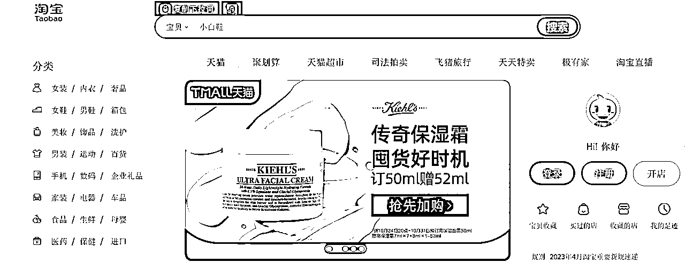
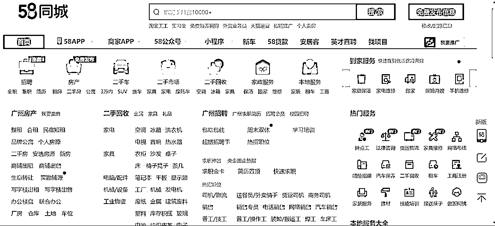
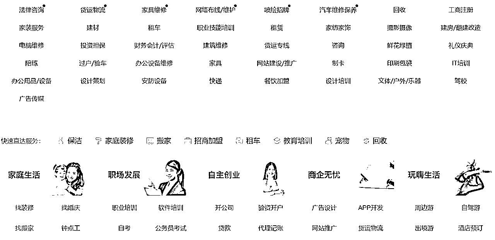
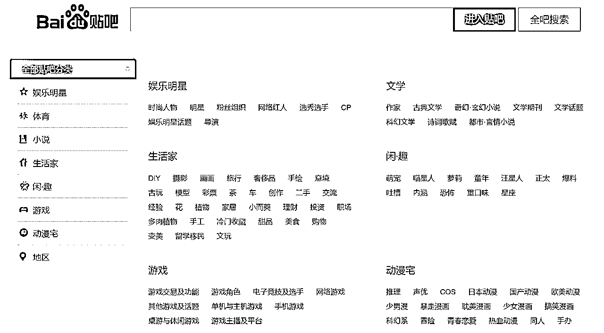
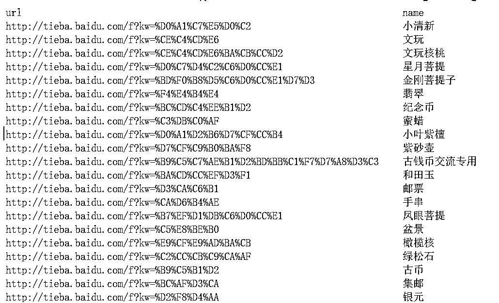
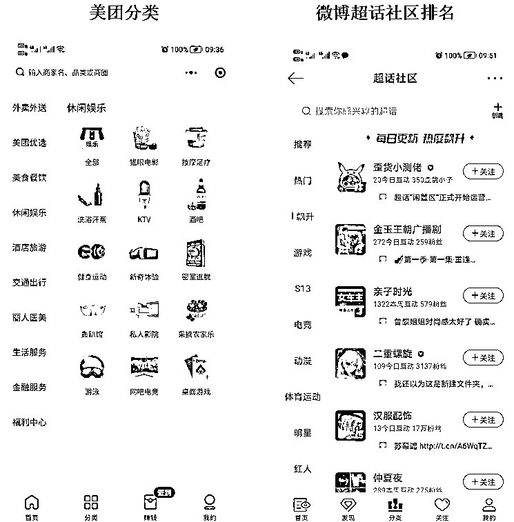
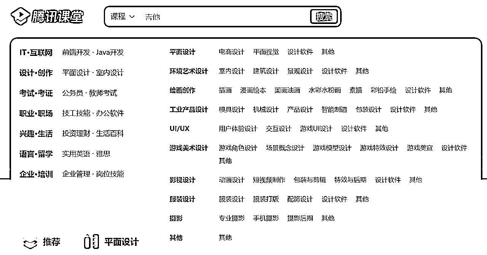
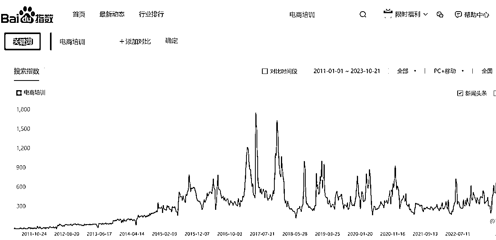
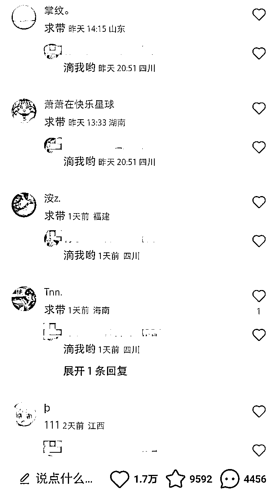
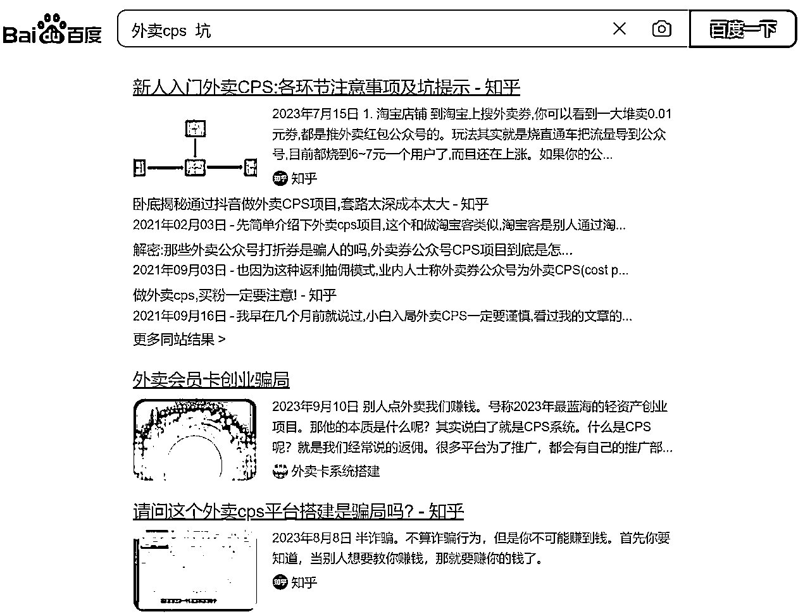

# 每个创业者应具备的思维——选品思维

> 来源：[https://aijnqrlsr5r.feishu.cn/docx/D27MdK6L2o8nEexASS0ctJHrnbc](https://aijnqrlsr5r.feishu.cn/docx/D27MdK6L2o8nEexASS0ctJHrnbc)

每个创业者应具备的思维——选品思维

选品对于电商人无疑是非常重要的，所谓“7分靠选品，3分靠运营”，同理对于我们创业者做项目来说，同样可以适用。

选择好的行业好的赛道，即使一样的运营能力，其结果可能也千差万别，选择上升期有红利的赛道，那可能乘风而起，选择落寞的行业，那做再多的努力可能也没有什么结果。因此，也就有那句话“选择比努力重要”。

关于如何选品，已经有很多大佬讲过了，今天我给大家讲了主要是关于如何用选品思维，筛选项目，希望能帮助大家一二。

由于我本人并非是做电商的，关于选品方法是借鉴了古辛、盗坤、丹牛等大佬（以及还有很多没有提到名字的大佬），由此发散出来的，在此也由衷感谢各位大佬的分享，虽然我没有从事电商相关行业，但是从方法论中迁移出来的思维对做其他行业也同样适用。

## “利用淘宝分类页获得关键词”。

电商大佬都提到了从淘宝等平台的分类页中获得灵感。

其原理就是从导航页中了解有哪些项目可以做。同理我们也找到其他的导航页，从而筛选我们的项目。

特别对于新手小白来说，找项目或许是比较困难的，往往是看到别人在做什么项目，然后一头扎进去，最终却没有什么成绩，所以了解整个行业分类是非常有必要的。

下面介绍几个可以查看项目分类的方法：

#### 58同城，众多本地可直接操作的项目：

虽然这些是58同城里的项目，但是我们可以迁移，大佬们说“所有的项目都值得用短视频做一遍”、“所有的项目都值得用社群做一遍”、“所有的项目都值得用私域做一遍”，因此我们可以思考这些项目是否可以在抖音做、小红书做、社群里做。

#### 贴吧：

贴吧也有导航分类，每个贴吧都是一个项目。我曾经搜集了60万的贴吧数据，里面有些项目是我之前闻所未闻的，也算开了眼界。

#### 美团分类和微博的超话社区：

这里也躺着很多项目

#### 教育行业的腾讯课堂：

腾讯课堂里面有众多的课程分类，除了腾讯课堂外，还有荔枝微课、抖音的学浪等都有课程分类。

#### 以及还有医美、加盟、旅游、珠宝等行业都可以找到这样的门户导航网站，从中可以筛选细分的项目。

ps：不会找的伙伴，可以尝试在百度中搜索“行业 网站”、“行业 导航网站”等关键词。

#### 另外还有淘宝、拼多多、京东等电商平台。

这些对于非电商人也一样有借鉴意义，重点关注“异常值”、“排名”等数据。我自己从淘宝中挖掘了一个虚拟类的项目，然后在其他平台操作，被动躺赚了3w，虽然不多，利用的就是跨平台的方法，后续有时间再分享出来。

## ”选择竞争相对小的产品“

其实意思就是选择需求量大，但同时同行少的项目。

需求量的多少我们可以从百度指数、生意参谋、微信指数、抖音指数等数据作为参考，搜索量是反应需求最直接的数据，同时也可以很直接的反应一个行业是上升还是稳定期。

对于非电商人来说，也建议用生意参谋查一下，或许有意外的收获，生意参谋可以按月租，几十块钱。

除了查看搜索量，我们还通过点赞、评论、下单等数据来判断。

例如之前秦汉唐圈友在挖机玩具加盟，就是通过看一个抖音视频，评论区都是咨询如何加盟，这样的数据那基本可以判断出需求比较强烈。

我们可以把项目关键词放到抖音、快手、小红书等各大平台进行搜索，查看作品的点赞、评论等数据

特别是如果看到他们的作品比较一般，但是数据却异常的好，这时往往有大机会。

## 筛选项目

通过上面两个方法，或许我们已经有了一些意向的项目，但是最终选择项目仍然需要进行评判。

所谓选品重点是在于一个“选”字，筛选是重点，那从哪些方面进行筛选呢？

*   上升行业：

选择项目，当然要选择有红利在快速发展的行业。行业是否处于上升阶段，一方面是根据我们的主观判断，同时也可以请教这个行业内的专业人士，同时也可以根据上面搜索指数的方法，搜索指数呈上升状态的一般都是上升行业。

*   市场规模：

看这个项目做的最大的龙头规模有多大，如果目前最大的一年也就赚一百多万，那我们刚入局的来说，一年至多也就几十万，那就要评估这个项目值不值得做了。当然，如果你将这个项目作为一个跳板，想后续切入一个更大的赛道，那就另外说了。

*   高客单价/低客单价：

50元的产品和5000元的产品相差100倍，需要100单低价品才能抵得上1单高价品，因此往往建议做高客单价的项目。

当然，不同的价格需要不同的服务，几元几十元的产品，在平台上就能够转化，但是上了1000元的产品，往往需要一对一才能够转化，所以一般需要将流量导到微信进行转化。

（高价）客户往往更在意效果，服务时更需要宣传使用产品后可以到达什么样的效果，（低价）客户往往更纠结于价格，服务时需要让客户有占到便宜的感觉。服务（低价）客户在一定程度上会更累的。

对于没有团队的个人来说，是不是高客单价项目就不能做了呢？并不是，在带货领域同样有几百上千单价的产品，而且毛利率比较高的，针对的中老年人群。而且还可以用上之前圈友讲的“中介思维”，很多项目并不需要自己去转化的，我们充当中介，找公司机构进行合作，按照cpa结算，或者根据成交来返佣。

像培训、定制旅游、医美、翡翠文玩、加盟、留学移民、白酒、茶叶、二手车、奢侈品、植发种牙、婚庆摄影、装修、房产中介、大型机械设备、驾校、情感咨询、金融、落户、代运营等，这些都属于高客单价。

*   目标人群：

人群可以从多个角度划分，学生/上班，打工人/老板，男性/女性，体制内/体制外，年龄，职业，大城市/农村，富人/穷人，对产品的认知程度。

不同的人群，决定了不同的付费意识、付费能力，会直接关系到转化率和最终结果的。也决定了项目能否支撑起高客单价。

我们在筛选项目，以及对项目进行定位时，尽量选择付费能力高、消费意愿强的人群。举例，圈友小哈哥做职业规划，一开始把目标人群定位在即将毕业和刚毕业的学生群体，但是他们的付费意识太低，没有经历过社会的磨砺，不愿将钱花在提升自己，后来将目标人群定位在上班族，付费率大大提高。

另外再举一个关于用户对产品认知程度的例子：老龄化越来越严重，这是一个很多人都认识到的事情，然后有人以“养老”为主题打造一个加盟项目，在相关的作品下的评论区我也看到了汹涌的需求，很多人留言怎么做，因为大家都觉得养老是个大市场，觉得这个项目有搞头，这个利用的就是用户的认知。

*   复购/一次性：（高频/低频）

对于有复购的产品来说，只要转化了一次，后续转化就比较容易，1000个微信的精准客户可以养活一个人好几年。而且复购频率越高越好，像减肥、白酒等赛道为什么流量那么贵，前期甚至亏本获取用户，因为复购太高了。

像化妆护肤用品、猫粮狗粮、白酒、茶叶、黑五、奶粉、二手奢侈品、成人用品等，都是复购高的，我们筛选项目时，尽量选有复购的项目。

*   季节性：

很多项目是一年四季都可以做的，但是有些项目是有季节性、周期性的，只有夏季/冬季可以做，或者一年只可以做一次，例如高考志愿填报，只有6月份的短暂时间；例如小龙虾只有夏季的烧烤季节火爆。做这些季节性项目，得计算好其他成本，有圈友一年只租2个月店铺，用来做小龙虾外卖，也能赚个10万。

对于一般人来说，尽量筛选一年四季都可以做的项目。

*   实体品/非实体品：

实体品就是能看到摸得着实物的，而相对应的就是非实体品，例如：虚拟电子资料、教程、课程、培训、陪跑训练营、社群、考试、软件、网站、vip会员、账号、激活码、设计、起名、风水、星座、塔罗、驾照、学历提升、落户、加盟、情感咨询、各种服务、各种查询测试、各种修复、各种代运营、各种代理、各种咨询等，都属于非实体项目。

相对来说，非实体项目成本较低，或者成本为0，比较适合新手小白操作。

*   标品/非标品：

非标品往往更容易做出产品“溢价”，通过差异化做出高价，从而提升客单价和毛利率。非实体产品往往是非标品，像培训、服务、虚拟品一般都没有标准化。对于非标产品来说，更需要重点研究用户的需求和痛点，针对需求痛点进行差异化的创新，从而切入市场。简单来说，就是非标产品的可操作性，更有可能出成绩。

*   供应链可控/不可控：

有些项目的产品供应链是无法掌控的，例如，盗坤举例的在小红书卖活体猫，猫是从别人那儿收过来转卖的，但是猫的质量无法掌控（收过来的往往是质量不大好的，质量好的别人自己轻易就卖出去了），因此转化不稳定，而且经常有售后问题，因此项目没法做下去，就是因为产品的供应链无法掌控。

*   轻决策/中度决策/重度决策：

相对来说，低价产品或者日常用品，人们一般都是当场就决策了，并不会花很多时间思考买哪款，这属于轻决策；而高价产品、涉及人生重要的事情，我们都会花比较多的时间进行重度决策，例如加盟、房产、离婚律师、婚礼策划、各种高价产品等，对于需要重度决策的产品，客户一般更重视效果、权威、信任、安全等因素。无疑，重度决策的产品一般需要导流到微信进行转化，更需注重人设的打造。我们筛选产品时可以结合自身的特性进行选择。

*   刚需/非刚需：

刚需和非刚需并非绝对的，只是相对而言。但是一般来说，用户有需求，又没有其他替代品的时候（或者没有其他更佳的方案），这个产品对用户来说就是刚需了。

刚需产品用户一定会买，差别是买你的还是买同行的。刚需产品用户一般会有明确的需求，适合做各个平台的搜索seo，淘宝等电商平台的免费流量其实也是一种seo。

*   效果型/非效果型：

有些产品是在使用后很快可以体现出效果的，例如化妆品、药品、美容；有些产品在使用后需要比较长时间才能体现出效果，或者干脆体现不出效果。

在某些行业这个无法作为一个有效的评判标准，但是在一些非标品的项目里，这个评判标准是很有用的，例如：在两个知识付费课程，一个做直播带货课，一个做职场提升课。直播带货课程很快就可以看到学员的效果，卖了多少货，在宣传时可以更轻松的展示我们的课程效果；而职场提升课，学员收获的效果得按年来计算，需要比较长的时间才能展示我们的课程效果。这里不是说职场提升课不能做，而是同等条件下，难度肯定要更大。因此在非标产品中，尽量选择能直接体现效果的项目。

当然如果选择了非效果型的项目，那则需要在仪式感、信任背书、检测、情绪激发等方面做出努力。

*   地域性：

筛选项目时，也要考虑是否有地域限制。线下实体项目一般都有地域限制，辐射范围在周边的一些地方，对于线上的项目，也要分析受众范围有多广。

*   以及还有：

耐用品/消耗品

服务的一对一/一对多

产品可改进/不可改进

大家可以从这些角度去分析。

以上的筛选角度，我们不可能面面俱到选到最好的一面，但是我们尽量多考虑一些角度，多选择一些有利于我们的项目，像亦仁老大之前分享“非标、高毛利、高客单价、可以支撑复购的产品”，这样的是好项目。

## 避坑

*   数据验证

上面说通过数据来挖掘机会，但是有时数据不一定是真实的，有可能人为在刷，所以需要多方进行验证。

*   避坑方法

不同的项目可能有不同的坑，我们无法一一预测，但是有个比较好的方法进行减少，就是通过搜索的方法。在百度等地方，输入“行业 坑”、“行业 骗局”、“行业 垃圾”等等相关的关键词，里面不但有一些可以避的坑，反应这个行业的问题，以及还有同行的一些套路，值得我们学习的。

## MVP测试

根据自己喜欢什么？擅长什么？有哪些技能？有哪些资源？结合项目进行评估，最终确认项目。

确认项目后进行MVP（最小可行产品）测试，使用尽可能低成本、快速的方法测试项目是否可行，形成完整的盈利闭环。后续再快速迭代、搜集反馈、验证假设，避免闭门造车。

以上就是我关于创业者“选品思维”的一个分享，若有不足，或者未罗列完整的，欢迎评论区补充。