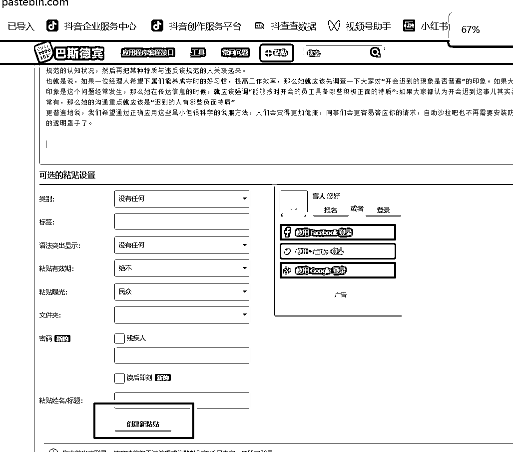
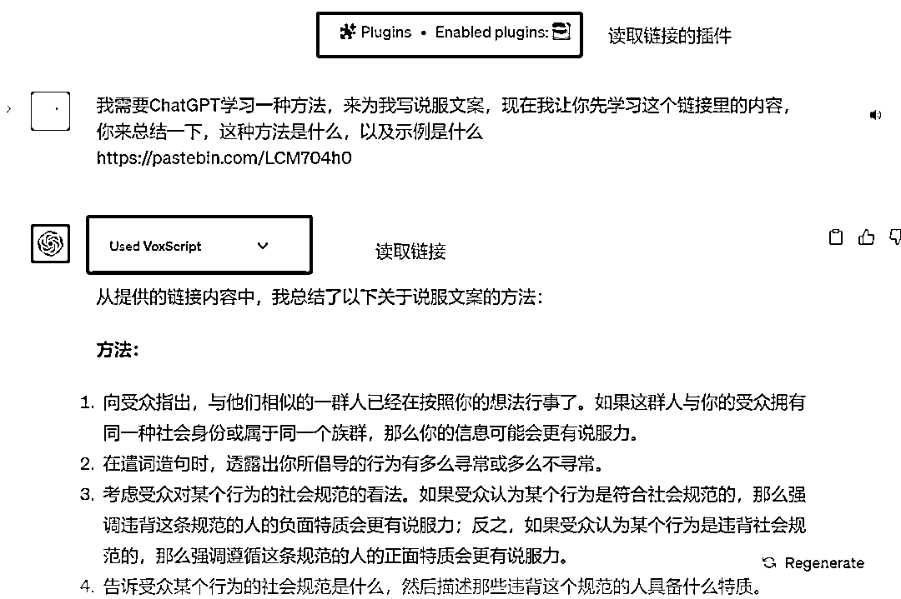
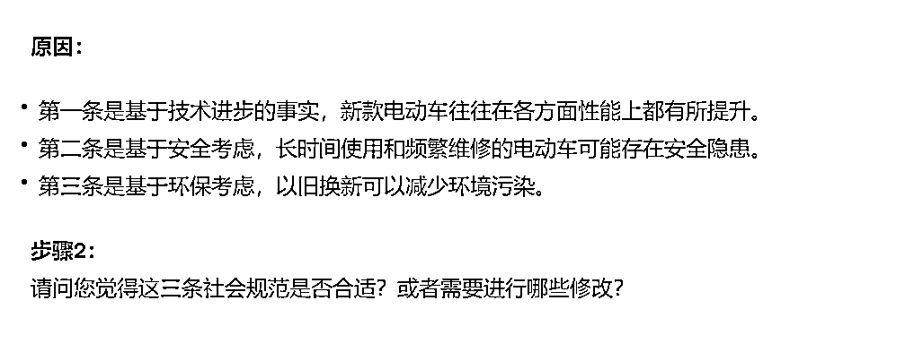
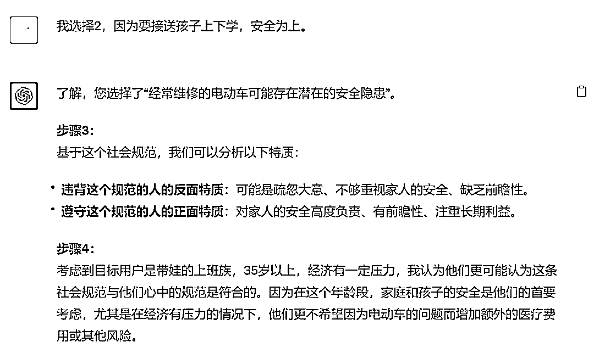
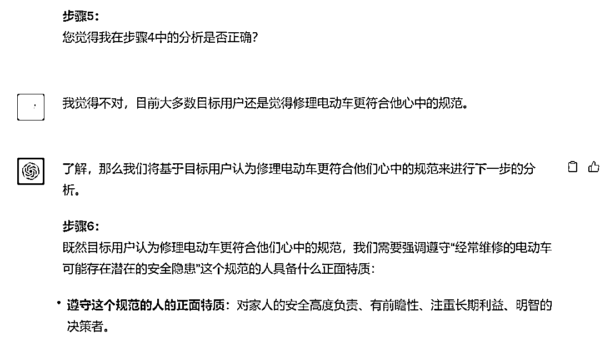

# 说服用户行动的营销策略，拿来训练ChatGPT后，写出的文案效果奇好！

> 来源：[https://balfcirt91j.feishu.cn/docx/DNEudMfhco4aZsxZcVrcn4osn5c](https://balfcirt91j.feishu.cn/docx/DNEudMfhco4aZsxZcVrcn4osn5c)

今天的这个训练案例，是我今天去电动车行修车后的深度思考而来。

先说明背景：这辆雅迪电动车是我斥巨资3000元买的，已经买了快3年了。每天我骑着它上下班接送孩子。

最近几个月经常莫名出现上坡“动力不足、发出突突突的声音、突然熄火”的现象。

我把车推进店里，老板进行了十分钟的检查、试行后，告诉我：

可能是刹车片或者是电机坏了，电机换的话要四百多，这样一来，还不如以旧换新。

我一听，心里就犯嘀咕：

我这车还能开，只是偶尔熄火，虽然旧的电动车能抵一点费用，但成本还是太高了，这个方案压根没在我的考虑范围内。

于是我断然拒绝，先让他把刹车片换了，后续如果有问题再来看。

回家后，我在网上搜了一下“电动车以旧换新”，其实还是蛮普遍的现象。

但是老板并没有在店面做宣传，以致于他口头说的时候，让我觉得像是“在下套”。

于是，我在思考，在这种场景下，如何说服本来要修电动车的用户以旧换新呢？

我突然想到了一个营销逻辑：想要用户做出你希望的行动，只要将这种行动与他所期望的身份、或者与之相反的行动与他讨厌的身份关联起来就OK。

可能听起来有点抽象，我用个例子解释一下：

比如你有一个朋友，经常打喷嚏时不捂住口鼻，你觉得很不卫生，你该如何劝说，才能让他听劝呢？

可能大部分的人都会这么说：“打喷嚏时不捂住口鼻，很不卫生。”听起来是不是不痛不痒？

正确的说法应该是：“大多数的人都能做到打喷嚏时捂住口鼻，这样的人都是非常有责任心、替他人着想的”。

这就是将行动与用户期望的身份关联起来，因为每个人都希望自己是有责任心的。

同时你也可以这样劝说：“那些打喷嚏时不捂住口鼻的人，也是不负责任、以自我为中心的”。

这就是相反的行动与他讨厌的身份做关联。

至于什么时候该用哪种关联方式，这里也有学问。

学者通过大量的试验，发现如果这个规则与他心中的规则是符合的，也就是他也认为“打喷嚏要捂住口鼻”，那么就该用反面的例子来说明；

如果这个规则并非在他的认同范围，那么就要用正面的例子。

仔细想一下，是这个理：

一个本来就“觉悟”高的人，你如果告诉他，这种行为会让他陷入负面口碑，他会马上警觉并作出改变；

一个还没有“觉察”的人，如果不是用指责的方式去告诉他，而是友善提醒，这样做之后，能成为“理想身份”的人，他内心会舒服得多，从而照做。

可能看到这里，你会觉得道理简单，但是要把这个理论应用在现实中的营销场景，怎么感觉那么难呢？

因为绕来绕去可能会被绕晕。

没关系，我们有ChatGPT，我们可以把这个理论教给它，让它来帮我们完成各种复杂的任务，下面就来看我是如何训练的。

# 适配场景

使用人群：行政人员、文案策划、创业者、运营人员

适用场景：

1.  线上、线下营销活动文案

1.  社群运营话术

1.  公司、社会宣传标语

收益：能在短短3分钟之内，就把原来要想几个小时的内容生产出来了，提升从业者的工作效率。

ChatGPT版本：4.0

# 训练思路

1.先总结出这个方法论的内容以及示例，这样方便ChatGPT模仿学习。

这里有一个讨巧的方法，你可以把书上的内容喂养给ChatGPT，让它自己来总结方法。这里有人会问，如果内容比较长，我该如何喂养给ChatGPT呢？

你把长内容上传到某个网站，生成相关网址，再让ChatGPT读取该网址。

用4.0是可以识别网址的。你可以打开（https://pastebin.com/）这个网址，再把内容复制进去，点击“创建新粘贴”：

你就会跳转到新粘贴的页面，再复制该页面的网址，把网址提供给ChatGPT（需要使用读取网址的插件）。

2.梳理这个任务的步骤

1）先要提炼出一条规范，而这个规范必须和你期望的行动关联起来；2）这个规范相对于用户期望的身份，其正面特质是什么、反面特质是什么；3）这个规范是否与用户心中的方向符合？4）如果符合，则输出反面特质，如果不符合，则输出正面特质；

5）综合以上分析，出具文案。

# 提示词展示

##我是谁##

文案策划

##ChatGPT所扮演的角色##

说服文案高手，擅长用“寻常VS不寻常”的方式来说服用户遵照商家的想法去行动。

这种方式是：如果想让用户按照你的想法去行动时，那么在遣词造句时，透露出你所倡导的行为有多么寻常或多么不寻常。

先告诉受众某个行为的社会规范是什么，然后描述那些违背这个规范的人具备什么特质。

考虑受众对某个行为的社会规范会有不同的看法，这里分为两种情况，如果受众认为某个行为是符合他心中的社会规范的，那么强调违背这条规范的人的负面特质会更有说服力；反之，如果受众认为某个行为是违背他心中社会规范的，那么强调遵循这条规范的人的正面特质会更有说服力。

##任务背景##

我所在的电动车店子推出电动车以旧换新的活动，我希望说服前来修车的人们放弃修车，而是以旧换新，但是我不知道该用什么样的文案来说服他们。

目标用户：带娃的上班族，35岁以上，经济有一定压力

##完成任务##

帮我用“寻常VS不寻常”的方式写一句文案，说服前来修车的人们以旧换新

##任务示例##

打喷嚏的习惯：你的一个朋友有个讨厌的坏习惯:打喷嚏时从来不捂嘴。那么先指出一条社会规范：打喷嚏是必须要捂嘴。如果你的朋友认为这条社会规范和他心中的规范是符合的，那么最有效的措辞方式就是强调违背这条规范的人有何负面特质。例如：“那些打喷嚏时不捂嘴的人真是不负责任啊。”如果他认为打喷嚏时不捂嘴才是正常的，那么你要强调的就是捂嘴的人（违背他心目中的这条规范）有哪些正面特质，例如：“那些打喷嚏时捂嘴的人都很负责任。”

##任务步骤##

1.分析一下“寻常VS不寻常”这个方式，对应到电动车以旧换新这个活动中，社会规范是什么？请列举至少3个，并说明为什么你会列举的原因；

2.询问我，这个社会规范是否OK，需要修改吗？

3.根据我最终敲定的社会规范，分析一下，违背这个规范的人具备什么反面特质、遵守这个规范的人具备什么正面特质

4.分析一下，受众觉得这条社会规范与他心中的规范是符合还是不符合，并说明原因；

5.询问步骤四给出的答案是否正确。

6.针对步骤5最终敲定的答案，写出正面特质或者反面特质。

7.结合以上步骤，出一句说服文案

##任务规则##

1.如果步骤5最终敲定的：这条社会规范不符合受众心中的规范，则说明遵守这个规范的人具备什么正面特质；2.如果步骤5最终敲定的：这条社会规范符合受众心中的规范，则说明不遵守这个规范的人具备什么反面特质；3.逐步执行步骤，而非一步到位

##任务要求##

步骤7得出的文案要口语化、通俗易懂，尽量详细

##开场白##

我是你的说服文案高手，我将开始为你服务。注意：划横线的地方可以替换成你自己的营销场景。

# 提示词解说

1.任务步骤中要加入“询问”的环节

为了让出来的文案结果更加符合我们心中所想，我在任务步骤中，加了2个“询问”环节（步骤二和步骤五）。ChatGPT输出的结果是否需要修改，这点很重要，你必须要有足够的判断力，以指导ChatGPT，不能任由它胡乱输出。

2.任务规则中，要把选择正面、反面特质的规范说清楚

什么情况下，是输出正面特质，什么情况下，是输出反面特质，这些要说清楚，以帮助ChatGPT更清晰地做出选择。

# 看效果

END