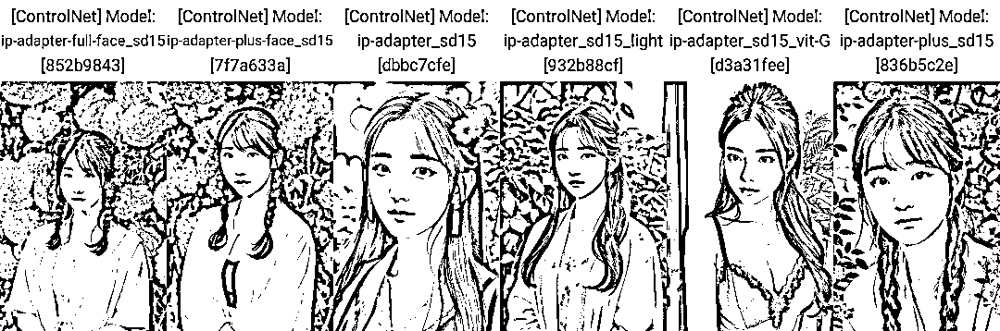
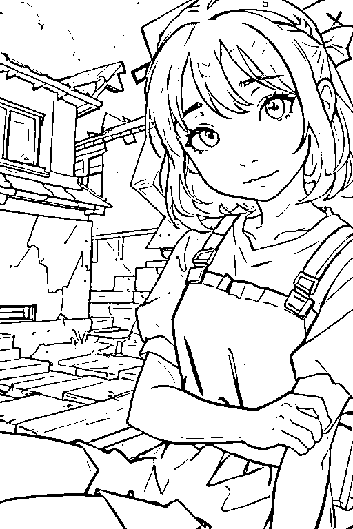
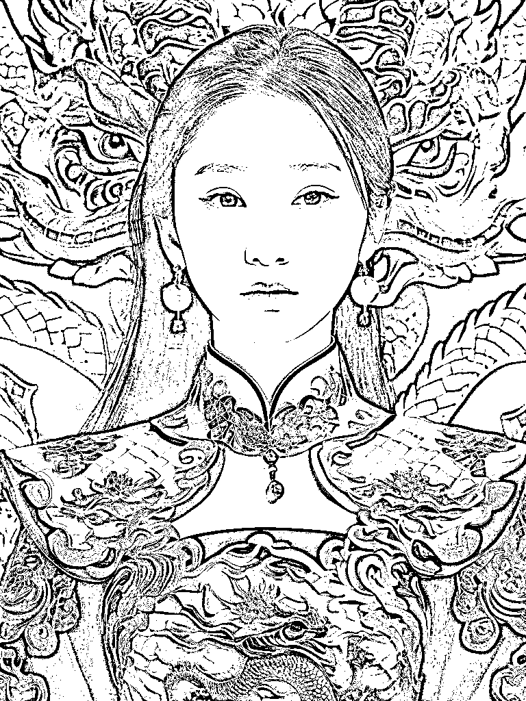
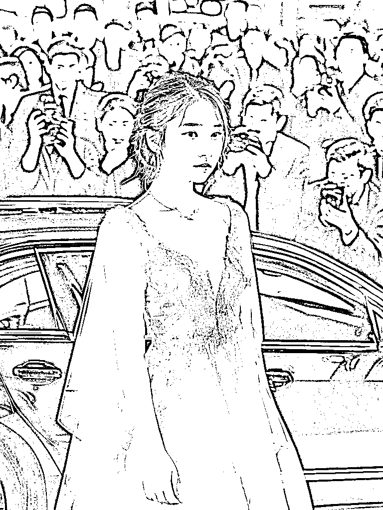

# 三年AI图像工程师跟你分享，无限贴近真人的调教方法，助力AI变现

> 来源：[https://mas0abfc08d.feishu.cn/docx/Dnred0RIBoBOYdx6NviciauynHh](https://mas0abfc08d.feishu.cn/docx/Dnred0RIBoBOYdx6NviciauynHh)

大家好，我是星九，一名工作第三年的AI图像工程师，喜欢拍照，喜欢鼓捣人像写真，加上本职就天天与图像打交道，所以在选择 AI 的深耕方向时，自然选择了更可控的 stable diffusion + 人像方向。

对于人像，我的研究重点主要是如何让脸更贴近原图。这篇文章就通过一些专题的实践，讲讲我在三个月里对还原人脸的一些出图思路、技巧和心得，会从出图思路、优化方向出发，逐步拆解，希望能给大家带来启发。

本篇的重点内容有：

如何根据一张图像还原人脸？

如何使用 stable diffusion 完成脸部相似的真人转漫画？

如何快速搭建一个可用的人脸 lora ？

如何基于模板照片换脸？

如何借助 SDXL 的能力出创意写真？

# 一、初次接触 AI 绘画

我从去年 12 月份第一次接触 stable diffusion ，但真正玩起来还是在今年 6 月有了显卡之后，虽然错过了 1-5 月的蓬勃发展期，但从 6 月底以来公众号垂直更新AI绘画内容，已经积累了 1800 多粉丝，也建了 SD 交流群。

我最初的头像，就是去年 12 月时，使用文生图参照着我当时的特征去写的提示词（白色毛衣，中长发，星星背景）：

现在我的头像已经迭代了一版，使用了 lora 更贴近真人了。controlnet 的出现也对 SD 出图有了更强的控制，能够直接参考人脸特征和其他写真图片的风格。

但学会看图说话，仍然是一个很重要的能力。下面第一个案例，就是讲如何在没 lora 的情况下实现漫转真人。

# 二、AI人像定制方向

区别于完全二次元的头像定制，真人漫改或者AI写真市场的需求还是很大的。工欲善其事，必先利其器，要想做出个名头，让顾客认可你的效果，那人脸还原度是一定要去追求的。

目前基于真人定制的图像主要有漫改类还有AI写真类，先看下目前类似的账号。

## 一）Q版头像

拿明星脸做成果图引流，可以让观众更有共同话题，大家自发去认明星，互动率就高了。且明星脸大家是比较熟悉的，所以更容易看出效果是不是真的好。

作者有说过需要20张人脸，那么肯定是需要lora出图的。加上SD模型有很多，只要你训一个lora，就能在多个模型上出不同的效果。

## 二）AI职业照、写真照

MJ有个很大的问题，就是皮肤效果还不够真实，相比较来说SD的模型能够自己训练，关于人像的出图效果也更好。

虽然小程序现在也一大堆，比如妙鸭，但自动化并不能满足所有人的需求，对于职业照这种必须要像本人的情况来说，私人定制还是有市场的，况且顾客喜欢的模板，人家APP不一定有。

如果想做形象照定制，完全可以走收集模板+换脸的路子，就像现在小红书上也有很多PS接单做证件照一样，但是这个路子也是有坑的，使用不同的工具，换脸的效果也有所差异，接下来就让我慢慢道来。

# 三、动漫转真人

我的第一次 AI 出单，就是因为有个从公众号来的小伙伴有个动漫转真人的需求，不需要特别还原动漫，只需要有那个感觉就行，唯一的要求就是胸大（可能主要为了瑟瑟），需要一套图，15-30 张。

如何在没 lora 的情况下实现漫转真人，首先就是要根据人物特征反推并细化提示词。

## 一）出图思路

大家听到漫转人，应该会想到这种图：

这种使用线稿控制出图，选择真人大模型出图就可以，但是我需要的是出一套场景变换、人物动作变换的图像，原型要求是迪士尼的茉莉公主。

我问他要了下其他漫转人的样图，他给了冰雪奇缘的，可以看到发型还是蛮还原的，不过衣服啥的不需要完全一样，类似就 ok 。

所以出图思路：

1、写实类大模型，画风精美，需要外国面孔

2、如果有现成的人物 lora ，就可以更好地控制出图，迪士尼公主应该有人会炼

3、提示词改变场景、表情等

## 二）实操：初步效果

选用了比较出名的 absolutereality_v16 模型，是一个非亚洲面孔的写实模型https://civitai.com/models/81458/absolutereality

最开始我没有找到关于茉莉公主的 lora ，所以我选择提示词直接出图，给客户先看下效果是否符合预期。

不知道怎么写提示词，先使用 tagger 反推一下：

然后直接用提示词出图看看效果：

tag 上的人种、服饰、装饰、姿势都比较齐全了，不过在服装颜色方面、装饰细节方面还不太对，因此基于这个提示词进行修改，规定服装颜色、头饰等。

茉莉公主这个发带实在不太好还原，但可以出皇冠或者吊坠的图像。

最终发了几个效果图给客户，客户看中下面两张图中，第一个的皇冠，第二个的脸，并且要求后面的是同一张脸。

## 三）固定人脸

他要求同一个人的脸，我就有点犯难了，我总不能专门去训练一个lora吧。而且训练lora也需要十几张同样的脸，也不是一件容易的事。

当时试过 controlnet 的 reference，但是如果对图片风格不统一的真人照片，想换得像还是有点难。但我这个是同一个模型生成出来的，感觉可以尝试一下。

因此我出图之后，用图生图蒙版把脸部覆盖，选择客户想要的那张脸，开启 reference only 模式，同时开启AD修脸插件。

蒙版是为了只参考和修改脸部，其他部位不能有什么干扰，重绘区域选择仅蒙版区域。

controlnet 选择 reference 设置，可根据出图效果去调整。

只开 controlnet 出图多半脸不正常，截图一下我的中间出图结果，比如可能会出现，脸部不贴合、比例不对、肤色不统一等问题。

所以需要开启 ad 修脸，就能把比较奇葩的脸修回来。

不过当时出图是两个月前，现在很多插件模型都更新了，我这两天复现了一下，同样的参数不如当时像了。

后面在C站上找到了茉莉公主的 lora ，为了发型更一致，使用lora也出了些图，可以看下当时的效果。

## 四）优化流程

之前用 reference 方法+修脸插件，直接把脸换成功了，主要也是因为图源比较统一，不然拿这个图换我的脸， 是不太行的。

但是重绘的操作可以用检测脸部算法来替代，那就和 roop 的原理一样，这次趁复盘的机会也做几个新实验。

### 1、直接图生图 roop

使用图生图，调整重绘幅度为 0 。

可以看到直接 roop 还是不错，因为这个图片本来就不是特别写实的感觉， roop 的质感还是能接受的，而且 roop 对外国人的脸比亚洲脸支持得要好。

这个表情的嘴部是微张的，也很好地还原了原图的表情，跟上面的 reference 效果基本是差不多的。

### 2、图生图 roop +修脸插件

试用了两个修脸插件，可以看到加了的话，妆感会更贴近与原图，如右边 fe 的出图妆感就更重一些。

到时候可以根据实际出图情况去选择是否加修脸插件。

## 五）总结

固定人脸的操作，优先 roop ，而且图源相似的情况下，换脸效果也会更好。

其次 reference 也是常见的一种参考脸部、物体材质的控制方式，不过现在 IP Adapter 出来了，参考效果会更好，遇到需要参考的问题也可以优先查看 IP Adapter 的效果。

# 四、真人转动漫

## 一）出图思路

目前真人转动漫也有几个思路，一个是直接利用线稿，选择相关风格的模型去出图，这样参考的就是原图的整个构图形式，局限性比较大，且对脸部只是近似的还原，不一够形似。

那怎么使漫画的脸更像真人呢？这个可不能拿真人脸去 roop 哈，不然就是这样：

你可以训练 lora ，让模型学会你脸部的特征，再配合模型出图，可以指定画面元素，不过需要数十张照片去练模型，成本高一点。

还有个省事的方法，利用 controlnet 相关模型去参考脸部特征，一张解决问题。

下面结合几个具体案例，讲一讲出图流程。

测试时使用一个皮克斯模型 https://tusiart.com/models/611691394094059626

## 二）线稿出图

线稿出图，需要最大程度还原整个画面的内容，因此需要进行tagger反推。

在控制方面，只需要输入一张图像到 controlnet ，开启线稿模式即可。

tag 是否贴近画面的对比：

这种方法在出图尺寸、画面修改上略有受限。

## 三）一张人脸参考出图

使用 controlnet 的 IP Adapter 模型，选择 sd15face ，这个就能最大程度得去参考脸部特征，把你的发型都能还原地差不多，而且不需要考虑原图像的尺寸。

只参考脸部和发型特征，选用 face-sd15 即可。这时候不写原画面提示词，模型只保留你的头部特点，其他都可以变化。

当然也可以选用 ip-adapter_sd15_plus 这个模型，它能把背景和人的穿着都参考到，最大程度还原，ip-adapter_sd15 不如 plus 准确。

不过，我测试过好多图像，如果想还原发型和表情，还是 face-sd15 最准确，其他的发型不如这个还原。

可使用这个控制方式时，可以自己尝试调整控制权重，根据出图找到自己喜好的阈值就可以。

这种方法就不受线稿的限制，可以变换姿势。

这样绝对是比 MJ 更加可控、更加像的，有做定制头像的，可以用这个方法去出图。

### 1、其他玩法：利用 IP Adapter 固定人脸

现在IP Adapter越来越强大，虽然对于真人图无法百分百还原人脸，但是能作为一个固定角色的方式。

比如，我针对SD1.5模型和SDXL模型，使用IP Adapter模型做了实验：

SDXL模型，推荐使用plus face sdxl vit-h模型出图。

SD1.5模型，推荐使用plus face sd15模型出图

### 2、实践：利用 IP Adapter 快速搞定动漫、手办图

使用IP Adapter方法可一键参考人脸，做手办摆台效果：

大模型：majicMIX realistic 麦橘写实_v6

手办lora：https://www.liblib.ai/modelinfo/4632a6702ac044d8aaab722fcd42de60

只需要一个IP Adapter控制

上述是 SD1.5 模型，所以选择 1.5 版本的 IPA face模型

注意预处理器、模型选择，控制权重根据效果调整。

提示词部分，注意此lora有个摆台的触发词：

best quality, shouban, chibi, girl, full body, faux figurine,<lora:shoubanv2.0:1.2></lora:shoubanv2.0:1.2>

Negative prompt: badhandv4, (EasyNegative:1.2), badhandv4, NSFW, (worst quality:2), (low quality:2), (normal quality:2), lowres, normal quality, ((monochrome)), ((grayscale)), skin spots, acnes, skin blemishes, age spot, (ugly:1.331), (duplicate:1.331), (morbid:1.21), (mutilated:1.21), (tranny:1.331), mutated hands, (poorly drawn hands:1.5), blurry, (bad anatomy:1.21), (bad proportions:1.331), extra limbs, (disfigured:1.331), (missing arms:1.331), (extra legs:1.331), (fused fingers:1.61051), (too many fingers:1.61051), (unclear eyes:1.331), lowers, bad hands, missing fingers, extra digit, bad hands, missing fingers, (((extra arms and legs))), lowres, bad anatomy, bad hands, text, error, missing fingers, extra digit, fewer digits, cropped, worst quality, low quality, normal quality, jpeg artifacts, signature, watermark, username, blurry

shouban, chibi是模型触发词，要摆台效果需要faux figurine，模型权重加到了1.2是因为有的时候不好出摆台的感觉，所以权重拉高一点。

负面提示词直接参考的liblib主页，也可自行更改尝试。

我写的提示词比较简单，所以一般会根据我给的图像出图，也可以自己去规定衣着、场景，比如我的汉服形象就打个汉服tag。

## 四）使用lora出图

先挂一张我现在的头像

这头像就是我用 Beautiful Realistic Asians v5 底模训练，用 麦橘v5 出的图，可以比较好地保留麦橘模型的厚涂感。

如果你想保留原模型的质感和风格，那 lora 就不要用同一底模去训练。

这里举个例子，我用 麦橘v5 出一个宠物合照，最左边是同一底模训练lora和出图，右边几个不同底模训练并用 麦橘v5 出图的，右边两个就比较保留麦橘原画风的感觉。

所以，如果是动漫风的头像也是这个出图思路，比如用原生 sd1.5 去训练lora，用对应二次元模型出图。

下面就是我用原生 sd1.5 ，使用不同模型出图的例子：

可以看出能够保留原人物的特征，且大模型画风不变。

如果用 controlnet 参考，同样的模型，出图会是这样：

可以看出，使用一张图去参考，表情和发型是依赖于原图。

另外，开头的q版头像我也试了，如果用IP Adapter，或者reference，脸很可能是崩的，如果加了修脸，样子就更不像了。只有lora+AD修脸的质量又好，人又像，出图毫无压力。

大模型推荐https://civitai.com/models/143396?modelVersionId=159133

提示词很简单，不用加特殊处理，直接在1girl的基础上加little_girl就可以出。如果加1boy，little boy还能出男孩。

以上效果的出图参数：

1girl, looking_at_viewer, outdoors, little_girl, street, <lora:xxx:0.8>, upper_body, masterpiece, best quality</lora:xxx:0.8>

Negative prompt: EasyNegative, badhandv4, bad-image-v2-39000, two human, lowres, bad anatomy, bad hands, text, error, missing fingers, extra digit, fewer digits, cropped, worst quality, low quality, normal quality, jpeg artifacts, signature, watermark, username, blurry

Steps: 20, Sampler: DPM++ 2M Karras, CFG scale: 7, Seed: 3465045641, Size: 512x768, Model hash: c8a8af0bdd, Model: bambiEyes_v10, VAE hash: 63aeecb90f, VAE: vae-ft-mse-840000-ema-pruned.safetensors, Clip skip: 2, ADetailer model: mediapipe_face_full, ADetailer confidence: 0.3, ADetailer dilate/erode: 4, ADetailer mask blur: 4, ADetailer denoising strength: 0.4, ADetailer inpaint only masked: True, ADetailer inpaint padding: 32, ADetailer version: 23.10.0, Lora hashes: "aj30_bra: 63abf49e02c0", TI hashes: "EasyNegative: c74b4e810b03, badhandv4: 5e40d722fc3d, bad-image-v2-39000: 5b9281d7c6ad", Version: v1.6.0

## 五）总结

做漫画效果时，看用户想要哪种效果：

1、完全根据原图画面来出，则直接使用 linear 线稿进行控制即可，现在大部分产品的人转漫画，就是这个方式。

2、想用一张真人图参考，最大还原发型，随意变换姿势，可使用 controlnet 的 IP Adapter 模型。

但这个方法比较适用于人转漫，如果想出比较写实或者 2.5d 的画风，就不太像。毕竟漫画讲究个形似就行，但写实一点的，对长相还原程度要求比较高。

3、想保持脸部特征不变，但不受发型、姿势、表情限制，保持原模型出图风格不变，可使用 lora 出图，但需要的照片数据更多。

关于训练 lora 的具体注意事项，在下一节真人写真中有更详细的介绍。

# 五、真人写真

## 一）出图思路

现在真人写真主要有以下几个思路：

1、摄影馆场景，对人物真实拍摄，修饰背景、服饰等。

2、基于已有的写真图像进行换脸。

可使用 roop 换脸，或使用人脸 lora 换脸。

如果 lora 训练得好，会更自然，如果训练得差，出图效果也会很差。

3、基于人脸 lora 出图。

图片风格可以另外使用风格 lora ，如妙鸭的写真模版，适合固定模板的写真。

也可以通过人脸 lora +提示词直接出图，适合创意场景写真。

本章主要讨论后两个出图方式。

## 二）换脸法

只进行换脸，无需考虑其他部位出图是否会混乱，能够较大程度地保证照片的质量。

### 1、roop、face swap换脸

上面说过 roop 换脸，在茉莉公主的例子中，表现还不错。

现在还有一个常用的换脸方法，就是 face swap ，不过这个技术跟 roop 底层差不多，出图效果也差别不大，具体使用方法可看https://zhuanlan.zhihu.com/p/658605755

但如果与 lora 比的话，roop 的质感和自然度会差一些，在脸部有遮挡的情况下，容易出现不适配的情况。

### 2、lora换脸

在图生图中，重绘幅度调到0.05（不调到0是因为有些修脸插件到0会报错），选择AD、fe等修脸插件，使用lora提示词换脸。

提示词写在修脸插件里，或者写到页面最上面的提示词框都可以，需要加一些质量相关的词，如best quality, masterpiece, highres, portrait, 等，保证出图质量。

如果发现脸部非常模糊，可以考虑去高级选项里找到脸部大小选项，把脸部尺寸调大。这里以 fe 为例：

这样就可以看到脸部会更加清晰了。

如果 lora 训练得好，这个方法会更加自然。

当然，也会出现出图不像的情况，这和原图的表情和五官也是有点关系的。比如训练 lora 数据时，如果没有露齿笑的表情，就容易不像。

在lora换脸中，也存在两种情况：

1) 模板图非模型生成

2) 模板图为模型生成，知道生成所需提示词

对于第一种情况，换脸难以保证妆效。对于第二种，可以保留原模型的妆效。

下面来做几个实验。

### 3、roop与lora对比

使用 beautifulRealistic_brav5 模型作为底模，使用在这个底模上训练过的 lora ，使用 AD 的 mediapipe_face_full 模型进行换脸。

roop 原图为：

使用 angelababy 的写真图，脸部有遮挡的情况：

这里 lora 还是比较相似的，不过由于遮挡，roop 的脸没有还原好。

使用 AD 换脸时，脸部检测框也会涉及到手部，所以手指也有所变形。

换脸的话，妆感会消失，即使 lora 能看出一点妆感，也应该是我模型本身的妆，而不是 baby 的妆。

使用职业照写真，露齿笑的情况：

如果是这种笑容的情况， lora 换脸不太容易出图，会形似但不像，无法满足职业照的要求。

当时接过几单职业照写真，大家要的就是这组笑容图像，接了 4 个人，只有一个人的 lora 能够正常出，其他用 lora 都不像，最后其他几个就是 roop 换脸加 p 图，把脸部质感拉一拉。

露齿笑确实属于比较难出的情况：

1）模型本身不擅长画牙齿

2）即使客户数据中有露齿笑，每个人的牙也有各自的特点。

经过我的实验， lora 可以学到牙的特点，但是 roop 出的牙风格都差不多。

所以，不建议出露齿笑这种高难度的图，即使是妙鸭，只要是有露齿笑的都不会太像我（你也会发现妙鸭只有几个露齿笑模板）

半身写真图

从这组来看，让我这个本人评价， lora 的效果就比较好，脸部光泽跟原图比，没有损失太多，但还是会掉妆感。

而 roop 总是有一种过度磨皮和假面感，脸部也变得更加平面了，高光都没有啦。

模板图为模型生成

这里增加一个妆感比较强的lora风格：美式证件照

原提示词：high quality, best quality, photorealistic, ultra detailed, extremely detailed face, textured skin, USportrait, 1girl, freckle, many braids, blue long sleeved shirt, red tie, headset, looking at viewer, blue background, studio lighting, <lora:usportrait_20230621151016:0.7>, navel,</lora:usportrait_20230621151016:0.7>

提示词1：best quality, masterpiece, highres, portrait, 1girl,<lora:aj30_bra:1></lora:aj30_bra:1>

提示词2：high quality, best quality, photorealistic, ultra detailed, extremely detailed face, textured skin, USportrait, 1girl, freckle, many braids, blue long sleeved shirt, red tie, headset, looking at viewer, blue background, studio lighting, <lora:usportrait_20230621151016:0.7>, navel,<lora:aj30_bra:1></lora:aj30_bra:1></lora:usportrait_20230621151016:0.7>

可以看到使用提示词2时，可以保留原图像的妆感。

### 4、相关产品尝试

最近看到很多写真小程序，其中有个叫「绘之境」的，就是用的换脸的逻辑，现在训练lora还是免费的，好几个写真模版也是免费的，我就尝试了下。

就紫梦花园这个主图，出了两个照片：

可以见到妆感虽然有点变化，但没有原图那么重。

换脸的时候，耳饰可能会变。

看它的模板，其实也都是模型去生成的写真，本质上与妙鸭的「更像一点」功能类似，只调整脸部。

所以这个小程序就是使用模型生成图去换脸的逻辑，本质上是使用了提示词控制妆感。

不过妆感这个东西，也可以在出图之后，经过美颜上妆功能去另外实现。

就我使用来看，它换脸后的质感还是很不错的，但这也跟我的数据集质量比较好有关。

看过有小红书其他人的返图，包括妙鸭这种，有的人的脸就是糊糊的，那就肯定是训练数据就不是很清晰。

## 三）lora直出法

使用人脸lora，直接文生图直出，自由度很高，可以生成各种创意图像。

或者像妙鸭，另外训练风格lora，然后使用controlnet控制出图姿势，可以稍微保证一下出图效果。

### 1、风格 lora + controlnet 姿势

这就是妙鸭的出图逻辑，用 controlnet 的 openpose 去控制镜头形式，可以发现妙鸭很多都是半身照，大头照，这样也能避免手部废片。

另外它也支持上传一个姿势去参考，还有开盲盒形式，增加了一些趣味性。

还拿上面的美式证件照举例，如果我想让它以固定的某个姿势去出图，可以这样设置：

这样姿势就很还原了。

### 2、文生图生成创意写真

最近 SDXL 出来后，模型理解能力更强了，我使用 xxmix 模型训练了自己的 lora ，然后使用模型进行文生图出图，得到了很多比较有创意的写真。

（ xxmix https://www.liblib.ai/modelinfo/69c41904b2fc4ed896866b1f4dd2b240）

大家都很好奇是怎么出的，是不是要另外训练 lora ？其实根本不需要，全靠我的提示词。

先贴几个出图效果：

碎纸为例，提示词可参考

A woman made of Chinese art paper, ((with shattered paper skin)), face is made of shredded paper, calligraphy and landscape paintings on the paper,

high quality, best quality, realistic, photo, detailed skin, detailed face, realistic, photorealistic,

xxmix girl, <lora:ajia_xx_v1:0.8>, ajia, black eyes, bust, upper_body</lora:ajia_xx_v1:0.8>

Negative prompt: (worst quality, low quality, illustration, 3d, 2d, painting, cartoons, sketch), tooth, open mouth, nsfw

Steps: 30, Sampler: DPM++ 2M Karras, CFG scale: 7, Seed: 3717684114, Size: 768x1024, Model hash: ecb947b4ea, Model: XXMix_9realisticSDXL(Test)_Test_v2.0, Style Selector Enabled: True, Style Selector Randomize: False, Style Selector Style: base, ADetailer model: mediapipe_face_full, ADetailer confidence: 0.3, ADetailer dilate/erode: 4, ADetailer mask blur: 4, ADetailer denoising strength: 0.4, ADetailer inpaint only masked: True, ADetailer inpaint padding: 32, ADetailer version: 23.9.1, Lora hashes: "ajia_xx_v1: e2b01d92cf91", Version: v1.6.0

就是增强想象力，描述自己想要的场景即可。

最近又出了明星下车照和中秋照片，文生图时，也可结合其他风格效果，比如我使用了工笔画的风格，就会有不一样的感觉。

这些提示词都是以下面这个词为基础，在第一行添加场景词实现的。

high quality, best quality, realistic, photo, detailed skin, detailed face, realistic, photorealistic,

xxmix girl, <lora:ajia_xx_v1:0.8>, ajia, black eyes,</lora:ajia_xx_v1:0.8>

一个 tip ：如果出图时脸部模糊，不一定是 lora 的原因，也有可能是提示词的原因，一些质量提示词还是要有。

## 四）lora训练经验

前面说了好多关于 lora 的部分，可能有些小伙伴想训练但不知如何开始，那我就以最简单的方法，从我的经验来说说，我都是怎么训练 lora 的。

这里不涉及从 0-1 的安装步骤教程哈，想要更详细的操作，可以看下吴东子写的 lora 训练攻略或是B站up的教程，这章的重点是帮大家排雷踩坑，让大家别那么纠结，快速上手训练。

### 1、炼丹工具选择

如果你在纠结用什么工具炼丹，那我直接推荐秋叶的炼丹脚本，最简单。

我从 6 月到现在，也一直是用他的工具。

下载地址【AI绘画】模型训练器发布！简单又不失专业的LoRA模型训练一键包_哔哩哔哩_bilibili

视频详情里有网盘链接，一些基本的操作也可以通过视频学习一下。

中途也尝试过赛博炼丹炉等工具，后来他们开发者都不再维护了，而且会有一些bug，现在已经沦为了我的打标工具（感觉这个工具删除标签啥的很方便）

### 2、准备数据集

我的主题主要是说人像，所以这里也主要讲训练人像需要注意的点。

1）图像清晰度

数据集的质量要注意，即使是 512*512 的图像，单反拍出来的质量与手机前置的也是不一样的。

需要避免图像噪点大、模糊泛白的情况，也要注意数据的多样性，不要都是同一个光线和颜色，容易过拟合。

2）选大脸还是全身？

虽然有人说自己大脸照训练出来之后，容易都是大头照。但我可以说，这个画面能够通过提示词控制，我上面所展示的 lora 效果，都是大脸照训练出来的。

就 SDXL 模型为例，我的数据集是这样，一共 20 张：

因此，如果你想出人像，优先建议用大脸照训练。

后续可以添加些半身、全身照进行混合训练。我不想训练半身照的原因是，服装确实会对 lora 有所污染。

大脸照我目前还是手动裁剪的，用算法自动检测的总是有点不够准确。

### 3、打标签

对于大脸照，打标签要容易得多，而且我没有特别多的干预，基本上依赖自动打标。

如果你有赛博炼丹炉，可以选择它来打标，这里我用丹炉做个例子。

打开丹炉后，上传素材，因为我现在已经是大头照了，就不用脸部加强了。

点击预处理，得到标签后，删去与面部特征强相关的词语，我主要是会删除 lips 和 nose 两个词。

再看一下眼神的方向有没有标错，比如眼睛看向旁边，却被标成看向观众：

这种眼睛的朝向标签不够准确，出来之后很可能就是斗鸡眼，当然也可以尽量避免这样的素材。

处理好之后点击「打开训练集」，直接把 image 目录复制到秋叶训练包下的 train 文件夹里，改下名字，开始准备训练。

### 4、参数设置

有人很纠结参数怎么调，这里我想说，先直接默认，只改底模路径、训练次数之类的，不需要特殊去调整学习率参数。

我使用 20 张人脸训练，习惯 repeat20、epoch10、batch1，这样训练出来基本7-10都是能用的。

优化器可以就用 AdamW8bit ，还是比较好用的。

如果用了其他的， loss 降低了出图也不一定好，比如数据集里有一个图很模糊，最后 loss 很低的模型，可能是学到了差的特征，那你训练出的 lora 出图就可能很模糊。

### 5、模型选择

对于 SDXL 模型，什么模型训练，什么模型出图就不错，不会过于拟合。

SD1.5 模型过拟合的情况会多一些，上面也讲了，如果同一模型训练和出图的结果比较差，想保留原模型质感，可以考虑直接用 sd1.5 基模型去训练，或其他相关底模训练。比如，我可以用 bra 的模型训练 lora ，直接去magic出图。

### 6、训练后测试出图

可以使用 xyz 图表方式测试出图，尽量使用一些比较有创意的词语，原照片上没有的元素。

比如白头发这种特征，或者一些赛博朋克的背景等。

记得测试时的提示词也要好好打，出图的质量和提示词也会有很大关系。

## 五）IP Adapter参考写真风格

我经常出人像写真，所以根据最近的实验总结了以下几条功能。

1、不需要费劲想提示词，调整画面光线滤镜，什么滤镜lora都省了。

比如荷叶写真，就尝试参考了妙鸭的胶片风。

感觉飘着的头发丝、发丝发光都参考到了啊~

2、发型、妆容、画面元素都可以参考到

比如baby的写真，这头发咋写提示词啊？

嘿！用IP Adapter轻轻松松就搬到了，我直呼内行~

再配合lora跑下自己的脸。

用这个的时候，如果出图效果差，先别着急，需要多调整调整。

比如我出上面的图时也会遇到问题，比如刘海会单独出黑色，或者是嘴巴参考原图太多，嘴唇太丰满了就不像我。

解决方法就是调整那个控制权重，可以稍微拉低一点到0.85。

一般我的权重都会更低，到0.5左右。

指定背景风格

一个新鲜出炉的尝试。

有个小伙伴问我，AI模特照片想固定背景怎么办，虽然没有特别好的方法，但我想到了ip adapter，或许可以尝试下是否可以实现。

毕竟如果训练lora的话，场景很固定还好，训一个就能约束约束，但想想SD的原理，场景完全一样可不太现实。

今天使用ip adapter后，最后真的有把背景的元素参考进来，只输入一个环境图，也能正常出人像。

权重太高不太行，拉低一点还ok，甚至让我去东方明珠底下去拍照了……

不过SD画建筑的话，细节还是很差，把图放大就有点假。

最后问我的那个朋友给我反馈，说背景风格确实有点像了。

但是做到统一还是难，如果只要求是同一个风格的就还好。

## 六）总结

本节对换脸和直出法做了详细的实验。

对于换脸：

lora 优先，想保持妆感，需要有相关妆感的 lora。

roop 效果较差，需要美颜微调。

对于 lora 直出：

需要选择一个能力好的基模型，能够调整出各种效果，通过提示词创意出图。

如果需要固定某一风格，可使用风格 lora 进行控制。

另外，用好IP Adapter，可以直接参考别人的写真风格，好工具利用起来~

# 六、结语

这就是目前星九在人像出图方面全部的研究，如果对人像比较感兴趣，可以利用上述方法去进行人像出图，不管是漫画头像定制，还是创意写真定制，都是有一定市场的。

最后也感谢生财提供的平台，感谢靠谱姐让我遇到生财。

我是今年刚加入生财的新人，目前已经参加过两次航海，8月份参加AI绘画＋自媒体航海时，认识到了很多优秀的教练。

感谢明月教练领头出品的AI绘画一本通，让我跟着手册学了到很多新操作。

感谢小鹅教练关于提高审美的分享，小鹅教练每次分享都给我带来很大启发，而且经常会给我们加油打气，爱了！

另外，感觉我加入生财后运气都变好了，刚来就中了生财的定制T恤，后来会员日还中了sky盖哥的AI绘画课程，真的好开心~

生财的每一份帖子都很高能，期待自己赶紧成长起来，就能给大家分享更多的经验啦！