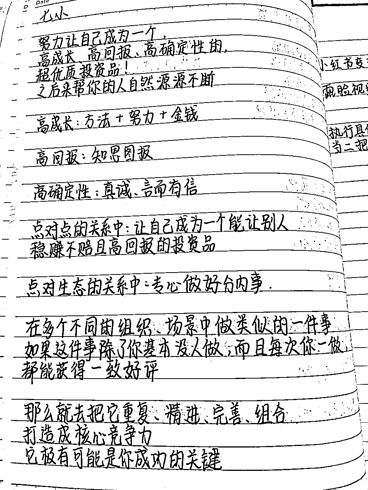

# 闲鱼卖幕布国庆7天赚了6158元

> 来源：[https://d8ez8yi1x2.feishu.cn/docx/EXCQdXB3aogo8FxomkCcLbhXnag](https://d8ez8yi1x2.feishu.cn/docx/EXCQdXB3aogo8FxomkCcLbhXnag)

嗨，我是小雨，一个万人团队的指导老师，全职做闲鱼卖货四年的宝妈。目前闲鱼卖货月收入在3-5W之间，通过闲鱼变现了几十万

我一直在闲鱼卖的产品都是一些百货用品。比如家具家居，电器类，母婴类这些产品我都会去卖。在今年的九月份开了一个新号，尝试在闲鱼卖幕布

用了将近一个月每天铺货优化，到9月底的时候已经开始不断的爆单，10月份利用国庆假期赚了6158元

闲鱼虽然门槛比较低，但是如果全部卖百货用品的话，它的曝光没有卖幕布那么的高。百货类的话是曝光比较少，但出单不错。而幕布在闲鱼就不一样了，它的曝光很好

到这个月我已经加入生财六个月了，不得不说这六个月我学到了很多很多。从一开始的一些圈内大佬的文章一一细看，再到参加小红书店铺的航海和时间管理的航海。从中学到的价值已经远远超过了我当时进生财的门票。

有关闲鱼卖货的帖子我写过很多篇。大多是针对百货类，选品，实操流程等等去写。专门针对一个类目的产品，我还没有去拆解过

所以这次也用心去上架产品，了解产品，在这一个类目这个领域做出成绩以后才有底气来写这篇分享。接下来给大家分享做幕布货源如何快速起号，以及幕布货源的一些上架细节

### 一.幕布货源利润

我在闲鱼卖的幕布主要有窄边画框幕布，菲涅尔硬屏，菲涅尔长焦，短焦等。主要卖的是菲涅尔，因为菲涅尔的利润比较高。一般利润都在55%左右，之前我卖一些百货类目的时候，利润最高的也就在40%~50%。基本利润平时也就在20%~30%。所以目前我做的所有产品里面菲涅尔幕布利润位居第一

这几单就是菲涅尔幕布的利润

### 二.幕布货源基本知识

卖幕布货源，我们一定要去了解清楚它的一些基本知识以及专业知识。你的专业度和你了解产品的程度，决定了之后有顾客来问的时候是否能成交。所以在幕布货源上要比其他的产品多花一些心思，我在还没上架这个货源的时候，就提前去百度小红书各大平台先了解这个幕布货源

##### 1.幕布的材质

幕布的材质其实分为这几种，白软.白塑，灰金.金属，黑栅，短焦菲涅尔，长焦菲涅尔，超短焦菲涅尔等等

##### 2.幕布的款式

根据使用的方法，幕布分为画框幕布，电动幕布，还有地拉幕布

##### 3.幕布尺寸的选择

画框幕布:如果你的观影距离大概在2.4m，那就可以买80寸的。观影距离在3m，可以买一个100寸的。观影距离在3.2m，可以买一个110寸的。观影距离在3.6m，可以买一个120寸的。观影距离在4.6m就可以买150寸的了

菲涅尔幕布:观影距离2.3m，可以买80英寸。观影距离2.4m，可以买88英寸。观影距离2.7m，可以买90英寸。观影距离2.9m，可以买100英寸。观影距离3.2m，可以买110英寸，观影距离3.5m，可以买120英寸

所以幕布的尺寸并不是说越大越好，而是得根据你的观影距离来选择。把尺寸掌握好以后，有顾客来买的时候，就可以先问一下观影距离，然后适当推荐尺寸和款式

也可以在你的闲鱼文案里面加上一句，请将投影距离告诉客服，安装位置到幕布墙面的正投距离，客服会帮您计算需要买多大尺寸的幕布。这样顾客就不会不知道买多大尺寸的幕布

##### 4.画框幕布介绍

窄边框铝合金框架幕布适合于家庭影院/办公会议/游戏KTV/民宿酒店。1厘米超窄边框，百分之99的屏幕占比，身临其境，体验沉浸式观影。表面采用高清光学涂层，色彩还原度高不伤眼睛。

什么是高清光学涂层?高光学涂层，不仅抗光，色彩还原度好减小幕布透光现象，增强色彩饱和度告别视觉疲劳，观影更舒适蓝光护眼涂层漫反射成像无辐射避免直射光源，告别传统液晶屏直射三代新工艺，德国光学抗光屏无惧任何光环境，让家人更加舒适观影。

整体采用弹簧拉伸系统幕布平整如镜，无褶皱合金框架+内部数十个强力弹簧结构，弹簧拉伸合金框架 强力拉伸弹簧

投影仪市场中高端客户都是增长趋势，一定概率都是准客户，而且大多数应用于有光线的场所 比如客厅 会议室 卧室 需要有抗光性的幕布才能使得观感体验提升

防止小孩子破坏，画框幕布/硬屏 比电视要便宜。损坏了不会像电视一样坏整个屏幕，而幕布只是在那一点上有损伤对整块屏幕的投影效果没有很大的影响。空间非常大，电视120寸的非常昂贵。

##### 5.菲涅尔抗光硬屏介绍

采用1厘米铝合金边框，高度还原色彩，超强抗光，比普通画框幕布抗光好很多，抗光率百分之90以上。

菲涅尔抗光的原理是什么?

菲涅尔光学结构抗光屏上的画面，它的亮度会更高，色彩会更加的鲜艳，对比度程度也非常高，色彩饱满度也会非常的好。

整体的抗光性要比普通的涂层抗光幕布好非常多，那么这是为什么?这是菲涅尔抗光屏的光学结构，它的光结构是一种聚光效应。

什么是聚光效应，就是它只反射投影的光而不反射干扰的光，这是一种物理光学结构，它的原理就是放大镜一样可以改变投影光线的反射角度，而图层抗光，它只能依靠特殊的图层去吸收环境光线来达到一个抗光的效果，所以它的亮度它是比白墙的亮度更低一些

### 三.回复顾客的一些专业知识

闲鱼卖货除了选品和上架技巧很重要以外，我们的话术也非常重要。特别是卖幕布，我们需要显得非常专业。接下来我整理了几个菲涅尔幕布比较常见的问题解答

##### 1.菲涅尔硬屏怎么安装？我的墙面可以安装吗?

抗光硬屏是一块整体成型的，无需组装，只需打孔，固定在墙面即可，墙面承重建议在30kg或以上，如果是特殊墙面，如玻璃大理石.瓷砖.空心墙的请一定要联系客服确认，特殊墙面打孔需要加收费用

##### 2.任何投影仪都能用吗？

中长焦投影仪是远投，超短焦是近投，菲涅尔幕布针对投影方式进行幕面设计的。 两者不能混用，所以需要提前问顾客是中长焦投影仪还是超短投影仪

##### 3.我应该买多大尺寸的幕布呢？

幕布尺寸大小由墙面的长高和你的投影距离决定。一般我都这么回，请将您的投影仪机型和投影距离告诉我，我来给你计算需要买多大尺寸的幕布。然后根据上面刚刚说的如何选择尺寸去看，如果自己实在不知道需要买多大尺寸的，可以去找一个拼多多同行的产品问客服

或者让顾客看投影机器距离墙面最大支持多少尺寸。如果不知道让顾客开投影仪投白墙去量尺寸。第二如果观影距离和投影距离一样。按照距离对应的尺寸推荐

##### 4.我的投影仪可以侧投吗？

抗光幕布反射过滤四周的一切干扰光线，所以我们需要正对幕布投影。这样就能让投影仪的投射光线更集中在屏幕上，以达到呈现更清晰和更高对比度的画面。所以投影仪要正对投影或者吊装正投。侧投的话，会有亮度不均衡的情况出现。推荐正对幕布投影，小角度侧投最好不要超过10°斜角

##### 5.幕布离地面多高合适？

幕布挂墙高度一般参考电视机挂墙的标准。50~120cm的离地高度。根据个人观影习惯来灵活调整即可

##### 6.卖菲涅尔幕布的注意事项

首先要注意一个尺寸问题，菲涅尔硬屏尺寸过大，它是不能折叠的。所以在购买前要确定一个电梯尺寸或者楼道的尺寸。避免因尺寸问题无法入户。可以把这个图片保存下来发给顾客看。上面有对应尺寸的幕布需要多宽的电梯或者楼梯才能上楼

##### 7.短焦投影仪适合什么？

灰晶抗光幕布比较合适

##### 8.中长焦投影仪适合哪种？

流明在1200到1700左右的用灰晶。1000以下的用小视角抗光幕布，或者白软通用幕布。真实流明在1700以上推荐用黑晶

顾客让自己推荐的时候一定要问，顾客投影仪型号，然后去拼多多，或者淘宝去查流明。一定是要ansi流明， 再着就是没有品牌的机器一律白幕，因为杂牌机都是虚标

##### 9.这是什么幕布和普通壁挂幕布有什么区别？

壁挂幕布比较简单，容易损坏，挂墙上没有固定好还会被风吹掉。 我们是铝合金框架幕布 一体上墙打孔固定背面采用不锈钢挂钩拉伸幕布，非常安全不会掉，上墙效果美观，即使不投影，也是家里一个不错的摆件

##### 10.幕布抗光效果如何？

抗光可以 但是建议在光线暗一点的环境使用效果更佳，毕竟电影院几十上百万的设备也是在黑暗环境才有好的效果

##### 11.产品的特点

材质特点:超清白软,表面特殊涂层物质令显像非常细腻，颜色表现得更自然，适合所有型号投影仪，对流明没有要求，【不具备抗光效果】

抗光灰晶:幕面淡灰色，高增益，对比度好，亮度色彩对比度都比较均衡。智能投影仪真实流明达到1200 ANSI流明以上.灯泡投影机真实流明达到2000流明以上!

抗光黑晶:幕面深灰色，表面采用特殊黑晶图层，画面对比度高，智能投影仪需1700ANSI流明以上，灯泡投影机实际高于3000光源流明以上!

### 四.如何快速起号

##### 1.店铺类型

卖幕布建议做垂直，幕布货源需要有一个周期。前期每天去铺货，后期慢慢的才会爆单。周期可能是一个星期，可能是半个月，也有可能是一两个月。它跟百货店铺不同，百货店铺是需要做杂货铺什么都上。出单正常大概也就三到七天左右。

而幕布货源是前期一上来直接怼链接做垂直。熬过了前期那一段不出单的时间以后，后面一爆单利润很吃香。就拿我自己的订单来看，基本利润都是三位数。我是9月份开始用这个新号做幕布的，前期一直没有出单，每天就是不停的上链接，怼链接。不停的去上架，优化。也是到了快9月底的时候才开始不停的爆单

幕布做垂直会显得你的店铺专业性在，能提高跟顾客的一个信任度

##### 2.店铺信息设置

首先是你的个人头像头像，建议就直接用一个幕布作为头像

名字可以写成幕布厂家之类的,体现你的专业度

以及个人介绍也可以写自己是幕布厂家，手里的货源支持一件代发，质量有保证之类的

##### 3.七要素做好差异化

上架的技巧我讲过有闲鱼7要素:也就是你的标题，文案,图片，图片标签，发布地址，选品，定价

幕布产品我们需要做出差异化来,再加上我们做的是垂直店铺，店铺里面就只有幕布这一个类型的产品。所以我们去上架的时候，一定要用心做好每一个链接

标题：标题跟我们做百货铺是一样的，一定要带产品的关键词。这样方便顾客能找到我们的产品

文案：我们想跟同行的做出差异化，我们就得写的详细一点。例如你的产品特点可以写清楚一点，售后保障可以写出来

主图：主图我看到过很多闲鱼同行卖家都是用一个黑屏的幕布去做闲鱼的主图。我经过测试以后发现黑屏的浏览量没有一些视频或者说亮屏的，有色彩的主图浏览高。因为其实我们卖的也属于一个数码类的产品，数码类像一些二手机，iPad，显示器之类的货源。都是要有一点色彩的主图浏览要高一些。主图我们可以去小红书找，找视频也行，图片也行，尽量是亮屏的

图片：图片一共九张，我们选好主图以后再选择八张图片放进去就够了。同样的，我们去小红书找图片。为什么说幕布要去小红书找图片？因为幕布货源在小红书上测评的很多，以及一些装修也会有幕布的图片。所以我们直接去小红书搜索幕布测评或者装修风格，奶油风之类的都会有幕布图片。幕布图片首先要选择一些氛围感比较好的，以及一些对比图也要放进去

图片标签:图片标签我们去闲鱼主页搜索框，搜索你卖的幕布款式。搜索出来的下拉词长尾词我们作为标签添加进去。除此之外，我们还可以添加一些幕布的特点

发布地址：普通版本的闲鱼一个店铺能上50个产品。50个产品，我们可以把它们发布在不同的发布地址

定价：这个产品的利润不错，定价可以在原价基础加价20%-55%。因为成本价很低，几乎全网是没有这个价格的。所以可以放心大胆去加价

##### 4.不停怼链接

垂直店铺就是需要我们不停的去上链接，上架高质量的产品，淘汰掉不好的链接。9月份前期一直不停上架，测试哪个产品的数据好。对比其他产品的数据，看是文案还是主图不行，进行优化

闲鱼平台虽然不需要太多运营知识，但是现在要优质的号，高质量卖家。你要是胡乱上一些产品放进去坐等着出单，出单的几率很小。相反，只要选品对了在上架技巧上下单功夫，跟同行做出差异化。坚持上架优化，你的店铺就离爆单不远了

### 五.卖幕布货源的优势和缺点

优势

卖幕布的主要优势就是它的利润很高，相对于百货用品的利润率要高一点

售后少，菲涅尔幕布的售后主要就是一些安装问题，其他关于效果不好之类的售后我目前一单都没有遇到过。所以售后特别少，特别简单

缺点

需要你懂很多很多的专业知识，就算你上架的再好，也有可能会因为回复不及时或者不专业而跑单。前期的时候成交率比较低，因为你得慢慢的去锻炼话术，慢慢的看会遇到一些什么问题。我前期就因为回复的不专业而跑掉了很多单，但是也在慢慢的回复中总结了很多经验

百货类目的话都是一些日常能见到的产品，所以不用过多的去了解。也不需要太多的专业知识，所以成交快，并且复购高。二者各有利弊

大致分下来这几点掌握好，就没多大问题了。其实就懂一个它的尺寸，投影仪的搭配，材质性能等等。也就是我上面说的这些完全掌握，去卖就没问题了

### 六.参加生财小红书店铺打卡学到的东西

之前参加了一期小红书店铺打卡，受益匪浅。其中最关键的一点，还是电商的选品。无论哪个平台卖货，核心绕来绕去还是选品

所以为什么有的人销量很好，而有的人一单都卖不出去？首先选品就拉开了差距

做闲鱼卖货四年，我也花了很多很多时间在选品上。不断测试哪个选品好卖，哪个选品不好卖。很多时候选了几十个产品，夸张到一开始的时候只有几个产品能出单

渐渐的掌握到了其中的精髓后，才开始有爆款产品。每天出门吃饭，逛街，买菜……脑海里想的都是这个产品拿去闲鱼好不好卖？回家就立马搜索同款挂在闲鱼试

好在经过不停的测试，优化，选品，上架循环后，我终于掌握了一些爆款选品技巧。成为了万人团队的选品官，负责选品给学员们去卖

这次参加生财的小红书店铺打卡后发现，电商平台之间是有互通性的。不一样的地方做出差异化来就行，我按照航海所教的，在小红书里面卖一些摆摊批发用品

一个利润几角钱，靠批发走量赚钱。9月份的时候做到每天利润200-300元

### 七.结语

我始终相信越努力，越幸运这几个字。虽然我只是一个生长在普普通通家庭的女孩子，但是现在达到这样的收入我觉得很开心，至少有能力买自己喜欢的东西，有能力给家人好的生活。当然，肯定还要再朝着更好的方向去继续努力

在20岁这个年纪我能做的就是努力去学习，去输出。跟着生财里的大佬提高自己的逻辑思维，打开眼界。说实话刚进生财的时候，看到很多很多大佬的帖子，我还有几天迷茫了。觉得自己做了四年的闲鱼也没有什么成就

但后来我想了想，我也不是一点成就都没有呀。我带过的学员赚到了钱，这就是我的成就。我带过一万多个学员，这也是我的成就。我自己在十几岁的年纪就已经通过闲鱼变现了几十万，这也是我的成就

2019年的时候还在卖着一单利润0.5-3元的产品，从拼多多找一些9.9元包邮的产品来卖

2020年下半年没坚持做下去，来回折腾了十多个副业项目。最后又重拾闲鱼扎头继续做，一直坚持做到了现在。2020年底卖货最高利润是单日赚了10000多块钱

2021年被选为闲鱼指导老师，指导一万人学员的团队。也从2021年到现在一直都是闲鱼指导老师，期间和各大几十万博主合作过训练营。带领5000多个伙伴通过训练营赚到闲鱼的第一桶金

2022年卖货的店铺营业额达到一百多万，到现在我的店铺有4个。前三个营业额都是三百多万，最后这个新号是九月份开的

一步一个脚印走到了今天，取得了今天这些成绩。对我来说也是一种成就

只是我的成就肯定和大佬们的领域不同，方式也不一样。但很多时候在一些社群，一些圈子里。很多伙伴一提到闲鱼的时候，都会有伙伴说，小雨老师做得可以，很专业，耐心，负责。当这样的话听了很多以后，就觉得自己的努力也不是白费的。我也开始再往好的方向发展了

再来后我继续读生财里大佬文章的时候，就没有感到迷茫了。而是去学习，看看这些大佬是怎么做得这么优秀的。比如七小大佬，进生财的前几天文章太多。我是真的不知道该从哪里看起，而七小大佬就厉害了，把生财的很多大佬的精华文章详细的整理出来

生财课代表也果真名不虚传，他首先发现了自己擅长做知识整合。并且自己的文字表达能力很强，也能对生财小白圈有十分了解。然后发现了生财里面的文章特别多，大家看多了不知道怎么去用好生财。所以他根据自己的优势来满足大家的需求写了一篇生财的使用指南

这不妥妥的喂饭了，每天看一篇大佬们的文章。自己觉得有用的地方记一下笔记

所以生财里面能学习的非常非常多，光从七小大佬身上我就已经学习到了，首先我要发现自己擅长什么东西。我的优势在哪儿？

很多人一提到小雨就会说这个人执行力很强，很耐心负责。那我想，这就是我的优势呀。我执行力强，那我就能把想到的去做出来，而不只是想想。就像我想卖货，那我马上就去上架产品。我想引流，那我马上就去写文章。逐渐找到自己的优势以后，我又开了自己的闲鱼一对一私教课，还建立了社群……

所以，真的很幸运加入生财这个圈子。让我能有幸认识这么多大佬，跟大佬们学习。也感谢生财的圈子提供了这么多的精华帖，每一篇都能从中学到很多，让我更加坚定互联网这条路能一直走下去。我也会更加努力，给大家带来更多干货分享