# 入局AI八个月小赚6位数经历复盘

> 来源：[https://l0lupq5bcjq.feishu.cn/docx/FJRLdF3l0oQb00xOe49cpT62nqC](https://l0lupq5bcjq.feishu.cn/docx/FJRLdF3l0oQb00xOe49cpT62nqC)

大家好，我是峰兄，一名程序员，目前在一家世界五百强外企从事IT相关工作。这篇文章主要讲述今年ChatGPT火爆全网以来，自己在AI方面的一些探索、心得，也算是对自己的AIGC之旅的一次回顾。

随着GPT的爆火出圈，我从今年2月份第一次真正的接触AI，起因是在朋友圈看到一个朋友分享的万字长文，文章的大概意思是：上个时代我们基于移动互联网，做出了各种各样的APP，而今天新的交互形式出现了，每一个细分的赛道上可能都会成长出一个全新的独角兽，基于AI的底层能力，所有的APP的交互方式都将改变，所有的APP都将重做一遍。这次的AI浪潮不同于之前的，由于chatGPT底层能力的开放，AI使用的门槛已经足够的低，每个人都可以通过AI来提效、创业、为自身赋能！

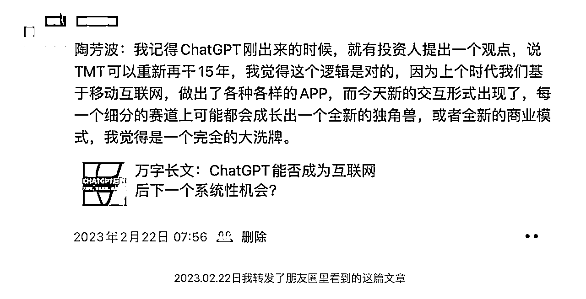

本文的章节主要包括：

第一段经历：GPT镜像站创业

第二段经历：提示词学习

第三段经历：训练专属私有模型搭建企业知识库

第四段经历：加入点金帮，点石成金，专注GPT企业培训及企业级AI解决方案

## 第一段经历：GPT镜像站创业

我个人是程序员出身，这里也要感谢时代，也算抓住了移动互联网尾声的一点点红利。当年做小程序赚了第一桶金，不过这两年小程序趋于饱和，已经完全变成了一片红海市场。移动互联网刚刚结束，没想到AI时代这么快就到了。

当时我就想在这样的历史机遇下，做点什么好呢？想来想去，还真让我想到一个点，当时国内直接访问ChatGPT是没办法访问的，这个大家应该都懂。既然这样，就做一个国内的镜像站吧，做一个中转代理，降低使用者的门槛，让大家都能方便快捷的使用上这么好的工具。

说干就干，当时找了几个平时玩的不错的朋友，大概说了一下想法，没想到大家都不谋而合，于是我们的AIGC镜像小分队就这样成立了。由于大家都有自己的本职工作，只能在晚上和节假日时间参与到镜像站的开发，但好在之前大家都合作过，有一定的默契，另外，大家有一致的目标，因此，项目的进展还算顺利，从规划原型图到开发、测试、上线，用了仅仅一个多周的时间。我们的模式也是简单粗暴，游客可以免费使用10次，超过10次就要充值会员才能继续使用。当时还想着会不会一日暴富呀，后来才发现想多了，遇到的坑比天上的星星都多，命运的齿轮开始转动。

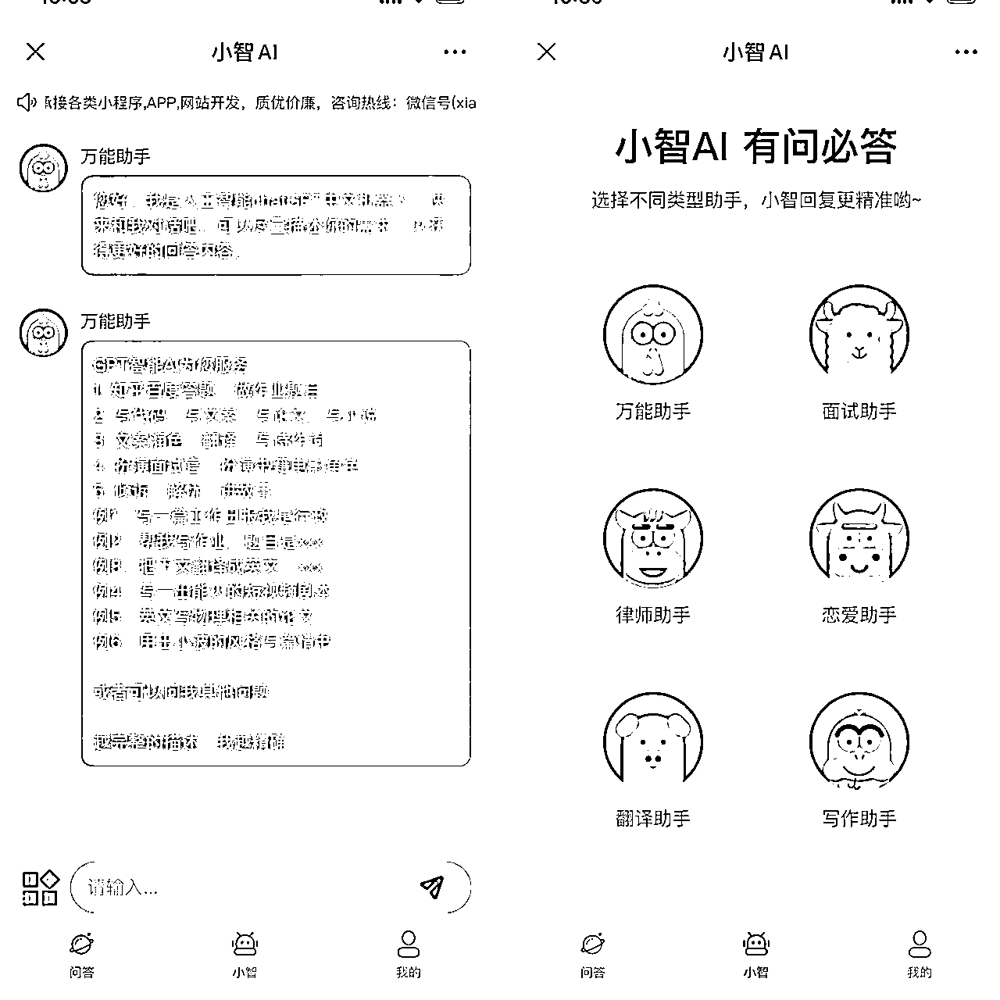

我们的第一版镜像站页面

我们做的第一版镜像站是基于微信公众号。2023年3月7号，我们的公众号上线，没做任何宣传推广，我只是当晚简单的发了一个朋友圈，第一天注册用户就达到232个，第二天就达到了500多，这也是我们的高光时刻，以后就是不断的踩坑填坑、踩坑填坑，直到最后看不到任何的希望，放弃了这个项目。这个项目整体盈利也不多，也就一万多块钱，最后都分给了跟我一起做这个项目的兄弟们了，其实还是挺抱歉的，大家跟我加班加点的熬了这么久，每个人就分了一点点钱，其实付出跟收益是严重不成比例的，也希望以后有机会有机会能弥补大家。

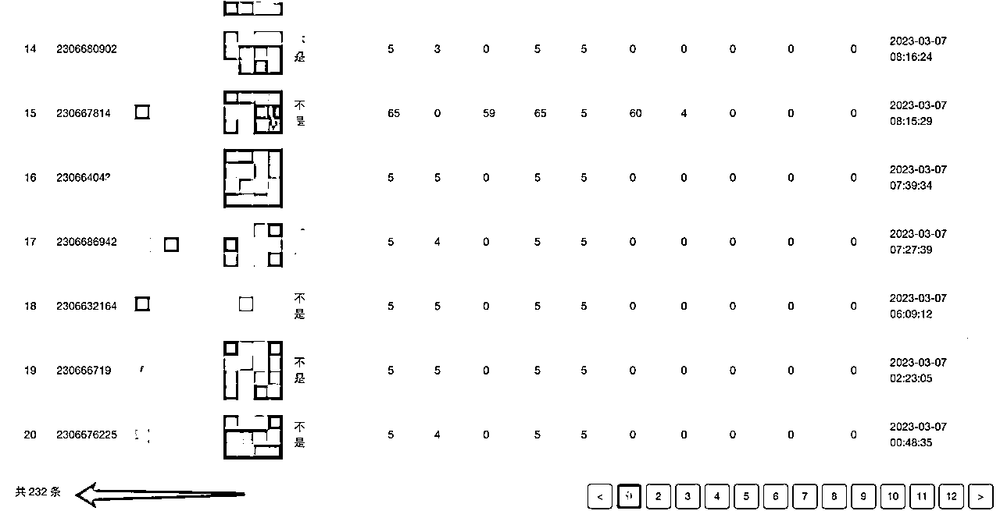

第一天上线，一晚上的注册用户数

由于上线时间比较赶，我们做了一件特别蠢的事情，我们的数据库端口没设置防火墙，对外暴露了，另外也没有改密码，使用的是默认密码，不出意外，意外发生了，我们的服务器上线第二天就被黑了，对方要比特币才给恢复数据。也不知道是谁给网络小黑子的勇气，是因为他认识梁静茹吗？我也没惯他坏毛病，没搭理他，重新部署了项目，设置了防火墙、修改了密码，作为对用户的补偿，我们为每一位新注册的用户赠送了一个月的会员。

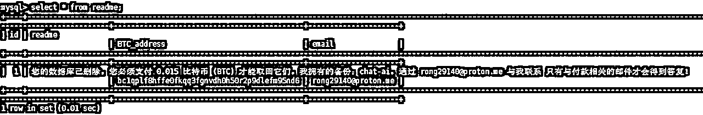

网络小黑黑库，索要比特币

虽然每天都有几十个新增用户，但我们发现大部分用户可能也是图个新鲜，充值会员的很少。所以，我就想仅靠会员充值这一条路可能太局限，正好听朋友说，现在微信小程序的广告主收益不错，可以做小程序版的镜像站，别人观看广告就有收益，说干就干，我们要做可以加入广告的小程序版国内镜像站。我们加班加点，用了差不多10天左右的时间，开发出了第一版本的小程序镜像站，本想着这下可以高枕无忧，只要有人访问就坐等收钱，但天不遂人愿，当时微信已经开始严格打击底层调用基于国外AI接口提供AIGC服务的应用，因此我们的小程序，第一次提审就被驳回了。

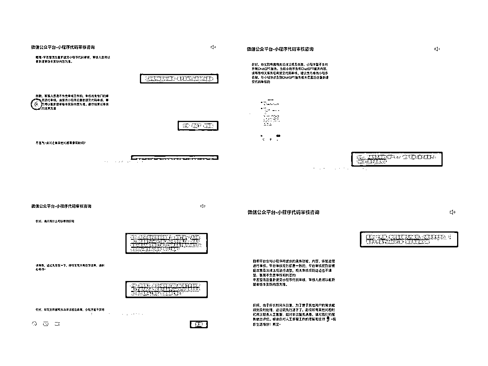

积极与腾讯小程序客服沟通，找到提审被驳回的原因

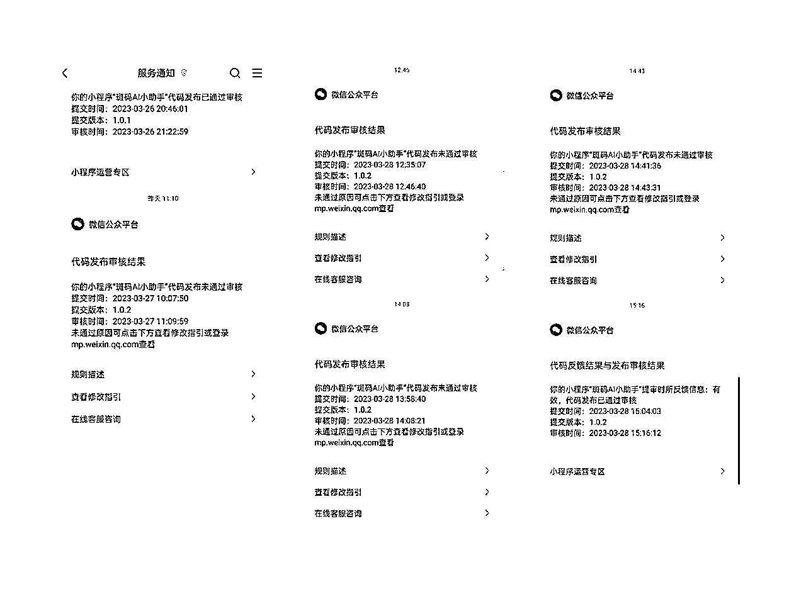

经过多次驳回，最终审核终于通过了

就这样来回折腾，我们的小程序被整整驳回了差不多有十次之多，我们也是每次被驳回就想应对方案，最终也是黄天不负有心人，我们的镜像站小程序总算是上架了。没消停几天，腾讯对此类小程序的监管越来越严，最终，我们的小程序还是被下架了。本来还想再去申诉一下，再抢救抢救，但当我看到我之前关注的差不多100个AI问答类型的小程序基本全军覆没，全部下架后，我也放弃了挣扎，既然平台不允许，就算再折腾，后期还是面临着同样的问题，不如就此收手，减少损失。

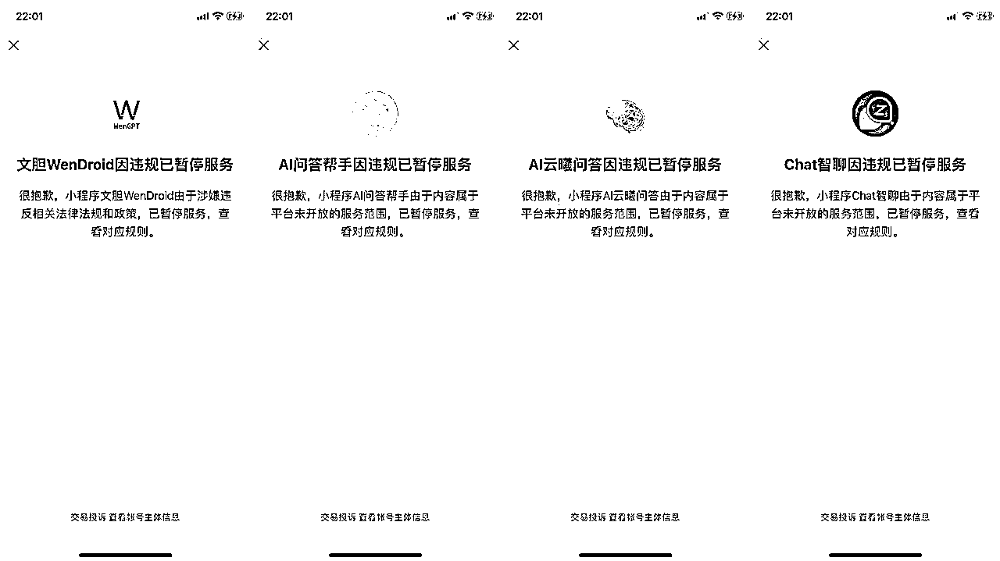

我关注的其他AI问答类型的小程序基本全部下架了

由于公众号监管要松一些，还是不太甘心就这样放弃。还是优化了一版基于公众号的镜像站，运行了一段时间，最后还是由于一些原因公众号也下线了。前前后后，折腾了2个多月的时间，钱确实没赚到多少，不过在解决问题的过程中也成长很多，也算是一笔财富。

最后，如果大家现在还有镜像站方面的需求，可以访问我的好朋友鹤涵的镜像站网站AI问问：https://chat.wenwen-ai.com/user-center?code=HZSHBRULDE，功能那是相当强大，肯定能满足小伙伴的需求。

## 第二段经历：提示词学习

在第一段GPT镜像站的创业中，我也发现了一个强需求，很多朋友在使用GPT的时候不知道如何提问，如何针对不同的场景设计出符合要求的提示词。这个其实有个比较高大上的名字：Prompt提示词工程师，很多公司也发布了这个岗位的招聘需求。

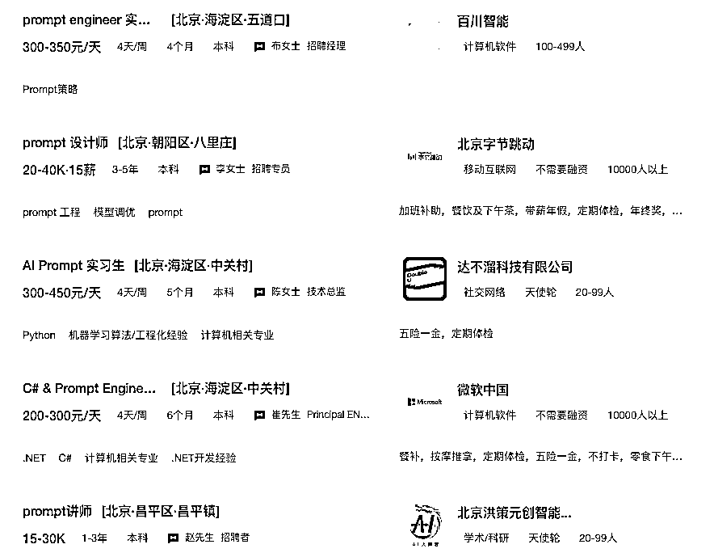

这是我这Boss直聘上搜Prompt提示词工程师，首页返回的数据。大概可以看到，这个岗位的薪资目前有两种一种是全职的，薪资范围是15K-40K；一种是兼职的，按天付费，一天大概在200-450元左右。

由于大模型技术今年也是刚刚开始发展，很多公司对这块业务的能力要求也是没有一个明确的职位描述，我们随便点开几个招聘链接查看一下：

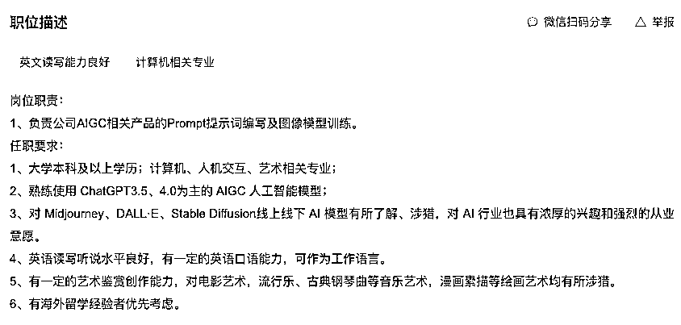

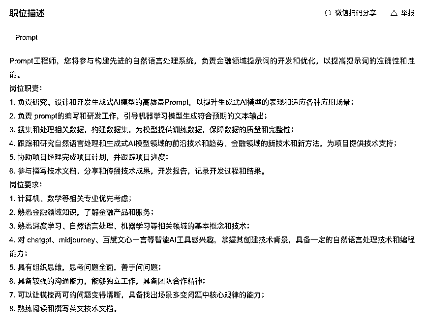

大家可以看到招聘标准不像一些成熟的运营岗、设计岗、开发岗有明确的职位描述，很多公司都是希望招聘到一个对大模型有一定了解，可以将AI赋能到公司已有的产品上，为公司提效。

认识到Prompt提示词的价值，我也在积极的学习相关的技术，做了一些有益的探索尝试，写了几篇关于提示词的文章，也认识了一些在这个领域内取得成绩的大佬、专家。

其他一篇文章还被Prompt提示词大佬小七姐在她的教程中提到，也算是一件很有意义的事情。

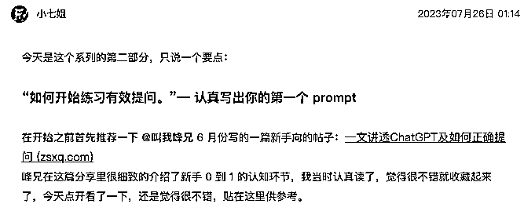

我的这篇文章的链接我也附上：希望可以帮助到正在学习提示词的朋友。

提示词学习这个阶段，通过内容的输出也杂七杂八的获得了一些打赏，另外，也通过帮助几个朋友制作了特定场景下的提示词改善GPT的回复质量，获得了一点收益，这部分加起来差不多有一万元左右。

## 第三段经历：训练专属私有模型搭建企业知识库

ChatGPT是“大力出奇迹”的经典表现，大模型给ChatGPT带来了惊人的智能，但是要训练这样的大模型，可是十分烧钱的，根据OpenAI给出的数据，1700亿参数的Davinci模型从头训练一遍，大概需要耗时3个月，耗资150万美元。那我们普通人或者小公司面对这个高门槛，对自定义模型是不是就完全没有希望了呢？其实除了从头训练一个模型，我们还可以选择基于一个基础模型进行训练，这样，我们可以往里添加自己的个性化数据，最终得到一个领域增强的个性化模型，目前有两种训练语料的方式embedding(嵌入)、Fine-tuning(微调)。

个性化模型有什么用？我们知道，OpenAI给的模型（如Davinci、Curie、gpt3.5-turbo）都是通用化模型，而现代社会的行业和知识如此之庞大，每个领域都有自己细分的专业知识，比如，我们知道ChatGPT的一个典型应用场景就是智能客服，但同样是客服，保险领域的客服和淘宝店铺的客服需要面对的客戶和需要解答的问题就完全不一样，想要给出更好的答案，我们就需要打磨自己的个性化模型。我们也可以用自己之前写的文章训练一个AI版的自己，以个性化的口吻回复用户的问题。

相较于GPT大模型回复的千篇一律，不能根据特定领域和私有化数据做个性化的回复，私有个性化模型具有广阔的前景：

针对个人，可以打造个人专属“数字分身”，专属个人知识库。

比如一位圈友，将自己过往的文章喂给GPT，打造了一个自己的数字分身，可以用自己文章风格自动回复粉丝问题，跟粉丝互动。

针对企业，可以构建AI客服机器人，替代人工客服，降低成本。

搭建企业AI知识库，对外，可以对合作伙伴赋能；对内，员工可以快速学习知识。

我们可以调整 prompt，匹配不同的知识库，让你的私有 LLM模型 扮演不同的角色

*   上传公司财报，充当财务分析师

*   上传客服聊天记录，充当智能客服

*   上传经典Case，充当律师助手

*   上传医院百科全书，充当在线问诊医生......

目前主流的训练模型的两种方式Fine-tuning（微调）和Embedding（嵌入）

*   Fine-tuning（微调）：Fine-tuning是指在预训练模型的基础上，使用特定的任务数据对模型进行重新训练，以适应具体的应用场景或任务。通常，预训练模型通过大规模数据集进行事先训练，获得了广泛的语言理解和生成能力。而Fine-tuning则是在此基础上，针对特定任务的数据集进行进一步训练，以使模型更好地适应该任务，并提高其性能。通过Fine-tuning，可以使模型更加专业化，提高在具体任务上的准确性和效果。

*   Embedding（嵌入）：Embedding是将高维的离散数据转化为低维连续向量表示的过程。在自然语言处理中，Word Embedding是一种常见的技术，将词汇表中的单词映射为实数向量。这些向量在低维空间中对应着单词的语义信息，使得计算机可以更好地理解和处理文本数据。通过将词汇嵌入到低维向量空间中，可以捕捉到单词之间的关联和语义相似性，从而使得模型能够更好地进行语言理解和相关任务。

Fine-tuning和Embedding是两种完全不同的技术，各自适用于不同的场景。Fine-tuning更适合于教授模型新的任务或模式，而不是新的信息。例如，你可以使用Fine-tuning来训练模型生成特定风格的文本，或者执行特定的NLP任务。然而，Fine-tuning并不适合于作为知识存储，也不适合于问答任务。

相反，语义搜索或Embedding则非常适合于问答任务。你可以使用语义搜索来快速找到相关的文档，然后使用大型语言模型来生成答案。此外，与Fine-tuning相比，语义搜索更快、更容易，也更便宜。

因此，如果你的目标是创建一个问答系统，或者你需要在大量的数据中快速找到相关的信息，那么你应该考虑使用语义搜索和Embedding。然而，如果你的目标是教模型执行特定的任务，比如生成特定风格的文本，那么你可能会发现Fine-tuning更有用。

从上面的内容可以看出，如果我们要做一个问答系统或者企业个人知识库还是需要用Embedding（嵌入）的方式进行训练。

由于篇幅愿意，这里就不详细介绍了。使用Embedding（嵌入）的方式实现主要有两种实现方案，这两种方案，我都有所涉及，目前也已经形成了两套成熟的大模型私有化部署的解决方案，可以直接商业使用。

## 方案一：

自购GPU服务器或租用云GPU服务器， 就是采用LLM 结合向量 Embedding的方式，独立部署开源的ChatGLM -6B、LLaMA等大模型，通过LangChain、闻达等三方开源项目提供向量存储检索服务及大模型的集成调度能力。这种方式，大模型的训练和推理都是在自有GPU服务器上进行，需要GPU服务器提供算力支持。

优点：调用免费、自由度高

缺点：由于需要GPU算力资源，因此需要自采GPU服务器或租赁云GPU服务器，成本相对较高。如购买一台最便宜的显卡为P100的GPU服务器也需要七八千块

下面是我给一个客户采购的一台GPU服务器，整机的组装成本在8000元左右，整套配置下来虽然便宜，但其实在部署过程中遇到了很多坑，如果对性能有一定要求的朋友，还是不要采用这套配置做GPU服务器

| 配件 | 品牌型号 |
| 处理器 | 至强E5 2680v4 * 2 (28核 56线程) + 寒冰A700(六热管) |
| 散热器 | 寒冰A700(六热管) |
| 主板 | X99华南金牌-F8D豪华双路八卡槽 |
| 内存 | 16G DDR4 RECC 2133MHZ 三星 * 4 (64G) |
| 显卡 | Navida Tesla p100 16G显存 * 2 (双计算显卡) + 机器点亮卡 GT220 1G |
| 硬盘 | 金士顿NVME M.2 1TB |
| 电源 | 守护者S950额定双路电源 |
| 机箱 | 金河田双路机箱 |

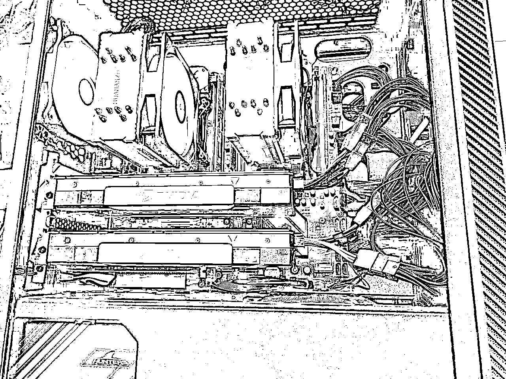

大家也可以在淘宝、京东看一下GPU显卡的价格，目前一块A100的显卡，至少也要三万多，所以没有一定的规模、预算的企业不建议自购GPU服务器来部署大模型，除非是打算自购服务器搭建大模型对外提供相关服务来盈利。

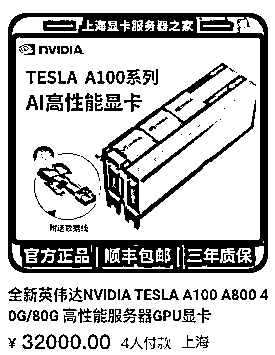

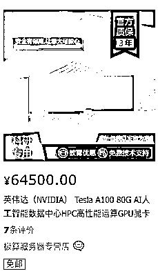

目前在这个领域也取得了一点点成效。通过帮助几个朋友公司自建GPU服务器，部署企业内部使用的私有企业知识库，也算赚到了第一桶金，大家也没让我白忙活，给了累计小五万的辛苦费，也算是目前做AI相关项目最大的一块收入。

## 方案二：

直接调用互联网上部署的AI大模型的API接口，比如OpenAI的embeddings相关接口。

优点：效果也不错，API调用，无需CPU资源，不用自购GPU服务器，前期投入低，适合调用次数比较少的企业

缺点：每次调用都需要按照请求token收费，灵活度也较低，另外必须请求外网接口，因此安全性也无法保证，不适合国内对安全性要求比较高的公司单位

针对这种方案，目前我们采用的是基于开源FastGPT的自研项目 ，FastGPT是一个基于 LLM 大语言模型的知识库问答系统，提供开箱即用的数据处理、模型调用等能力。同时可以通过 Flow 可视化进行工作流编排，从而实现复杂的问答场景！

FastGPT非常适合作为中小企业的智能客服系统和高质量AI企业知识库，这里也对这个系统做个简单介绍，最后提供一个可访问的数字分身，让大家感受一下FastGPT的强大。当然，大家也可以通过他训练自己的数字分身，流程非常简单，无需任何编程基础，人人都可以学会。

### 一）FastGPT能力

#### 1.专属AI客服

通过导入文档或已有问答对进行训练，让 AI 模型能根据你的文档以交互式对话方式回答问题。

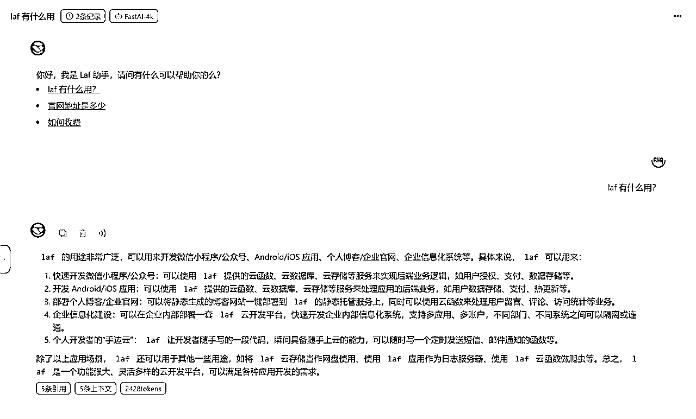

#### 2.简单易用的可视化界面

FastGPT 采用直观的可视化界面设计，为各种应用场景提供了丰富实用的功能。通过简洁易懂的操作步骤，可以轻松完成 AI 客服的创建和训练流程。

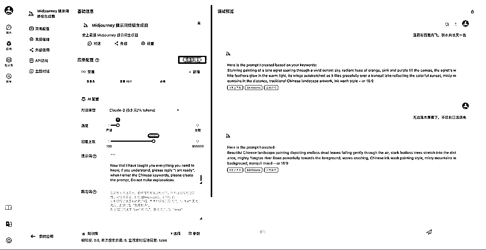

#### 3.自动数据预处理

提供手动输入、直接分段、LLM 自动处理和 CSV 等多种数据导入途径，其中“直接分段”支持通过 PDF、WORD、Markdown 和 CSV 文档内容作为上下文。FastGPT 会自动对文本数据进行预处理、向量化和 QA 分割，节省手动训练时间，提升效能。

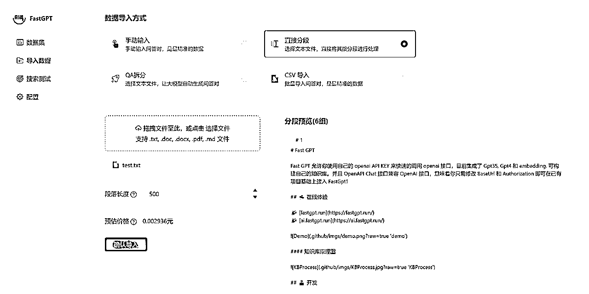

#### 4\. 工作流编排

基于 Flow 模块的工作流编排，可以帮助你设计更加复杂的问答流程。例如查询数据库、查询库存、预约实验室等。

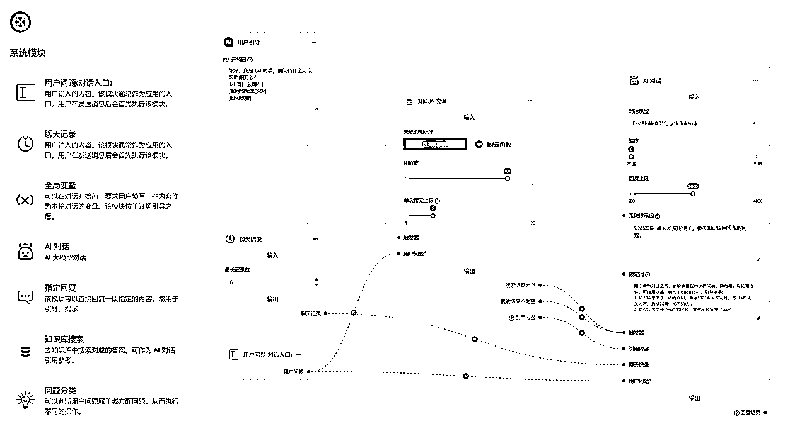

#### 5.强大的 API 集成

FastGPT 对外的 API 接口对齐了 OpenAI 官方接口，可以直接接入现有的 GPT 应用，也可以轻松集成到企业微信、公众号、飞书等平台。

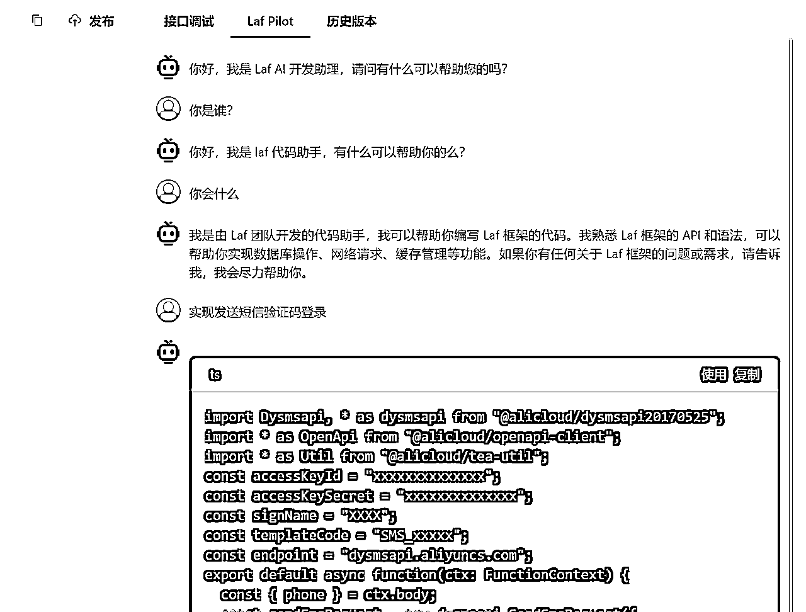

### 二）FastGPT 特点

#### 项目完全开源

FastGPT 遵循 Apache License 2.0 开源协议，你可以 Fork 之后进行二次开发和发布。FastGPT 社区版将保留核心功能，商业版仅在社区版基础上使用 API 的形式进行扩展，不影响学习使用。

#### 独特的 QA 结构

针对客服问答场景设计的 QA 结构，提高在大量数据场景中的问答准确性。

#### 可视化工作流

通过 Flow 模块展示了从问题输入到模型输出的完整流程，便于调试和设计复杂流程。

#### 无限扩展

基于 API 进行扩展，无需修改 FastGPT 源码，也可快速接入现有的程序中。

#### 便于调试

提供搜索测试、引用修改、完整对话预览等多种调试途径。

#### 支持多种模型

支持 GPT、Claude、文心一言等多种 LLM 模型，未来也将支持自定义的向量模型。

### 三）知识库核心流程图

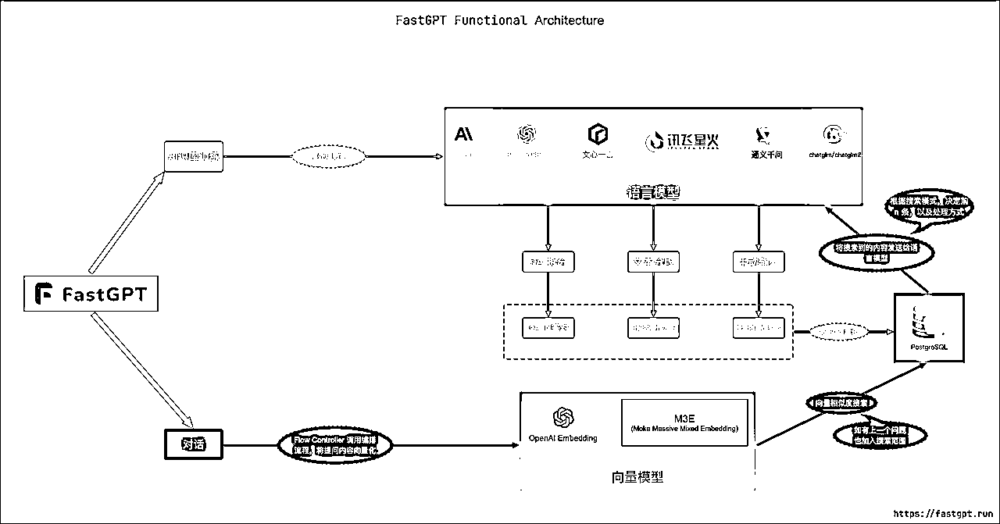

### 四) 通过私有化素材训练自己的数字分身

这里用我们团队创始人乔帮主资料文档（文档链接 ）训练一个AI版的乔帮主，也欢迎大家向帮主提问。

访问以下AI乔帮主数字分身，向帮主提问问题：

https://wenwen-ai.com/chat/share?shareId=bsljlyq1x3haih0zyt4pr2sl

## 第四段经历：加入点金帮，点石成金，专注GPT企业培训及企业级AI解决方案

今年在AIGC方面的学习方面也算是重金投入，加了不少知名的关于AIGC领域及赚钱的圈子，如AI破局俱乐部、生财有术、AIGC赋能商业等等社群。前期也把自己在实践中摸索出来的经验、走过的坑写成文章发布出来，也因此链接到了不少大佬，如点金帮的乔帮主。

乔哥我之前就有耳闻，在很多地方看过乔哥分享的干货文章，很是敬佩，但总感觉自己资历尚浅，也就一直没好意思主动链接。谁知道就在今年七月份乔哥主动加了我，一开始还疑惑，后来才知道，原来乔哥看了我之前写的一篇关于私有化部署大模型的文章，希望我加入他的创始合伙人团队，大家一起做一些更有意义的事情。那天聊天聊了很多，最终我也如愿加入了乔哥的线上合伙人团队。

点金帮是一家专注于提供前沿人工智能解决方案的领先企业。目前团队有线上线下共17名合伙人，并在迅速扩大中，大家都在各自的领域取得过一定的成绩，而且真诚且谦逊，从大家身上我也学到很多。

在这几个月中，我参与线上课程的共创，比如

1.  AI初阶应用课：《ChatGPT教你学编程：普通人的编程入门课》

1.  AI中阶实践课：《ChatGPT实战营：掌握GPT+多维技能，成为领跑AI时代的高效能人士》

1.  AI高阶企业课：《ChatGPT企业级应用与实践——提高企业10倍生产力》

1.  AI精品体系课：《AIGC应用与实践》

我还参与了下线实战营的课程设计，里面的内容更是干货满满，如3分钟批量生产爆款文案、3分钟生成一套精美PPT、5分钟生成一张高清宣传海报、5分钟完成数据分析报告、10分钟零基础写可马上爬数据的爬虫程序、1天设计出一门优质课程书籍等等，通过GPT+多维技能，旨在让你成为领跑AI时代的高效能人士。

我们还给企业做定制化解决方案。比如前段时间服务的一家规模很大的干洗店，针对洗鞋这块业务，需要在公域上发布一些自媒体图文来宣传、引流，但由于目前的人力限制，客户面临出图数量不足、成本偏高的现状，迫切的希望结合AI，通过AI绘画赋能洗鞋营销，来批量的生成高质量、高稳定、细节可控、可定制的图片，并使用GPT批量生成可控的宣传文案，然后图文排版，发布到各大公域平台上。我们给这个客户定制了一体化的完整解决方案，获得客户的一致好评。

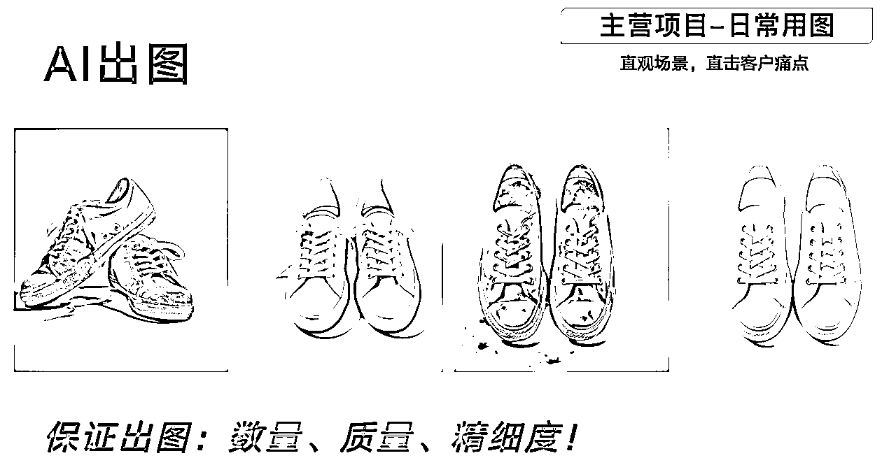

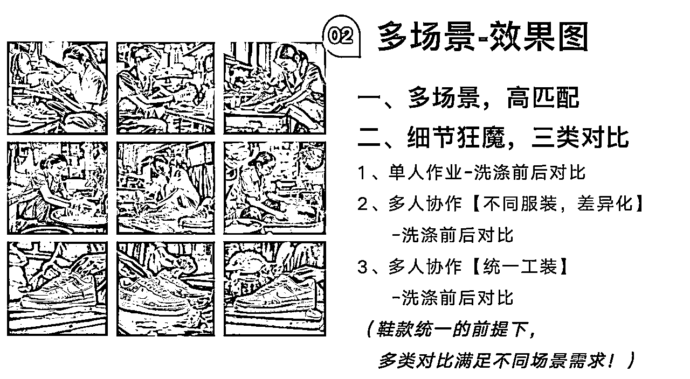

## 结尾

最后，我想说，新的时代已来，我们不应该逃避，而应该积极的面对。网上经常看到35岁以上程序员失业后找不到工作的新闻，我想年龄不应该成为我们的枷锁，我们的归宿并不是只有送外卖、开滴滴，只要用一个开放的心态接收新鲜的事物，不管多大年纪都可以乘风破浪，走在浪潮之巅！