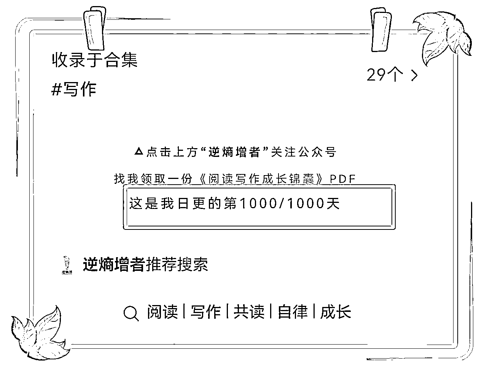
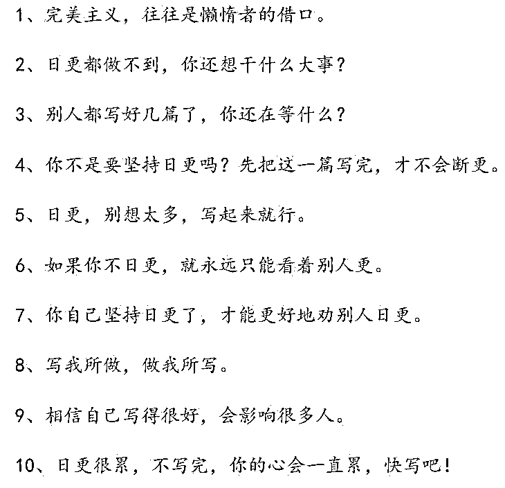

# 日更写作1000天，靠知识变现100+万

> 来源：[https://grkhqdru9g.feishu.cn/docx/FNtOd1KBTotUFJxpLG7cr8cen1d](https://grkhqdru9g.feishu.cn/docx/FNtOd1KBTotUFJxpLG7cr8cen1d)

大家好，我是逆熵增者!

从2020年10月2日开始更新公众号，截止今天，刚好日更写作第1000天。

所以今天主要给大家分享三个点:

一、日更公众号1000天的收获

二、持续日更写作的9个秘诀

三、给写作新手的4条黄金建议

首先，大家可以思考一个问题:

到目前为止，除了吃饭睡觉、刷牙洗脸，你有持续做一件事超过1000天吗？是什么事情呢？

我把这个问题发在群里，大部分小伙伴都回答没有。

持续做一件事1000天确实很难。所以，日更写作1000天也是不容易。

大概有多难呢？

我觉得这个难度跟每年赚100万的难度有的一拼。

看似轻轻松松持续更新了1000篇，但其实很难很难。

别说1000天了，很多事情持续100天就已经很不容易了。

1000天是什么概念呢，将近3年时间，在3年时间里持续不断在更新公众号，每天一篇。

中间肯定有遇到特殊情况，时间有冲突的时候，情绪也不可能保持1000天稳定。

所以，日更公众号1000天的背后也有很多辛酸事，比如说:

大年三十晚上我还在日更写作

有时候工作加班到11点还要写作

我家娃刚出生的那天也在写作

领证结婚办订婚宴那天在写作

生病发烧38.5°那天还在写作

阳了之后浑身难受还在写作

在外面旅行途中也保持写作

……

当然，这1000天里还有许多困难，比如不知道今天写点啥，担心写出来的东西没有人看怎么办，对别人没有什么价值等等。

中间也有过好几次想要断更的念头，但后来想着日更的flag都立出去了，也公开承诺了要日更下去，不好意思被打脸，就持续了下来。

## 一、日更写作这1000天，都有哪些收获？

能做一件事持续1000天，一定是在这过程找到正反馈的。

也一定是找到了做这件事的意义。

同时肯定也是因为热爱这件事的，不然肯定坚持不下来。

所以，持续写作1000天的过程中，我的收获非常非常大，难以用语言描述。

下面我简单分享7点收获:

### 1️⃣变得更加自信了

你想想啊，能持续日更写作1000天，还有啥做不成。

相信时间+复利的力量。

水滴还能石穿呢？

任何事情，刻意练习1000天，都会有非常惊人的效果。

当然是要“刻意练习” ，不是低水平勤奋，重复1000天。

刻意练习阅读1000天，可以成为阅读领域的专家；

刻意练习写作1000天，可以成为写作领域的专家；

刻意练习赚钱1000天，可以实现年入百万。

### 2️⃣运气变得越来越好了

很多小伙伴可能会有疑问，为什么日更写作1000天，会让我的运气变得更好？

答:因为日更一文，就是在日行一善，每天帮助一个人，根据宇宙定律和吸引力法则，运气自然会有好转。

这也是我哪怕再忙也要持续日更1000天的最大原因，也是我持续日更写作的最大动力。

因为我知道我每天写的公众号一定会对某个人有帮助，虽然我不知道对谁有影响，但是公众号23000+粉丝，每篇文章平均有1000人读过，总会对某个人有影响。

这样对我来说，这篇文章就是有意义的，就是在日行一善，每天至少帮助一个人。

比如下面这些反馈👇🏻

当我这么做的时候，运气确实慢慢开始好了起来，吸引到了很优秀小伙伴到我身边来，包括成长社群里的所有小伙伴，还有100多位合伙人，都是这么来的。

但行好事，莫问前程，该来的迟早都会来。

### 3️⃣写作让我更会思考了

写作其实不是简简单单的写出来，然后分享出去就行了，写作是对脑中的东西进行处理以后的输出。

写作其实也是一个系统工程，是有三个环节的，先有输入，中间是思考加工处理，最后才是输出。

据说只有5%的人在思考，10%认为自己在思考，剩下85%宁愿死也不愿思考。

要不是每天都要更新一篇文章，我也不会每天去思考。

所以，感谢写作倒逼自己去思考。

### 4️⃣真正见识到写作的复利作用

每一篇文章之间如果形成知识体系，

会形成一种非常强的知识复利效应。

下面再从另一个角度，看看什么是写作复利。

分享一组真实的数据:

​日更写作100天，变现0元

​日更写作200天，变现0元

​日更写作300天，变现1万

​日更写作400天，变现10万

​日更写作500天，变现20万

​日更写作600天，变现30万

​日更写作700天，变现40万

​日更写作800天，变现60万

​日更写作900天，变现100万

日更写作1000天，…………

想到一句“持续分享，黄金万两”。

前面200多天是完全没有变现的，但对我来说并不难熬。

因为我把前面一年的写作看成是学习和提升自己的手段，我要用一年时间来沉淀和积累。

所以，前面一年的写作并不是为了赚钱，那时候也没有做自媒体和付费社群的想法。

最开始，把自己的能力提升上来，让自己变得有价值，让自己成长起来才更关键。

记住一句话:

财富是成长的附属品!

认知提升之后，财富自然会流向你。

具体是如何赚到100万的，可以看看之前两篇精华帖👇🏻

①《通过生财有术提升商业认知，我做付费成长社群实现月入3万+的经验分享》

https://t.zsxq.com/13cbfeOzJ

②《分销经验:我是如何靠私域1个月成交300+单，变现20W+的？

https://t.zsxq.com/13KBqNYYy

主要靠3款产品，共读营、成长社群、合伙人。目前合伙人170+人，成长社群1500+会员。

### ❺写作让我认识了很多小伙伴

写作是我们和这个世界连接的载体。

文字是你在互联网上的另一张名片，任何人都可以通过它们随时认识你，这就好比自己有了“分身术”，一觉醒来就有可能收到意想不到的连接。

不管你身处何种现实困境，你都能通过文字创造一个属于自己的王国，去连接一个全新的世界。

写作这3年让我链接到了很多优秀的小伙伴，比如小红帽、JS、阿满、莲子、苏老师、吉阳洋、大侠、刘老师、乐乐、申姐、驽马、小白鱼等等2万多位小伙伴。

以及我们社群里每一位小伙伴，其实都是因为公开写作而认识的，从这一点就能看出来写作的魅力。

### 6️⃣写作让我有更多可能性

正所谓不发声=不发生，如果我当初只是埋头苦读，没有公开写作和分享的话，我肯定不会被大家看到。

所以我们应该在公开平台多发声，多分享，才有更多可能性。

写作相当于在互联网上给自己安了一个喇叭，可以时不时地喊一嗓子，亮亮相，让更多人注意到你，认可你，欣赏你，最终连接到更多的资源。

比如前些天上市公司掌阅APP在微信读书里面看了我的书评，找到我，想跟我一起合作。

### 7️⃣个人影响力也提升了许多

公众号粉丝从最开始的0涨到现在的23000+

微信好友数从0涨到现在18000+；

成长社群小伙伴从0到现在的1500+；

逆熵增合伙人从0到现在的170+位。

### 总结一下，写作的意义。

实际上，在这个网络时代，写作的本质已经完全超出了传统意义上的写作。

写作是每个人都可以做的事情。

写作是加速器，让你快速成长。

写作是探索，让你找到兴趣与擅长。

写作是发展，让你的专长越来越牛。

写作是思考，让你的大脑越来越精明。

写作是传播，让更多人链接到你。

写作是记录，让你的成长可视化。

写作是利他，让你为他人创造价值。

通过写作，你可以打造个人品牌，开启自己的事业，最终可以实现财务与时间双自由。

通过写作，不断地分享你的知识经验，在教别人的过程就是学习的过程，而且是最有效的学习方法，即以教为学的“费曼学习法”。

所以，劝每一位小伙伴，一定要写起来，并且要持续写下去。

不为钱，不为别的，为另一个版本的你自己。

## 二、持续日更写作1000天的秘诀

写作最难的就是要保持持续输出，有些人刚开始的时候兴致勃勃，写了没几天，感觉没啥可写了，就偃旗息鼓了。

下面结合我日更写作1000多天的经验以及对写作的理解，分享几条持续写作的经验。

### 1️⃣定个写作目标

比如定个日更写作100天的目标，并且公开承诺，说我接下来要日更写作100天，没有完成我就在群里发200红包🧧，请大家监督。

这样一来，就有了倒逼自己日更写作的动力。

### 2️⃣经常提醒自己

把这张图打印出来贴在显眼位置，当我们写不下去、不想写时，就看着它多读读：

1、完美主义，往往是懒惰者的借口。

2、日更都做不到，你还想干什么大事？

3、别人都写好几篇了，你还在等什么？

4、你不是要坚持日更吗？先把这一篇写完，才不会断更。

5、日更，别想太多，写起来就行。

6、如果你不日更，就永远只能看着别人更。

7、你自己坚持日更了，才能更好地劝别人日更。

8、写我所做，做我所写。

9、相信自己写得很好，会影响很多人。

10、日更很累，不写完，你的心会一直累，快写吧！

### 3️⃣提前写好几篇放在库存里

最好留有库存，万一哪天非常忙，用之前写好的文章就可以，我是因为要倒逼自己每天思考和学习，文章一般都是当天写出来。

所以压力会比较大，今后会做调整，先提前写好文章，以备不时之需。

### 4️⃣保持每天阅读输入

很多人不能持续写下去的一个重要原因就是没东西可写，写了一个月就被掏空了，肚子里没有墨了。

所以一定要保持每天有阅读输入。

我基本上每天保持2-3小时的输入，看书、看公众号，还有知识星球这些。

这一点是我能够日更写作1000天最主要的原因。

### 5、加上写作天数的进度条

这里还有个小技巧，那就是加上进度条，比如写作打卡第36/100天，每天看到这个就可以提醒自己今天还有写作要完成，避免忘记。

### 6️⃣定写作计划

先确定自己写作的内容大概有哪些？

比如我可以写以下这些方面的内容：

①推荐好书

②阅读笔记

③复盘文章

④分享金句

⑤时间管理

⑥个人成长

⑦自律习惯

然后定一个写作计划，比如分配到一周里，我更新文章的计划：

①每周日复盘文章1篇

②每周二金句分享1篇

③每周推荐好书2篇

④每周三转载好文1篇

⑤剩余2篇就进行主题分享

可以是回答书友问题等等文章

### 7️⃣套用万能的写作公式

如果你想持续写作、让写作成为一种习惯，最好掌握几条写作公式，以应对不知道写什么、不知道怎么往下写、不知道如何下手的问题。

可以找一个写作万能公式，每天就按这个格式写。

比如简单一点的公式就是黄金思维圈，why-how-what，可以先写好为什么，是什么，怎么做这三点。

如果你看过《逆熵增成长之路》，你会发现整本书就是用黄金思维圈这个方法写出来的。

有了万能的写作公式和写作模板，就能更好保持日更。

### 8️⃣构建个人知识体系

如果你觉得每天坚持写作很困难，甚至觉得每天输出一篇文章是登天一般的难事，那一定是你没有梳理、制订出自己的知识体系。

每一个行业领域都有着大量的知识点，而且这些知识点还会随着行业、技术的发展而不断扩增。

当你围绕自己的定位，梳理、制订出自己的知识体系后，在现有框架的基础上，即使每天只写一个知识点，也能写上几个月。

把一个知识点写透，就是一篇好文章。

比如，很多人说想要打造个人IP，那么具体该如何做呢？这就是一个知识点，对那些不知道如何打造个人IP的人来说，这就是一篇很好的文章。

知识框架可以从30个常见问题开始，比如关于阅读我就搜集了22个常见问题，比如关于写作方面的30个常见问题，每天一篇的话也能更新2个月了。

记住

一个好问题+一个好回答=一篇好文章

### 9️⃣加入一个写作的圈子

一群人都写文章，别人写了，自己没写，就会很难为情，从而督促我们坚持写文章。

还能提醒自己，工作一忙，我们就会丢三落四，有可能把写文章、发布文章的事情抛在了脑后。

群里有人发布文章了，通常会在群里发消息，提醒大家去看，这对我们自己来说也是一个提醒，会让你想起自己的文章还没有写或还没有发布。

这也就是“一个人可以走得很快，但一群人可以走得更远”的道理。

## 三、给写作新手的4条黄金建议

### 1️⃣刚接触写作，该如何开始？

答：可以先想好自己的定位，然后朝着你的定位方向去写与之有关的东西就行。

这个过程里，无须考虑选题是否符合大众口味，无须考虑标题是否吸引人，无须考虑文笔写得好不好，也无须考虑字数等等。你只需要把一篇完整的文章写出来就可以。

比如我一开始是写读书笔记和书评类的，我每看完一本书就输出一篇文章。

这里也分享一个万能的读书笔记写作模板：

开头:今天看了xx书，分享一下我印象最深刻的3个点。

中间:分别写①②③三个感触点，把书本内容和自己的感悟写出来。

另外，再加一两条下一步的践行清单。

结尾:总结一下内容，抒发感情。

我的很多文章都是这么出来的，具体的书评写法可以看看这篇文章👇🏻

https://mp.weixin.qq.com/s/pDTP7d90bycsjKKmPkXKEA

刚开始可以写自己感兴趣的领域，有时候哪怕自己不擅长，但写着写着就擅长了，这些都是我的真实经历与经验。

因为写作就是费曼学习法，而费曼学习法是最高效的学习方法，越分享，自己的进步越大，当在某个领域写完100篇，自然就擅长了。

### 2️⃣新手可以从自己擅长的方面入手

如果你是公司的管理，就可以分享一些职场生活与干货；

如果你经常旅游，就可以从游记和摄影方面入手；

如果你是宝妈，就可以从育儿知识或者绘本阅读方面入手；

如果你是大学生，那也有很多大学干货可以分享...

之前有位小伙伴说，怕自己分享的内容太简单，怕对别人没有用。

其实真不是这样的，在中国哪怕再简单的事情，至少有100万的人不知道，比如建微信群这么简单的事情，肯定有很多人不知道。如果你分享出去了，对于那部分不懂的人来说就是有价值的。

比如我在2022年初写的一篇关于微信读书APP的介绍文章《2022年，吹爆这个学习APP》👇🏻

https://mp.weixin.qq.com/s/_Tuck4rLjmnXcPbWF3XjoQ

罗列了我所掌握的20个微信读书功能，那篇文章截止到同年11月，达到3600+的阅读量了。

不管写什么内容，在写的时候，希望你能抱着“帮助他人”的想法去输出，写作其实就是在帮助他人解决问题或解开心中的某个结，这样的内容才有价值。

写作的终极技巧就是写对别人有用的内容。

### 3️⃣先完成再完美:建议直接开始写

迈出写作的第一步，重点不在技巧层面，而在心态层面。

你要从心底接受自己暂时写得差这个事实；

要知道你最大的对手是自己，别人没有时间笑话你；

千万不要等准备好了再开始写，先干起来，你就成功了一半；

从写好一段话开始你的写作，坚持用正确的方法，持续训练，你一定会越写越好。

不管自己的写作水平都差，都可以从每天100字开始写作打卡，连续打卡100天你一定会有所收获的。

我之前看到彭小六的一篇文章，也是建议从每天写100字开始，这其实是利用了微习惯的方法。

包括我自己也是这么一点点练习过来的，只有开始写起来，才能不断提升自己的写作能力，记住一句话“先完成，再完美”！

### 4️⃣学会建立素材库

大家可能有一个误区，写作就是从一张白纸，从零开始码字，其实并不是的，包括我现在日更公众号，也不是从一个字都没有开始写的。

我有一个强大的素材库，想写的时候就搜索关键词，如果不是从空白文档开始写，就容易多了。

所以小白老老实实积累素材库，打好基本功。

在积累素材时要做好分类和归纳。

比如阅读、写作、时间管理、思维认知、人际关系、投资理财、知识管理类等，你都可以分门别类，下次查找素材很方便很快捷。

用这个方法积累素材的时候，你也会下意识思考，该素材在写什么文章的时候可以使用，主动思考，这才是积累素材的意义所在。

最后，分享一段关于写作的金句，送给想要写作的你：

刚开始一定是为自己的成长而写，等坚持下来之后，可以为众人的需求而写、为长远的价值而写、为创造一个属于自己的世界而写。

即使没有鲜花和掌声，也要坚持输出和成长，收获的反馈和奖励都只是意外和惊喜，不是必然和期待。

我就是靠这句话熬过了最开始那段无人问津，没有阅读量没有点赞的阶段，希望这段话对正在写作的你同样有帮助。

共勉!

今天就先分享这些，希望对你有启发呀。

大家关于写作还有什么疑问，欢迎提出来一起交流。

欢迎深度链接🔗免费赠送3个福利🧧

1️⃣《50条阅读写作成长锦囊》

2️⃣《101条个人IP变现锦囊》

3️⃣《2024年搞钱指南》