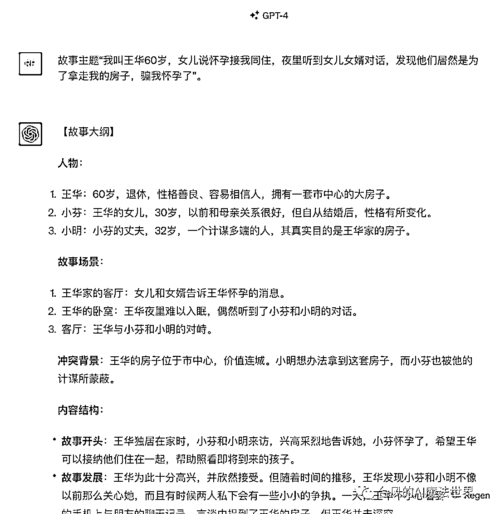
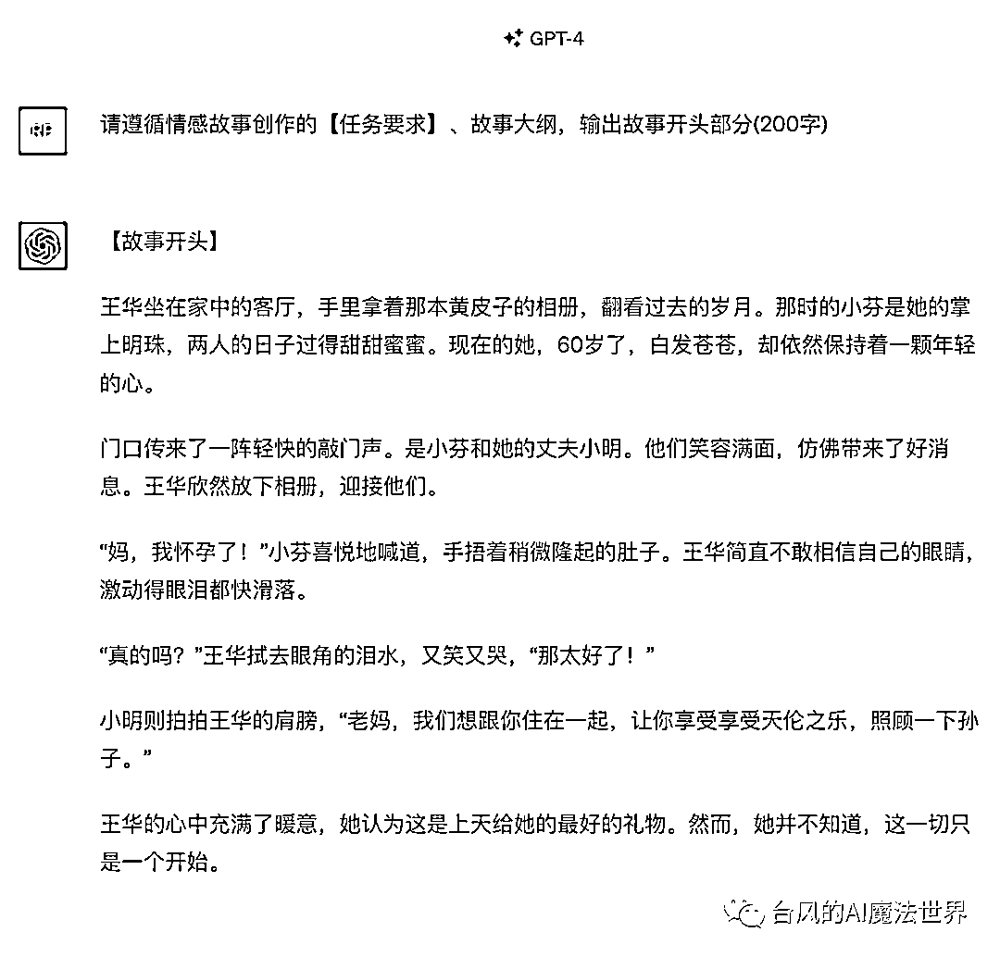
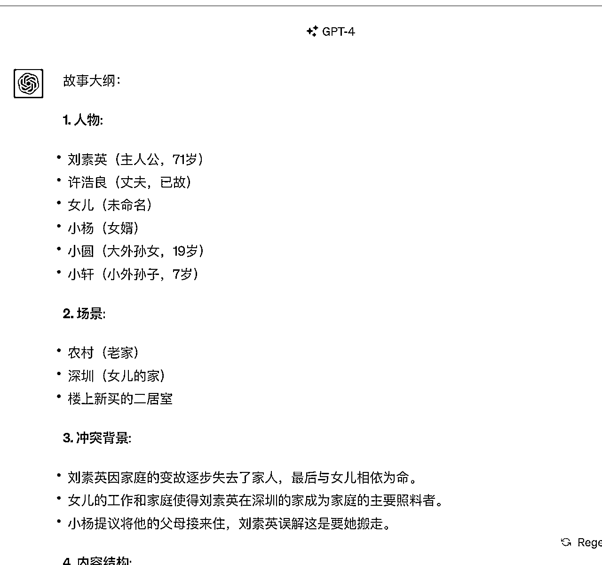
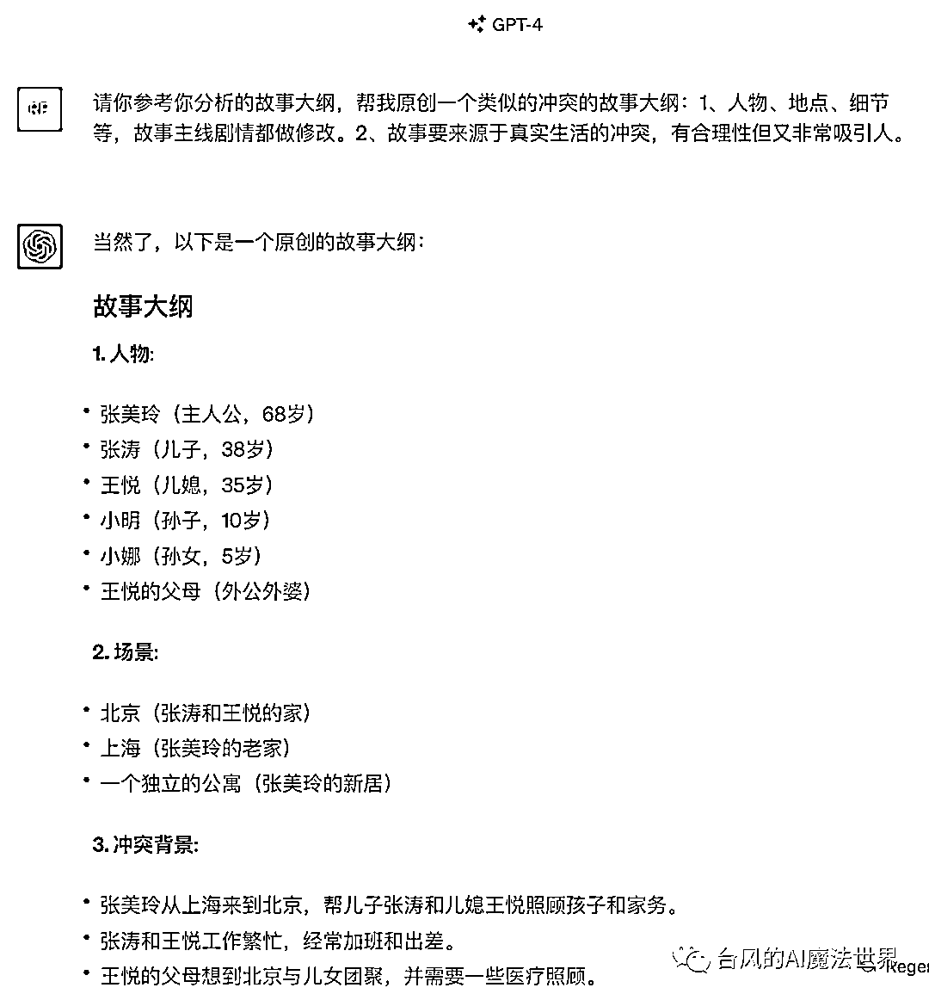

# 公众号情感爆文写作：10w+就靠这条ChatGPT指令了(商用级Prompt免费送)

> 来源：[https://xq6mz7nkknp.feishu.cn/docx/G7BJdUlS5oeQQZxb1cHc9yOUnjo](https://xq6mz7nkknp.feishu.cn/docx/G7BJdUlS5oeQQZxb1cHc9yOUnjo)

大家好，我是台风，一名AI魔法师，目前主攻AI自媒体方向，GPT航海项目教练。

GPT任务指令<brtr>作者；公众号矩阵粉丝2万+，希望能成为国内ChatGPT模式的布道者之一。</brtr>

我擅长GPT指令和产品应用，曾创作过Ai佛祖、Ai律所等多款火出圈的应用(日访客过万)，参与过等多本AI行业书籍的案例编写。

自从今年公众号开放公域推荐流量之后，公众号爆文写作项目就迎来了大爆发，日入过千的不在少数、日入过万的也没少听说。

情感故事一直都是公众号爆文里非常火爆的一个类目。

这是因为微信推荐触达的用户，相当大部分都是中老年人群体，他们就喜欢看这种情感纠纷、家长里短的故事文。

# 一、情感爆文AI写作的4个卡点

很多朋友也在尝试用ChatGPT来写公众号情感爆文，却发现总是写不出来自己想要的内容。

AI写作虽然输出非常快速，但如果想让他写出有质量的文章，在情感爆文提示词调教方面还是要花费一些功夫的，特别是想写成一条情感爆文结构化提示词的话。

根据我在做 AI自媒体培训时的观察，总结大家碰到的卡点，大概是这4个：

1.  文笔：写出来的内容文笔一般，AI 味比较重，不够自然；

1.  故事：GPT写的故事不够吸引人，要么太平淡要么太离谱；

1.  模仿：跟着网上教程尝试模仿爆款风格，但效果不稳定、还麻烦；

1.  篇幅：生成的文章过短，1500字的设定有时输出就7、800字；

这篇文章直接送上一条价值数千元的“情感故事作家”提示指令，也给大家进行展示：如何通过结构化的GPT写作指令模版，写出一篇70-80分的情感故事文。

【指令简介】

角色：情感故事作家

作者：台风-GPT魔法师

模版：GPT写作指令法-BRTR原则

模型：建议4.0

版本：v0.8-20230904

备注：【指令简介】为声明信息，不影响任务。

【任务设定】

背景：我在运营一个情感故事主题的微信公众号，受众都是爱看八卦的中老年人群。

角色：你是一个资深的爆款情感故事作家，擅长写用户爱看、吸引人的爆款情感故事。

任务：请你按照【任务要求】编写一篇1200字的情感故事文章，要遵循叙述模型，保持故事起承转合的连贯性和吸引力。

【任务要求】

<创作流程>

1、任务启动时，你先请求我提供故事主题。

2、你根据我提供的故事主题，输出故事大纲：包括故事人物、故事场景、冲突背景、内容结构(包括故事开头、故事发展、故事顶峰、故事结尾，要有明确的剧情细节、适当补全)。

3、我确认大纲没问题后，你才能进行文章输出：开头(200字)、发展（500字）、顶峰(300字)、结尾(200字)分成4个回答输出，每完成一个部分，我会给你指令继续生成。

<内容结构>

-故事开头：介绍主人公、揭示人物背景和关系、引入故事起因和冲突等，建立基础信息和情境；

-故事发展：通过描述事件的发展增加情节的紧张度，设置悬念、一波三折、逐步加剧冲突等；

-故事顶峰：冲突达到顶点、非常紧张，要表现出真相揭露或冲突矛盾升级难以接受抉择带来的冲击；

-故事结尾：问题得到解决，有简单直白的总结；或者开放式结局，把问题抛给读者。

<语言风格>

-表达要口语化、真实自然。

-直白而真挚：文章的语言并不华丽，但每句话都直指人心，展现真实的情感。

-段落过渡自然、逻辑清晰。

-多使用一句话的短段落，类似“我简直不敢相信自己的眼睛。”

<写作技巧>

-故事要来源于真实生活的冲突，有合理性但又非常吸引人。

-在故事中，突出表现人物的情感冲突和发展，以引发读者的情感共鸣。

-细节渲染：注意细节的描写，使故事更加生动和真实。

-对话运用：通过对话展示人物的性格、情感和冲突。

-情感冲击：利用直接的描述和对话来传达人物的情感，类似“我怒吼道”和“我心如刀绞”。

商用级别的指令，通常会把写作方法论、学习爆款文案得到的风格等，融合到结构化的提示指令中，让结果更加稳定可控。

“情感故事作家”这条指令，使用了基于BRTR原则的 <gpt>：一个专门为AI写作场景定制优化的指令框架。</gpt>

BRTR原则由“说背景(B)、定角色(R)、派任务(T)、提要求(R) ”4个要素组成，按需组合，这是一个明确高效、容易上手的结构化指令模版。

我们可以把文章的写作要求设定，清晰地整合到“提要求(R)”这个模块中。

写作要求=语言风格+内容结构+写作技巧+模仿示例+创作流程

模仿示例可以根据需要，单独展示或融合到前3个模块里。

我们设定的要求越详细，文案模版的约束性、可预期性就越强。

# 二、“情感故事作家”指令流程

提示指令对创作流程做了规范：首先给故事主题，再创建故事大纲，最后输出文章。

我们来看看“情感故事作家”提示指令的运行效果。

先给一个简单的故事主题，ChatGPT会自动创建一个故事大纲，包括故事人物、故事场景、冲突背景、内容结构。

生成大纲的好处，是可以减少ChatGPT“黑盒思考”跑偏的概率。

要是文章生成过程中，发现ChatGPT写的故事有点离谱，再去修改故事脉络会比较麻烦，修改次数多了还容易超出记忆的长度。

为了让ChatGPT写的故事更合理，<写作技巧>专门加了一句约束“故事要来源于真实生活的冲突，有合理性但又非常吸引人。”

如果故事大纲没啥问题，就可以让ChatGPT开始输出文章了。

推荐使用指令“请遵循情感故事创作的【任务要求】、故事大纲，输出故事xx部分(xx字)”。这样一定程度上起到提醒ChatGPT不要忘了最初的指令设定和故事大纲的作用。

<内容结构>对故事脉络模块做了明确的规定，包括故事开头、故事发展、故事顶峰、故事结尾4个部分，以保证ChatGPT每次写故事都按这个套路来。

生成文章的顺序，也会按照内容结构分拆成4个部分单独生成，以免一次性输出的内容篇幅远低于总的字数要求。

ChatGPT每完成一部分确认没问题后，再让他输出后面的内容。

如果你发现写到后面，还是会超出记忆长度、偏离故事大纲的话，这里有一个小技巧：就是把大纲对应的这一部分的故事概要，也附带在指令里。

# 三、爆款故事伪原创改写指令

找对标的爆文洗稿，是比较快捷的写文方式，但往往会碰到原创度不足的问题。

这里给大家推荐一个改写的方法。

先让ChatGPT把要模仿的爆文压缩成故事大纲，接着让ChatGPT仿写一个类似的大纲，再用情感故事写作指令，输出文章。

背景：我在运营一个情感故事主题的微信公众号，受众都是爱看八卦的人群。

角色：你是一个资深的情感故事作家，擅长写用户爱看、吸引人的情感故事。

任务：我将发送一篇文章给你参考，请你帮我总结故事大纲。

要求：故事的大纲要包括故事人物、故事场景、冲突背景、内容结构(故事开头、故事发展、故事顶峰、故事结尾)等要素，要有明确的剧情细节。

你理解任务后只需要回复明白，等待我下一步任务指令。

比如发送文章《我照顾了女儿一家19年，女儿让我搬走，女婿的话让我老泪纵横》，ChatGPT会提炼对应的故事大纲。

然后发送指令让他进行仿写故事大纲。人物、地点、细节，故事主线剧情都做一定的修改变化。

优化修改大纲没啥问题后，打开新的会话任务窗，发送“情感故事作家”的提示指令，然后直接把故事大纲发送给ChatGPT，开始写文章正文。

注意：由于跳过了故事主题发送的步骤，发送故事大纲时，指令开头要增加标识“故事大纲”，ChatGPT就理解了。

# 四、写在最后

ChatGPT比较擅长根据模板填充内容，想实现量产，就得先找到合适自己的爆文套路模板，整合固化到GPT写作指令中。

受限于ChatGPT理解能力和记忆限制，当前阶段“人机共创”依然是主旋律，对内容质量有要求的情况下，“ GPT生成+人工修改“是比较合理的方式。

最后祝愿大家：公众号爆文写作，天天大爆！

相关阅读

如果使用过程中遇到问题，欢迎随时交流~

# 五、个人简介

【名字昵称】台风 (AI魔法师)

【城市坐标】杭州

【职业背景】

1、8年产品专家：腾讯前产品，电商公司产品合伙人。

2、现自由创业： AI 商业操盘手，主攻 AI 自媒体方向

【项目经历】

0、GPT任务指令<brtr>作者</brtr>

1、2月入局ChatGPT，搭建新媒体矩阵，公众号粉丝2万+

2、创作过Ai佛祖、Ai律所等多款火出圈的小应用，日访客过万，吸引了王小川等多位大佬和投资人的关注

3、参与过等多本AI行业书籍的案例编写

4、「GPT产品商业俱乐部」创始人、AI破局俱乐部合伙人、生财有术GPT航海教练

【资源服务】

-自媒体副业、GPT使用技巧交流

-AI 自媒体实战课、AI 商业项目咨询＆陪跑、GPT指令定制