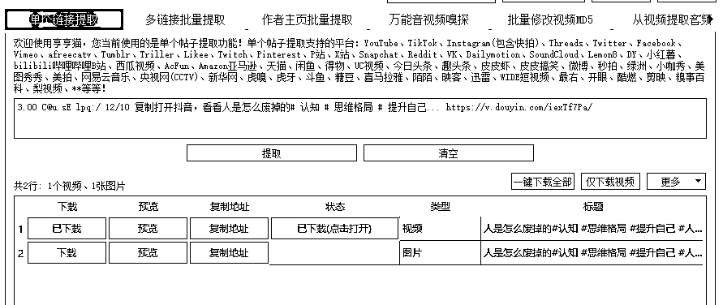
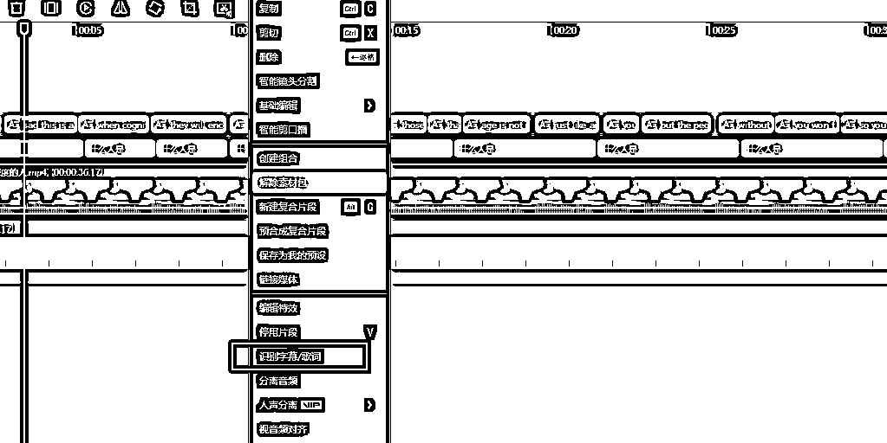

# 《Ai数字人讲认知，涨粉很快，小白直接简单上手》

> 来源：[https://m0pnt42rkm.feishu.cn/docx/Qv7WdY2uNozpKHxRNkPcPaP2nZg](https://m0pnt42rkm.feishu.cn/docx/Qv7WdY2uNozpKHxRNkPcPaP2nZg)

大家好，我是李又懂，

前互联网大厂员工，MBA正规军，

其他时间钻研编程技术、副业、搞钱，项目，运营知识，项目管理、商业模型等等。爱好非常广泛。

首先感谢大家能看到我！

本次分享，我将分享给大家：

最近抖音上比较火的的数字人，讲认知的。

我自己下场做了一些，感觉确实流量还行，主要是感觉投入产出比很高，

其他视频没什么关注量，只有点赞，评论

但是这种数字人讲认知的关注量、评论量都比较猛。

所以这篇文章想分享给大家教程。

看完也能直接上手做出一个数字人账号。

## 项目介绍

之前也是我在生财中无意中看到一个风向标，这样的一个账号，

涨势很猛，一周21万，觉得制作还很简单啊，非常适合小白，

不像一些漫画类账号每个都要自己做脚本。

数字人还是很简单的，做好字幕做好人像就行。

后面测试了几个号，发现还是挺猛的，非常容易爆流量，

而且这个项目是抢时间的，越早做越好。

## 适用人群

没做过抖音；

之前做口播效果差；

之前做和成长、思维相关的抖音账号

之前做过书单号

这类账号后期可以转做书单号。前期流量还是很大的。

## 项目实操

### 一、找对标账号

对标账号可以在小红书，抖音，快手，视频号去找，一找才发，有人通过这种方式在做矩阵账号，数据还不错。少的几万粉，多的上百万了

方法就是通过一些关键词，在抖音里去找。

### 二、文案提取

1、下载原视频

相关的推荐有很多，比如哼哼猫（收费），免费的可以搜索一下小程序“轻抖”

2、提取音频文案

自行下载文案轻微改动，或者自己配音。

用翻译软件，比如百度翻译成英文

### 三、配音

在魔音工坊选择魔丹妮，费用是99元/月

导入英文

导出配音

### 四、制作数字人

制作数字人软件比较常见的是heygen，官网：https://www.heygen.com/

方法一：用临时邮箱注册，可能失效，需要自己去找没有被官网限制的临时邮箱，新注册送1积分。

*   邮箱一：https://www.mohmal.com/zh

方法二：直接去淘宝购买heygen成品积分账号，5元11积分

0.5分钟兑换0.5积分

导入英文

导出数字人

### 五、视频剪辑

准备背景图，并且导入

导入数字人，

智能识别字幕（英文），识别出来的都是英文

但是中文是自己输入中文字幕，选择字体

### 六、发布到抖音

注册新账号，可以直接发布

抖音账号准备，设置好名称、签名

## 写在最后

其实这个做法非常简单，建议可以尽早去做一下，

不知道后面数字人的规则会不会变，也不知道抖音平台会不会限制，

至少目前效果还是很好的，推荐小白可以做一下，

体验一下涨粉的快乐，我第一次做这个，涨了几千粉丝还是很开心的~

这是我第一篇在生财的帖子，感谢生财平台，

也欢迎大家留言，链接~