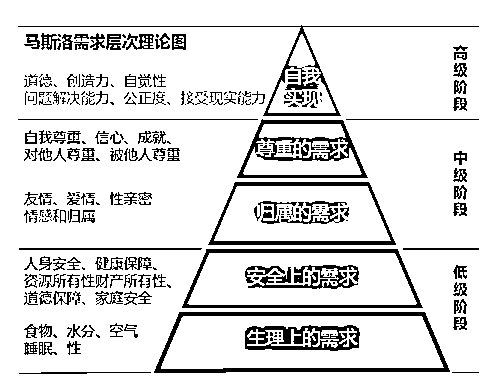
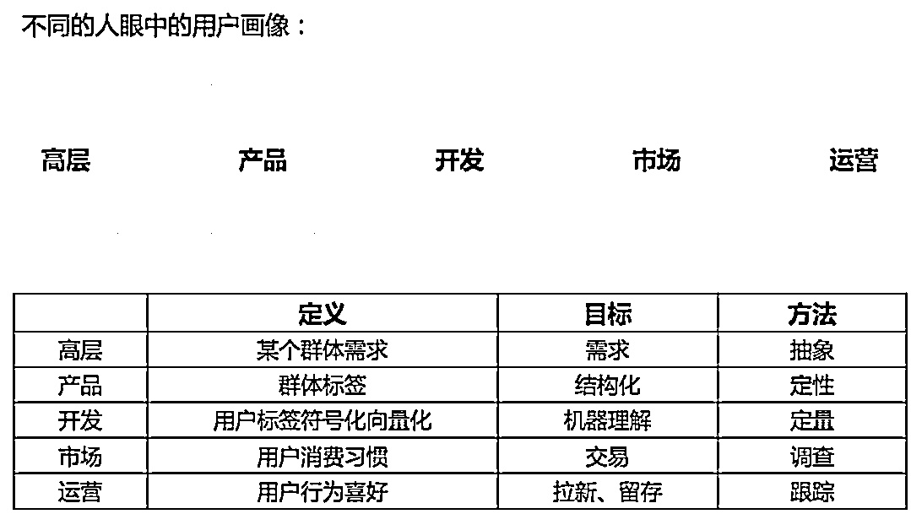
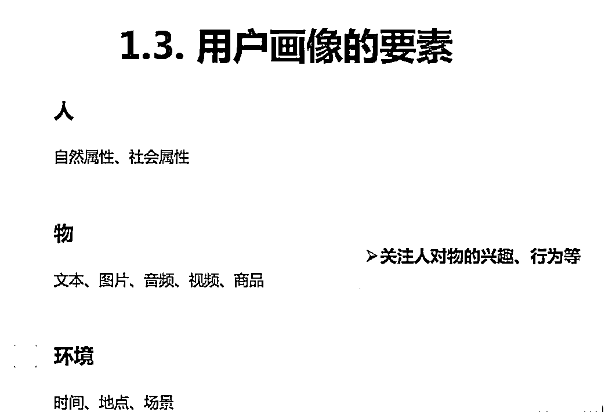
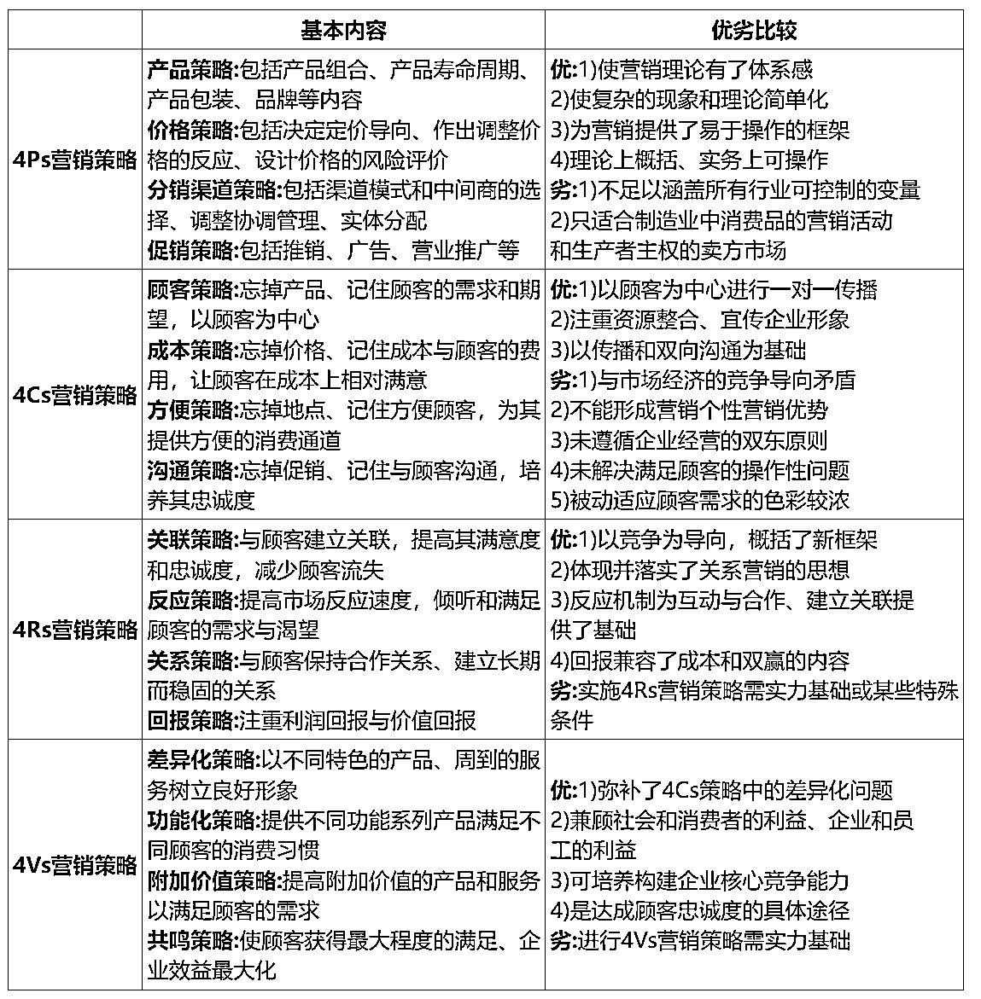

# 创业、副业找伙伴，找投资？一篇文章说清如何让人能听懂你的项目

> 来源：[https://lxkvj39q93t.feishu.cn/docx/IkF4di2CMoCuLmxx73ccS3EOnGg](https://lxkvj39q93t.feishu.cn/docx/IkF4di2CMoCuLmxx73ccS3EOnGg)

💡 无论是拉人参与你的项目，还是寻找投资，一份清晰商业计划书都非常重要

# 一、什么是商业计划书

## 1.1 商业计划书的定义

商业计划书（ Business Plan ）是按国际惯例通用的标准文本格式形成的全面介绍公司和项目运作情况，阐述产品、市场及竞争、风险等未来发展前景和融资要求的书面材料。

## 1.2 商业计划书的目的

⚫自己的行动指南：商业计划书是对自己商业逻辑的梳理。

⚫引起投资人的兴趣：简洁的BP是寻找投资人的敲门砖。

⚫吸引创业团队：商业计划需要有共鸣的同路人

# 二、你想要找的投资人/合伙人/项目参与者想了解什么

关键词：痛点、解决办法、目标人群、专注

## 2.1这个项目是要做什么？

要描述清楚你的产品定位和方向：要一句话能概括要做的事，解决的痛点；

初创项目，商业计划可直接以此为标题，说白了，就是你的产品大白话的slogan

举例：

一个预定体育场馆的App——————“体育爱好者和体育场馆一键连接”。

（产品或服务）

## 2.2这个项目要怎么做？

发现的需求和痛点；提出的解决方案、服务；其独特性、优势。

痛点：从用户的痛点出发做产品才容易成功，尽可能分析出项目产品的动人细节和独特价值。

所谓“痛点”可分为三类：

第一类是人类普遍有所体会的某种心理上的难受，或者某些蠢蠢欲动的欲望没有得到满足的难受，这种难受常常经过外界刺激而有所强化。例如，思乡、恐高、怕抽血、窥探隐私、八卦欲等等。

第二类是体验过某种产品后，如果不买会难受，会有不满足感，可谓欲罢不能。比如喝惯可乐、玩过网络游戏为什么难以摆脱。

第三类是在购买过程中小小地难受一下，如此使得顾客最终获得产品时，强烈地对比出愉悦感来。例如，苹果新品发布时总是长龙排队，甚至有顾客不得不凌晨开始在店铺外占位。

与第一类用于化解痛点的产品不同，第三类痛点是有意设置的，它有时是因为企业稀缺的资源所造就的，企业为了将有限的资源聚焦在最具竞争力的产品或服务上，因而剔除了某些附加服务。如果顾客体验到的痛感远远小于获得产品和服务时的满足感，那么顾客就不再计较这其中的痛点。成功击中这类痛点的产品，要么消解了痛点，要么弱化了痛点。

说明痛点是什么？为什么是现在？怎样解决？

根据需求层次理论、环境变革因素、市场缝隙等分析，论证真实存在的客观需求。

什么是缝隙市场：缝隙市场指向那些市场中的统治者/有绝对优势的企业忽略的某些细分市场或者小众市场，指企业选定一个很小的产品或服务领域，集中力量进入并成为领先者，从当地市场到全国再到全球，同时建立各种壁垒，逐渐形成持久的竞争优势。

有潜力成长为大公司的项目一定试图满足人们更基础更本质的刚性需求，亮眼小众的项目多是满足需求塔尖的美好需求；

用生动具体的细节，阐述用户有什么痛苦，有什么方法解决这些痛苦。

创业企业多因无法找到真实的需求和可靠的商业模式而失败

举例：

针对男性品类的广告语——————“喝XX肾宝，他好我也好”

针对现代人易上火的广告语——————“怕上火，喝王XX”

（产品生产及服务过程、商业模式）

## 2.3这个项目在为谁做？

关系到一个产品底层逻辑的问题：你的产品将面对的用户群是哪些?如何获取？

### 2.3.1用户群的划分

每一个产品都应该有固定的目标客户，没有目标客户的产品注定是不会成功的

以大家熟悉且每天无法离开的“水”为例

山泉水/井水————免费，但不是所有人都需要，对不同人群的价值不同，主要受众是住在山边/农村的人

自来水————最易获得，价格最低，主要受众是家庭使用

娃哈哈、怡宝、农夫山泉————较低价的瓶装饮用水，有一定门槛，主要受众是打工人

百岁山————相对“中产”的矿泉水，包装好看，但在三四线城市销量惨淡，主要受众是挣得稍微多一点的打工人，小中产

依云、巴黎水————电影院柜台常客，主要用来做价格锚定，来卖高价饮料，部分穷人也买来装X（真的有钱人日常喝不算），主要受众是有钱人和部分约会群体

那么，思考一下，你现在的产品的目标客户，到底是谁？

### 2.3.2细分市场有哪些？

每一个大市场都会有子市场的细分

做自媒体的可以分为做公众号的、做视频号的、做小红书的、做头条的……

做小红书的可以再细分为做小红书店铺的、小红书带货的、小红书笔记的、小红书纯分享的……

创作者根据创作内容的不同又可以分为母婴赛道、养生赛道、副业赛道……

还有一些其他的，比如聚光服务商、蒲公英服务商、教人做小红书的课程服务商等等

那么你的项目，到底是做的哪个赛道的哪个细分领域，这样才能准确的让人明白，你在做的事儿是什么

### 2.3.3目标顾客群是谁？特征（核心要突出专注）

用户画像又称用户角色，作为一种勾画目标用户、联系用户诉求与设计方向的有效工具，用户画像在各领域得到了广泛的应用。我们在实际操作的过程中往往会以最为浅显和贴近生活的话语将用户的属性、行为与期待联结起来。作为实际用户的虚拟代表，用户画像所形成的用户角色并不是脱离产品和市场之外所构建出来的，形成的用户角色需要有代表性能代表产品的主要受众和目标群体。根据目标的行为观点的差异区分为不同类型，迅速组织在一起，然后把新得出的类型提炼出来，形成一个类型的用户画像。一个产品大概需要4-8种类型的用户画像。

但一定要记得，如果要切再细分的赛道，要再进行细分，越细分，就越容易做到头部

### 2.3.4用户获取：拟采取的营销策略？

市场营销策略是企业以顾客需要为出发点，根据经验获得顾客需求量以及购买力的信息、商业界的期望值，有计划地组织各项经营活动，通过相互协调一致的产品策略、价格策略、渠道策略和促销策略，为顾客提供满意的商品和服务而实现企业目标的过程。

以下是比较常用的营销策略：

营销策略没有对错，对应合适的产品，判断合适的人群，针对人群选择合适的策略才是最优质的结果

### 2.3.5关键性用户：如何得到第一批用户？大概数量有多少？

第一批用户最好低成本来获得，在保证客户画像正确的前提下，成本越低越好，但数量并不是越多越好

无论是通过捆绑合伙人，来获取他的资源，亦或是通过自身已经营的社群，还是你有足够低价的触达到目标客群的渠道

先去做，任何产品刚开始都不可能是完美的！！！

通过第一批用户的体验，及时反馈修正，小步快跑调整产品/人群才是第一批用户存在的意义

在不确定产品一定可行的情况下，选择适量的第一批关键用户才是必要的，一旦出了口碑危机，也可以及时挽救！

例子：某心脏类药物，在临床实验后，发现对心脏病的治疗效果不OK，但第一批用户中的男性对此药物赞不绝口，厂家及时调整策略，才有了世纪级优质产品的诞生——————伟哥

### 2.3.6后期营销策略：怎么得到更多用户？

是打磨产品，增强服务，产生口碑传播？

还是砸钱烧市场？

还是把第一批用户发展成分销员进行利益捆绑？

亦或是能找到更好的渠道进行推广？

还是那句话，没有对错，选最合适的！

（市场分析、消费者群）

## 2.4这个项目有谁已经在做或有可能入局来做？

不是这个赛道有人做就不做了

不是这个赛道有大佬就不做了

不是这个赛道在走下坡就不做了

一切的一切要看这块蛋糕现在有多大，未来有多大，现在市面上的玩家有哪些，有没有空白市场或者哪块市场里的玩家做的垃圾！

能抢下肉吃的赛道，就是好赛道

红海或下行赛道就一定不行么？不一定，曾经DVD全国开花杀破头，妥妥的红海市场。现在全网卖DVD机器的，基本上是同一个人做，找对目标市场————没通网的农村，没有竞争，赚得爽的很

如何做竞争分析？

⚫关键词：竞争对手、核心竞争力与竞争壁垒、渠道优势、差异化

⚫竞争对手：梯队分层（直接、间接、潜在）业务侧重点、方向、策略

⚫核心竞争力与竞争壁垒：专利、许可、资源、团队（技术与模式）、模仿成本……

⚫渠道优势：明星效应创业、成熟企业多元或一体、员工社会资本等。

⚫差异化：基于竞争对手分析和自身能力分析，梳理集中资源于一点的逻辑。

（行业竞争分析）

## 2.5为什么是你们做？

⚫团队的重要性；

“宁可投资一流人，二流项目;也不投一流项目，二流的人”；

只要团队好，模式、市场与利润都可以创造；

⚫介绍团队主要成员的背景和特长： 说明不仅是好项目，重要的是适合你们做。注意几方面：

⚫创业者气质和经验：有创业气质，积累过相关经验，在项目上有见解。

⚫3团队成员的匹配性和互补性：成员过往经历和经验能够互补，并匹配当前项目。（之前做过什么不重要，重要的是之前的经历和经验跟现有项目的契合度；强调个人的能力适合该岗位。）

⚫团队组合的稳定性；稳定的团队有利于计划执行、风险应对和融资

数据可以锦上添花

⚫团队和数据往往是初期判断和兴趣点；

⚫数字最有说服力，投资人最喜欢看的就是数字和图表；

⚫需求潜力类数据：相关产品的销售量增长数据、新产品的市场渗透数据、某类潜在客户的人口特征情况数据等。

⚫运营数据是产品竞争力的表现：适当罗列，建议展示量级和数据里程碑。

互联网创业类APP上线*个月，用户到*量级，日活在*量级，传播速度和效果如何？

有收入的创业项目：收入、利润怎样？平均单价如何估算？是否合理等。

（优势与核心能力、团队）

## 2.6能做到和想做到什么？

其他你的优势，在上面没有总结到的，可能是你致胜的法宝，或者吸引合伙人的利器

⚫商业模式：回答准备怎么赚钱的问题？

⚫产品或服务主要内容是什么？产品或服务制作与提供的过程等？

客户的种类？怎么收钱？定价如何？

（营销与发展规划）

## 2.7需要什么资源，要人，还是要钱，要钱的话，多少钱？什么时候赚钱？体量？

市场体量怎么样

回答问题：你的产品或服务针对什么市场？

⚫市场总容量？目标（细分）市场份额？

⚫目标市场、用户群可能的趋势性数据（今后5年）

⚫相关产品需求的趋势性数据

⚫根据上述信息来论证痛点背后的商业价值有多大？目标是占有多大的市场份额（后期需要据此和产品定价来估算的真实有效的收入）？最后用一句话来描述市场规模和潜在的远景。

⚫注意：不要通篇讲产业行业分析，要通过分析得到自己对行业的理解和认知，不是简单的罗列数据

论证目标：盈利模式是可靠且有盈利期望的。

切实可行的盈利模式不仅是投资人关心的，更是创业的首要；

搞不清楚怎么赚钱，也要搞清楚你的产品的价值-----用户

关于发展规划与策略：要明确发展的战略思想。

⚫市场策略：

⚫怎么推广？打算用多少时间做到多少的用户量？怎么去扩展市场？

⚫产品分析要能细分到自己一年内做的事；列出自己超越对手的关键点以及一年期的工作要点；

⚫长远发展规划：如果前期能做好，后期会向哪个方向发展？

⚫投资人投资（创业）的不只是产品，而是一家公司，需要弄清楚公司长远的发展计划

关于财务预测与计划要注意以下几点：

⚫理论上需要测算项目经济效益：

⚫大体估算未来三年到五年的收入；

⚫估算投资和费用：固定资产、流动资金投入、运营期年总成本费用预测

⚫利润预测，可据此估计经济效益。

市场变化风云莫测，关键搞清楚的问题，项目生存能力

⚫ 1、说清楚未来一年或半年的资金需求和用途：运营期总成本费用：每个月固定成本、运营成本，半年花多少钱，一年预计花多少钱；

⚫2、什么时候能够达到收支平衡？

⚫3、如果业务成功，什么时候能达到盈利，如果业务遇到问题，财务状况能继续支持企业运营多久；

⚫不要预测过高、过于夸大和吹牛；难以置信的利润和回报不足取信；现实和保守的态度。

财务预测自己没谱干脆先不提——周鸿祎；

（财务预测：投资、利润、回收期）

## 2.8可能有什么风险？

如何做风险分析？

关键词：风险识别、风险影响、防范或应对措施

⚫风险识别：对风险因素进行定性分析，详细说明项目实施过程中可能遇到的风险：如技术风险，市场风险，管理风险，财务风险，政策风险，其他不可预见的风险等。

⚫风险影响：风险会导致的问题（销量、定价、成本等变化对经营能力、战略规划执行的影响），有必要的情况下进行定量分析（不确定性分析工具）。

⚫提出有效的风险控制和防范应对措施。

（风险分析与防范）

## 2.9谁出钱？谁出力？出钱的怎么回收？出力的怎么分钱？

项目一定是要有人干活的，也要有人砸钱的

当然，如果你能画大饼忽悠来免费的人干活，并且可以忽悠来免费的路径，也可以不要人砸钱

但这毕竟是小概率事件

先小人，后君子，亲兄弟，明算帐

把前期大家要负责的事情安排明白，出力的要达到什么效果，只出钱的不要干扰进度

避免后续麻烦

某夫妻店图书网站不也闹出了“抢公章”闹剧么？

项目什么时候算是初步成功了，初步成功之后，有多少（或多少比例）的钱拿出来分

出钱的人、出力的人、出脑子的人，大家怎么分这笔钱

（股本结构、退出机制）

# 三、核心总结

如何说自己的项目是个好项目，从以下几个角度出发准没错：

⚫1\. 市场大不大，增长快不快

⚫2\. 产品好不好，逻辑顺不顺

⚫3\. 数据涨不涨，指标硬不硬

⚫4\. 模式有没有，收钱行不行

⚫5\. 团队齐不齐，老大强不强

⚫6\. 融资多不多，价格低不低