# 体制内二宝妈的副业探索之路

> 来源：[https://mwgg37pdpl.feishu.cn/docx/JdjUdvwKxo25yWxh06tcZzzAnxd](https://mwgg37pdpl.feishu.cn/docx/JdjUdvwKxo25yWxh06tcZzzAnxd)

一、与网赚结缘

大家好，我叫伊程，是一名二孩宝妈。今年三月份加入了生财，进入生财之后，读了一些帖子，认识了很多圈友（当然，没一个人认识我），都是被大家的才干和赚钱能力吸引。感谢靠谱，芷蓝，让我更近距离的感受到了大家的“超能力”。接下来向大家分享我的网赚经历。

从2021年11月开始，接触了网赚。每一个做网赚的人都有一个开始的故事，我也是，因为是贵州嫁广西，在一个小县城的体制内上班，当时为了解决夫妻异地，也想回娘家方便一点，想遴选到市一级单位，于是就不断参加体制类的遴选考试，当时为了节省成本，在闲鱼上买了一套虚拟资料。一套资料下来也不便宜——800多元。事后想了想，反正这也是虚拟资料，能不能挂在我自己的闲鱼上呢？说干就干，于是回头去找我的卖家账号，模仿他的闲鱼。不久之后还真有人来问，没多久就出了一单。到现在还记得第一单的利润是210，当时很开心，很兴奋，想着这样也能赚钱？那是第一次尝到了做网赚的甜头，后面大家也猜得到，在网赚的道路上越走越近，在考试的道路上越走越远。非常感谢当时的那位卖家，当然，在我心里他是带我走进互联网赚钱的第一人，一直心存感激，现在也是很好的朋友。做虚拟资料售卖，一直坚持到到今年7月份。两年不到期间总共卖了30W+，虽然跟各位圈友没法比，但跟自己的主业比起来，这属于一份高收入成绩单，可以说这是属于我的第一桶金。

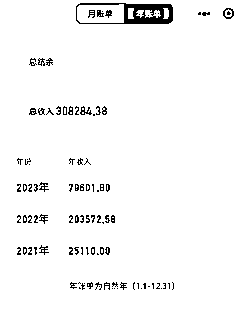

二、偶遇新机遇

8月中旬，有一天在刷抖音，看到一个关于解说社保知识的直播间，突然联想到自己的主业也是做社保，觉得我是不是也可以啊，做了十年社保工作，如果能把主业和副业结合起来做也不错。接着又去知识星球搜了一下“养老”，看到亦仁大大8月18日借着圈友LimBo的一条加精风向标帖子，也分享了关于“养老金”这个赛道的几点想法，还有很多圈友分享的关于这个赛道的想法，再结合自身多年从事社保工作的经验，这让我更加坚信做此赛道的决心。于是，找了几个对标博主，泡了几天有关社保直播间，从引流到变现的整个过程也有了初步的框架思维。

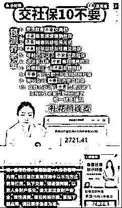

首先引流：

1、通过直播间讲解相关的社保知识，回答各种问题，测算养老金等等，拉动流量

1.  社保知识短视频拍摄、图文等

变现：

1、直播间卖社保规划课程：

2、连麦礼物打赏赚钱音浪

3、引流微信做异地参保代办（社保直播变现尽头）

社保对于大家来说都不陌生，有工作的，企业会缴五险一金（养老、医疗、失业、工伤、生育、公积金），个人和企业分别承担相应的比例，公司出大头，个人出小头；没有公司，个人可以灵活就业人员缴纳养老和医疗；个体户和法人需要交五险，费用全由自己承担；当然也存在另一种——挂靠，这种是国家不承认的，也是违法，被发现的话缴费年限直接清零。（以下图为五险一金详解图）

很多人都知道社保，但是并不懂社保知识，很容易踩坑。比如：之前有工作，单位交五险，后来失业了，自己以灵活就业身份交，之前的年限是不是清零了？领了失业金，以后领取退休金是不是就少了？灵活就业人员缴费档次越高越好？等等，发现真的很多人都不懂社保知识，只是知道要买社保，这样就导致很多人没法最大化享受国家的社保福利。所以很多直播间的主播就出了社保规划书，帮助客户更好的规划社保，就跟商业保险一样，也要讲究投资回报，如何更用更少的资金换来更高的待遇。主要针对灵活就业，大家都想提高待遇，但是很少有人了解养老金是怎么来的。

养老金=基础养老金+个人账户养老金

基础养老金=所在地上年度在岗职工月平均工资×（1+平均缴费档次）÷2×缴费年限×1%；

个人账户养老金=人账户累计储存额÷计发月数；

例如：一个人缴费档次60%，按照最低缴费基数缴费，当地上年度在岗职工月平均工资9500元，个人交15年，个人账户累计储存额为：85964元，60岁（对应计发月数139）退休金大概是：

基础养老金：9500×（1+0.6）÷2×15×1%=1140元；

个人账户养老金：85964÷139=618.45元；

60岁后合计领取养老金总额大约是：1140+618.45=1758.45元；

通过计算结果可以看出决定养老金高低的是“基础养老金”，影响基础养老金的主要因素大小排列为 ：社平 > 年限 > 缴费档次 > 退休年龄

社平工资高，越年轻缴纳社保，档位越高，对应的退休金就越高。

社保遵循的是“长缴多得，多缴多得”原则，档位越高，养老金虽然也高，但投资回报率越低，回本时间长，一般来说不太建议个人交高档位，这个的设置主要是针对有工作的高收入人群，企业交大头，个人负担小头，比较划算。

社平：

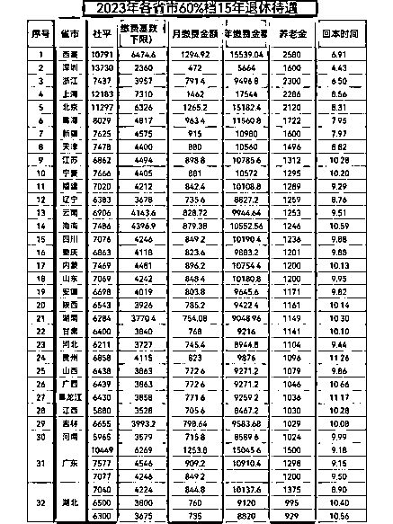

社平高的地区，退休金越高。图中可以看出最高社平（深圳13730）与最低社平（河南5965）相差一倍多，退休金每月深圳（1600）与河南（1024）相差500+，一年下来相差6000+，每年退休金都在涨，几年后差距越来越大，几个w、十几个w、几十个w.......

每个省的社平不一样，各地已经开放外地户籍可以以灵活就业人员方式参保（除了北京）：

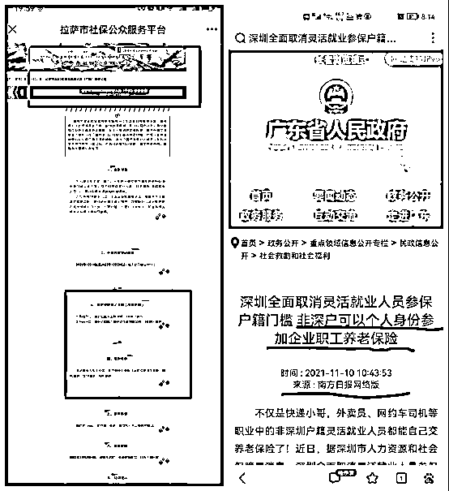

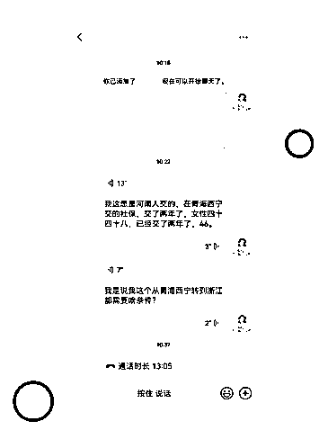

异地参保是提高退休金的最直接有效的方式。操作手法是：更改参保城市，选取社平高的地区参保，一般做的城市主要有三个，优势往下看：

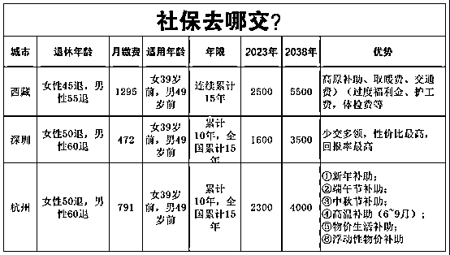

去异地参保除了领取高额退休金，还有一个原因——可提前退休。主要针对灵活就业人员女性，除了西藏女性可以45岁退休，其他地区都可以50岁退，但每个地方50退的条件不一样，例如：辽宁，女性必须在企业首次参保才可50岁退；黑龙江，在企业连续累计5年以上，中间不能断缴；吉林，企业累计3年。条件比较苛刻的地方，可以选择条件宽松的地方退休，比如：西藏、深圳、四川、内蒙等。

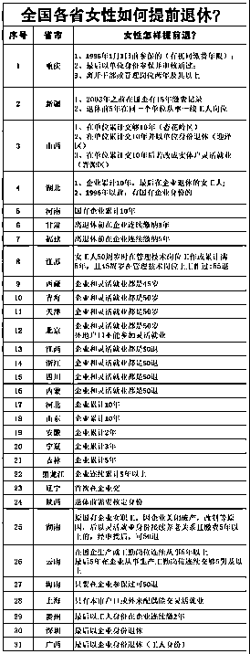

比如张大姐38岁，李大哥48岁，夫妻俩都没有超年龄，户口都是河北的，他俩跟着儿子去深圳。在那里办理了居住登记信息，又去当地社保中心开个社保账户，他们的社保账户叫做一般账户，在深圳交社保。但是在那边退休，有个要求，要在深圳交过10年以上，全国累计15年以上，最后的参保地是深圳，俩人就可以在深圳退休，退休后再回河北住，也还是领着深圳的退休待遇，比同龄人领河北待遇香太多。

自己也可以去异地办理，只需要在当地有居住信息即可。如果专门为了办社保去一趟外地，除了要熟悉流程，花费的成本和精力也是比较高的，所以很多人愿意选择代办，通过代办省心省力。

付费连麦直播间回答社保问题是变现的第一步；售卖社保规划书是变现的第二步，挂社保课程就是为了卖规划书，课程是送的，规划书99.59.49.39价格各异，但服务内容大体相同。值得注意的是挂课程，抖音粉丝必须到达1000以上才可以；通过异地代办参保是实现社保规划的终极变现，也是收费最高，3000—8000+不等，根据参保城市定价，深圳最便宜，西藏最贵。整个抖音社保知识的变现流程就是这样一个完整闭合。

引流分三步走：

（8月18日发了有关“社保”的第一条朋友圈，8月24日开启了人生第一场直播）

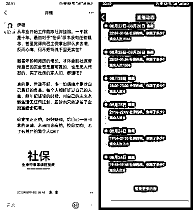

1.  线下：

因为本身是社保工作人员，朝着打造个人ip方向走，从身边熟悉的人开始，可能会比较容易成单。身边人并不了解社保还能异地参保，包括我父母都觉得这是骗人的，更别说外人了，前期推广起来很难，因为大家都缺乏这方面的认知，突然出现这么个事，没人会相信你，但还是要继续干。朋友圈是每天必须要打造的，这是展示产品的个人商店，也是私域客户最直接了解产品的平台。朋友圈是转化的重要一环，怎么发圈？如何激起客户的痛点和产品的卖点？这也倒逼自己去学习模仿打造好自己朋友圈，边学边发，朋友圈从最初无人问津，到陆陆续续亲戚朋友都来咨询了解，终于在9月5日，成功转化了第一单。那一刻，信心倍增，也坚信自己选的这条赛道没错。

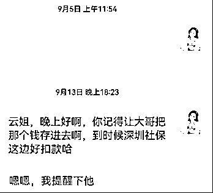

1.  抖音、小红书平台：短视频、图文、直播引流。

找准对标博主账号，模拟做直播知识分享。用两台手机，一个看直播，另一个手机用wps语音输出直播稿，自己再修改，不断打磨。

直播：

（一）开播准备：

1.  社保草稿大纲（一小时话术）

1.  不露脸直播：手机，手机支架（最好是苹果手机，不容易发热掉线）

1.  露脸直播：一个电脑、话筒、摄像头（1080以上，重点，画质清晰）、音响、背景（2m*3m）、计算器一个（手机支架）、实名认证的抖音号（不露脸的直播可以不需要）

*   直播知识

1.  数据：点赞、停留（新手最注重这个数据）、互动、张粉、灯牌（想上人，这几个数据很重要）

1.  一周的稳定数据：建议不要找亲人朋友，开播以后，抖音推的是自然流，是抖音免费推送的数据。亲戚朋友是主页来的数据，影响官方推送。

1.  定时开播：新号必须每天固定时间。

1.  每天最少一场：一场最少一个小时以上。也不是越久越好，抖音不推自热流就可以下播了。

*   直播内容：

1、找社保最想讲的话题，列大纲，大标题+小标题，用颜色把重要的标出来。类似于大字报，用手机屏幕对着，照着话术开播。

2、直播间测养老金。可以用支付宝里面小程序“2023养老金测算”，吸引流量。

做直播开始最难的是开口，这是第一大拦路虎，害怕讲错，觉得丢脸，掌控不好直播节奏等等，这些都是正常现象，如果一切都顺利才是奇怪。所以鼓励自己要大胆的讲出来，坚持播下去，在直播间就像跟朋友分享知识一样，心态摆好，一场说不好，明天再继续，要不断进行自我催眠，直播是比较考验人心态，有时候直播间一个人都没有，但还是要坚持做完这场直播，抖音会给你直播内容打标签，需要时间段来分析账号，所以坚持做直播才能打上正确的标签。整个话术的内容需要不断的打磨，多看直播间停留人数多的同行，从开播到下播话术都要熟练掌握。这是目前花时间和精力最多的地方。

每天发短视频和图文笔记。经常在平台上刷一些社保相关的视频和图文，找高评点赞收藏等数据好的博主模仿。目前还没有爆款视频跟笔记，选题的内容可能出现偏差，文案不行等都是不足的，也是不断在边做边学习中。

3.把之前的流量利用起来。通过他们把身边有需要的人转介绍过来。每天给自己定几个客户聊天。比如：让他们把身边有需要的人推过来，如果成功一单，就送一年的付费课程相结合。

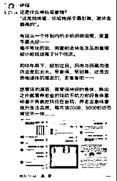

目前利用以上的三种方式进行引流，运营40天，已变现3单，总收入9000元。

除了个人参保，还做企业参保。

于企业而言，社保费是比较大的人工成本，帮助企业外地参保，可以降低企业成本，一般做的是深圳和厦门。费用如下：

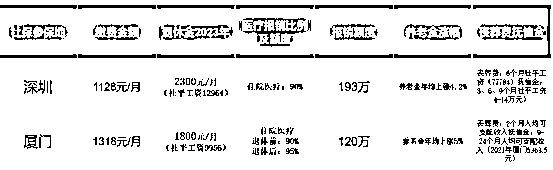

毕业开始就入了体制，从此与社保工作结缘，专业的业务知识储备是我从事这个赛道最大的优势。从社保参保到退休全过程，每个岗位都轮替过，各种政策的解读、知识分享对于我来说不是难点，把知识点整理给客户讲明白就可以。目前很多人关于异地参保的观念还没有转过来，相信越往后会有一个爆发期，当然会不会引起政策的收紧说不准，只能说早点去社平高的外地参保会更好。

三、事业角色互换

平时经常被周围朋友同事跟客户问到，哪有时间既兼顾主业又能把副业做起来？其实很简单，做“体制内的闲鱼，体制外的卷王”就好了，当然还不是卷王，但朝着这个方向前进。当你认清所处环境的游戏规则，一切都可轻松解决。比如说身处体制内，我的生存法则是，不求精益求精，只求60分即可，这样的想法不代表业务能力不行，仅代表它能让我付出的时间价值只有这么多，多一分都觉得浪费。

几个月前职级晋升，此次所带来的喜悦感完全不及我卖一单产品所带的喜悦感更让我满足，降低对主业的期待，一切意外收获只是锦上添花而已。相反，副业不一样，能带给我的不只是价值的体现，更是人脉、资源和认知的整合。时间就是效率，花在哪就在哪体现应有的价值。体制内10+年，打开了叛逆的阀门，自动断舍离很多无用的职场情怀，学会对不友好的人“刚”，对无效的人事物“拒绝”。一定要给自己找点事干。不然真的会让自己变成一只……废物。

最后，特别感谢我的幸运女神——靠谱，也是我想成为的目标，在迷茫时，帮我分析现状，给了许多建议和鼓励，支棱我到现在。也特别感激生财，这就像一个工具库和知识库，节约了我很多时间成本，把项目做到效果最大化。非常有幸与大家在同一个圈儿，希望自己的认知和能力能够跟上大家的脚步！平时也非常喜欢交朋友，如果大家对社保感兴趣，也欢迎来链接！