# 如何利用影刀RPA进行多平台分发

> 来源：[https://p8y34fwle2.feishu.cn/docx/JzKCdIcnFoYXPFxdB4xcdNiUnqe](https://p8y34fwle2.feishu.cn/docx/JzKCdIcnFoYXPFxdB4xcdNiUnqe)

## 一、认识影刀 RPA

公众号爆文这个项目，想要增加收益的方式之一就是做矩阵，然而人的精力是有限的，仅凭手动操作是非常消耗我们的精力的，那么这时候就需要一款常用的自动化工具来帮我们提效。

你可以利用 RPA 完成选品工作，也能借此实现自动引流、自动发布……网上你能想到的大部分重复劳动，基本都可以用 RPA 搞定。

虽然这一切听起来似乎就是程序员的日常，似乎需要懂代码懂码农。不用担心，即便你跟我一样，一点儿都不懂代码，也能轻松入门影刀，因为相关的代码操作都已经被整理成一个个的中文菜单栏了。

影刀的下载和学习，我这边就不展开讲，大家从这个官网和官方学院进入即可下载和学习，

影刀官网地址：https://www.yingdao.com/

学院地址：https://college.yingdao.com/

建议新手们都去影刀学院学习一下相关课程，掌握基本的技能。虽然影刀已经做好了菜单栏的可视化，不需要写代码，但我们还是有必要了解整套流程的底层逻辑。只有当我们了解了影刀的内部运行逻辑，以及相关操作，我们才能更好地利用影刀帮助我们降本增效。

相信不久之后，你也能跟我一样，利用影刀来大幅度提升自己工作和生活的效率！

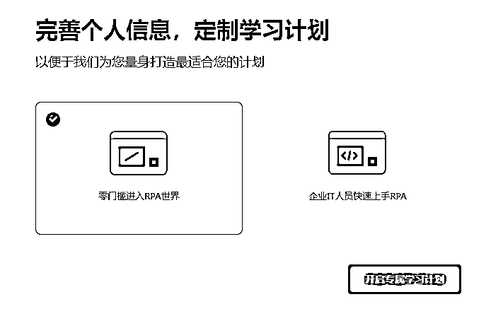

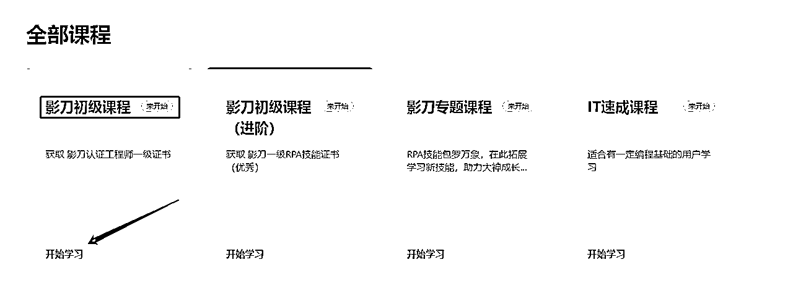

如果说掌握了基础课程之后，我们就能独立写机器人。那么，在学有余力时，挑战进阶课程，就能让我们更加从容面对复杂的世界，写出更加贴合实际应用的机器人了。

进阶课程，建议影刀学院+B站上搜“影刀RPA”教程一同服用，效果更佳！

## 二、影刀 RPA 在公众号爆文项目中的应用

要实现用 RPA 帮我们自动化，首先我们要手动走一遍流程，让 RPA 记住每一个操作步骤并记录在代码中，相当于给它演示一遍要怎么操作，完成这个流程之后，再运行代码，它就会根据我们的步骤自动完成所有动作。

### 应用一：公众号批量下载文章

有时候，我们需要找到对标的文章扒拉下来，投喂给GPT，以便后续能够按照我们喜欢的文风，生成爆文。

手动操作的话需要先登录公众号后台--点击图文--点击超链接--选择公众号文章--点开每一个文章获取有用信息，文章非常多的时候，一个个点开是很花费时间的。

那么，这个如何能通过影刀RPA实现呢？

第一步，先登录公众号后台--点击图文--点击超链接--选择公众号文章，到这个界面之后，就可以设置我们的自动化流程了。

第一遍我们需要影刀 RPA 记住整个流程，即把公众号名称填写进去，复制第一篇文章的标题，再点击查看第一篇文章并记录下链接，分别保存在表格里。

让它记录每个步骤之后，我们就可以开始运行啦，RPA 会对每一篇文章进行点击，并自动获取文章标题和链接，逐行放在表格中

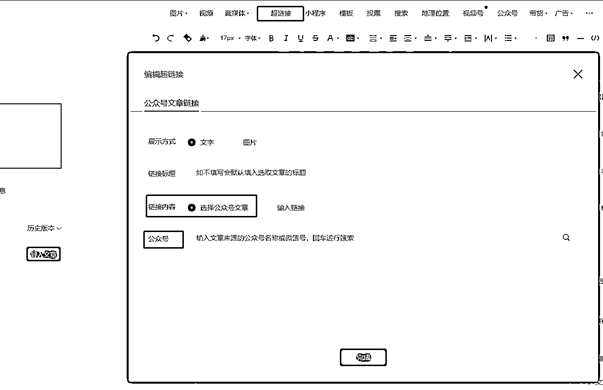

第二步，得到下图的数据，再配合一键获取公众号所有文章的工具就完美收官了。

而这一切，影刀很快就能搞定👻这不比自己手动扒拉强多了？

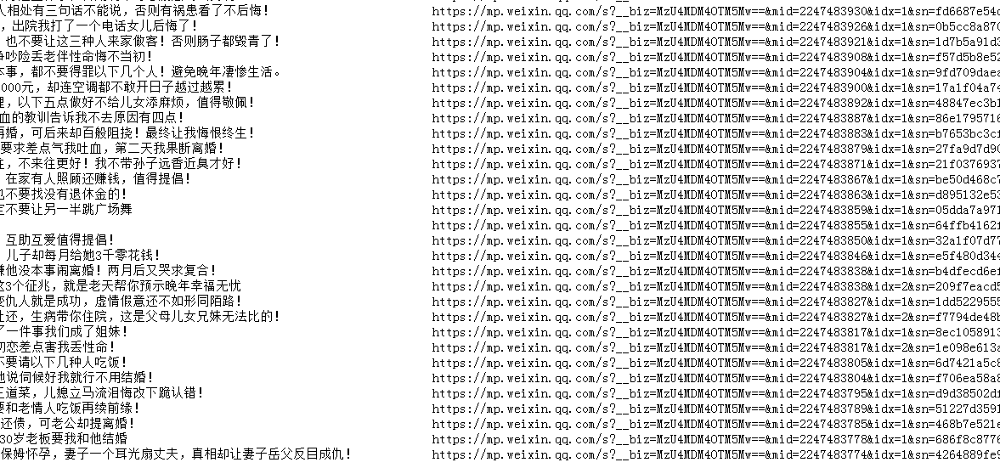

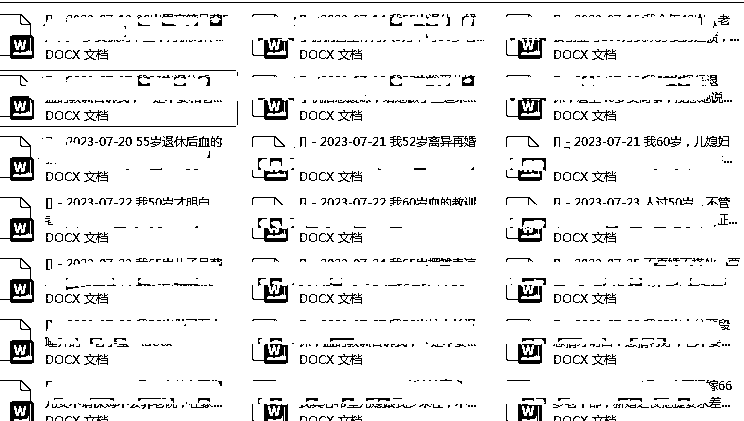

源代码如下

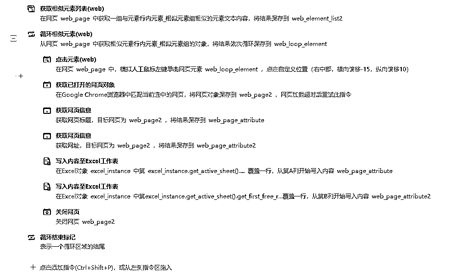

### 应用二：将文章存在公众号草稿箱

投喂完后，利用 RPA+ChatGPT 可以批量生成爆款文章，在航海手册第七点，我就不再赘述了，感兴趣的可以到咱航海资料里查看。

我今天想要教大家的是，如果将生成好的文章存入公众号的草稿箱内，以便后续能够定时发布。（毕竟目前公众号有个bug，只能定时发布今天和明天的群发消息）

#### 第一步：在 Word 里排版

操作细节：把 ai 得到的文章复制到Word文档中，根据自己公众号以前的风格对 Word 文档进行排版

例如开头用红色字体，中间蓝色字体，以及字号大小都可以在 Word 排版完成

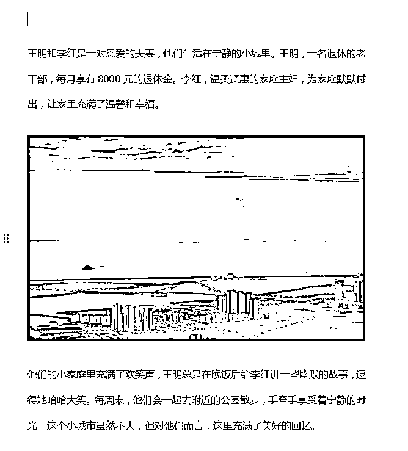

#### 第二步：整理数据

把整理好的文档和需要用到的封面图路径复制到表格中。

给各位老板们留个问题【要如何能找到文档的文件地址，最先回答的三位老板，我送一份小礼物！】

答案就是按Shift+鼠标右键

答对的老板免费领取应用二自动完成8篇文章到草稿

#### 第三步：整理原创标题

把公众号原创作者的名称写在表格中

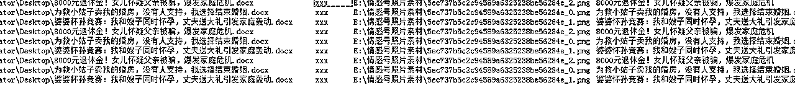

#### 第四步：机器人干活

打开--公众号后台-点击图文消息

点击运行影刀应用

完成后自动保存草稿

源代码分享

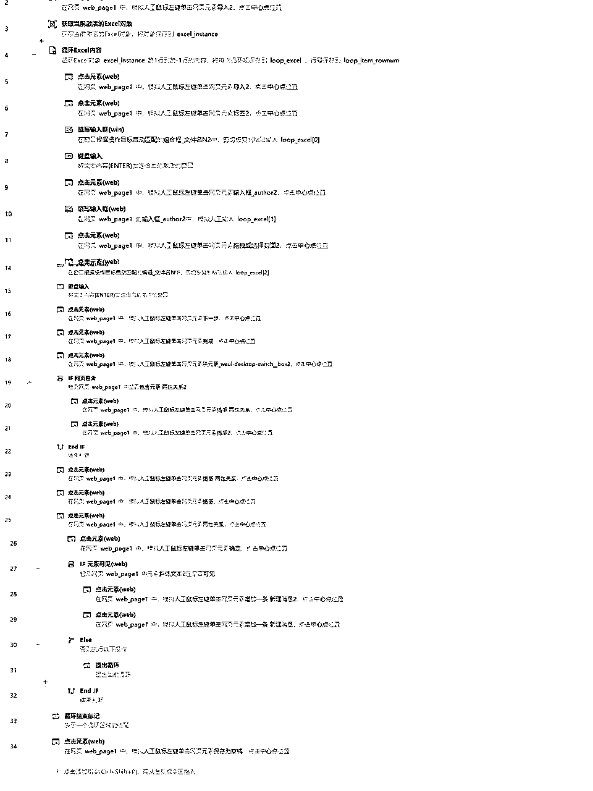

### 应用三：利用影刀多平台分发

不要忘了一鱼多吃，既然整理好了文章发布在微信公众号，多平台分发，多亿份收益不是更好吗？

我整理了现在比较热门的文章分发平台：百家号、今日头条、大鱼号和企鹅号。

还是跟上述的流程一致，首先我们还是需要将文章的相关材料（标题、正文、图片、封面等等）都整理好放在Excel里，然后机器人通过读取Excel对应的内容，填入以上几个平台上。

以下是实现自动分发的源代码：

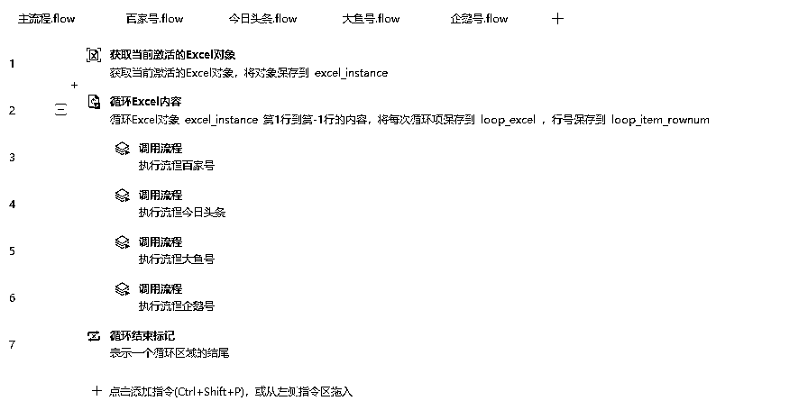

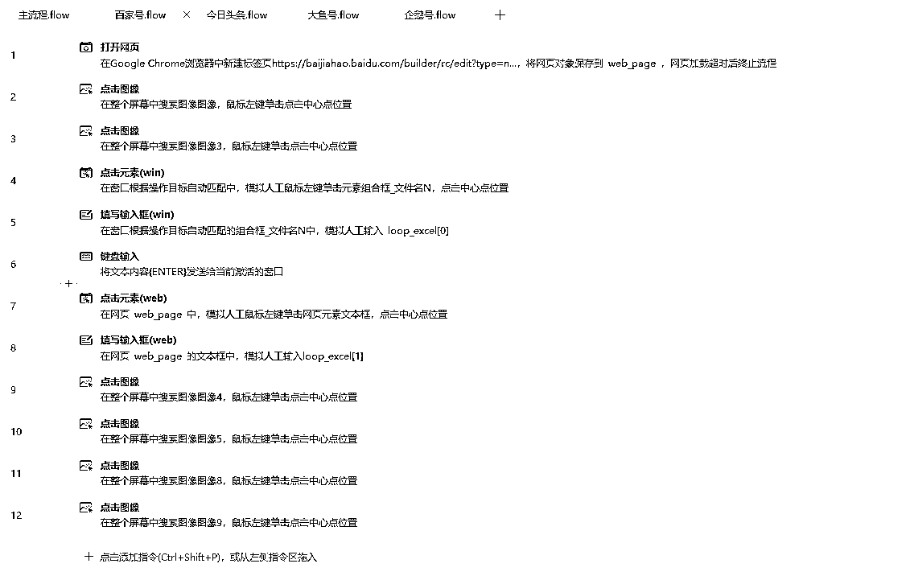

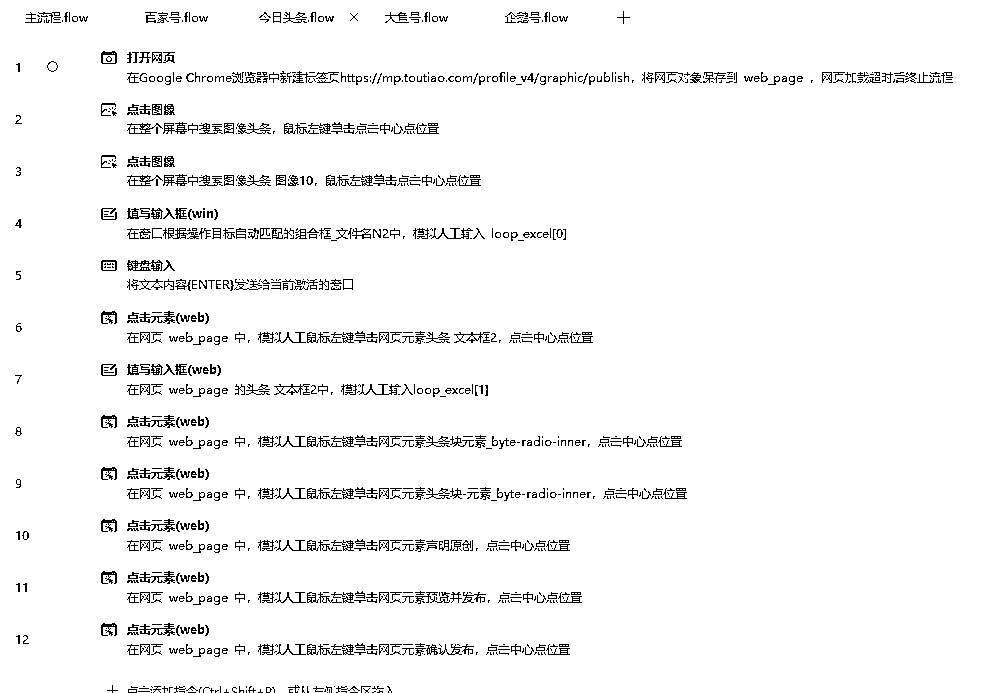

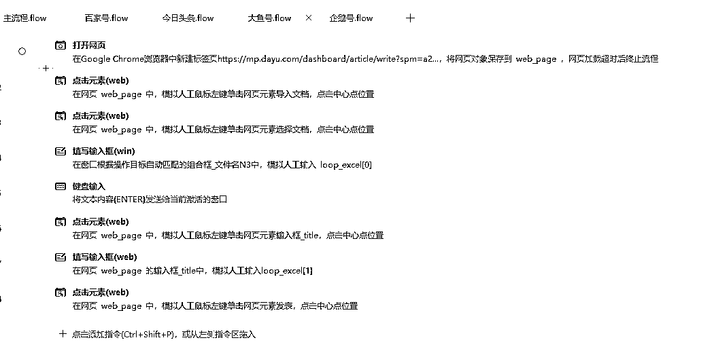

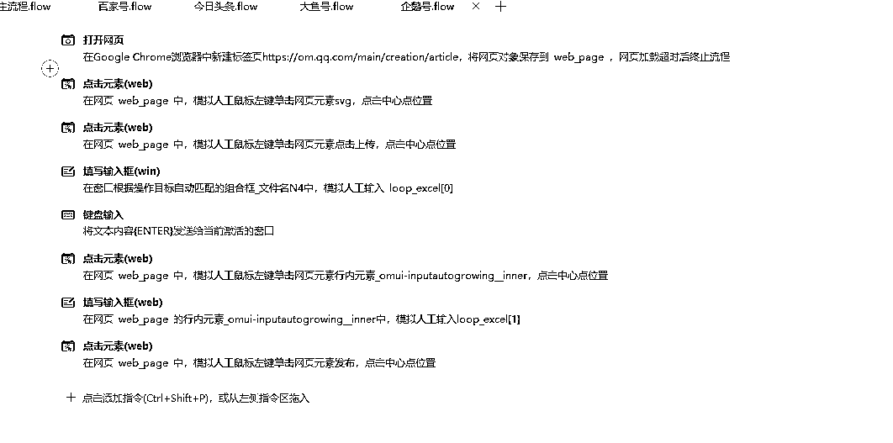

### 应用四：结合GTP自动洗文章

### 其他应用

除了在这个项目上可以极大的发挥它的作用，它还可以用在：

*   视频号视频定时自动发布

*   抖音视频/图文定时自动发布

*   小红书视频/图文定时自动发布

*   快手视频/图文定时自动发布

*   B站，百家号，西瓜，今日头条的自动发布

*   抖音、小红书、快手下拉词获取

*   文件批量重命名，图片批量去重

*   私域运营：批量加好友，批量加标签，聊天记录导出，团队订单汇总等

你能想到的大部分重复劳动，基本都可以用 RPA 搞定。

如果你还有不清楚是否可以利用影刀RPA帮忙的场景，也欢迎在稍后提问，知无不言言无不尽！

## 三、结语

有人说，我真的值得花时间成本去学影刀RPA吗？我的回答始终如一，如果是不懂代码，而且想全面提升自己的工作生活效率的话，我都强烈建议去学习。

因为无论最后决定学或不学都会后悔。决定要学习的人，会后悔自己怎么这么晚才发现这么一个宝藏效率神器。决定不学的人，就一直懊恼说，为什么自己效率提不上去。

能在今天晚上公众号的所有航海船上跟大家分享，我是真的深感荣幸，毕竟我也是6月才开始接触影刀RPA的人，也是在不断学习以及为其他老板做定制化机器人时升级打怪，深受RPA影响，才意识到自己之前原来错过了那么多。

感谢生财，让我知道有影刀这么一个效率神器，感谢自己持续不断钻研影刀RPA，感谢小霸王让我有机会能让更多人知道这么一个效率神器。

我是马小威一位专注研究影刀 RPA 降本增效的95后奶爸，最后祝大家一起生财有术！

如果你也想要提升工作效率欢迎你和我一起交流~V:mxw4260